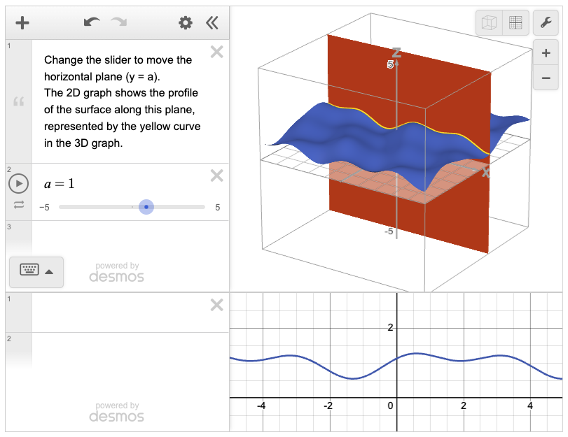
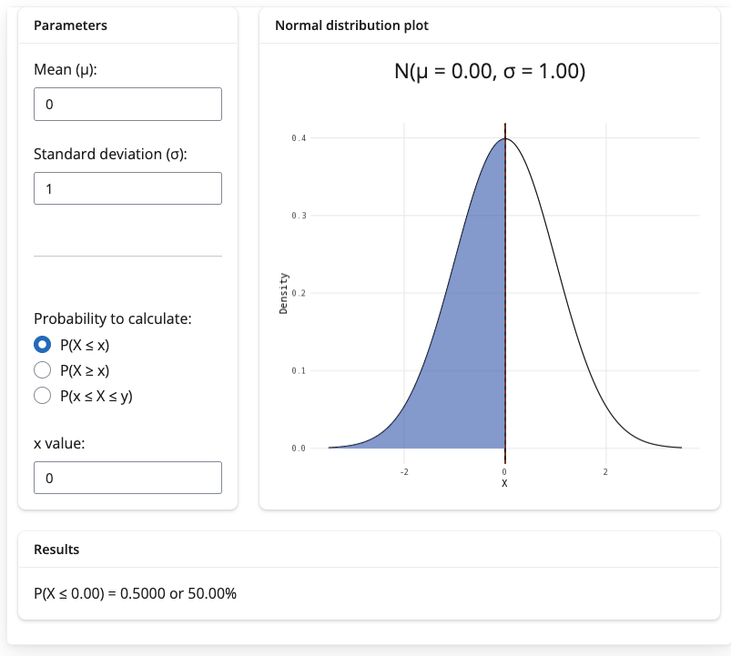
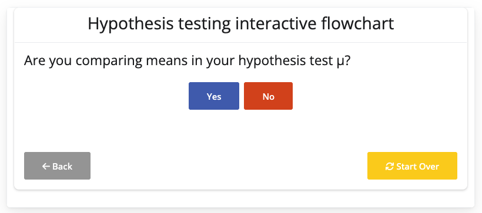
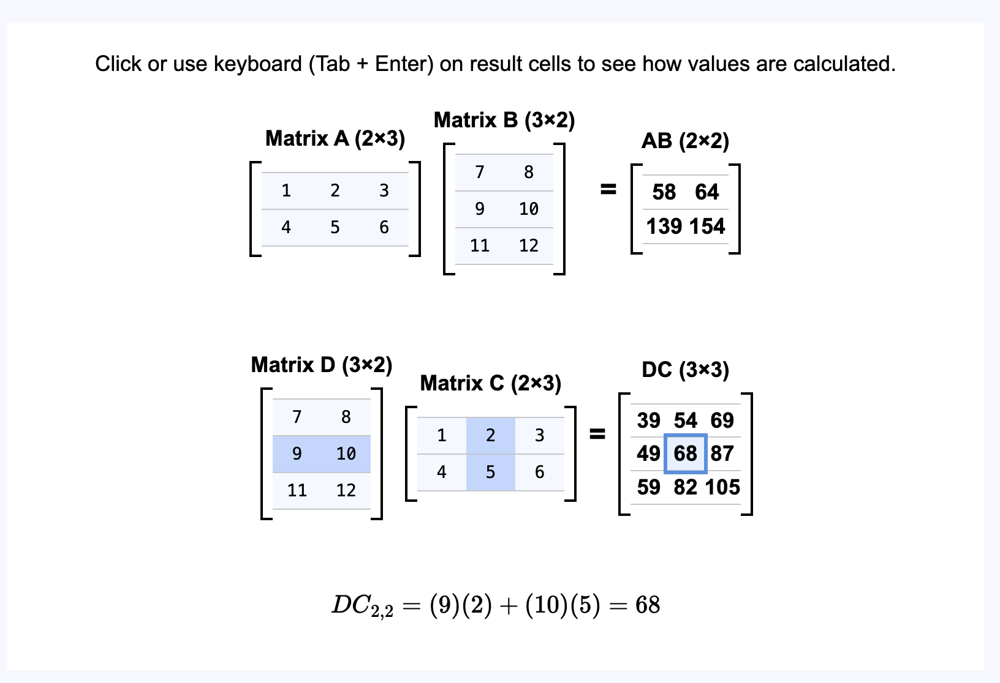
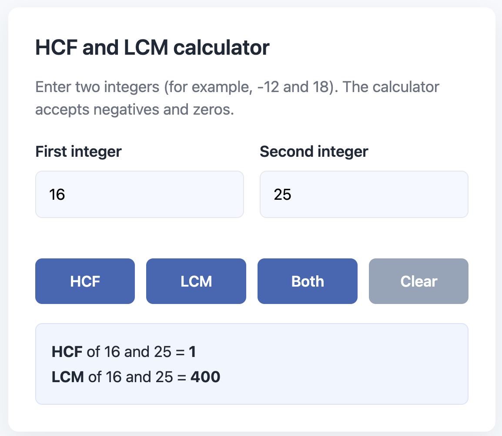
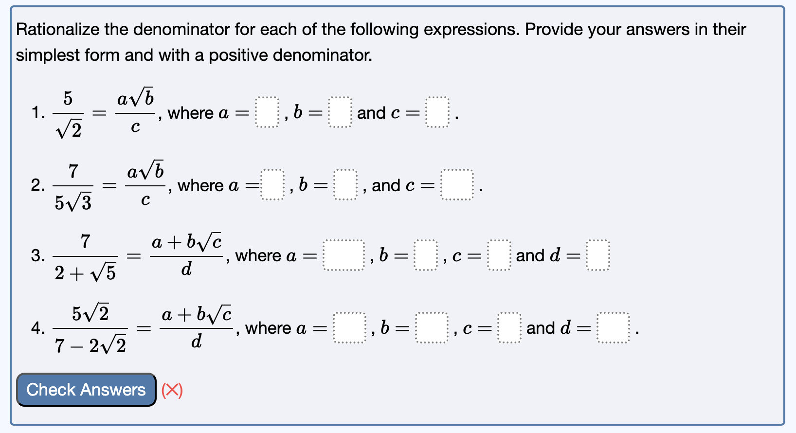

## Context {data-background-image="slides-bg.png"}

- Lecturer (Education Focused) in mathematics

- passion for creating good resources / very shallow technical background

- currently using Quarto to produce **publicly available free-to-use, accessible and inclusive** maths and stats **support resources**

- **co-create these resources with students** as part of a Vertically Integrated Project module at St Andrews

## Methods (1/2) {data-background-image="slides-bg.png" .smaller}

wide range of topics necessitate wide range of methods for best results

- R package **webexercises** for 'quick-check' questions (true or false, multiple choice...)

- Quarto's synergy with R encourages **R Shiny apps**, particularly good for statistics

    - works best with a dedicated R Shiny server
    
    - but can use R Shiny Live to run these apps without a server (at the cost of longer loading times)

- **Desmos** is best for graphs / recognisable brand for students / accessibility features built-in

    - students helped organise agreement to use Desmos API environment
    
    - can embed directly from site without this (at the cost of uneditable figures at point of use)

- raw **html** provides natural flexibility for everything else (calculators, animations...)

## Methods (2/2) {data-background-image="slides-bg.png" .smaller}

**generative AI provides starting points for use of these tools**

- **R Shiny Assistant** (for R Shiny) / **Copilot** (for html) / **ChatGPT** (for html/Desmos API environment)

- teachable moments for students in using generative AI responsibly

**use conditional content tags if using multiple outputs**

```{.quarto}
::: {.content-visible when-format="html"}
interactive content
:::

::: {.content-hidden when-format="html"}
non-interactive content for printable versions
:::
```


## How to embed {data-background-image="slides-bg.png" .smaller}

:::{.panel-tabset}

### html

```{.quarto}
(three ticks){=html}
embeddable content
(three ticks)
```

### Desmos

**with API key**

```{.quarto}
format:
  html:
    include-in-header: 
    - text: <script src="desmos_API_key_link"></script>
```

then use [Desmos' documentation to start building](https://www.desmos.com/api/v1.12/docs/index.html) (step 1 covered by above)

**without API key** 

- draw graph using Desmos graphical calculator
- share button / 'embed snapshot'
- paste iframe code into html tags in Quarto

```{.quarto}
(three ticks){=html}
Desmos iframe
(three ticks)
```

### R Shiny

in _quarto.yml file

```{.quarto}
format:
  html:
    include-in-header: 
    - text: <script src="https://esm.sh/shinylive-r"></script>
    filters:
    - shinylive
```

(or add filter page by page), then in .qmd file

```{.quarto}
[three ticks]{shinylive-r}
#| standalone: true
#| viewerHeight: 500

R Shiny app here
[three ticks]
```

### webexercises

- install [webexercises package](https://psyteachr.github.io/webexercises/index.html) from CRAN or otherwise

- add files to same folder as the Quarto project as instructed

- load library in each .qmd file

```{.quarto}
[three ticks]{r, setup, include = FALSE}
library("webexercises")
[three ticks]
```

- follow documentation to create `webex-boxes` where you want questions in your text

:::

## Examples {data-background-image="slides-bg.png" .smaller}

:::{.panel-tabset}

### Desmos

[{width=60%}](../studyguides/introtopartialdifferentiation.qmd)

### R Shiny 1

[{width=50%}](../factsheets/f-normaldist.qmd)

### R Shiny 2

[](../studyguides/hypothesistesting.qmd)
  
### html 1

[{width=60%}](../studyguides/matrixmultiplication.qmd)

### html 2

[{width=50%}](../apps/calculators/c-hcflcm.qmd)

### webexercises

[{width=65%}](../studyguides/rationalizingthedenominator.qmd)

:::

## Want more? {data-background-image="slides-bg.png"}

- **loads more examples at [starmast.org](https://starmast.org) :)** 

- **source code for interactive figures** at the [starmast github repository](https://github.com/tdhc153/starmast)

- contact me at **tdhc@st-andrews.ac.uk**: any ideas, feedback, comments, most welcome :)

 

**thank you for listening!**