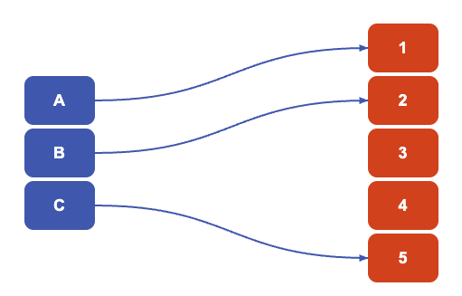
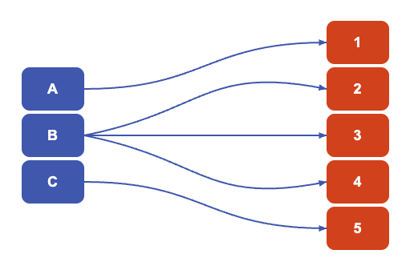
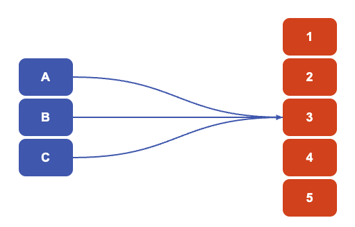
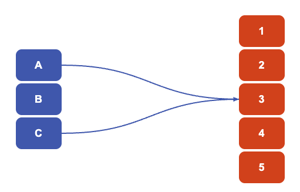
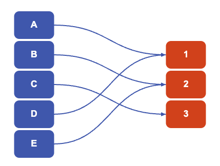
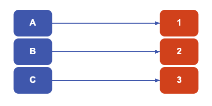

# The function junction

:::{.content-visible when-format="html"}

:::{.callout-important}
## Try it yourself 1

How many elements are in this set? $$X = \{a,c,♦️,d,♠️,️♣️,❤️,💫,b,🍏,🏏,e,f,🗿\}$$
:::

:::{.callout-note collapse="true"}
## Answer to try it yourself 1

There are $14$, but that's not important. Read on...
:::

:::

:::{.content-hidden when-format="html"}

:::{.callout-important}
## Try it yourself 1

How many elements are in this set? $$X = \{a,1,2,3,b,5,193,14555,c,p,23,L,Q,W,A\}$$
:::

:::{.callout-note collapse="true"}
## Answer to try it yourself 1

There are $14$, but that's not important. Read on...
:::

:::

The important thing was **how** you counted it. If you counted out loud, you probably said $1,2,3,4,\ldots$ all the way up to $14$, pointing at each element in turn. This is how you are first taught to count things.

In fact, what you are doing is taking an input from $X$ and assigning it an output from the set of all positive whole numbers. This linking of an input to an output is the idea of a mathematical **function**.

:::{.callout-note}

## Function, domain, range

Let $X,Y$ be two sets.

A **function** $f$ from the set $X$ to the set $Y$ is an assignment that maps each element of $X$ to **exactly one** output in $Y$. It is written as $f:X\to Y$, and the notation $f(x) = y$ means '$f$ maps $x\in X$ to $y\in Y$.

Here, the set $X$ is called the **domain** of $f$ and the set $Y$ is called the **codomain** of $f$. 

Two functions $f$ and $g$ are equal if and only if they have the same domain $X$, codomain $Y$, and $f(x) = g(x)$ for all $x\in X$. 

:::

The important thing is that for some $x\in X$, there is exactly one $y\in Y$ such that $f(x) = y$ - so **one** element of $X$ can't map to **many** elements of $Y$. The converse is not true; **many** elements of $X$ are allowed to **one** element of $Y$.

:::{.content-visible when-format="html"}

You can use the interactive figure below to explore functions from a set $X$ of letters to a set $Y$ of numbers. It's important to see that $X$ and $Y$ don't have to be the same set, or even the same size!


```{=html}
<script src="https://cdn.jsdelivr.net/npm/mathjs@latest/lib/browser/math.min.js"></script>
<style>

:root{
  --blue:#3F68B6;
  --orange:#DB4315;
  --yellow:#FFCB00;
  --green:#2E8B57;
  --red:#C0392B;
  --border:#DDDDDD;
  --background:#F5F5F5;
  --column-separation:50%;
}
body{

  font-family:Arial,Helvetica,sans-serif;
  background:var(--background);

}

.calc-container{

  max-width:1200px;
  margin:auto;

}

.calc-row{

  display:flex;
  gap:1rem;
  flex-wrap:wrap;

}

.params-card{

  flex:1;
  min-width:300px;

}

.function-card{

  flex:2;
  min-width:600px;

}

.calc-card{

  background:white;
  border:1px solid var(--border);
  border-radius:8px;
  overflow:hidden;
  margin-bottom:1rem;
  box-shadow:0 2px 6px rgba(0,0,0,.08);

}

.calc-header{

  background:var(--blue);
  color:white;
  font-weight:bold;
  padding:.8rem 1rem;

}

.calc-body{

  padding:1rem;

}

input[type=range]{

  width:100%;

}

.button-row{

  display:flex;
  gap:.75rem;
  margin-top:1rem;

}

button{

  border:none;
  border-radius:6px;
  padding:.55rem 1rem;
  font-size:15px;
  cursor:pointer;
  transition:.2s;

}

button:hover{

  transform:translateY(-1px);

}

.undo-button{

  background:var(--blue);
  color:white;

}

.reset-button{

  background:var(--orange);
  color:white;

}

/*************************************************/
/* FUNCTION DESIGNER                             */
/*************************************************/

#designer{

  position:relative;
  height:480px;

}

#arrowLayer{

  position:absolute;
  inset:0;
  width:100%;
  height:100%;
  pointer-events:none;

}

.column{

  position:absolute;
  top:50%;
  transform:translateY(-50%);
  display:flex;
  flex-direction:column;
  gap:60px; 
  
  padding:10px 0;

}

#domainColumn{

    left:calc(50% - var(--column-separation)/2);
    transform:translate(-15%,-50%);


}

#codomainColumn{

    left:calc(50% + var(--column-separation)/2);
    transform:translate(-15%,-50%);


}

.node{

  width:78px;
  height:54px;
  margin:4px 0; 

  border-radius:10px;

  display:flex;
  justify-content:center;
  align-items:center;

  font-weight:bold;
  font-size:18px;

  cursor:pointer;

  transition:.25s;

  user-select:none;

}

.domain{

  background:var(--blue);
  color:white;

}

.codomain{

  background:var(--orange);
  color:white;

}

.node:hover{

  transform:scale(1.05);

}

.node.selected{

  background:var(--yellow);
  color:black;
  box-shadow:0 0 12px rgba(255,203,0,.8);

}

.node.error{

  background:var(--red);
  color:white;

}

.node.unused{

  opacity:.35;

}

.badge{

  display:inline-block;
  padding:.3rem .8rem;
  border-radius:20px;
  color:white;
  font-size:14px;
  margin:.2rem;

}

.good{

  background:var(--green);

}

.bad{

  background:var(--red);

}

.neutral{

  background:#888;

}

.metric{

  margin-bottom:16px;

}

.metric-label{

  font-weight:bold;
  color:#666;

}

.metric-value{

  margin-top:4px;
  font-size:1.1rem;

}

/*************************************************/
/* SVG ARROWS                                    */
/*************************************************/

.arrow{

  stroke:var(--blue);
  stroke-width:2;
  fill:none;

  marker-end:url(#arrowhead);

  transition:.3s;

}

.arrow.invalid{

  stroke:var(--red);

}

.arrow.selected{

  stroke:var(--yellow);
  stroke-width:5;

}

/*************************************************/
/* MOBILE                                        */
/*************************************************/

@media(max-width:900px){

  .calc-row{

      flex-direction:column;

  }

  .function-card{

      min-width:auto;

  }

  #designer{

      height:520px;

  }

  .node{

      width:78px;
      height:54px;
      font-size:16px;
      margin:4px 0; 

  }

  #domainColumn{

    left:calc(50% - var(--column-separation)/2);
    transform:translate(-15%,-50%);


  }

  #codomainColumn{

    left:calc(50% + var(--column-separation)/2);
    transform:translate(-15%,-50%);

  }

}

</style>

<div class="calc-container">

  <div class="calc-row">

    <!-- ================= PARAMETERS ================= -->

    <div class="calc-card params-card">

      <div class="calc-header">
        Parameters
      </div>

      <div class="calc-body">

        <label for="domainSize">
          Size of domain (|X|)
        </label>

        <input
          id="domainSize"
          type="range"
          min="1"
          max="8"
          value="5">

        <div id="domainValue">
          5 elements
        </div>

        <br>

        <label for="codomainSize">
          Size of codomain (|Y|)
        </label>

        <input
          id="codomainSize"
          type="range"
          min="1"
          max="8"
          value="5">

        <div id="codomainValue">
          5 elements
        </div>

        <div class="button-row">

          Click a domain element,
          then a codomain element,
          to create a mapping.

          <button
            id="undoButton"
            class="undo-button">

            Undo

          </button>

          <button
            id="resetButton"
            class="reset-button">

            Reset

          </button>

        </div>

      </div>

    </div>

    <!-- ================= FUNCTION DESIGNER ================= -->

    <div class="calc-card function-card">

      <div class="calc-header">
        Function Designer
      </div>

      <div class="calc-body">

        <div id="designer">

          <!-- SVG arrow layer -->

          <svg id="arrowLayer">

            <defs>

            <marker
                id="arrowhead"
                markerWidth="5"
                markerHeight="4"
                refX="4.8"
                refY="2"
                orient="auto"
                markerUnits="strokeWidth">
            
                <polygon
                    points="0 0, 5 2, 0 4"
                    fill="#3F68B6">
                </polygon>

                </marker>

            </defs>

          </svg>

          <!-- Domain -->

          <div
            id="domainColumn"
            class="column">

          </div>

          <!-- Codomain -->

          <div
            id="codomainColumn"
            class="column">

          </div>

        </div>

      </div>

    </div>

  </div>

  <!-- ================= INFORMATION ================= -->

  <div class="calc-card">

    <div class="calc-header">
      Information
    </div>

    <div
      id="informationPanel"
      class="calc-body">

      <div class="metric">

        <div class="metric-label">

          Function Status

        </div>

        <div
          id="functionStatus"
          class="metric-value">

          Click a domain element,
          then a codomain element
          to create a mapping.

        </div>

      </div>

      <hr>

      <div class="metric">

        <div class="metric-label">

          Properties

        </div>

        <div id="propertyBadges">

          <span
            class="badge neutral">

            Not yet defined

          </span>

        </div>

      </div>

      <hr>

      <div class="metric">

        <div class="metric-label">

          Domain

        </div>

        <div
          id="domainDisplay"
          class="metric-value">

        </div>

      </div>

      <div class="metric">

        <div class="metric-label">

          Codomain

        </div>

        <div
          id="codomainDisplay"
          class="metric-value">

        </div>

      </div>

      <div class="metric">

        <div class="metric-label">

          Image

        </div>

        <div
          id="imageDisplay"
          class="metric-value">

        </div>

      </div>

      <div class="metric">

        <div class="metric-label">

          Mapping

        </div>

        <div
          id="mappingDisplay"
          class="metric-value">

          None

        </div>

      </div>

      <div class="metric">

        <div class="metric-label">

          Explanation

        </div>

        <div
          id="explanation"
          class="metric-value">

          Every element of the domain
          must map to exactly one element
          of the codomain.

        </div>

      </div>

    </div>

  </div>

</div>

<script>

/*********************************************************************/
/* GLOBAL DATA                                                       */
/*********************************************************************/

// Labels for the domain (X)
const DOMAIN_LABELS = [
  "A","B","C","D","E","F","G","H"
];

// Labels for the codomain (Y)
const CODOMAIN_LABELS = [
  "1","2","3","4","5","6","7","8"
];

/*********************************************************************/
/* CURRENT STATE                                                     */
/*********************************************************************/

// Current slider values
let domainSize = 5;
let codomainSize = 5;

// Currently selected domain element
// (null means nothing selected)
let selectedDomain = null;

// History stack for Undo
let undoStack = [];

/*
Mappings are stored as:

Map(

  "A" -> ["2"],

  "B" -> ["5"],

  "C" -> ["1","4"]   <-- illegal one-to-many

)

Deliberately allow multiple outputs because
students to be able to create an invalid
function and receive feedback.
*/

let mappings = new Map();

/*********************************************************************/
/* INITIALISATION                                                    */
/*********************************************************************/

function initialiseData(){

    mappings.clear();

    undoStack = [];

    selectedDomain = null;

    domainSize =
        parseInt(
            document.getElementById(
                "domainSize"
            ).value
        );

    codomainSize =
        parseInt(
            document.getElementById(
                "codomainSize"
            ).value
        );

    // Every domain element begins
    // with zero outputs.

    for(let i=0;i<domainSize;i++){

        mappings.set(
            DOMAIN_LABELS[i],
            []
        );

    }

}

/*********************************************************************/
/* SAVE STATE FOR UNDO                                               */
/*********************************************************************/

function saveState(){

    // Deep copy of mappings

    const copy =
        new Map();

    mappings.forEach(
        (value,key)=>{

            copy.set(
                key,
                [...value]
            );

        }
    );

    undoStack.push({

        mappings:copy,

        selected:selectedDomain

    });

}

/*********************************************************************/
/* UNDO                                                              */
/*********************************************************************/

function undo(){

    if(
        undoStack.length===0
    ){
        return;
    }

    const state =
        undoStack.pop();

    mappings =
        state.mappings;

    selectedDomain =
        state.selected;

    redraw();

}

/*********************************************************************/
/* RESET                                                             */
/*********************************************************************/

function resetMappings(){

    initialiseData();

    redraw();

}

/*********************************************************************/
/* SELECT DOMAIN ELEMENT                                              */
/*********************************************************************/

function selectDomain(label){

    selectedDomain = label;

    redraw();

}

/*********************************************************************/
/* ADD MAPPING                                                       */
/*********************************************************************/

function addMapping(codomainLabel){

    if(
        selectedDomain===null
    ){
        return;
    }

    saveState();

    const outputs =
        mappings.get(
            selectedDomain
        );

    outputs.push(
        codomainLabel
    );

    selectedDomain = null;

    redraw();

}

/*********************************************************************/
/* REMOVE A SPECIFIC MAPPING                                         */
/*********************************************************************/

function removeMapping(

    domainLabel,

    codomainLabel

){

    saveState();

    const outputs =
        mappings.get(
            domainLabel
        );

    const filtered =
        outputs.filter(

            x=>x!==codomainLabel

        );

    mappings.set(

        domainLabel,

        filtered

    );

    redraw();

}

/*********************************************************************/
/* REPLACE OUTPUT                                                    */
/*********************************************************************/

/*
Useful later if you decide that
clicking an already-defined domain
should replace its output rather than
creating an illegal function.

Currently unused.
*/

function setSingleOutput(

    domainLabel,

    codomainLabel

){

    saveState();

    mappings.set(

        domainLabel,

        [codomainLabel]

    );

    redraw();

}

/*********************************************************************/
/* ACCESSORS                                                         */
/*********************************************************************/

function getDomain(){

    return DOMAIN_LABELS.slice(
        0,
        domainSize
    );

}

function getCodomain(){

    return CODOMAIN_LABELS.slice(
        0,
        codomainSize
    );

}

function getImage(){

    const image =
        new Set();

    mappings.forEach(

        outputs=>{

            outputs.forEach(

                y=>image.add(y)

            );

        }

    );

    return [...image];

}

/*********************************************************************/
/* HELPER                                                            */
/*********************************************************************/

function hasOutput(domainLabel){

    return (
        mappings.get(
            domainLabel
        ).length>0
    );

}

function outputCount(domainLabel){

    return mappings.get(
        domainLabel
    ).length;

}

function outputs(domainLabel){

    return mappings.get(
        domainLabel
    );

}

/*********************************************************************/
/* REDRAW EVERYTHING                                                 */
/*********************************************************************/

function redraw(){

    //----------------------------------------------------------
    // Get containers
    //----------------------------------------------------------

    const domainColumn =
        document.getElementById(
            "domainColumn"
        );

    const codomainColumn =
        document.getElementById(
            "codomainColumn"
        );

    const svg =
        document.getElementById(
            "arrowLayer"
        );

    //----------------------------------------------------------
    // Clear previous contents
    //----------------------------------------------------------

    domainColumn.innerHTML = "";

    codomainColumn.innerHTML = "";

    // Keep the <defs> section

    const defs =
        svg.querySelector("defs");

    svg.innerHTML = "";

    svg.appendChild(defs);

    //----------------------------------------------------------
    // Build domain
    //----------------------------------------------------------

    getDomain().forEach(label=>{

        const box =
            document.createElement("div");

        box.className =
            "node domain";

        if(label===selectedDomain){

            box.classList.add(
                "selected"
            );

        }

        box.textContent =
            label;

        box.dataset.label =
            label;

        box.addEventListener(

            "click",

            ()=>{

                selectDomain(
                    label
                );

            }

        );

        domainColumn.appendChild(
            box
        );

    });

    //----------------------------------------------------------
    // Build codomain
    //----------------------------------------------------------

    getCodomain().forEach(label=>{

        const box =
            document.createElement("div");

        box.className =
            "node codomain";

        box.textContent =
            label;

        box.dataset.label =
            label;

        box.addEventListener(

            "click",

            ()=>{

                addMapping(
                    label
                );

            }

        );

        codomainColumn.appendChild(
            box
        );

    });

    //----------------------------------------------------------
    // Draw arrows
    //----------------------------------------------------------

    drawArrows();

    //----------------------------------------------------------
    // Update information panel
    //----------------------------------------------------------

    updateInformation();

}

/*********************************************************************/
/* DRAW SVG ARROWS                                                   */
/*********************************************************************/

function drawArrows(){

    const svg =
        document.getElementById(
            "arrowLayer"
        );

    mappings.forEach(

        (outputs,domain)=>{

            outputs.forEach(

                (codomain,index)=>{

                    const from =
                        document.querySelector(
                            '#domainColumn .node[data-label="'+domain+'"]'
                        );

                    const to =
                        document.querySelector(
                            '#codomainColumn .node[data-label="'+codomain+'"]'
                        );

                    if(!from || !to)
                        return;

                    const p1 =
                        centreOf(from,svg);

                    const p2 =
                        centreOf(to,svg);

                    //--------------------------------------------------

                    const startX = p1.x + 39;   // half of 78px
                    const endX   = p2.x - 39;
                    
                    const dx = (endX - startX)/2;
                    
                    const curve =
                        30*(index-(outputs.length-1)/2);

                    //--------------------------------------------------

                    const path =
                        document.createElementNS(

                            "http://www.w3.org/2000/svg",

                            "path"

                        );

                    path.setAttribute(

                        "class",

                        "arrow"

                    );

                    path.setAttribute(
                        "d",
                        `M ${startX} ${p1.y}
                         C ${startX+dx} ${p1.y+curve},
                           ${endX-dx} ${p2.y+curve},
                           ${endX} ${p2.y}`
                    );

                    svg.appendChild(
                        path
                    );

                }

            );

        }

    );

}

/*********************************************************************/
/* CENTRE OF NODE                                                    */
/*********************************************************************/

function centreOf(node,svg){

    const r=node.getBoundingClientRect();
    const s=svg.getBoundingClientRect();

    return{

        x:r.left-s.left+r.width/2,

        y:r.top-s.top+r.height/2

    };

}

/*********************************************************************/
/* UPDATE INFORMATION PANEL                                          */
/*********************************************************************/

function updateInformation(){

    const domain = getDomain();
    const codomain = getCodomain();

    //----------------------------------------------------------
    // Analyse mapping
    //----------------------------------------------------------

    let missing = [];
    let oneToMany = [];
    let image = new Set();

    let isFunction = true;

    mappings.forEach((outputs,x)=>{

        if(outputs.length===0){

            missing.push(x);
            isFunction = false;

        }

        if(outputs.length>1){

            oneToMany.push(x);
            isFunction = false;

        }

        outputs.forEach(y=>image.add(y));

    });

    //----------------------------------------------------------
    // Injective?
    //----------------------------------------------------------

    let injective = false;

    if(isFunction){

        injective = true;

        const seen = new Set();

        for(const x of domain){

            const y = mappings.get(x)[0];

            if(seen.has(y)){

                injective = false;
                break;

            }

            seen.add(y);

        }

    }

    //----------------------------------------------------------
    // Surjective?
    //----------------------------------------------------------

    let surjective = false;

    if(isFunction){

        surjective = true;

        codomain.forEach(y=>{

            if(!image.has(y))
                surjective = false;

        });

    }

    //----------------------------------------------------------
    // Bijective?
    //----------------------------------------------------------

    const bijective =
        isFunction &&
        injective &&
        surjective;

    //----------------------------------------------------------
    // Status message
    //----------------------------------------------------------

    let status;
    let explanation;

    if(isFunction){

        status =
            "<span class='badge good'>✓ Function</span>";

        explanation =
            "Every element of the domain has exactly one output.";

    }
    else if(oneToMany.length){

        status =
            "<span class='badge bad'>✗ Not a Function</span>";

        explanation =
            oneToMany.join(", ")
            + " map to more than one value.";

    }
    else{

        status =
            "<span class='badge bad'>✗ Not a Function</span>";

        explanation =
            "No output has been chosen for "
            + missing.join(", ") + ".";

    }

    //----------------------------------------------------------
    // Property badges
    //----------------------------------------------------------

    let badges = "";

    badges +=
        injective
        ? "<span class='badge good'>Injective</span>"
        : "<span class='badge bad'>Not Injective</span>";

    badges +=
        surjective
        ? "<span class='badge good'>Surjective</span>"
        : "<span class='badge bad'>Not Surjective</span>";

    badges +=
        bijective
        ? "<span class='badge good'>Bijective</span>"
        : "<span class='badge bad'>Not Bijective</span>";

    //----------------------------------------------------------
    // Mapping text
    //----------------------------------------------------------

    let mappingHTML = "";

    domain.forEach(x=>{

        const outputs = mappings.get(x);

        if(outputs.length===0){

            mappingHTML +=
                `${x} ↦ ?<br>`;

        }
        else{

            mappingHTML +=
                `${x} ↦ ${outputs.join(", ")}<br>`;

        }

    });

    //----------------------------------------------------------
    // Image
    //----------------------------------------------------------

    const imageText =
        image.size
        ? "{"+[...image].join(", ")+"}"
        : "∅";

    //----------------------------------------------------------
    // Update page
    //----------------------------------------------------------

    document.getElementById(
        "functionStatus"
    ).innerHTML = status;

    document.getElementById(
        "propertyBadges"
    ).innerHTML = badges;

    document.getElementById(
        "domainDisplay"
    ).innerHTML =
        "{"+domain.join(", ")+"}";

    document.getElementById(
        "codomainDisplay"
    ).innerHTML =
        "{"+codomain.join(", ")+"}";

    document.getElementById(
        "imageDisplay"
    ).innerHTML =
        imageText;

    document.getElementById(
        "mappingDisplay"
    ).innerHTML =
        mappingHTML;

    document.getElementById(
        "explanation"
    ).innerHTML =
        explanation;

}

/*********************************************************************/
/* EVENT LISTENERS                                                   */
/*********************************************************************/

//----------------------------------------------------------
// Domain size slider
//----------------------------------------------------------

document.getElementById(
    "domainSize"
).addEventListener(
    "input",
    function(){

        domainSize =
            parseInt(this.value);

        document.getElementById(
            "domainValue"
        ).textContent =
            domainSize +
            " element" +
            (domainSize===1 ? "" : "s");

        initialiseData();

        redraw();

    }
);

//----------------------------------------------------------
// Codomain size slider
//----------------------------------------------------------

document.getElementById(
    "codomainSize"
).addEventListener(
    "input",
    function(){

        codomainSize =
            parseInt(this.value);

        document.getElementById(
            "codomainValue"
        ).textContent =
            codomainSize +
            " element" +
            (codomainSize===1 ? "" : "s");

        initialiseData();

        redraw();

    }
);

//----------------------------------------------------------
// Undo button
//----------------------------------------------------------

document.getElementById(
    "undoButton"
).addEventListener(
    "click",
    undo
);

//----------------------------------------------------------
// Reset button
//----------------------------------------------------------

document.getElementById(
    "resetButton"
).addEventListener(
    "click",
    resetMappings
);

//----------------------------------------------------------
// Window resize
//----------------------------------------------------------

window.addEventListener(
    "resize",
    redraw
);

//----------------------------------------------------------
// Keyboard shortcuts
//----------------------------------------------------------

document.addEventListener(

    "keydown",

    function(e){

        //--------------------------------------------------
        // Ctrl+Z
        //--------------------------------------------------

        if(
            (e.ctrlKey || e.metaKey) &&
            e.key.toLowerCase()==="z"
        ){

            e.preventDefault();

            undo();

        }

        //--------------------------------------------------
        // Escape clears selection
        //--------------------------------------------------

        if(
            e.key==="Escape"
        ){

            selectedDomain = null;

            redraw();

        }

    }

);

//----------------------------------------------------------
// Initial page load
//----------------------------------------------------------

initialiseData();

document.getElementById(
    "domainValue"
).textContent =
domainSize + " elements";

document.getElementById(
    "codomainValue"
).textContent =
codomainSize + " elements";

redraw();

</script>

```

:::

:::{.content-hidden when-format="html"}

Here are some examples of functions.

{width="75%"}

{width="75%"}

{width="75%"}

{width="75%"}

:::

## Sequences

In mathematics, the reason why functions are incredibly powerful is because they allow for **comparison** between sets. Any time you want to compare two sets - a function is almost always used. Any time you want to look at growth, or rates of change, or to decide behaviour in the future: you will use a function. 

One of the ways that functions are studied in mathematics is the idea of a **sequence**. You saw all about sequences in [Exploration: The hidden sequences of Pascal's triangle](e-pascalstriangleandgrowth.qmd); how they can be either finite or infinite, how they could have formulas or not.

In fact, every sequence is a function in disguise. To help illustrate this, here is some new mathematical notation; this is a common thing to do in mathematics to help explain certain concepts.

:::{.callout-note}

## Special notation for sets

Write $[n]$ to be the set $\{1,2,3,\ldots,n\}$ of all positive whole numbers from $1$ up to $n$ included. So $[4] = \{1,2,3,4\}$ and $[k] = \{1,2,3,\ldots,k\}$. You can notice that the number of elements of $[n]$ is $n$

For the (infinite) set of all positive whole numbers, write $$\mathbb{N} = \{1,2,3,\ldots\}$$ as the set of **natural numbers**. You can write $$\mathbb{N}_0 = \{0,1,2,3,\ldots\}$$ to be the set of **natural numbers with zero**.

For the (infinite) set of all possible numbers - whole, fractions and decimals, positive and negative - write $\mathbb{R}$ to be the set of these numbers (called **real numbers**). 

:::

This makes it a lot easier to phrase the following important consideration:

:::{.callout-note}

## Sequences and functions

(a) Any finite sequence of length $n$ of symbols from the set $[k]$ can be viewed as a function $f:[n]\to [k]$.

(b) In the reverse direction, any function $f:[n]\to [k]$ is a finite sequence of length $n$ of symbols from the set $[k]$

(c) Any finite sequence of numbers of length $n$ can be viewed as a function $f:[n]\to \mathbb{R}$.

(d) Any infinite sequence of numbers can be viewed as a function $f:\mathbb{N}\to\mathbb{R}$, and any function $f:\mathbb{N}\to \mathbb{R}$ can be written as an infinite sequence.

:::

:::{.callout-important}
## Try it yourself 2

Why are (a) and (b) true? As an initial pointer, think about where the set $[n]$ will appear in your consideration.

:::

:::{.callout-note collapse="true"}

## Answer to try it yourself 2

For (a), suppose that you have a sequence of length $n$ of elements from $[k]$; you could say that this is $$a_1,a_2,\ldots,a_n.$$ You can see that for every number $i$ between $1$ and $n$, there is an element $a_i$ of $[k]$ at position $i$ in the list. You can then define a function $f:[n] \to [k]$ by the assignment $$f(i) = a_i$$ which sends $i\in [n]$ to $a_i$. This then determines the sequence $a_1,a_2,\ldots,a_n$.

For (b), suppose you have a function $f:[n]\to [k]$. You can now view this as a sequence of length $n$ in $[k]$ by writing out all of the outputs in order: $$f(1),f(2),\ldots,f(n)$$ which defines a finite sequence of length $n$ with elements in $[k]$. 

::: 

Parts (c) and (d) follow from similar reasoning. 

This means that finite/infinite sequences can be studied through functions.

:::{.callout-note}

## Examples of sequences as functions

If a sequence has a **closed form formula**, then it can be represented concisely as a function. For instance, the sequence of cube numbers can be written as $f_1:\mathbb{N}\to\mathbb{N}$ with $f(n) = n^3$, or the powers of two as $f_2:\mathbb{N}_0\to\mathbb{N}$ with $f_2(n) = 2^n$. Even constant sequences can be written as functions: write $f_3:\mathbb{N}\to\{153\}$ to be $f_3(n) = 153$ for all $n\in\mathbb{N}$.

The binomial coefficients can also be written as a function, but the domain needs to be all **pairs** of all whole numbers with $0$. Write $$\mathbb{N}_0\times \mathbb{N}_0\ = \{(n,k)\; : \; n,k\in \mathbb{N}_0\}.$$ Then the binomial coefficient can be written as a function $b:\mathbb{N}_0\times \mathbb{N}_0\times \mathbb{N}$ with $$b(n,k) = \binom{n}{k}.$$

:::

Here's an excellent result that follows from this.

:::{.callout-note}

## Counting number of functions

The total number of possible functions $f:[n]\to[k]$ is $k^n$.

:::

:::{.callout-note}

## Proof of the formula of the number of functions

You are given that $[n] = \{1,2,3,\ldots,n\}$, and there is a function $f:[n]\to[k]$. Write $f$ as a finite sequence of length $n$ with elements from $k$ to get $$f(1),f(2),f(3),\ldots,f(n)$$

So, you can ask yourself - what is $f(1)$? Well, you don't know, as you aren't given the information. However, there are $k$ many **choices** for the value of $f(1)$, because it has to be exactly one element of the set $[k] = \{1,2,3,\ldots,k\}$. Since it can be any of them, this gives $k$ choices.

Next, you can ask -  what is $f(2)$? Again, there are $k$ many choices.  You can notice here that the choice of the value of $f(2)$ is completely independent of the choice for the value of $f(1)$. Similarly, there are $k$ many choices for the value of $f(3)$ and this choice is independent of the values of $f(1)$ and $f(2)$. 

You can carry on in this way for all the elements of $[n]$. With $k$ choices for each element, and all of the choices being independent of each other, this leads to $$\underbrace{k}_{\textsf{what is }f(1)?}\cdot \underbrace{k}_{\textsf{what is }f(2)?}\cdot \underbrace{k}_{\textsf{what is }f(3)?} \cdot \ldots \cdot \underbrace{k}_{\textsf{what is }f(n)?} = k^n$$ many choices for the sequence $f(1),f(2),f(3),\ldots,f(k)$. Therefore, there are $k^n$ possible functions $f:[n]\to [k]$.

:::

:::{.callout-important}

## Try it yourself 3

Does this seem familiar? 

:::

:::{.callout-note collapse="true"}

This is an almost a word-for-word recreation of the proof in [Exploration: How to win at cards - combinations and permutations](e-combinationspermutations.qmd) that there were $2^n$ many subsets of a set $\{1,2,3,\ldots,n\}$!

So what's happening here? Well, the idea of deciding whether or not each element of $[n] = \{1,2,3,\ldots,n\}$ is in some subset of $[n]$ can be modelled as a function $f:[n]\to[2]$, where $f(i) = 1$ says that $i$ is not in the subset, and $f(i) = 2$ says that $i$ is in the subset. Therefore, every function $f:[n]\to[2]$ corresponds to a subset of $[n]$, and every subset of $[n]$ corresponds to a function $f:[n]\to[2]$. This function is called an **indicator function** for the subset of $[n]$.

:::

# Injective, surjective, bijective

Now, much like numbers can be odd, even, prime, not prime, and so on, functions have different properties as well. To do this, you'll need to examine **exactly** where the function sends its elements.

:::{.callout-note}

## Image of a function

The set $$f(X) = \{f(x)\textsf{ where } x\in X\} \subseteq Y$$ is called the **image** of $f$. It follows from this that the image of $f$ is a subset of the codomain $Y$ of $f$.

:::

:::{.content-visible when-format="html"}

You can use the above interactive figure to investigate the image of the function - it is included in the information below the figure. You can see that the image of your chosen function is the set of whatever outputs you pick in the codomain.

:::

:::{.content-hidden when-format="html"}

:::{.content-hidden when-format="html"}

Here are some examples of images of functions.

{width="75%"}

{width="75%"}

:::

:::

How functions map into the image is important, and how much of the codomain is covered in the image is important. Together, these properties underpin the very idea of counting.

:::{.callout-note}

## Injective, surjective, and bijective

Suppose that $f:X\to Y$ is a function from $X$ to $Y$.

(a) Say that $f$ is **injective** (or **one-to-one**, or even **one-one**) if $x_1\neq x_2$ means that $f(x_1)\neq f(x_2)$ for all $x_1,x_2\in X$. Equivalently, $f$ is injective if $f(x_1) = f(x_2)$ implies that $x_1 = x_2$ for all $x_1,x_2\in X$.

(b) Say that $f$ is **surjective** (or **onto**) if for all $y\in Y$ there exists $x\in X$ such that $f(x) = y$. Equivalently, $f$ is surjective if the image $f(X)$ of $f$ is equal to the codomain $Y$ of $f$.

(c) Say that $f$ is **bijective** if $f$ is both injective and surjective.

:::

Intuitively, you could say that 

- $f$ is injective if different elements in $A$ always map to different elements in $B$.

- $f$ is surjective if every element of $B$ has an element of $A$ that maps to it.

- $f$ is bijective if every element of $B$ has a **unique** element of $A$ that maps to it.

It's important that in mathematics, you have both the **precise definition** and the **intuition behind it** - it's like the spirit and letter of the law, they have to line up in order to be effective.

:::{.callout-important}

## Try it yourself 4

Using the interactive function investigator above, find examples of injective, surjective and bijective functions, and write down their images. What do you notice about the sizes of the sets involved?

:::

:::{.content-visible when-format="html"}

:::{.callout-note collapse="true"}

## Answer to try it yourself 4

You can check these for yourself in [Interactive: Function investigator](../apps/interactive/i-functions.qmd)!

Here's an example of an injective function $f:\{A,B,C\}\to\{1,2,3,4,5\}$: $$f(A) = 1,\quad f(B) = 2,\quad f(C) = 5$$ with image $\{1,2,5\}$. You can notice that each of the domain elements $\{A,B,C\}$ is sent to a different element of the codomain, demonstrating that the function is injective.

Here's an example of a surjective function $g:\{A,B,C,D,E\}\to\{1,2,3\}$: $$g(A) = 1,\quad g(B) = 2,\quad g(C) = 3,\quad g(D) = 1,\quad g(E) = 2$$ with image $\{1,2,3\}$. Since the image $\{1,2,3\}$ is the same as the codomain, it follows that this function is surjective. 

Here's an example of a bijective function $h:\{A,B,C\}\to\{1,2,3\}$: $$h(A) = 1,\quad h(B) = 2,\quad h(C) = 3$$ with image $\{1,2,3\}$. You can notice that each of the domain elements $\{A,B,C\}$ is sent to a different element of the codomain, demonstrating that the function is injective - in addition, the image $\{1,2,3\}$ is the same as the codomain, so the function is also surjective. This means that $h$ is bijective.

:::

:::

:::{.content-hidden when-format="html"}

:::{.callout-note collapse="true"}

## Answer to try it yourself 4

Here's an example of an injective function $f:\{A,B,C\}\to\{1,2,3,4,5\}$: $$f(A) = 1,\quad f(B) = 2,\quad f(C) = 5$$ with image $\{1,2,5\}$. You can notice that each of the domain elements $\{A,B,C\}$ is sent to a different element of the codomain, demonstrating that the function is injective.

{width="75%"}

Here's an example of a surjective function $g:\{A,B,C,D,E\}\to\{1,2,3\}$: $$g(A) = 1,\quad g(B) = 2,\quad g(C) = 3,\quad g(D) = 1,\quad g(E) = 2$$ with image $\{1,2,3\}$. Since the image $\{1,2,3\}$ is the same as the codomain, it follows that this function is surjective. 

{width="75%"}

Here's an example of a bijective function $h:\{A,B,C\}\to\{1,2,3\}$: $$h(A) = 1,\quad h(B) = 2,\quad h(C) = 3$$ with image $\{1,2,3\}$. You can notice that each of the domain elements $\{A,B,C\}$ is sent to a different element of the codomain, demonstrating that the function is injective - in addition, the image $\{1,2,3\}$ is the same as the codomain, so the function is also surjective. This means that $h$ is bijective.

{width="75%"}

:::

:::

What about the functions before?

:::{.callout-note collapse="true"}

## Previous examples

- The function $f_1:\mathbb{N}\to\mathbb{N}$ with $f_1(n) = n^3$ is injective but not surjective. For injective, you need to take two potential equal ouputs and show they come from the same input. So if $f_1(x) = f_1(y)$ then $x^3 = y^3$, and so $x = y$ - therefore, $f_1$ is injective. To show that $f_1$ is not surjective, it's enough to show that there is an element of the codomain that isn't in the image; since there is no natural number that cubes to make $2$, it follows that $2$ is not in the image. So $f_1$ is not surjective. 

- Similarly, $f_2:\mathbb{N}_0\to\mathbb{N}$ with $f_2(n) = 2^n$ is injective but not surjective. 

- The function $f_3:\mathbb{N}\to\{153\}$ with $f_3(n) = 153$ for all $n\in\mathbb{N}$ is surjective but not injective. Here, the image of $f_3$ is $\{153\}$ which is the same as the codomain, so $f_3$ is surjective. To show that it's not injective, you can notice that $f_3$ sends both $1$ and $2$ to $153$ and since $1\neq 2$, different elements aren't always mapped to different elements and the function is not injective.

- The binomial coefficient written as a function $b:\mathbb{N}_0\times \mathbb{N}_0\times \mathbb{N}$ with $$b(n,k) = \binom{n}{k}$$ is surjective but not injective. For surjective, suppose that $m$ is in $\mathbb{N}$; you need to find a pair $(n,k)$ such that $b(n,k) = m$. Since $\binom{m}{1} = m$ for all $m$ in $\mathbb{N}$, it follows that taking $n = m$ and $k = 1$ shows that every $m\in\mathbb{N}$ is in the image of $b$. So $b$ is surjective. However, $b$ is not injective as $$b(3,1) = \binom{3}{1} = 3 = \binom{3}{2} = b(3,2)$$ but the inputs $(3,1)$ and $(3,2)$ are not the same. 

:::


You can also notice that 

- if a function is surjective, then the cardinality of the domain $X$ is greater than or equal to the cardinality of the codomain $Y$, so $|X| \geq |Y|$.

- if a function is injective, then the cardinality of the codomain $Y$ is greater than or equal to the cardinality of the domain $Y$, so $|Y| \geq |X|$.

- if a function is bijective, then the cardinality of the domain $X$ is equal to the cardinality of the domain $Y$, so $|X| = |Y|$.

These observations can be reversed using a mathematical principle called the **contrapositive**. This allows you to change the logical perspective of a statement 'if $A$ then $B$' to 'if not $B$ then not $A$'.

Doing this to the observations above give the following statements about any function $f:X\to Y$:

- if the cardinality of the domain $X$ is **less than** the cardinality of the codomain $Y$, then $f$ is never surjective.

- if the cardinality of the codomain $Y$ is **less than** the cardinality of the domain $X$, then $f$ is never injective.

- if the cardinalities of the domain $X$ and the codomain $Y$ are **not equal**, then $f$ is never bijective. 

## Pigeons

The second of these statements is equivalent to an important principle in combinatorics.

:::{.callout-note}

## The pigeonhole principle

Suppose that $n > m$. If you have $n$ items and $m$ boxes in which to put them, then at least one box contains more than one item. 

:::

:::{.callout-note}

## Proof of the pigeonhole principle

Give numbers to your list of items $\{1,2,3,\ldots,n\}$. Put item $1$ in box $1$, item $2$ in box $2$, and so on until you put item $m$ in box $m$. Since $n> m$, it follows that $n - m \geq 1$ and so you have at least one item to put in a box. It follows that at least one box contains more than one item.

:::

:::{.callout-note}

## Scenario 1

Cantor's Confectionery is one of the best places to work in the fictional world. It has the habit of throwing a birthday party for every one of its employees on their birthday, which is truly exceptional for morale. They have appointed you, its HR representative, to try and investigate cost-cutting measures for this expensive endeavour. The best way to achieve this is to have a shared party between two or more employees.  

What is the number $n$ of employees required to have 

(a) a $50\%$ chance that two employees share the same birthday?

(b) a $100\%$ chance that two employees share the same birthday?

:::

The first of these is probability, and relies on techniques seen in [Explorations: How to win at cards - combinations and permutations](e-combinationspermutations.qmd). The second uses the pigeonhole principle!

:::{.callout-note}

## Answer to Scenario 1

For convenience, assume that there are $365$ days in the year, as there are in most years. 

(a) Here, it's easier to work out the probability of this **not** happening - you can then subtract this from $1$ to work out the probability of this happening.

  Write a list of your employees. Suppose that the first employee has a birthday on any day of the year. The chances that a second employee has a different birthday than the first is $364/365$. The chances that a third employee has a different birthday than the first two is $363/365$. You can continue in this way to show that the probability that $n$ employees all have different birthdays is 
$$
\begin{aligned}
\mathbb{P}(\textsf{different birthdays}) &= \frac{365}{365}\cdot \frac{364}{365}\cdot \frac{363}{365}\cdot\ldots\cdot\frac{(365-n)}{365}\\[0.5em]
&= \frac{(365)_n}{365^n}
\end{aligned}
$$
where $(365)_n$ is the **falling factorial** from [Explorations: How to win at cards - combinations and permutations](e-combinationspermutations.qmd). 

  As it turns out, the number $n$ that tips this number below $50\%$ - and so the chances that two employees share a birthday is **above** $50\%$ - is $n = 23$. So for a company with $23$ employees, there is a greater than $50\%$ chance that two employees share a birthday!

(b) Here, the **worst-case scenario** is that everybody has a different birthday. Since there are $365$ possible birthdays, the worst case scenario is that the company has $365$ employees, each with different birthdays. 

  So if there are $366$ employees in Cantor's Confectionery, then it's guaranteed that at least two people share a single birthday. So the answer is $n = 366$. 

:::

The pigeonhole principle also guarantees that in Scotland, at least two people have the same numbers of hairs on their head!

# Counting blessings

So what does all of this have to do with counting?

If you count the set in Try it yourself 1 by pointing at each element and saying each number, you created a bijection between the set and the set of number $\{1,2,\ldots,14\}$. By putting sets in bijections with other sets, or not, you can directly compare them to each other by their sizes. This is infact the definition of counting:

:::{.callout-note}

## Definition of cardinality

Let $X$ be a set, and $[n] = \{1,2,3,\ldots,n\}$. If there exists a bijection $f:X\to[n]$, then write $|X| = n$. 

:::

So finding bijections between sets of things and sets of natural numbers is the very **idea** of mathematically defining how to count things. It is the injective part that identifies each element of $X$ with a unique natural number, and the surjective part ensures that all the numbers in $\{1,2,3,\ldots,n\}$ are covered. 

If the surjective part doesn't exist, then you have **inequalities** rather than equality. Thankfully, because of the way surjective functions are defined, you can 'shrink' the codomain of your function to the image to create a bijective function. 

So if there exists an injective function $g:X\to [n]$, then this tells you that there is a bijection $g:X\to [m]$ where $m < n$. So not only do bijective functions tell you about the cardinality of sets, injective functions tell you which sets are bigger than others. The following are strengthenings of the above observations.

:::{.callout-note}

## Injections

(a) If there exists an injection $f:X\to Y$, then $|X| \leq |Y|$.

(b) If there exists an injection $g:Y\to X$, then $|Y| \leq |X|$.

(c) (**Cantor-Schröder-Bernstein theorem**) If there exists injections $f:X\to Y$ and $g:Y\to X$, then $|X| = |Y|$.

:::

Notice here that none of the sets here were specifically stated to be **finite.** So this idea of comparing sets using injective and bijective functions extend to where the sets are **infinite** - and this will have even more surprising results in the next exploration...

# Version history {.unnumbered}

v1.0: initial version created 07/26 by tdhc, originally for presentation 3 of 4 for Sutton Trust Summer School 2026.

[This work is licensed under CC BY-NC-SA 4.0.](https://creativecommons.org/licenses/by-nc-sa/4.0/?ref=chooser-v1)
