# Into the infinite

## What is infinity?

Where might you have seen infinity before? Perhaps in numbers:

- Infinite amount of positive whole numbers $1,2,3,4,\ldots$
- $\frac{1}{3} = 0.333333\ldots$
- $\pi = 3.1415926535\ldots$

In fact, you can think of it as a **concept** - the idea of going on forever and ever, rather than as a fixed number. Roughly speaking, something is infinite if it 'goes on forever'. The symbol $\infty$ that you may be familiar with is a shorthand for 'unbounded'

In mathematics, infinity comes up in three common themes.

- You could try and **count** infinitely many things, similar to what you have been looking at in the previous explorations

- You could try and **do** infinitely many operations (adding is the most common).

- You could **look** at what happens as sequences of things go towards infinity.

# Part 1: Counting

:::{.callout-note}

## The natural numbers

Remember from [Exploration: Making it count - an introduction to the theory of functions](e-functionsandcounting.qmd) that the set of positive whole numbers is written as $$\mathbb{N} = \{1,2,3\ldots\}$$ 

:::

Because you can 'count' the elements, and the set is infinite, you can say that $\mathbb{N}$ is a **countably infinite set**. 

So if you have a set $X$, how could you show that $X$ is countably infinite? First of all, you need to show that $X$ is not finite - so must be at least as big as the natural numbers. What you can do is use the idea of an **injective function** from [Exploration: Making it count - an introduction to the theory of functions](e-functionsandcounting.qmd), where you saw the following statement

:::{.callout-note}

## Injections

(a) If there exists an injection $f:X\to Y$, then $|X| \leq |Y|$.

(b) If there exists an injection $g:Y\to X$, then $|Y| \leq |X|$.

(c) (**Cantor-Schröder-Bernstein theorem**) If there exists injections $f:X\to Y$ and $g:Y\to X$, then $|X| = |Y|$.

:::

So what does this mean for showing that $X$ is a countably infinite set? 

:::{.callout-note}

## Statements about cardinality

(a) If there exists an injective function $f:X\to\mathbb{N}$, then $X$ is either finite or it is countably infinite.

(b) If there exists an injective function $g:\mathbb{N}\to X$, then $X$ is infinite.

(c) (from the **Cantor-Schröder-Bernstein theorem**) If there exists injections $f:X\to \mathbb{N}$ and $g:\mathbb{N}\to X$, then $|X| = |\mathbb{N}|$ and $X$ is countably infinite. 

(d) If there exists a bijection $f:X\to Y$, then $|X| = |Y|$ which means they have the same number of elements. 

:::

## Hotels

Most hotels in the world have a finite number of rooms. This means that if the hotel is fully booked, then you cannot fit any more guests in. This is exactly the **pigeonhole principle** from [Exploration: Making it count - an introduction to the theory of functions](e-functionsandcounting.qmd) - if you have $n$ guests and $m$ rooms, where $n > m$, then there must be one room with more than one guest in it! So if someone comes and asks for a room, you have to send them away!

However, on these pages, real life can be twisted and stretched until you have infinitely many rooms in your hotel.

:::{.callout-note}

## Scenario 1

You are the manager of the prestigious Hilbert Hotel. The Hilbert Hotel is special in having a **countably infinite** number of rooms. Each room is labelled with a positive whole number from the set $\mathbb{N} = \{1,2,3,\ldots\}$. For the first time ever, every room is currently occupied.

While at the front desk, you spot a person with a suitcase walking towards you. The person asks you if you have a room available for this evening. Smiling politely, you begin to explain to them that you are terribly sorry, but all the rooms are full... until you have a brainwave. You then say to that person; 'Yes, we do have a room available'.

**How? And how can you be sure that every current guest still has a room?**

:::

:::{.callout-note}

## Answer to Scenario 1

The idea is to move every current guest to a new room.

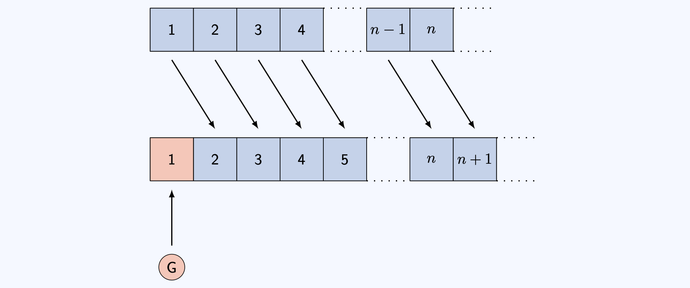{fig.alt="A schematic of the infinitely many rooms of Hilbert hotel, both before and after moving all guests in room n to room n+1, with arrows demonstrating the move. The new guest, labelled G, is then put in the empty space given by room 1 with an arrow demonstrating this."}

Why does this work? By sending the guest in room $n$ to room $n+1$, you ensure that room $1$ is unoccupied (as there is no room $0$), leaving a space for our new guest.  

:::

So what you have done is 'paired' every element $n$ in the hotel $\mathbb{N} = \{1,2,3,\ldots\}$ with a unique element $n + 1$ of the set $S = \{2,3,4,\ldots\}$. This is a **bijection** between the set $\mathbb{N}$ and the set $H$. As you know from above, since $\mathbb{N}$ is countably infinite, so is $S$. As $S$ is infinite, everyone in the hotel to begin with has a new room, leaving room $1$ for the new guest.

You can formulate this into a new hotel policy:

:::{.callout-important}

## Try it yourself 1

You quickly realise that this gives you a way to deal with **any** whole number $m$ of new guests. The question is: how would you do it?

:::

:::{.callout-note collapse="true"}

## Answer to Try it yourself 1

You can do this by moving the person in room $n$ to room $n+m$ for every room number $n$. This is then a bijection from $\mathbb{N}$ to $S_m = \{m+1,m+2,\ldots\}$, leaving rooms $1$ to $m$ for your $m$ new guests.

:::

This is a process known as **generalisation** - once you have figured out how to do one thing, you can extend this as much as possible. But before you can, another problem is going to rear its ugly head. 

:::{.callout-note}

## Scenario 2

After sorting out the previous issue, you spot a single InfiniCo bus parked outside. Intrigued, you go out and speak to the rather flustered bus driver, who explains that the bus has a **countably infinite** amount of people on board all looking for a room. The bus seats are numbered $B = \{1,2,3,\ldots\}$.

This is a different problem to the finite group of people; as there is no number $m$ large enough to add to room numbers that will make sure everybody on the bus has a room!

However, you turn to the bus driver and say 'Tell everyone to get off the bus, I'll have rooms for everyone in no time'.

**How do you do it?**

:::

:::{.callout-note}

## Answer to Scenario 2

The idea is to move every current guest to a new room again!

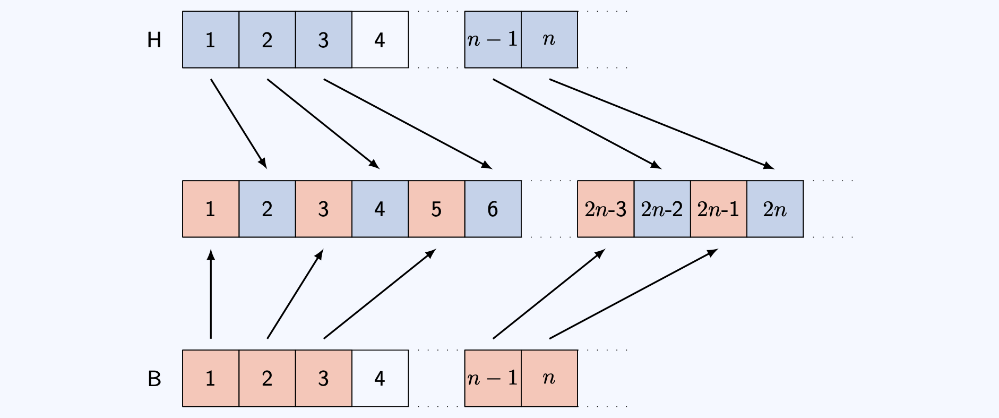{fig.alt="A schematic of the infinitely many rooms of Hilbert hotel, both before and after moving all guests in room n to room 2n, with arrows demonstrating the move. The set of new guests, labelled B, is then directed by arrows into the empty spaces in odd numbered rooms."}

Why does this work? Sending the guest in room $n$ to room $2n$ makes sure that all the odd numbered rooms are empty. You can assign each seat on the bus to a unique odd-numbered room.  

:::

Mathematically, what you have done is `paired' every element $n$ in the hotel $\mathbb{N} = \{1,2,3,\ldots\}$ with a unique element $2n$ of the set $E = \{2,4,6,\ldots\}$, giving a bijection between $E$ and $\mathbb{N}$. This means that every current guest has a new room. 

The empty rooms are odd numbers $O = \{1,3,5,\ldots\}$. There are infinitely many odd numbers. You can then define a bijection between every element $m$ in the bus $B = \{1,2,3,\ldots\}$ with a unique element $2m - 1$ of the set $O = \{1,3,5,\ldots\}$; so every passenger on the bus has a room.

:::{.callout-important}

## Try it yourself 2

You realise that this gives you a way to deal with **any** number $m$ of buses, each with countably infinite number of passengers. The question is: how would you do it? 

As a starting point, let $0\leq r \leq m$. Then there are infinitely many positive whole numbers with remainder $r$ when dividing by $m+1$.  

:::

:::{.callout-note collapse="true"}

## Answer to Try it yourself 2

You can do this by moving the person in room $n$ of the hotel to room $(m+1)\cdot n$ for every room number $n$. The passenger in seat $q$ on bus number $r$ goes into the room $(m+1)q + r$.

:::

Here's something completely different now - an interlude to showing that there are infinitely many primes. To do this, there are two things that you need to know:

:::{.callout-tip}

## Two tips

- To prove that a set is infinite, you can prove that it is **not finite** by assuming that it is finite, and deriving a logical impossibility. This is known as a **proof by contradiction**. 

- Every natural number $n \geq 2$ can be written as a unique product of prime factors. This is a result known as the **Fundamental Theorem of Arithmetic**. 

:::

This is enough to help you sort through the next piece of hotel-based japery. 

:::{.callout-note}

## Scenario 3

After sorting out the InfiniCo bus, you spot a single Euclid Express bus parked outside. There are infinitely many passengers on this bus. Before you can go out however, the Euclid Express bus driver barges in and demands that each of his passengers is accommodated in a **prime-numbered** room. You calmly explain to him that there is plenty of room for his bus, but he is so mad he doesn't listen. He wants you to prove to him that there are enough prime numbered rooms for the passengers on his bus.

**How do you do it?**

As a starting point, first assume that there are finitely many prime numbers $p_1,p_2,\ldots,p_n$ and this is all of them. Consider the number $x = p_1p_2\ldots p_n + 1$. What happens if $x$ is prime? What happens if $x$ is not prime?

Your aim is to show that this assumption that there are finitely many prime numbers is incorrect!

:::

This scenario asks you to prove that there are infinitely many prime numbers.

:::{.callout-note}

## Answer to Scenario 3

Suppose there are only finitely many prime numbers $p_1,p_2,\ldots,p_n$; the aim is to show that this assumption is incorrect. This is known as a **proof by contradiction**. The starting block says $x = p_1p_2\ldots p_n +1$.

Now EITHER

- $x$ is a new prime number OR
- $x$ is divided by a prime number $q\leq x$ (by the useful result). As $p_1,p_2,\ldots,p_n$ do not divide $x$, $q$ cannot be any of these.

So there exists a prime number not on your original list $p_1,p_2,\ldots,p_n$. This is a contradiction. This works for any finite set of primes and so **the set of primes is infinite**.

:::

The idea of a unique factorization of a natural numbers into primes is the cornerstone of the next, even more mindbending problem. 

:::{.callout-note}

## Scenario 4

Just when you thought your day was over, suddenly you hear a huge noise. In your countably infinitely many parking spaces there are countably infinitely many InfiniCo buses sitting idly. You are confronted by a countably infinite number of bus drivers, who each say that they have countably infinitely many guests on board all waiting for a room! Now this one **does** seem impossible... but you can do it! **How??**

:::

Here are some hints to help. 

- First, write $(n,k)$ to represent the passenger in seat $n$ on bus $k$. The set of all passengers is called $B'$.
- **Hint 1:** In this case, you don't have to make sure all the rooms are occupied - an injective function into $\mathbb{N}$ is enough!
- **Hint 2:** There are infinitely many prime numbers. You can write $p_n$ is the $n$th prime number.
- **Hint 3:** Put passenger $(n,k)$ into the room $p_n^k$. Why is this number unique?
- **Hint 4:** Where can you put the guests who are already in the hotel? You know that $p_1p_2$ is free, as the bus passengers have occupied all the prime powers.
 
:::{.callout-note}

## Answer to Scenario 4

You can write $(n,k)$ to represent the $k$th seat on the $n$th coach. You can pair $(n,k)$ in the buses $B'$ to the natural number $p_n^k$; by the useful result, this is a unique natural number. But what about the existing hotel guests? Send the guest in room $n$ to room number $p_1p_2\ldots p_np_{n+1}$; so the guest in room $1$ is sent to $p_1p_2 = 2\cdot3 = 6$.  Crucially, none of these rooms overlap with the rooms occupied by the bus passengers, as it's not a prime number! 

This means every passenger is accommodated with infinitely many rooms to spare! For instance, no passenger is in room number $p_1^2p_2 = 2^2\cdot 3 = 12$. 

This is an injective function from the set $\mathbb{N}\times\mathbb{N} = \{(n,k) \; :\; n,k\in\mathbb{N}\}$ into $\mathbb{N}$. Since there is also a natural injective map from $\mathbb{N}$ to $\mathbb{N}\times \mathbb{N}$ sending $n$ to $(n,1)$, it follows from the Cantor-Schröder-Bernstein theorem that $|\mathbb{N}| = |\mathbb{N}\times\mathbb{N}|$.

:::

You can ask yourselves - are there infinities that **don't fit** into the natural numbers? Actually, you've only scratched the surface...

:::{.callout-note}

## Scenario 5

Cantor's Confectionery have hired the Continuum Coach service for their employee excursion this year, and they've all piled into the bus. Every employee has a unique employer ID which is a real number between $0$ and $1$.

They all pile into the lobby of Hilbert's Hotel, all wanting a room. However, you **cannot accommodate** the employees from Cantor's Confectionery; **there simply aren't enough rooms**. 

:::

This argument is due to the real life [Cantor](https://mathshistory.st-andrews.ac.uk/Biographies/Cantor/)!

:::{.callout-note}

## Answer to Scenario 5: Cantor's diagonal argument

Write $[0,1]$ to be the set of every decimal number between 0 and 1 inclusive. You can see that the function $f:\mathbb{N} \to [0,1]$ given by $$f(n) = \frac{1}{n}$$ is an injective function, so the cardinality of $[0,1]$ is at least the cardinality of $\mathbb{N}$.

Now, if there was an injective function $g:[0,1]\to \mathbb{N}$, then the sets $[0,1]$ and $\mathbb{N}$ would have the same cardinality. The aim is to show that there is **no** one-to-one mapping from $[0,1]$ to $X$. To do this, assume that there **is** a one-to-one mapping from $[0,1]$ to $X$, and then reduce to a logical impossibility - a contradiction. 

You can write every number inside $[0,1]$ as an infinite decimal $0.a_1^na_2^na_3^na_4^na_5^n...$ where every $a_i$ is one of $0,1,2,3,4,5,6,7,8,9$. (You can also assume that the infinite decimal doesn't end in all $0$'s. It's true that $0.\overline{9} = 1$.)

Now, if there is a one-to-one mapping, then you can label each number inside $[0,1]$ by an element of $\mathbb{N}$. So for the $n$th number in $[0,1]$, write $0.a_1^na_2^na_3^na_4^na_5^n...$. Construct a list as shown in the following diagram.

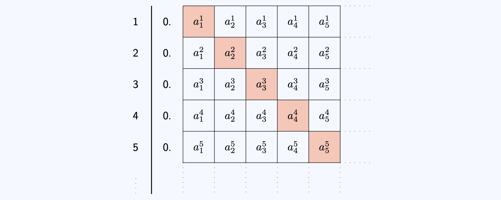{fig.alt="A diagram showing Cantor's diagonal argument. There is a vertically descending list of decimal numbers, with one box per decimal place. The numbers at the $n$th decimal place of the $n$th number are highlighted in red."}

Now, the idea is to construct a new number in $[0,1]$ that is **not in this list**. Look at $a^1_1$; this is a number between 0 and 9. Pick $b_1$ such that $b_1 \neq a^1_1$. Repeat this for every natural number $n$; so pick a $b_n \neq a^n_n$ for every $n$.

Look at the number $0.b_1b_2b_3...$. This number is different from every number in the list, as it differs in the $n$th decimal place for every $n$! 

This is a contradiction as there is a number in $[0,1]$ not labelled by a number from $\mathbb{N}$. So there is no one-to-one mapping and therefore $[0,1]$ has more numbers than $\mathbb{N}$ does. 

:::

The set $[0,1]$ is therefore **uncountably infinite**; as it is infinite but there is no injective function to the set of natural numbers. Intuitively, it is because you cannot `count' them by associating a natural number to each element. 

The branch of mathematics concerned with measuring the size of infinite sets is the modern day study of **set theory**. There are **varying sizes** of infinity, with some infinities bigger than others. You can show, using sets of subsets of sets, that there exist **infinitely many** different sizes of infinity. 

# Doing

## Arithmetic

Doing infinitely many things takes an infinite amount of time. This is time which you do not have.

What can you do? You can do two things and write down the result, then three things and write down the result, and so on. This creates a **sequence** of numbers which you can look at!

- If your sequence is getting closer and closer to a number, then doing infinitely many of those things might give you that number.
- If your sequence is getting larger and larger, then doing infinitely many of those things could give you infinity!
- If your sequence is doing neither, then perhaps comparing it to another sequence (where you know what is going on) may help.

:::{.callout-note}

## Scenario 6

All this running about after infinitely many hotel guests is tiring, so you pop into the hotel bar (Euler's) to check on the staff. Just as you are talking to the bartender, a countably infinite number of people walk in and form an orderly queue. The first person asks for half a bottle of Wiles Wine. The second person asks for a quarter of a bottle... and the $n$th person asks for $\frac{1}{2^n}$th of a bottle, and so on...

The bartender looks utterly bemused. However, you've been in the hotel trade for a long time, and calmly walk behind the bar to sort out the order.

**How many bottles of Wiles Wine do you need?**

(As a hint: You have seen that the positive powers of two are 2, 4, 8, 16, 32, 64, 128, 256, 512, ...  You need to add up $\frac{1}{2} + \frac{1}{4} + \frac{1}{8} + \frac{1}{16} \ldots$.

:::

:::{.callout-note}

## Answer to Scenario 6

You need **only one** bottle of Wiles Wine - and the solution is best expressed in a picture!

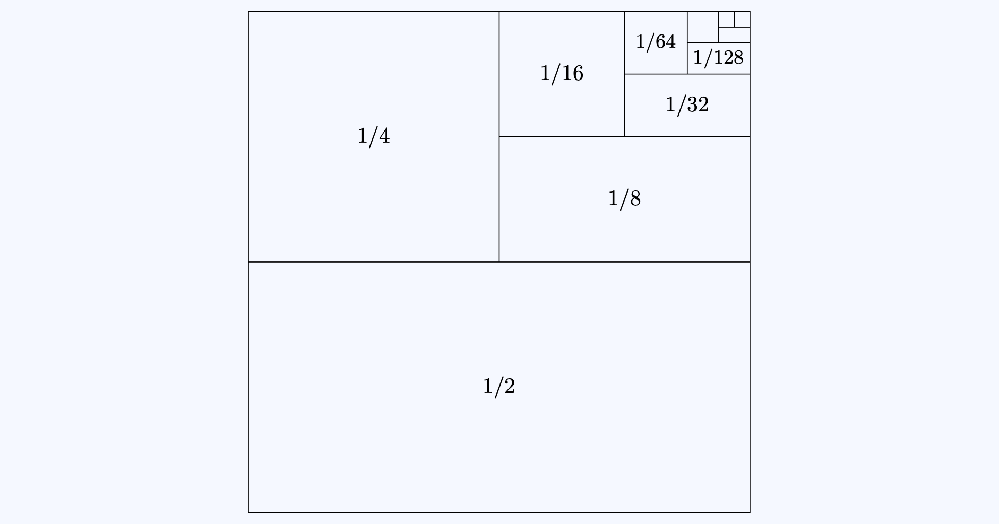{fig.alt="A unit square, divided into smaller and smaller pieces. They are of size 1/2 (bottom half), 1/4 (top left), 1/8 (bottom half of top right), and they continue to decrease in powers of 1/2."}

If you want to see exactly why this is true, please see [Guide: Geometric series].

:::

:::{.callout-note}

## Scenario 7

After you have finished pouring infinitely many glasses of wine from your single bottle, you feel like this day couldn't get any worse. However, another countably infinite number of people walk in and form an orderly queue.

This time, the first person asks for a whole bottle of Wiles Wine. The second person asks for half a bottle, the third person asks for a third of a bottle... and the $n$th person asks for $\frac{1}{n}$th of a bottle, and so on... You frantically get the picture, and after a moment's thought, dispatch your confused colleague to the wine cellar.

**How many bottles of Wiles Wine do you need this time?**

(As a hint, you need to add up $$S = \frac{1}{1} + \frac{1}{2} + \frac{1}{3} + \frac{1}{4} + \frac{1}{5} + \frac{1}{6} + \frac{1}{7} + \frac{1}{8} + \ldots$$ Is this series bigger than another series? Think about grouping terms in halves...

:::

:::{.callout-note}

## Answer to Scenario 7

You need a **countably infinite** amount of bottles of Wiles Wine.

Here's why...

$$
\begin{aligned}
S &= \frac{1}{1} + \frac{1}{2} + \frac{1}{3} + \frac{1}{4} + \frac{1}{5} + \frac{1}{6} + \frac{1}{7} + \frac{1}{8} + \ldots \\[1em]
&> \frac{1}{1} + \frac{1}{2} + \frac{1}{4} + \frac{1}{4} + \frac{1}{8} + \frac{1}{8} + \frac{1}{8} + \frac{1}{8} + \ldots \\[1em]
&= \frac{1}{1} + \frac{1}{2} + \underbrace{\frac{1}{4} + \frac{1}{4}}_{1/2} + \underbrace{\frac{1}{8} + \frac{1}{8} + \frac{1}{8} + \frac{1}{8}}_{1/2} + \ldots \\[1em]
&= \frac{1}{1} + \frac{1}{2} + \frac{1}{2} + \frac{1}{2} + \ldots = \infty
\end{aligned}
$$

:::

Scenarios $6$ and $7$ are examples of **infinite series**. The first one is called a **convergent** series (it has a finite answer), and the second is a **divergent** series (it has an infinite answer).

:::{.callout-important}

## Try it yourself 3

Below are some more examples of infinite series. Can you guess whether they converge or diverge? You do not need to prove these.

(a) Series 1 $$S_1 = \frac{1}{1^2} + \frac{1}{2^2} + \frac{1}{3^2} + \frac{1}{4^2} + \frac{1}{5^2} + \frac{1}{6^2} + \frac{1}{7^2} + \frac{1}{8^2} + \ldots$$

(b) Series 2 $$S_2 = \frac{1}{2} + \frac{1}{3} + \frac{1}{5} + \frac{1}{7} + \frac{1}{11} + \frac{1}{13} + \frac{1}{17} + \frac{1}{19} + \ldots$$

(c) Series 3 $$S_3 = \frac{1}{1} - \frac{1}{2} + \frac{1}{3} - \frac{1}{4} + \frac{1}{5} - \frac{1}{6} + \frac{1}{7} - \frac{1}{8} + \ldots$$

:::

:::{.callout-note collapse="true"}

## Answer to Try it yourself 3

$S_1$ converges and is equal to $\frac{\pi^2}{6}$. $S_2$ diverges. $S_3$ converges and is equal to $\ln(2)$.

:::

# Looking

## Fractal geometry

Here are some shapes.

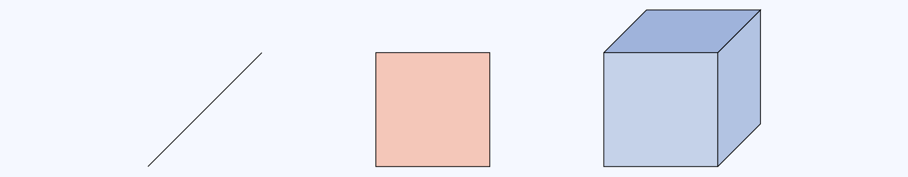{fig.alt="Three shapes in a row - a black line, a red square, and a blue cube."}

They have finite length, finite area/perimeter, finite volume/surface area. The dimensions are whole numbers.

Shapes with a finite number of edges (lines, squares, cubes...) are quite boring. If you introduce infinity into the mix, you can get some incredibly strange results... The following shapes are all formed by writing down a ``base" mathematical equation and iterating infinitely - creating an area of mathematics known as **fractal geometry**.

You can think of what follows as the lobby artwork for Hilbert's Hotel!

### The Koch snowflakes

A shape with a finite area and an infinite perimeter could be the **Koch snowflake curve**:

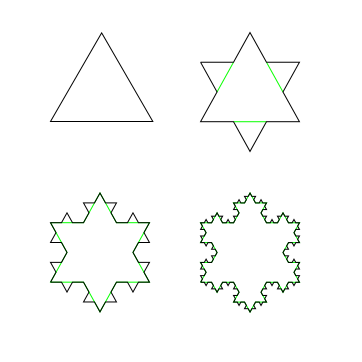{fig.alt="Four images in a square. Top left, an equilateral triangle. Top right: Equilateral triangle with three smaller equilateral triangles in the middle of the lines to create a six pointed star. Bottom left: Top right, but with even smaller equilateral triangles in the middle of each side. Bottom right: Bottom left, but with even even smaller equilateral triangles in the middle of each side."}

{fig.alt="One side of many iterations of the Koch snowflake, formed by attaching smaller and smaller equilaterial triangles to the middle of lines, and repeating this process infinitely."}

Iterated infinitely, this snowflake leads to a shape with finite area and **infinite** perimeter. The dimension of this curve is $\log_3{4} \approx 1.269$ - not a whole number!

You can move this to three(?) dimensions by looking at the Koch surface:

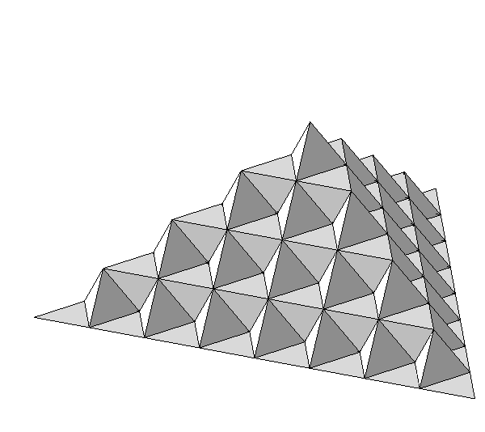{fig.alt="One side of many iterations of the Koch surface, formed by attaching smaller and smaller tetrahedrons to the middle of a triangular face, and repeating this process infinitely." width="50%"}

Iterated infinitely, this leads to a shape with finite volume and **infinite** surface area. The dimension of this surface is $1 + \log_2{3} \approx 2.5849$.

## Lines that make squares or cubes

Lines that wiggle enough fill a space - think of an airport queue, twisting and turning to fill all of the available space. These are **space filling curves**, and come in two varieties - the **Hilbert curve** and the **Peano curve**.

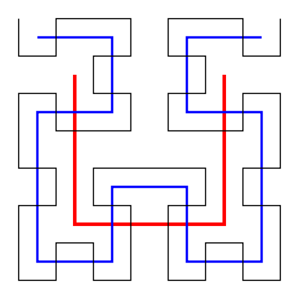{fig.alt="The first three iterations of the Hilbert curve overlaid on top of each other. A red U shape. A series of smaller U shapes joined together in blue. A series of even smaller U shapes joined together in black. They gradually fill the space." width="50%"}

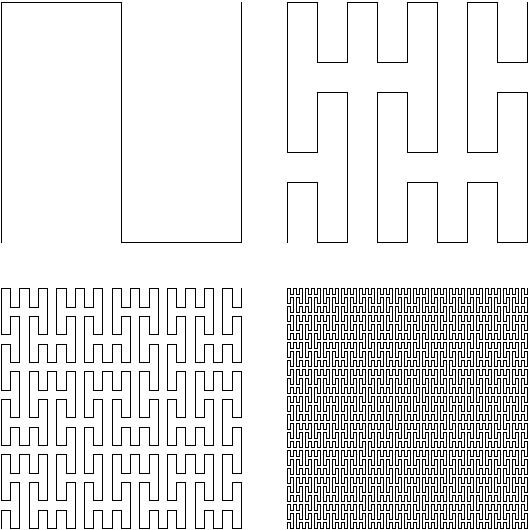{fig.alt="The first four iterations of the Peano curve arranged in a square. A rotated S shape in the top left. In the top right, a curve that starts in the bottom left and winds its way around the entire shape, ending in the top right. In the bottom left, a curve that is similar to the top right, but far more twisty and turny. Finally, in the bottom right, a curve that is so twisty and turny that it starts to look like a shaded square." width="75%"}

Iterated infinitely, these curves **completely fill** the space in which they are defined. So this line has dimension $2$!

## Taking infinitely many things away

The following three figures are obtained by successively removing middle thirds from a line, a square, and a cube. These are known as **Cantor sets**.

{fig.alt="A column of seven lines. The first is a solid line stretching across the page. Each subsequent row in the column is obtained by removing the middle third from any solid line present in the previous row. The last row is then a sparse collection of lines."}

Iterated infinitely, this collection of points has dimension $\log_3{2} \approx 0.6309$.

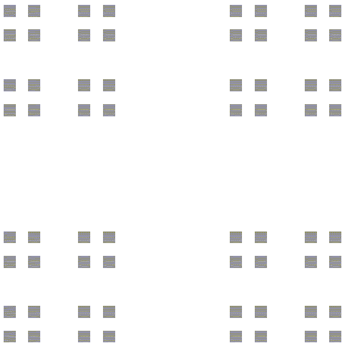{fig.alt="A figure obtained by repeatedly removing the middle third sections of a square. There are 4 areas of 16 squares; one in the top left, one in the top right, one in the bottom left, one in the bottom right." width="50%"}

Like the Cantor set, but on a square. This shape has dimension $\log_3{4}\approx 1.2619$.

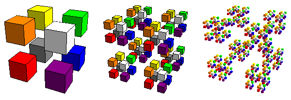{fig.alt="Three figures in a row. The first is a cube with the middle thirds in each dimension removed, leaving 8 cubes arranged as the corners of a bigger cube. The second and third figures are obtained successively by removing inner thirds of any remaining cubes."}

The next figure removes triangles from a larger triangle to create the famous **Sierpiński triangle**. This shape has dimension $\log_2{3} \approx 1.5849$.

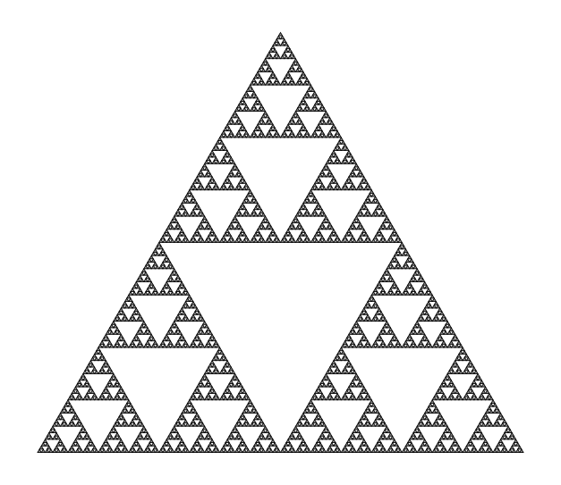{fig.alt="A triangle pointing upwards, with many other triangles pointing downwards inside. This is obtained by successively removing the middle downward pointing triangle from any remaining upward pointing triangles."}

As a fun aside, the Sierpiński triangle can be found in Pascal's triangle! Shade all of the odd binomial coefficients, and leave all the even ones. This gives the Sierpiński triangle!

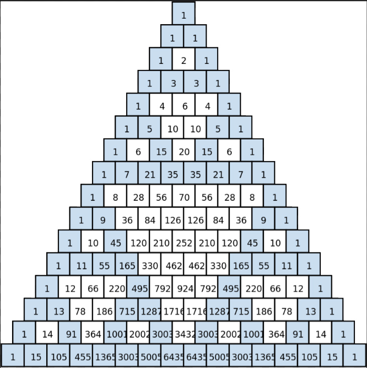{fig.alt="16 rows of Pascal's triangle with odd numbers shaded blue and even numbers left white. It is an approximation of the previous figure." width="50%"}

You can also apply a similar operation to a square to get a **Sierpiński carpet**... (with dimension $\log_3{8}\approx 1.8928$)

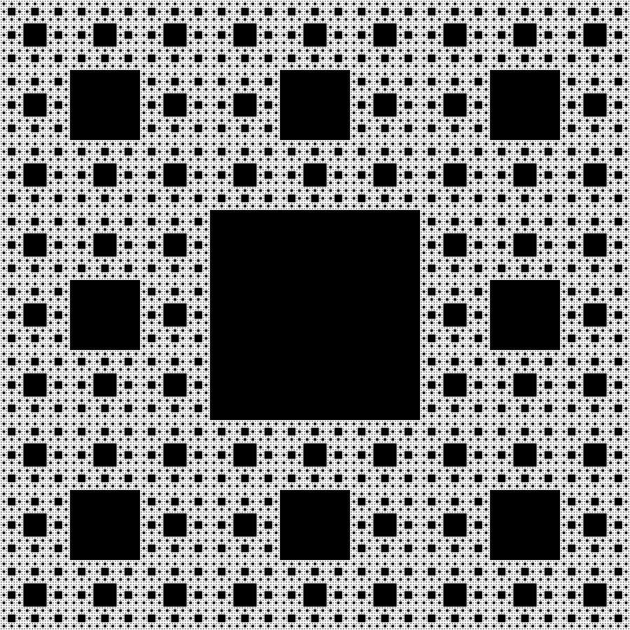{fig.alt="A shape obtained by successively removing the central square of any square. The result is one large black square in the middle, surrounded by nine smaller squares. Each of the smaller squares are surrounded by nine even smaller squares, and so on." width="50%"}

...a similar operation to a square-based pyramid to get a **fractal pyramid** (with dimension $\log_2{5} \approx 2.3219$)...

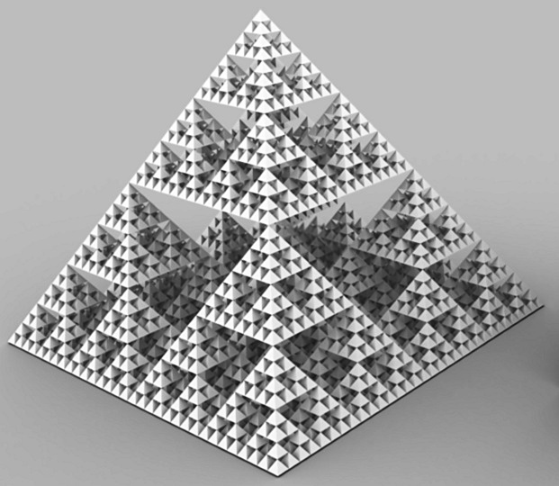{fig.alt="A pyramid pointing upwards, with many other smaller pyramids pointing downwards inside removed. This is obtained by successively removing the middle downward pointing pyramid from any remaining upward pointing pyramids." width="50%"}

...and a cube to get the **Menger sponge** (with dimension $\log_3{20} \approx 2.7268$).

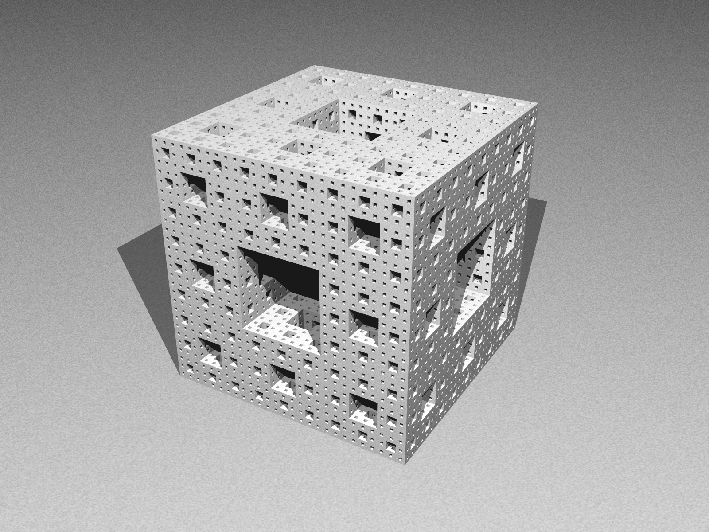{fig.alt="A shape obtained by successively removing the central cube of any cube. The result is a cube with many cube shaped holes in the middle, Each of the smaller squares are surrounded by nine even smaller squares, and so on."}

## The Mandelbrot set

Finally, here's one of the most famous fractals ever, the famous **Mandelbrot set**, defined by repeatedly iterating the function $$P_c(z) = z^2 + c$$ (where $z$ is a complex number) to get the set $$M = \{ c\in\mathbb{C}\; : \; \forall n\in\mathbb{N},\; |P_c^n(0)|\leq 2\}.$$ It looks like this:

:::{.content-visible when-format="html"}



:::

:::{.content-hidden when-format="html"}

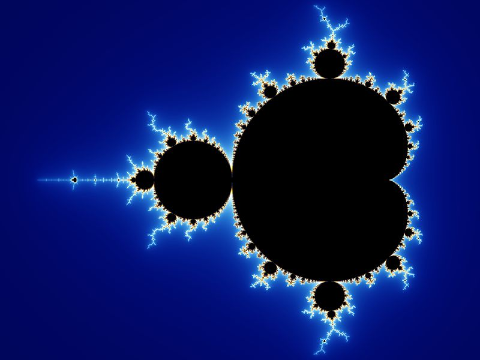

:::

# Version history {.unnumbered}

v1.0: initial version created 07/26 by tdhc, originally for presentation 4 of 4 for Sutton Trust Summer School 2026.

[This work is licensed under CC BY-NC-SA 4.0.](https://creativecommons.org/licenses/by-nc-sa/4.0/?ref=chooser-v1)