# Latin Squares: what are they, and why do people care?

Latin squares have a rich history in mathematics. They are often related to the construction of magic squares, the earliest known being in medieval Islamic mathematics. The first published example of a Latin square was given by the Korean mathematician Choi Seok-jeong (1646–1715), and was a $9 \times 9$ example used to construct a magic square. They were introduced to Western mathematicians by Jacques Ozanam (1640–1718), where they were expressed in terms of a problem about playing cards. Later, the Swiss mathematician Leonhard Euler (1707–1783) considered the so-called "36 Officers' Problem" and began studying the general theory of Latin squares.

But what actually is a Latin square?

::: callout-note
## Definition of a Latin square

For a positive, whole number $n$, an order $n$ Latin square is an $n \times n$ grid filled with $n$ different symbols, where each symbol appears exactly once in each row and column.
:::

An example of a $3 \times 3$ Latin square is shown in @fig-1.

::: {.content-visible when-format="html"}
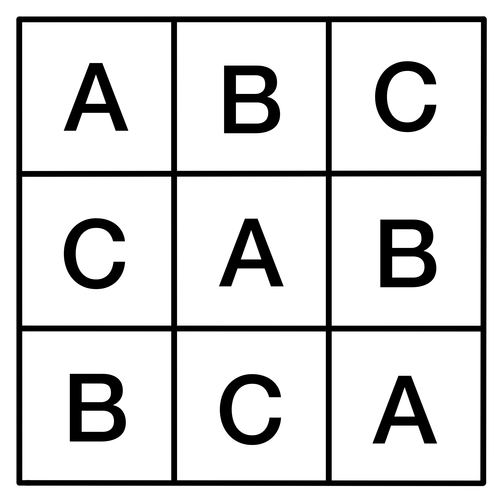{#fig-1 width="55%" fig-alt="A grid made up of 9 individual cells arranged in a 3 by 3 layout. Reading row-wise, the cell entries are A, B C, then C, A, B, then B, C, A."}
:::

::: {.content-hidden when-format="html"}
{width="55%" fig-alt="A grid made up of 9 individual cells arranged in a 3 by 3 layout. Reading row-wise, the cell entries are A, B C, then C, A, B, then B, C, A."}
:::

::: callout-tip
While the symbols present in a Latin square can be anything, this article will mostly stick to a set of numbers $\{1,\dots, n\}$ from here on out. (This will make it easier when considering Sudoku puzzles further down the line!).
:::

Latin squares see a lot of use in the realm of organization—specifically, when a person is trying to organize something **fairly**. The positions of symbols that they enforce make perfect templates for creating schedules and match-ups that take every scenario into account while avoiding any duplicates!

::: callout-note
## Example 1

Suppose that a workplace has three employees that need to rotate through three tasks over the course of three days. Each employee needs to do every task once, and each day's assignments need to be balanced.

If you assign each row of a $3 \times 3$ Latin square to be a day and each column of the Latin square to be the rota of an employee, then each task can be one of the three symbols, and the Latin square ensures that each task is seen exactly once by each employee, and each employee sees a different task each day.

One example of how a Latin square could organize this is shown in @fig-2.
:::

::: {.content-visible when-format="html"}
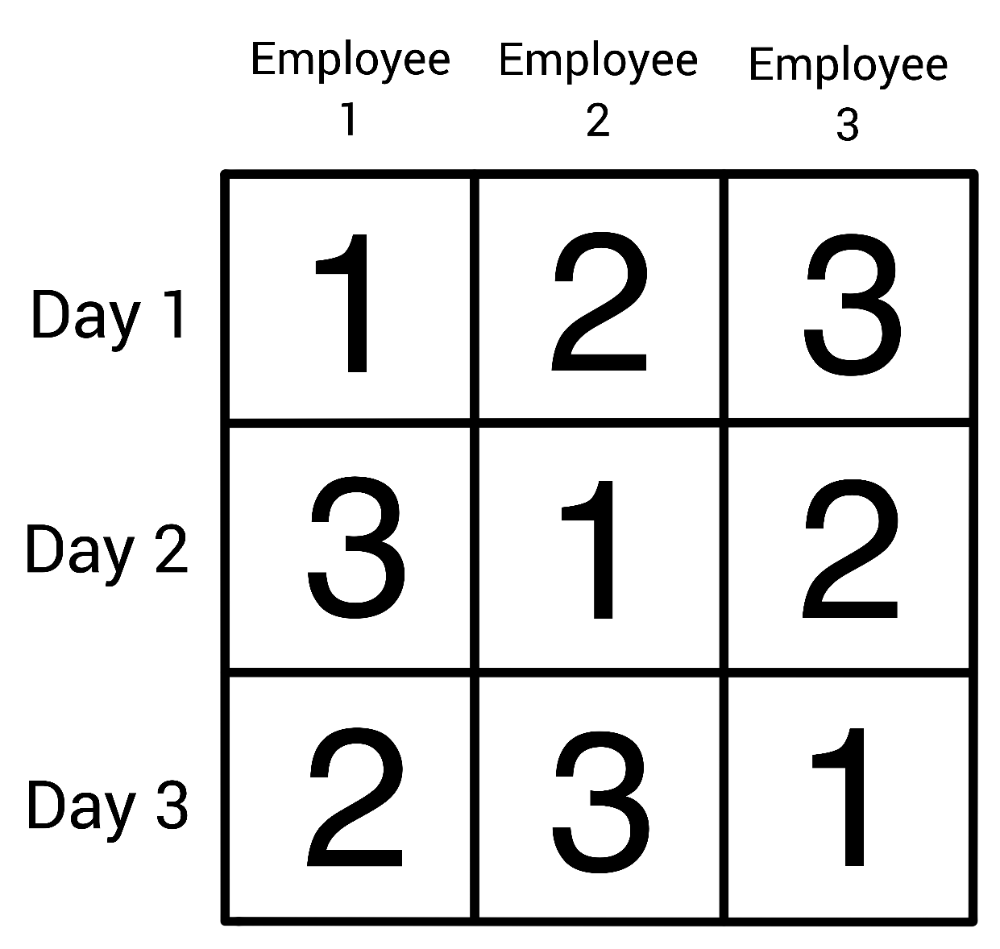{#fig-2 width="70%" fig-alt="An order 3 Latin square with symbols 1, 2 and 3. To the left of each row, in descending order, there are labels reading Day 1, Day 2 and Day 3. Above each column, reading left to right, there are labels reading Employee 1, Employee 2 and Employee 3. The Latin Square is organized so that each row and each column contains the symbols 1, 2 and 3 exactly once."}
:::

::: {.content-hidden when-format="html"}
{width="70%" fig-alt="An order 3 Latin square with symbols 1, 2 and 3. To the left of each row, in descending order, there are labels reading Day 1, Day 2 and Day 3. Above each column, reading left to right, there are labels reading Employee 1, Employee 2 and Employee 3. The Latin Square is organized so that each row and each column contains the symbols 1, 2 and 3 exactly once."}
:::

::: callout-note
## Example 2

Imagine you are running a small experiment testing different teaching styles and their effectiveness. You have three methods and three groups of students. You want to avoid any groups getting the same method twice, and you don't want any method to be over-represented in a specific time slot.

In this scenario, a $3 \times 3$ Latin square gives you a neat schedule to apply, where each method appears exactly once in each row, which represents the time slot, and column, which represents the group.

One example of how a Latin square could organize this is shown in @fig-3.
:::

::: {.content-visible when-format="html"}
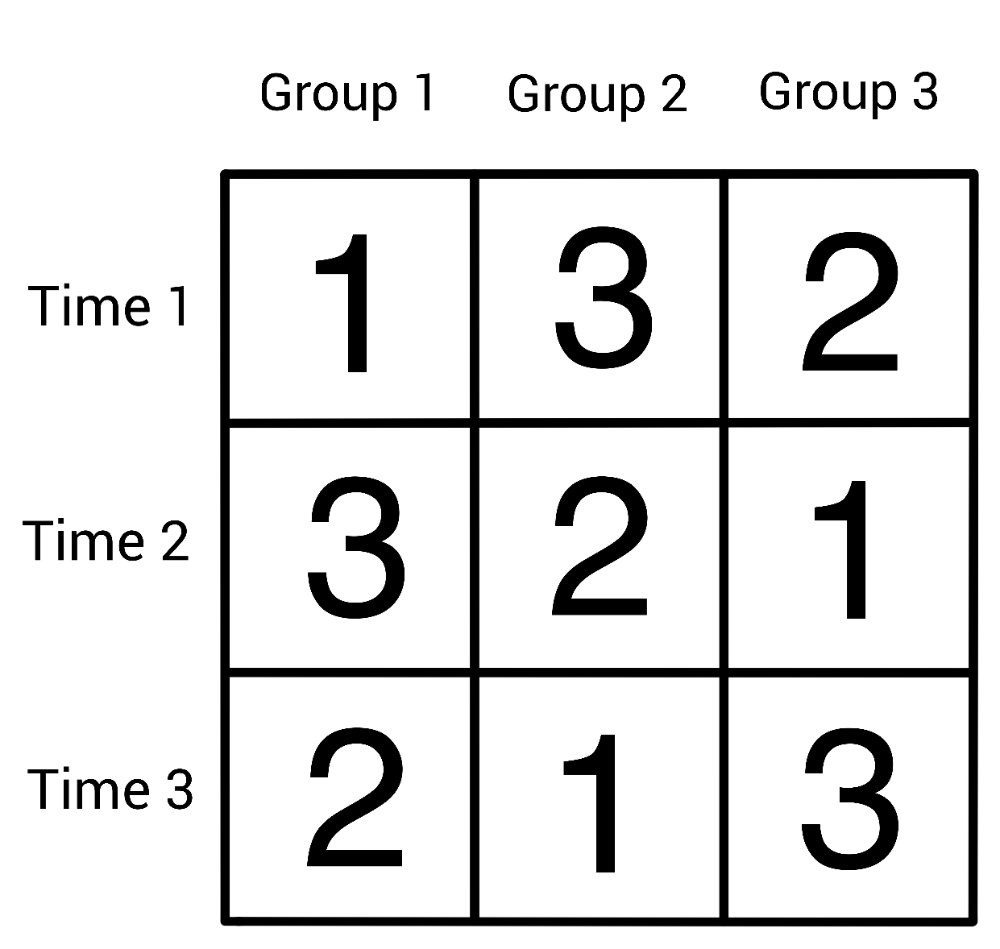{#fig-3 width="70%" fig-alt="An order 3 Latin square with symbols 1, 2 and 3. To the left of each row, in descending order, there are labels reading Time 1, Time 2 and Time 3. Above each column, reading left to right, there are labels reading Group 1, Group 2 and Group 3. The Latin Square is organized so that each row and each column contains the symbols 1, 2 and 3 exactly once."}
:::

::: {.content-hidden when-format="html"}
{width="70%" fig-alt="An order 3 Latin square with symbols 1, 2 and 3. To the left of each row, in descending order, there are labels reading Time 1, Time 2 and Time 3. Above each column, reading left to right, there are labels reading Group 1, Group 2 and Group 3. The Latin Square is organized so that each row and each column contains the symbols 1, 2 and 3 exactly once."}
:::

In this sense, Latin squares are the backbone behind many everyday organizational problems. They make sure that there is no skew in data for statisticians, and ensure that there is no wasted resources in potential experiments or projects.

Both of the examples you've seen so far use a single Latin square to organize a single variable, be it employees or classes of children. Latin squares are capable of far more than single-variable organization, but to see this, you first need to take a quick detour into the concept of **orthogonality**.

## Orthogonality and Latin Squares

Orthogonality is, in a sense, the concept of things being as different from each other as they possibly can be. When it comes to Latin squares, this is best defined by use of an example.

Let's take a look at the first recorded problem motivating the definition of orthogonality, presented in the 1700s by French mathematician Jacques Ozanam.

::: callout-note
## Problem: Suits and Faces

Arrange the 16 face cards of an ordinary pack of playing cards into a $4 \times 4$ square, in such a way that no row or column contains more than one card of each suit (Clubs ♣, Diamonds ♢, Hearts ♡, Spades ♠), and more than one card of each rank (Jack, Queen, King, Ace).
:::

If you separate out the suits and ranks, the question asks for two order 4 Latin squares, such that when they are superimposed (stacked on top of each other) each (suit, rank) pair occurs exactly once.

@fig-4 shows one possible solution to this problem:

::: {.content-visible when-format="html"}
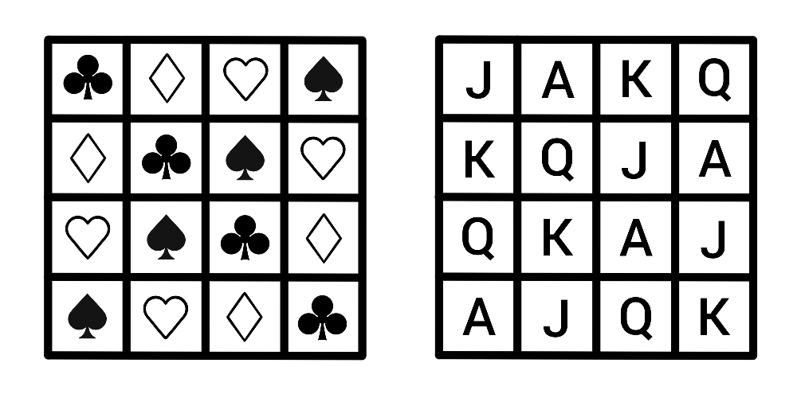{#fig-4 width="125%" fig-alt="Two order 4 Latin squares positioned side by side. The left square has symbols Clubs, Diamonds, Hearts and Spades and corresponds to the suits of the face cards. The right square has symbols J, Q, K, A, and corresponds to the ranks of the face cards. Reading left to right across rows, the left square has symbols Clubs, Diamonds, Hearts, Spades in the top row, then Diamonds, Clubs, Spades, Hearts in the second row, Hearts, Spades, Clubs, Diamonds in the third row and Spades, Hearts, Diamonds, Clubs in the fourth row. Reading in the same manner, the right square has symbols J, A, K, Q in the top row, then K, Q, J, A in the second row, Q, K, A, J in the third row and A, J, Q, K in thw fourth row."}
:::

::: {.content-hidden when-format="html"}
{width="125%" fig-alt="Two order 4 Latin squares positioned side by side. The left square has symbols Clubs, Diamonds, Hearts and Spades and corresponds to the suits of the face cards. The right square has symbols J, Q, K, A, and corresponds to the ranks of the face cards. Reading left to right across rows, the left square has symbols Clubs, Diamonds, Hearts, Spades in the top row, then Diamonds, Clubs, Spades, Hearts in the second row, Hearts, Spades, Clubs, Diamonds in the third row and Spades, Hearts, Diamonds, Clubs in the fourth row. Reading in the same manner, the right square has symbols J, A, K, Q in the top row, then K, Q, J, A in the second row, Q, K, A, J in the third row and A, J, Q, K in thw fourth row."}
:::

For example, the four pairs with ♣ in the first position occur along the main diagonal.

::: callout-note
## Definition: Orthogonality

Two Latin squares $A = (a_{ij})$ and $B = (b_{ij})$ of order $n$ are **orthogonal** if the set

$$
\{(a_{ij}, b_{ij}): 1 \leq i, j \leq n \}
$$ 
contains all possible pairs, where $a_{ij}$ represents the symbol in row $i$ and column $j$ in the Latin square $A$.
:::

When looking through an experimental lens, two orthogonal Latin squares would allow a person to combine two variables with no repeats, and nothing missed!

::: callout-note
## Example 3

Cantor's Confectionery is looking to experiment with ice-cream! It's recently brought in four flavours:

-   Vanilla
-   Chocolate
-   Strawberry
-   Mint choc-chip

and four toppings:

-   Sprinkles
-   Strawberry sauce
-   Chocolate flake
-   Mini sugar cubes

and it wants to figure out what combination of flavour and topping its customers like best. It needs to schedule some taste tests, so customers can rank the combinations, and it wants a fair representation, so they consider every option and they don't consider any option more than any other.

To do this, it can use a pair of order 4 orthogonal Latin squares; when they're superimposed, every possible pair is included in exactly one slot, so this provides a template to combine the toppings and flavours with maximum efficiency! Since there's no repeats, no combination would be over-represented, and every possible combination is included.

One possible way to do this is show in @fig-5.
:::

::: {.content-visible when-format="html"}
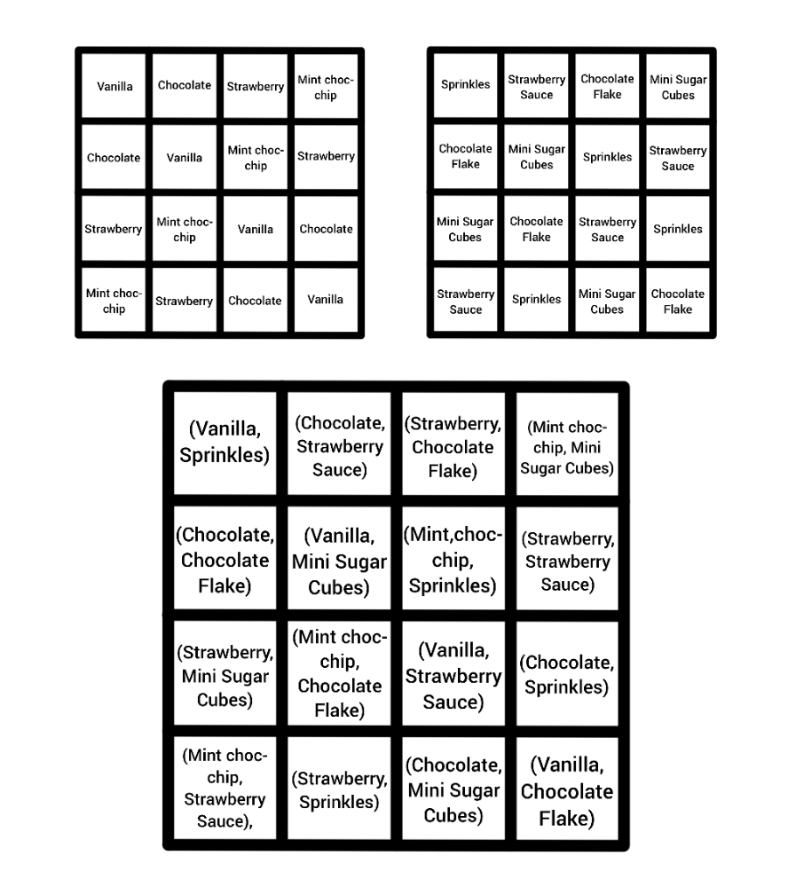{#fig-5 width="80%" fig-alt="Two order 4 Latin squares displayed side by side, and their superposition below them. The symbols for the Latin squares are the words Vanilla, Chocolate, Strawberry and Mint choc-chip for the left square, and Sprinkles, Strawberry Sauce, Chocolate Flake and Mini Sugar Cubes for the right square. Their superposition displays every possible pair of symbols in exactly one cell."}
:::

::: {.content-hidden when-format="html"}
{width="80%" fig-alt="Two order 4 Latin squares displayed side by side, and their superposition below them. The symbols for the Latin squares are the words Vanilla, Chocolate, Strawberry and Mint choc-chip for the left square, and Sprinkles, Strawberry Sauce, Chocolate Flake and Mini Sugar Cubes for the right square. Their superposition displays every possible pair of symbols in exactly one cell."}
:::

You can extend this idea to more than two variables—though there isn't an answer available for every size of Latin square, mathematicians have proved that if you have $m$ **mutually orthogonal** Latin squares of order $n$, then $m \leq n - 1$, and $m = n - 1$ if $n$ is a **prime power**.

::: callout-note
## Mutual Orthogonality

A group of Latin squares $A_1, \dots, A_k$ are mutually orthogonal if every $(A_i, A_j)$ pair are orthogonal.
:::

::: callout-note
## Prime Power

A prime power is a number $n = p^t$, where $p$ is a prime number and $t$ is a positive whole number.
:::

By now, you've seen how Latin squares organize symbols across a grid, and how orthogonality lets two such arrangements coexist neatly. Those ideas set the stage for a puzzle many people know very well. While it doesn't use orthogonality, it builds on the same instinct—keep the grid tidy and let structure guide the eye of the solver.

Said puzzle is called **Sudoku**.

# Sudoku and Latin Squares

## The Rules

The goal of Sudoku is to fill in a partially complete Latin square with symbols $1, \cdots, 9$. While already a difficult feat when considering order nine Latin squares, this endeavor is made more challenging by the inclusion of an additional constraint on the positioning of the symbols.

::: callout-note
## Sudoku Boards and Puzzles
A Sudoku board is an order 9 Latin square with one additional property—the square is split into nine $3 \times 3$ 'blocks', and each block must behave in the same way as the rows and columns. That is, each block must contain the numbers 1 to 9 exactly once.

A Sudoku puzzle, then, is a partially-filled in Sudoku board, that is filled in such a way that there is a **unique** solution—a person can only fill the puzzle in a single way to get the full board.

An example of a Sudoku board and one of its corresponding puzzles is seen in @fig-6.
:::

::: {.content-visible when-format="html"}
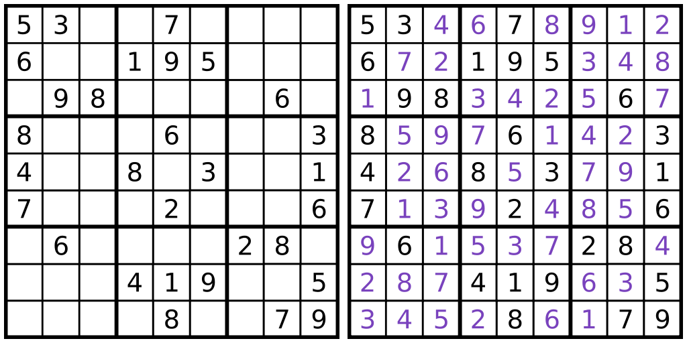{#fig-6 width="150%" fig-alt="A Sudoku puzzle and its corresponding filled board, displayed side by side. The puzzle has numbers missing from certain cells, and the board displays the missing numbers in purple."}
:::

::: {.content-hidden when-format="html"}
{width="150%" fig-alt="A Sudoku puzzle and its corresponding filled board, displayed side by side. The puzzle has numbers missing from certain cells, and the board displays the missing numbers in purple."}
:::

A Sudoku board is a specific type of Latin square is called a **Gerechte design**.

::: callout-note
## Gerechte Designs

A Gerechte design of order $n$ is a Latin square of order $n$ that is further divided into $n$ distinct sections of size $n$. Each of these sections must also contain all of the $n$ symbols in the Latin square exactly once.

While a Sudoku board is one type of order 9 Gerechte design, the regions of an order 9 Gerechte design can be any shape, and not all order 9 Gerechte designs are Sudoku boards.
:::

::: callout-tip
All well-made Sudoku puzzles have a unique solution, but this doesn't mean that each board only has one puzzle—in fact, a single Sudoku board can have many possible puzzles, and multiple puzzles can solve to the same board.
:::

## The Mathematics of Sudoku

There are a lot of questions that mathematicians can, and have, asked about Sudoku. Many of these questions are very complex, require brute-force computational methods to answer, or have no answer at all (yet)! You can, however, gain an intuition for how some of these questions are answered using a smaller type of puzzle called Shidoku.

::: callout-note
## Shidoku Boards and Puzzles

A Shidoku board is a $4 \times 4$ Latin square that is further divided into four $2 \times 2$ blocks, where each block must contain the numbers 1 to 4 exactly once. You can think of it as a scaled-down Sudoku board, that only uses the numbers 1 to 4, instead of 1 to 9.

Much like a Sudoku puzzle, a Shidoku puzzle is a partially filled-in Shidoku board, that is filled in such a way that there is a unique solution to the problem.

An example of a Shidoku puzzle with its corresponding board is seen in @fig-7. [@LauraT]
:::

::: {.content-visible when-format="html"}
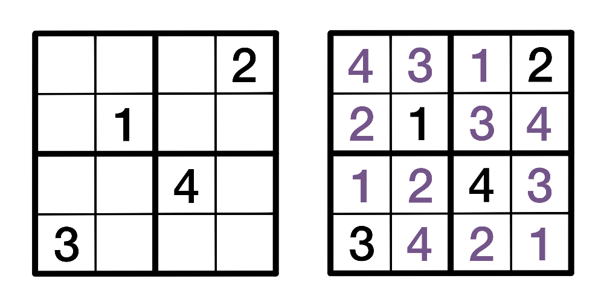{#fig-7 width="100%" fig-alt="A Shidoku puzzle and its corresponding filled board, displayed side by side. The puzzle has numbers missing from certain cells, and the board displays the missing numbers in purple."}
:::

::: {.content-hidden when-format="html"}
{width="100%" fig-alt="A Shidoku puzzle and its corresponding filled board, displayed side by side. The puzzle has numbers missing from certain cells, and the board displays the missing numbers in purple."}
:::

Some of the first questions asked about Sudoku are posed below. While you won't see any direct proofs of the answers here, you can take a look at how they are answered in the case of Shidoku, which should provide some insight into the larger case of Sudoku.

### Q1. How many Sudoku boards are there?

In 2005, computer scientist Bertram Felgenhauer and mathematician Frazer Jarvis used a computer algorithm to conclude that there are 6,670,903,752,021,072,936,960 valid Sudoku boards [@BFFJ]. That is about 6.67 **sextillion** boards, which is an absolutely enormous number—more than the number of milliseconds that have passed since the Big Bang!

Nobody has found a non-computational method to arrive at this number yet. In the case of Shidoku puzzles, however, it is possible to answer this question manually while using similar techniques to those used in the Sudoku case.

#### **Counting Shidoku Boards**

::: callout-important
## When accounting for all possible combinations, there are 288 Shidoku boards.
:::

While it is possible to list each Shidoku board individually, it is difficult to keep track of all boards that have already been listed, especially once you have made your way through a lot of them. A different way to approach this problem is by using something called **ordered boards**.

::: callout-note
## Ordered Shidoku Boards

An ordered Shidoku board is a Shidoku board whose first row and top-left block (reading row-wise) reads 1, 2, 3, 4 in order, and whose first column reads 1, 3, 2, 4 in order. This is demonstrated in @fig-8.
:::

::: {.content-visible when-format="html"}
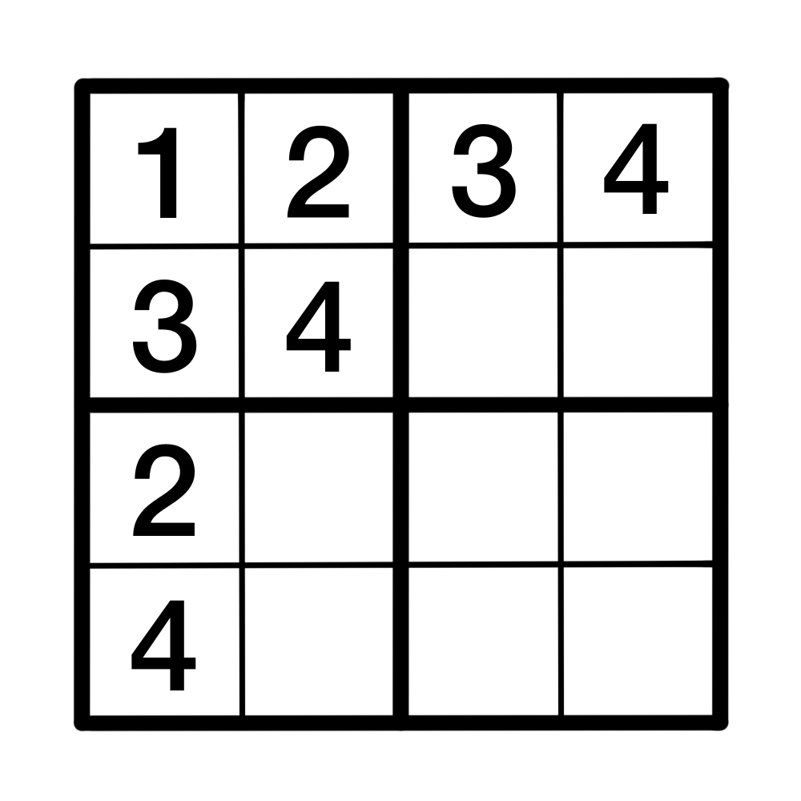{#fig-8 width="55%" fig-alt="A partially filled in Shidoku board. Reading row-wise, the cells of the top-left block read 1, 2, 3, 4. The top row also reads 1, 2, 3, 4 from left to right, and the leftmost column reads 1, 3, 2, 4 from top to bottom."}
:::

::: {.content-hidden when-format="html"}
{width="55%" fig-alt="A partially filled in Shidoku board. Reading row-wise, the cells of the top-left block read 1, 2, 3, 4. The top row also reads 1, 2, 3, 4 from left to right, and the leftmost column reads 1, 3, 2, 4 from top to bottom."}
:::

There are very few ordered Shidoku boards in existence. However, each ordered Shidoku board can represent a large number of unordered Shidoku boards, and if you can find this number, then you can figure out how many Shidoku boards exist in total.

::: callout-note
## Claim: Each ordered Shidoku board represents 96 different Shidoku boards.

To demonstrate this, you can take a look at the ordered Shidoku board setup seen in @fig-8.

Start with the top-left block. You can relabel the numbers in any Shidoku board to match the top-left block, and as long as you relabel the numbers in the rest of the board the same way, the Shidoku board will remain valid.

There are $4! = 4 \cdot 3 \cdot 2 \cdot 1 = 24$ different ways that this could possibly occur—if you consider the corner cell, before relabeling it to 1, it could have been either 1, 2, 3 or 4. That's four different choices. Moving onto the second cell in the block, before relabeling it into becoming 2, it could have been three different numbers, since it can't have been the same number as the first square was. Likewise, the remaining two squares in the block would have two and one choice(s) for their numbers respectively, before they were relabeled to 3 and 4.

This means that the first block from an ordered Shidoku board could have come from one of 24 different Shidoku blocks!

Then, you can consider the first row and column. Once the first block has been properly labelled like above, there are two possible scenarios for the top row: it either reads 1, 2, 3, 4 or 1, 2, 4, 3. Then there are two possible cases; either you need to swap the last two columns to get the board into an ordered format, or the board is already 'correct', and you can leave it as it is.

The scenario is identical for the first column; once the first block has been ordered, the column will either read 1, 3, 2, 4 or 1, 3, 4, 2. So you either need to swap the bottom two rows to order the board, or they are already in the 'correct' position and you can leave them alone.

These shufflings account for a further $2 \cdot 2 = 4$ different scenarios. Bear in mind that these swaps are only done after the board has been relabeled so the first block is ordered. This means that, for each of the 24 scenarios that could have led to the first ordered Shidoku block, there are four possible boards that could occur.

As such, each ordered Shidoku board represents a total of $4! \cdot 2 \cdot 2 = 96$ Shidoku boards in total.
:::

This is fantastic news, because it means that to count the total number of Shidoku boards, you only need to count the number of ordered Shidoku boards, and there are far less of them.

To find an ordered Shidoku board, you can begin with the partial board shown in @fig-8, and "play" Shidoku by filling in the rest of the board and keeping track of the choices you make along the way. Doing this, you can find that there are only 3 ordered Shidoku boards in existence! These Shidoku boards are displayed in @fig-9.

::: {.content-visible when-format="html"}
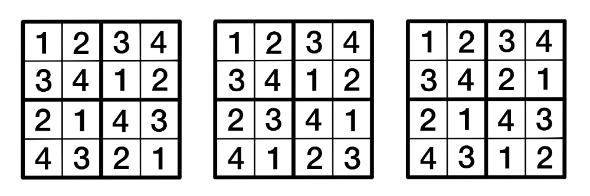{#fig-9 width="150%" fig-alt="Three different Shidoku boards displayed side by side. Each Shidoku board has the cells of its top-left block, top row and leftmost column filled in such a manner that the board is considered ordered. Reading row-wise, the entries to the boards are as follows. Board one: 1, 2, 3, 4, then 3, 4, 1, 2, then 2, 1, 4, 3, then 4, 3, 2, 1. Board two: 1, 2, 3, 4, then 3, 4, 1, 2, then 2, 3, 4, 1, then 4, 1, 2, 3. Board 3: 1, 2, 3, 4, then 3, 4, 2, 1, then 2, 1, 4, 3, then 4, 3, 1, 2."}
:::

::: {.content-hidden when-format="html"}
{width="150%" fig-alt="Three different Shidoku boards displayed side by side. Each Shidoku board has the cells of its top-left block, top row and leftmost column filled in such a manner that the board is considered ordered. Reading row-wise, the entries to the boards are as follows. Board one: 1, 2, 3, 4, then 3, 4, 1, 2, then 2, 1, 4, 3, then 4, 3, 2, 1. Board two: 1, 2, 3, 4, then 3, 4, 1, 2, then 2, 3, 4, 1, then 4, 1, 2, 3. Board 3: 1, 2, 3, 4, then 3, 4, 2, 1, then 2, 1, 4, 3, then 4, 3, 1, 2."}
:::

Since every ordered Shidoku board represents 96 different Shidoku boards in general, there are a total of $3 \cdot 96 = 288$ Shidoku boards in existence.

#### **Extending to Sudoku Boards**

Felgenhauer and Jarvis used a similar strategy to the one demonstrated above—they used the concept of ordered boards to "fix" a section of the Sudoku board and greatly reduce the amount of calculations they would have to do. This method is significantly more complicated in the $9 \times 9$ case of a Sudoku board for a couple of reasons, the most prominent of which is the idea of an "ordered" Sudoku board.

Let's revisit the ordered Shidoku board. Instead of thinking of the top row as reading 1, 2, 3, 4, instead imagine that you fixed the top-left block and you wanted the top row arranged so that it ends in one 2-digit increasing sequence of numbers—that is, the two numbers in the final block that contributes to the row must be ordered so that the second number is bigger than the first. In the case of a Shidoku board, there is only one way to do this: 3, 4. This means that you only need to consider this scenario when counting Shidoku boards. Likewise, there is only one possible way the first column can be ordered to fulfil this condition: 1, 3, 2, 4.

An ordered Sudoku board is more complicated. Say you fix the top-left block of a Sudoku board so that it reads 1, 2, 3, 4, 5, 6, 7, 8, 9 row-wise, like the Shidoku board example. An ordered Sudoku board, then, has its first row and column ending in two 3-digit increasing sequences. For each of the two blocks that contribute to the top row, the three numbers in the top row must be arranged so that each number is bigger than the last. The first column of an ordered Sudoku board is ordered in the same way, only going down instead of across.

::: callout-note
## Ordered Sudoku Boards

An ordered Sudoku board is a Sudoku board whose top-left block reads 1, 2, 3, 4, 5, 6, 7, 8, 9 row-wise, and whose first row and column end in two 3-digit increasing sequences of numbers.
:::

@fig-10 shows one potential ordering of a Sudoku board.

::: {.content-visible when-format="html"}
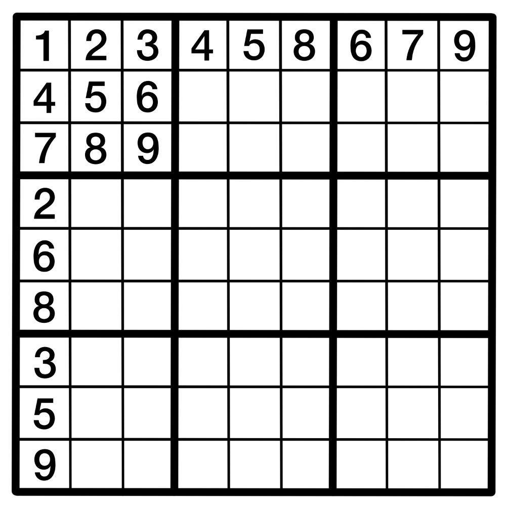{#fig-10 width="55%" fig-alt="A partially filled in Sudoku board. Reading row-wise, the cells of the top-left block have entries 1, 2, 3, then 4, 5, 6, then 7, 8, 9. Reading left to right, the top row reads 1, 2, 3, then 4, 5, 8, then 6, 7, 9. Reading top to bottom, the leftmost column reads, 1, 4, 7, then 2, 6, 8, then 3, 5, 9."}
:::

::: {.content-hidden when-format="html"}
{width="55%" fig-alt="A partially filled in Sudoku board. Reading row-wise, the cells of the top-left block have entries 1, 2, 3, then 4, 5, 6, then 7, 8, 9. Reading left to right, the top row reads 1, 2, 3, then 4, 5, 8, then 6, 7, 9. Reading top to bottom, the leftmost column reads, 1, 4, 7, then 2, 6, 8, then 3, 5, 9."}
:::

As such, there are many different ways to order a Sudoku board. To count the total number of Sudoku boards out there using this method, you would need to count the total number of orderings a Sudoku board could have, and then count how many Sudoku boards could complete each of those orderings—this is the sort of thing that Felgenhauer and Jarvis did to "free up space" for their calculations, although they also used other methods to reduce the amount of counting they would need to do.

### Q2. How many "essentially different" Sudoku boards are there?

6.67 sextillion is an absolutely ludicrous number of boards, but most of those boards can be considered, in a sense, different versions of the same board. This is because Sudoku boards are full of **symmetry** and **structure**.

You can relabel the numbers in a Sudoku board, and the resulting board will be technically different, but the underlying structure of the board will remain the same. Similarly, you could rotate a board, or reflect it, but this won't change the pattern that the board follows, just its orientation. This is the same idea behind the ordered Shidoku boards acting as representatives of other boards, but scaled up!

The next question, then, is how many different Sudoku boards are there, once you take these board transformations into account? Before you answer this question, you need to decide what operations can be applied to a board to keep it essentially similar to a different board. That is, what can you do to a board while keeping it essentially the same?

In 2006, mathematicians Ed Russel and Fraser Jarvis defined a set of these operations:

-   Relabel the numbers in the board
-   Shuffle the three stacks in the board
-   Shuffle the three bands in the board
-   Shuffle the three rows within a band
-   Shuffle the three columns within a stack
-   Any rotation or reflection of the board

Where a **stack** is three of the blocks in a vertical line (stacked on top of each other) and a **band** is three of the blocks in a horizontal line (next to each other).

When considering all of these operations, they found that there are 5,472,730,538 [@ERFJ] or about 5.5 billion essentially different Sudoku boards which, while still huge, is a much more manageable number. They arrived at this number by considering symmetries is a type of mathematical object called a **group**, which won't be expanded on here. If you're interested in groups, check out [Guide: Introduction to Groups](../studyguides/introtogroups.qmd) to learn more!

### Q3. What is the minimum number of clues a Sudoku puzzle can have?

This is a deceptively complicated question, owing to how a puzzle is defined—something is only considered a puzzle if it has a unique solution. A better way to phrase this question, then, is this: how few initial clues do you need to make sure the solution board is unique?

In 2012 Gary McGuire, Bastian Tugemann and Gilles Civario proved that the answer to this question is **17**, through an exhaustive computer search based on a computational method called hit set enumeration [@McGBTGC]. This number is not the case for all Sudoku boards, and the majority of boards will need more than 17 initial clues to make sure it is the unique solution to the puzzle, but there is no unique solution to any Sudoku board which is provided with 16 or fewer clues.

This question, much like the first, is far more doable in the $4 \times 4$ case. Let's return to the realm of Shidoku boards to have a look at the solution in a bit more detail.

#### **Minimum-Clue Shidoku Puzzles**

Before you investigate this problem in the context of Shidoku boards, it will be helpful to return to the concept of essentially different boards.

In @fig-9, you can apply a series of transformations to the third board to turn it into the second. If you:

-   transpose the third board. This is an operation that flips the board across its main diagonal (top-left to bottom-right), so its top row becomes its leftmost column, its second row becomes its second column, and so on and so forth. Then,
-   relabel the numbers so the board is ordered,

you get the second board! This means that, while there are three ordered Shidoku boards in existence, only two of them are essentially different. This will help your search for the minimum number of clues, since you only need to consider two boards instead of three. Let's call these type-1 and type-2 boards respectively, after the first and second boards in @fig-9.

::: callout-important
## The minimum number of clues that a Shidoku puzzle can have is 4.
:::

To prove this, you can first start with an example of a four-clue Shidoku puzzle. One of these, along with its unique board, was shown earlier in @fig-7.

Since that puzzle exists, the only thing you need to do is show that Shidoku puzzles with less than four clues do **not** exist. You will do this for the type-1 case. The argument for the type-2 case is very similar—you can try it yourself as an exercise, if you want to!

Take a look at the type-1 Shidoku board in @fig-11. [@LauraT]

::: {.content-visible when-format="html"}
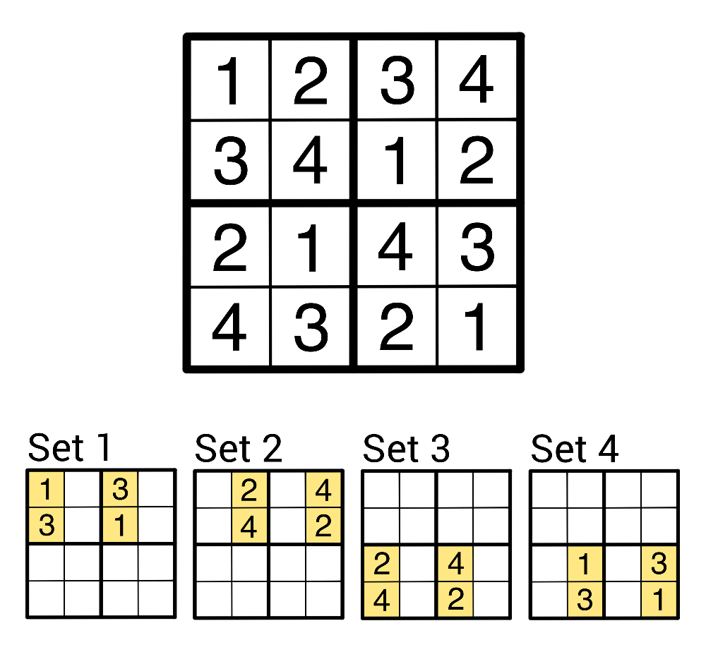{#fig-11 width="70%" fig-alt="An ordered Shidoku board, with four partially filled in Shidoku boards below labelled Set 1, Set 2, Set 3 and Set 4 respectively. The entries of the full board are the same as the entries of the first board in Figure 9. Each of the four partially filled in boards below the full board have four filled in cells, split into two vertically stacked pairs, in two of the four blocks total. Labelling the blocks of the boards row-wise as block 1, 2, 3, 4 respectively, Set 1 and 2 have stacks in the blocks 1 and 2, in the left and right sections of the blcoks respectively, and Set 3 and 4 have stacks in blocks 3 and 4, again in the left and right sections respectively. Together, the four sets combine to form the full board displayed at the top of the image. The cells in Sets 1 and 4 contains only entries of 1 and 3, and the cells in Sets 2 and 3 contain only entries of 2 and 4."}
:::

::: {.content-hidden when-format="html"}
{width="70%" fig-alt="An ordered Shidoku board, with four partially filled in Shidoku boards below labelled Set 1, Set 2, Set 3 and Set 4 respectively. The entries of the full board are the same as the entries of the first board in Figure 9. Each of the four partially filled in boards below the full board have four filled in cells, split into two vertically stacked pairs, in two of the four blocks total. Labelling the blocks of the boards row-wise as block 1, 2, 3, 4 respectively, Set 1 and 2 have stacks in the blocks 1 and 2, in the left and right sections of the blcoks respectively, and Set 3 and 4 have stacks in blocks 3 and 4, again in the left and right sections respectively. Together, the four sets combine to form the full board displayed at the top of the image. The cells in Sets 1 and 4 contains only entries of 1 and 3, and the cells in Sets 2 and 3 contain only entries of 2 and 4."}
:::

Notice how the board has been divided into 4 different sections, each containing 4 cells. The cells in each of the 4 sections make up something you can call an **unavoidable set**.

::: callout-note
## Unavoidable sets

An unavoidable set is a collection of cells on a Shidoku board where **every** puzzle for that board needs at least one clue inside the set.
:::

Consider Set 1, as an example. The cells in Set 1 make up an unavoidable set—you can fill in all 12 of the other cells on the board, but without a clue from the section making up Set 1 you could make 2 different valid Shidoku boards by filling in the blank spaces.

That means that every Shidoku puzzle whose solution is the type-1 Shidoku board must have a clue in Set 1.

In @fig-11, there are four different unavoidable sets, each displayed below the full board. These sets do not overlap on the full board, which means that any puzzle whose solution is the type-1 board, or one of the boards that the type-1 board represents, must have at least 4 clues.

If you make a similar argument for the type-2 board, you will see that the same is true in that case. As such, the minimum possible number of clues that a Shidoku puzzle can have is 4.

# In Conclusion

One part of what makes Sudoku so charming is its simplicity. A $9 \times 9$ grid, split into nine blocks, that you need to fill in a specific manner to get to the solution. But, as you've seen, there's a rich tapestry of complexity lurking underneath that premise, one which continues to entrance people to this day.

Whether your interest lies in untangling the questions behind the puzzles, or simply the puzzles themselves, there's a game for everyone in these neat little grids.


If all this talk of Sudoku puzzles has you wanting to try solving one yourself, feel free to try the one below!

```{shinylive-r}
#| standalone: true
#| viewerHeight: 580

library(shiny)

# --- Puzzle and solution ---
puzzle <- matrix(c(
  5,3,0, 0,7,0, 0,0,0,
  6,0,0, 1,9,5, 0,0,0,
  0,9,8, 0,0,0, 0,6,0,

  8,0,0, 0,6,0, 0,0,3,
  4,0,0, 8,0,3, 0,0,1,
  7,0,0, 0,2,0, 0,0,6,

  0,6,0, 0,0,0, 2,8,0,
  0,0,0, 4,1,9, 0,0,5,
  0,0,0, 0,8,0, 0,7,9
), 9, 9, byrow = TRUE)

solution <- matrix(c(
  5,3,4, 6,7,8, 9,1,2,
  6,7,2, 1,9,5, 3,4,8,
  1,9,8, 3,4,2, 5,6,7,

  8,5,9, 7,6,1, 4,2,3,
  4,2,6, 8,5,3, 7,9,1,
  7,1,3, 9,2,4, 8,5,6,

  9,6,1, 5,3,7, 2,8,4,
  2,8,7, 4,1,9, 6,3,5,
  3,4,5, 2,8,6, 1,7,9
), 9, 9, byrow = TRUE)

# --- UI ---
ui <- fluidPage(

  tags$h2("Try a Sudoku puzzle!"),
  tags$p("Fill the grid with the numbers 1–9. Incorrect entries will show a small ✕ when checked."),

  # --- CSS ---
  tags$style(HTML("
    /* Outer grid: 3×3 blocks */
    .sudoku-grid {
      display: grid;
      grid-template-columns: repeat(3, auto);
      grid-template-rows: repeat(3, auto);
      gap: 0;
      width: fit-content;

      /* Outer square as outline so it doesn't affect layout */
      border: none;
      outline: 3px solid black;
      outline-offset: -1px; /* tweak -1, 0, or -2 if needed */
    }

    /* Each 3×3 block */
    .block {
      display: grid;
      grid-template-columns: repeat(3, 40px);
      grid-template-rows: repeat(3, 40px);
      border: 3px solid black;
    }

    .cell-wrapper {
      position: relative;
      width: 40px;
      height: 40px;
    }

    .cell, .given {
      width: 38px;
      height: 38px;
      font-size: 20px;
      text-align: center;
      border: 1px solid #999;
      box-sizing: border-box;
      line-height: 38px;
      user-select: none;
    }

    .cell {
      background: white;
    }

    .cell[contenteditable=\"true\"] {
      cursor: text;
    }

    .given {
      background: #eee;
      font-weight: bold;
    }

    /* X overlay */
    .xmark {
      position: absolute;
      top: 0;
      left: 0;
      width: 38px;
      height: 38px;
      pointer-events: none;
      display: none;
    }

    .xmark.visible {
      display: block;
    }

    .xmark svg {
      width: 100%;
      height: 100%;
    }
  ")),

  # --- JS: capture edits + toggle overlays ---
  tags$script(HTML("
    document.addEventListener('input', function(e) {
      if (e.target.classList.contains('cell')) {

        // Send updated value to Shiny
        Shiny.setInputValue(e.target.id, e.target.innerText, {priority: 'event'});

        // Auto-remove X overlay when user edits the cell
        const xid = 'x_' + e.target.id;
        const xel = document.getElementById(xid);
        if (xel) xel.classList.remove('visible');
      }
    });

    Shiny.addCustomMessageHandler('showX', function(msg) {
      document.getElementById('x_' + msg.id).classList.add('visible');
    });

    Shiny.addCustomMessageHandler('hideX', function(msg) {
      document.getElementById('x_' + msg.id).classList.remove('visible');
    });
  ")),

  # --- FLEX WRAPPER FOR PERFECT CENTRING ---
  tags$div(
    style = "display:flex; justify-content:center; width:100%;",

    # --- Sudoku Grid (3×3 blocks) ---
    tags$div(
      class = "sudoku-grid",

      lapply(0:2, function(br) {
        lapply(0:2, function(bc) {

          tags$div(
            class = "block",

            lapply(1:3, function(r) {
              lapply(1:3, function(c) {

                gr <- br*3 + r
                gc <- bc*3 + c
                id <- paste0("cell_", gr, "_", gc)

                tags$div(
                  class = "cell-wrapper",

                  if (puzzle[gr, gc] != 0) {
                    tags$div(
                      id = id,
                      class = "given",
                      puzzle[gr, gc]
                    )
                  } else {
                    tags$div(
                      id = id,
                      class = "cell",
                      contenteditable = "true"
                    )
                  },

                  tags$div(
                    id = paste0("x_", id),
                    class = "xmark",
                    tags$svg(
                      xmlns = "http://www.w3.org/2000/svg",
                      tags$line(x1="5", y1="5", x2="33", y2="33", stroke="red", `stroke-width`="4"),
                      tags$line(x1="33", y1="5", x2="5", y2="33", stroke="red", `stroke-width`="4")
                    )
                  )
                )
              })
            })
          )
        })
      })
    )
  ),

  br(),
  actionButton("check", "Check My Board"),
  br(), br(),
  textOutput("status")
)

# --- Server ---
server <- function(input, output, session) {

  observeEvent(input$check, {

    incorrect_any <- FALSE
    empty_any <- FALSE

    # Clear old overlays
    for (r in 1:9) for (c in 1:9) {
      id <- paste0("cell_", r, "_", c)
      session$sendCustomMessage("hideX", list(id = id))
    }

    # Validate
    for (r in 1:9) for (c in 1:9) {

      if (puzzle[r, c] != 0) next

      id <- paste0("cell_", r, "_", c)
      val <- input[[id]]

      if (is.null(val) || val == "") {
        empty_any <- TRUE
        next
      }

      if (suppressWarnings(as.numeric(val)) != solution[r, c]) {
        incorrect_any <- TRUE
        session$sendCustomMessage("showX", list(id = id))
      }
    }

    output$status <- renderText({
      if (incorrect_any) {
        "There are incorrect cells."
      } else if (empty_any) {
        "So far so good!"
      } else {
        "Congratulations — you solved the puzzle!"
      }
    })
  })
}

shinyApp(ui, server)

```


# Version history {.unnumbered}

v1.0: initial version created 04/26 by Holly Goldsmith as part of a University of St Andrews VIP project.

[This work is licensed under CC BY-NC-SA 4.0.](https://creativecommons.org/licenses/by-nc-sa/4.0/?ref=chooser-v1)

#### References
:::{#refs}

:::