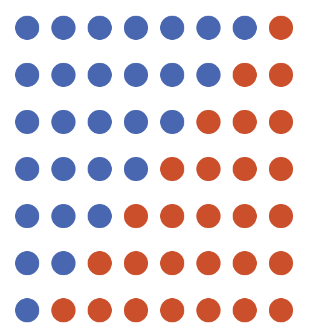
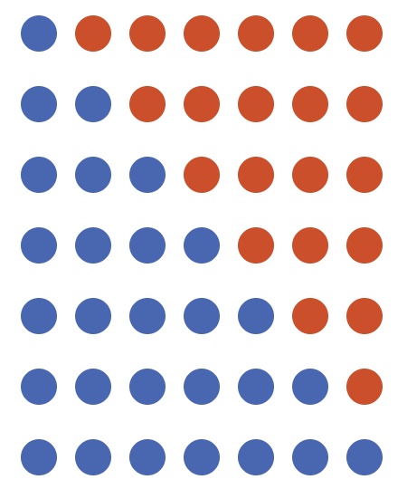
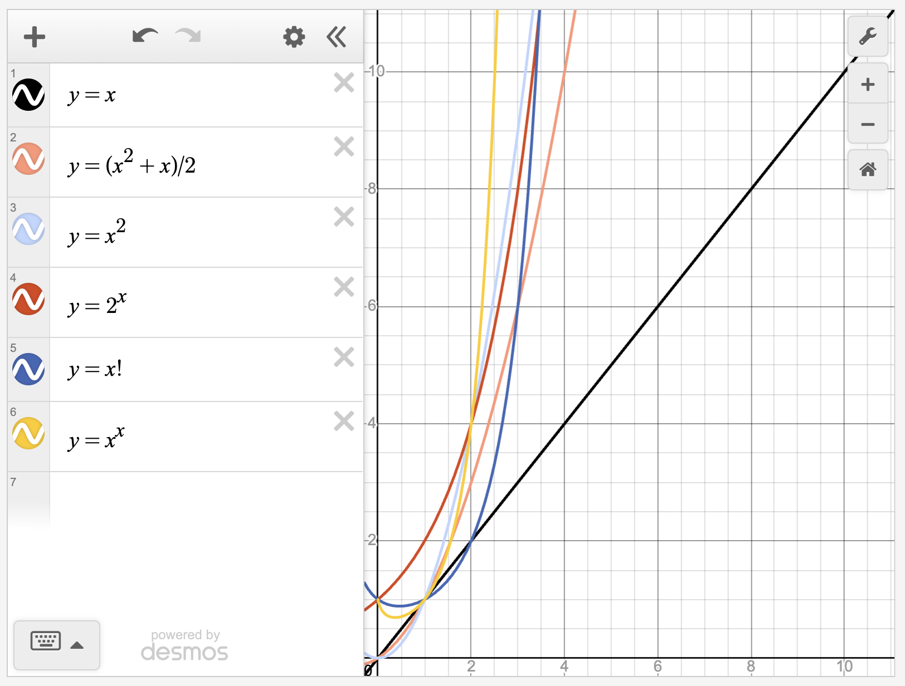

```{r, setup, include = FALSE}
library("webexercises")
# To allow injection of aria-labels
in_labelled_fitb <- function(answer, label_text, ...) {
  html <- webexercises::fitb(answer, ...)
  # Insert aria-label into the <input ...> tag
  html <- sub(
    "<input ",
    paste0("<input aria-label=\"", label_text, "\" "),
    html
  )
  html
}
```

# Pascal's triangle

Central to many different and disparate areas of mathematics, one of the most interesting objects in the subject is **Pascal's triangle**. 

:::{.callout-note}

## How to construct Pascal's triangle

Start with 1 at the top point of a triangle. 

Write 1's down the sides of the triangle.

To fill in the rest of the entries, add two numbers next to each other in a row, and write the answer below and between both of them.

:::

:::{.content-visible when-format="html"}

```{=html}
<script src="https://cdn.jsdelivr.net/npm/mathjs@latest/lib/browser/math.min.js"></script>
<style>
.calc-container{
  max-width:1200px;
  margin:auto;
}

.calc-row{
  display:flex;
  gap:1rem;
  flex-wrap:wrap;
}

.params-card{
  flex:1;
  min-width:280px;
}

.plot-card{
  flex:2;
  min-width:500px;
}

.calc-card{
  background:white;
  border:1px solid #ddd;
  border-radius:8px;
  overflow:hidden;
  margin-bottom:1rem;
  box-shadow:0 2px 6px rgba(0,0,0,.08);
}

.calc-header{
  background:#3F68B6;
  color:white;
  padding:.75rem 1rem;
  font-weight:700;
}

.calc-body{
  padding:1rem;
}

#rows{
  width:100%;
}

#rowsValue{
  margin-top:.5rem;
  font-weight:600;
}

#triangle{
  display:flex;
  flex-direction:column;
  align-items:center;
}

.triangle-row{
  display:flex;
  margin-top:-13px;
}

.hex{
  width:60px;
  height:52px;

  display:flex;
  align-items:center;
  justify-content:center;

  color:white;
  font-weight:bold;

  background:#3F68B6;

  clip-path:polygon(
    50% 0%,
    93% 25%,
    93% 75%,
    50% 100%,
    7% 75%,
    7% 25%
  );

  margin:0 0.5px;

  transition:.1s;
}

.hex.selected{
  background:#db4315;
  transform:scale(1.05);
}

.hex.parent{
  background:#ffcb00;
  color:black;
}

.row-label{
  width:30px;
  text-align:right;
  font-weight:bold;
  margin-right:8px;
}

.row-wrapper{
  display:flex;
  align-items:center;
}

.align-toggle{
  display:flex;
  align-items:center;
  gap:.5rem;
  margin-top:1rem;
  padding:.25rem .5rem;
  border-radius:6px;
}


@media(max-width:768px){

  .calc-row{
    flex-direction:column;
  }

  .plot-card{
    min-width:auto;
  }

  .hex{
    width:42px;
    height:36px;
    font-size:12px;
  }

}
</style>

<div class="calc-container">

  <div class="calc-row">

    <div class="calc-card params-card">

      <div class="calc-header">
        Parameters
      </div>

      <div class="calc-body">

        <label for="rows">
          Number of rows
        </label>

        <input
          type="range"
          id="rows"
          min="1"
          max="10"
          value="5">

        <div id="rowsValue">
          5 rows
        </div>

      </div>
      
<label class="align-toggle">

  <input
    type="checkbox"
    id="leftAlign">

  Left-align triangle

</label>

    </div>

    <div class="calc-card plot-card">

      <div class="calc-header">
        Pascal's triangle
      </div>

      <div class="calc-body">

        <div id="triangle"></div>

      </div>

    </div>

  </div>

</div>

<script>

const triangleDiv =
  document.getElementById("triangle");

let currentValues = [];
let currentParents = [];

function updateInfoPanel(
  value,
  row,
  position,
  parentText
){

  document.getElementById(
    "selectionInfo"
  ).innerHTML = `

    <div class="metric">
      <div class="metric-label">
        Value
      </div>
      <div class="metric-value">
        ${value}
      </div>
    </div>

    <div class="metric">
      <div class="metric-label">
        Row
      </div>
      <div class="metric-value">
        ${row}
      </div>
    </div>

    <div class="metric">
      <div class="metric-label">
        Position
      </div>
      <div class="metric-value">
        ${position}
      </div>
    </div>

    <div class="metric">
      <div class="metric-label">
        Binomial Coefficient
      </div>
      <div class="metric-value">
        C(${row},${position})
      </div>
    </div>

    <div class="metric">
      <div class="metric-label">
        Parents
      </div>
      <div class="metric-value">
        ${parentText}
      </div>
    </div>

  `;
}

function clearSelection(){

  document
    .querySelectorAll(".hex")
    .forEach(el=>{

      el.classList.remove(
        "selected"
      );

      el.classList.remove(
        "parent"
      );

    });

}

function selectHex(i,j){

  clearSelection();

  const hex =
    document.getElementById(
      `hex-${i}-${j}`
    );

  if(!hex) return;

  hex.classList.add(
    "selected"
  );

  const parentIds =
    currentParents[i][j];

  let parentText = "None";

  if(parentIds.length === 2){

    const p1 =
      document.getElementById(
        parentIds[0]
      );

    const p2 =
      document.getElementById(
        parentIds[1]
      );

    if(p1 && p2){

      p1.classList.add(
        "parent"
      );

      p2.classList.add(
        "parent"
      );

      parentText =
        `${p1.textContent} + ${p2.textContent}`;

    }

  }

  updateInfoPanel(
    currentValues[i][j],
    i,
    j,
    parentText
  );

}

function buildTriangle(rows){

  triangleDiv.innerHTML = "";

  currentValues = [];
  currentParents = [];

  for(let i=0;i<rows;i++){

    currentValues[i] = [];
    currentParents[i] = [];

    for(let j=0;j<=i;j++){

      if(j===0 || j===i){

        currentValues[i][j] = 1;
        currentParents[i][j] = [];

      }
      else{

        currentValues[i][j] =
          currentValues[i-1][j-1] +
          currentValues[i-1][j];

        currentParents[i][j] = [
          `hex-${i-1}-${j-1}`,
          `hex-${i-1}-${j}`
        ];

      }

    }

  }

  for(let i=0;i<rows;i++){

    const wrapper =
      document.createElement("div");

    wrapper.className =
      "row-wrapper";

    const label =
      document.createElement("div");

    label.className =
      "row-label";

    label.textContent = i;

    wrapper.appendChild(label);

    const row =
      document.createElement("div");

    row.className =
      "triangle-row";

    for(let j=0;j<=i;j++){

      const hex =
        document.createElement("div");

      hex.className =
        "hex";

      hex.id =
        `hex-${i}-${j}`;

      hex.textContent =
        currentValues[i][j];

      hex.addEventListener(
        "click",
        ()=>selectHex(i,j)
      );

      row.appendChild(hex);

    }

    wrapper.appendChild(row);

    triangleDiv.appendChild(
      wrapper
    );

  }

  selectHex(0,0);

}

document
  .getElementById("rows")
  .addEventListener(
    "input",
    function(){

      document.getElementById(
        "rowsValue"
      ).textContent =
        this.value + " rows";

      buildTriangle(
        parseInt(this.value)
      );

    }
  );

document
  .getElementById("leftAlign")
  .addEventListener(
    "change",
    function(){

      triangleDiv.style.alignItems =
        this.checked
          ? "flex-start"
          : "center";

    }
  );

buildTriangle(5);

</script>

```

:::

:::{.content-hidden when-format="html"}

{width="75%"}

:::


:::{.callout-tip}

## Why Pascal's triangle? A brief history

While this is known as Pascal's triangle in most of Western civilization, the idea of generating numbers in a triangle by adding the above two entries predates [Pascal the mathematician](https://mathshistory.st-andrews.ac.uk/Biographies/Pascal/) by several hundred years. In fact, the history of the triangle lives on in the name given to it by other countries:

- In Iran, it's called **Khayyam's triangle** after the Persian mathematician [Omar Khayyam](https://mathshistory.st-andrews.ac.uk/Biographies/Khayyam/), who used the construction in the 11th century to find $n$th roots of numbers and describe bracket expansions.. In fact, they were not the first Persian to discuss the triangle: this was [al-Karaji](https://mathshistory.st-andrews.ac.uk/Biographies/Al-Karaji/).

- In China, it's called **Yang Hui's triangle** after the Chinese mathematician [Yang Hui](https://mathshistory.st-andrews.ac.uk/Biographies/Yang_Hui/), using it to find the sum of triangular numbers (more on that later...). They also wrote many more mathematical texts on subjects from algebra to magic squares.

- In Italy, it's called **Tartaglia's triangle** after the Italian mathematician [Niccolò Tartaglia](https://mathshistory.st-andrews.ac.uk/Biographies/Tartaglia/), who (amongst other things) helped to solve equations involving cubic terms $x^3$. [Notably, they participated in what can only be described as the 16th century Italian version of a rap battle.](https://mathshistory.st-andrews.ac.uk/HistTopics/Tartaglia_v_Cardan/)

Pascal himself did expose the deep connections between the triangle and probability theory, and so the common name Pascal's triangle is not without merit!

:::

Here's something you can figure out.

:::{.callout-important}

## Try it yourself 1

Using the defining relation and the figure above, work out the eleventh row of Pascal's triangle. Write down any observations you have about the triangle so far. 

:::

:::{.callout-note collapse="true"}

## Answer to try it yourself 1

The next row should be $$1\;\; 10\;\; 45\;\; 120 \;\; 210 \;\; 252 \;\; 210 \;\; 120 \;\; 45 \;\; 10 \; \;1$$ where each term is obtained by adding the two terms directly above it. 

You can notice that 

- every row is symmetric down the middle (and therefore so is the triangle)

- every even numbered row has a unique number in the centre

- every odd numbered row has two numbers the same in the middle. 

- there is $1,2,3,4,5,6,\ldots$ down the diagonals in numerical order. 

You will see more on these properties in the next exploration, which can be found at [Exploration: How to win at cards - combinations and permutations](e-combinationspermutations.qmd).

:::


# Sequences hidden in Pascal's triangle

A **sequence** is any finite or infinite list of numbers. Any number in a sequence is called a **term**. The term in position $n$ of the sequence is called the **$n$th term** of the sequence. 

Here are some sequences of numbers:

$$
\begin{aligned} 
(1) &\qquad 1,1,1,1,1\\[0.5em]
(2) &\qquad 1,1,1,1,1,\ldots\\[0.5em]
(3) &\qquad 1,2,3,4,99,\ldots\\[0.5em]
(4) &\qquad 1,99,2,3,4,\ldots\\[0.5em]
(5) &\qquad 1,4,6,9,16,\ldots\\[0.5em]
(6) &\qquad 1,1,2,3,5,\ldots
\end{aligned}
$$
Here, $(1)$ is a finite sequence with five terms; all of the others $(2)-(6)$ are infinite sequences - which you can see by the three dots $\ldots$ at the end of each. 

As evidenced by $(2)$, every term in the sequence can be the same; such a sequence is called a **constant sequence**. 

Sequence $(3)$ shows that a sequence doesn't have to follow a prescriptive pattern; they really can be any list of numbers. The $5$th term of the sequence is $99$. 

Sequences $(3)$ and $(4)$ show that the order of the terms in the sequence matters; these are not the same sequence. 

Sequence $(5)$ is an example of a sequence where the $n$th term is given by a formula involving $n$. In this case, the $n$th term of the sequence is given by $n^2$. 

Sequence $(6)$ is an example of a sequence where the $n$th term is given by some combination of previous terms. It can be defined by setting the first and second term to be $1$, and then every subsequent term is the sum of the previous two terms. (This is the famous **Fibonacci sequence**.)

### What's the point?

Sequences of numbers help to measure **growth** of things. Knowing which sequences grow faster than others is a critical skill in measuring the speed of computer algorithms, as well as behaviour of some mathematical objects as they approach infinity. 

## Triangular numbers

Looking down the diagonals of Pascal's triangle (in either direction) gives infinite sequences of numbers. 

- The diagonal starting at row $0$ (the side of the triangle) gives an infinite sequence of $1$'s, which is pretty boring.

- The diagonal starting at row $1$ gives the sequence of positive whole numbers $1,2,3,4,5,\ldots$, which is more interesting.

- The diagonal starting at row $2$ gives the sequence $$1,3,6,10,15,\ldots$$ Because of the way that Pascal's triangle is created, you can get the terms of the sequence from the two entries above it: $$\begin{aligned} 1&=1\\[0.5em] 3 &= 1 + 2\\[0.5em] 6 &= 3 + 3 \\[0.5em] 10 &= 6 + 4\\[0.5em] 15 &= 10 + 5\\[0.5em] \vdots & \qquad \vdots\end{aligned}$$ But you can notice that the first terms of these sums are the sequence on the left, allowing you to write $$\begin{aligned} 1&=1\\[0.5em] 3 &= 1 + 2\\[0.5em] 6 &= 1 + 2 + 3 \\[0.5em] 10 &= 1 + 2 + 3 + 4\\[0.5em] 15 &= 1 + 2 + 3 + 4 + 5\end{aligned}$$

You can visualize these numbers by **triangles**, where each term of the sum is the number of dots in a subsequent row. This sequence of numbers is therefore called the **triangular numbers**. The $n$th term of a triangular number is written as $T_n$, so you could write $$T_1 = 1,\; T_2 = 3,\; T_3 = 6,\; T_4 = 10,\; T_5 = 15,\;\ldots$$

:::{.content-visible when-format="html"}

You can explore triangular numbers up to $T_{15}$ by using the following interactive figure.

```{=html}
<script src="https://cdn.jsdelivr.net/npm/mathjs@latest/lib/browser/math.min.js"></script>
<style>

:root{
  --primary:#3F68B6;
  --accent:#db4315;
  --trihighlight:#ffcb00;
}

body{
  font-family:Arial, Helvetica, sans-serif;
  background:#f5f5f5;
  margin:0;
  padding:20px;
}

.calc-container{
  max-width:1200px;
  margin:auto;
}

.calc-row{
  display:flex;
  gap:1rem;
  flex-wrap:wrap;
}

.params-card{
  flex:1;
  min-width:280px;
}

.plot-card{
  flex:2;
  min-width:600px;
}

.calc-card{
  background:white;
  border:1px solid #ddd;
  border-radius:8px;
  overflow:hidden;
  margin-bottom:1rem;
  box-shadow:0 2px 6px rgba(0,0,0,.08);
}

.calc-header{
  background:#3F68B6;
  color:white;
  padding:.75rem 1rem;
  font-weight:700;
}

.calc-body{
  padding:1rem;
}

#rows{
  width:100%;
}

#rowsValue{
  margin-top:.5rem;
  font-weight:600;
}

.toggle{
  display:flex;
  gap:.5rem;
  align-items:center;
  margin-top:.75rem;
  padding-left:.35rem;
}

.visual-container{
  display:flex;
  flex-direction:column;
  align-items:center;
  gap:2rem;
}

.triangle-display{
  display:flex;
  flex-direction:column;
  align-items:center;
}

.tri-triangle-row{
  display:flex;
  justify-content:center;
  gap:10px;
  margin-bottom:15px;
}

.dot{
  width:clamp(10px, 2vw, 20px);
  height:clamp(10px, 2vw, 20px);
  margin:2px 0;
  border-radius:50%;
  flex-shrink:0;
}

.blue{
  background:var(--primary);
}

.orange{
  background:var(--accent);
}

.yellow{
  background:var(--trihighlight);
}

.proof-section{
  width:100%;
  text-align:center;
}

.proof-title{
  font-weight:700;
  margin-bottom:.75rem;
}

.hidden{
  display:none;
}

.metric{
  margin-bottom:1rem;
}

.metric-label{
  font-size:.85rem;
  color:#666;
}

.metric-value{
  font-weight:700;
}

.formula{
  font-family:Georgia, serif;
}

@media(max-width:768px){

  .calc-row{
    flex-direction:column;
  }

  .plot-card{
    min-width:auto;
  }

  .dot{
    width:18px;
    height:18px;
    margin:1px;
  }

}

</style>
</head>
<body>

<div class="calc-container">

  <div class="calc-row">

    <div class="calc-card params-card">

      <div class="calc-header">
        Parameters
      </div>

      <div class="calc-body">

        <label for="rows">
          Slider for n th triangular number
        </label>

        <input
          type="range"
          id="trirows"
          min="1"
          max="15"
          value="5">

        <div id="trirowsValue">
          Triangular number T5
        </div>

        <label class="toggle">
          <input
            type="checkbox"
            id="trishowDouble">
          Show double-triangle proof
        </label>

        <label class="toggle">
          <input
            type="checkbox"
            id="trishowSquare">
          Show square-number proof
        </label>

      </div>

    </div>

    <div class="calc-card plot-card">

      <div class="calc-header">
        Triangular numbers
      </div>

      <div class="calc-body">

        <div
          id="trivisualContainer"
          class="visual-container">

          <div
            id="tritriangleView"
            class="triangle-display">
          </div>

          <div
            id="tridoubleProof"
            class="proof-section hidden">
          </div>

          <div
            id="trisquareProof"
            class="proof-section hidden">
          </div>

        </div>

      </div>

    </div>

  </div>

  <div class="calc-card">

    <div class="calc-header">
      Information
    </div>

    <div class="calc-body">

      <div id="triInfoPanel"></div>

    </div>

  </div>

</div>

<script>

function T(n){
  return n*(n+1)/2;
}

function tribuildTriangle(n){

  const container =
    document.getElementById(
      "tritriangleView"
    );

  container.innerHTML = "";

  for(let r=1;r<=n;r++){

    const row =
      document.createElement("div");

    row.className =
      "tri-triangle-row";

    for(let c=0;c<r;c++){

      const dot =
        document.createElement("div");

      dot.className =
        "dot blue";

      row.appendChild(dot);

    }

    container.appendChild(row);

  }

}

function tribuildDoubleProof(n){

  const div =
    document.getElementById(
      "tridoubleProof"
    );

  if(
    !document.getElementById(
      "trishowDouble"
    ).checked
  ){
    div.classList.add(
      "hidden"
    );
    return;
  }

  div.classList.remove(
    "hidden"
  );

  let html =
    '<div class="proof-title">Double triangle proof</div>';

  for(let r=0;r<n;r++){

    html +=
      '<div class="tri-triangle-row">';

    for(let c=0;c<n-r;c++){
      html +=
        '<div class="dot blue"></div>';
    }

    for(let c=0;c<r+1;c++){
      html +=
        '<div class="dot orange"></div>';
    }

    html +=
      '</div>';
  }

  html += `
    <p>
      Number of dots in rectangle:
      ${n} × ${n+1}
      =
      ${n*(n+1)}
    </p>
    <p>
      Therefore:
      T<sub>${n}</sub>
      =
      ${n*(n+1)/2}
    </p>
  `;

  div.innerHTML = html;

}

function tribuildSquareProof(n){

  const div =
    document.getElementById(
      "trisquareProof"
    );

  if(
    !document.getElementById(
      "trishowSquare"
    ).checked
  ){
    div.classList.add(
      "hidden"
    );
    return;
  }

  div.classList.remove(
    "hidden"
  );

  let html =
    '<div class="proof-title">Square number proof</div>';

  for(let r=0;r<n;r++){

    html +=
      '<div class="tri-triangle-row">';

    for(let c=0;c<n;c++){

      if(c<=r){

        html +=
          '<div class="dot blue"></div>';

      }else{

        html +=
          '<div class="dot orange"></div>';

      }

    }

    html +=
      '</div>';
  }

  html += `
    <p>
      T<sub>${n}</sub>
      +
      T<sub>${n-1}</sub>
      =
      ${T(n)}
      +
      ${T(n-1)}
      =
      ${n*n}
    </p>
  `;

  div.innerHTML = html;

}

function triUpdateInfo(n){

  document.getElementById(
    "triInfoPanel"
  ).innerHTML = `

    <div class="metric">
      <div class="metric-label">
        Triangular Number
      </div>
      <div class="metric-value">
        T<sub>${n}</sub> = ${T(n)}
      </div>
    </div>

    <div class="metric">
      <div class="metric-label">
        Sum representation
      </div>
      <div class="metric-value">
        ${Array.from(
          {length:n},
          (_,i)=>i+1
        ).join(" + ")}
        =
        ${T(n)}
      </div>
    </div>

    <div class="metric">
      <div class="metric-label">
        Closed form formula
      </div>
      <div class="metric-value formula">
        Tₙ = n(n+1)/2
      </div>
    </div>

    <div class="metric">
      <div class="metric-label">
        Double triangle identity
      </div>
      <div class="metric-value">
        T<sub>${n}</sub>
        =
        (${n}×${n+1})/2
        =
        ${n*(n+1)/2}
      </div>
    </div>

    <div class="metric">
      <div class="metric-label">
        Square dentity
      </div>
      <div class="metric-value">
        T<sub>${n}</sub>
        +
        T<sub>${n-1}</sub>
        =
        ${T(n)}
        +
        ${T(n-1)}
        =
        ${n*n}
      </div>
    </div>

  `;
}

function triRedraw(){

  const n =
    parseInt(
      document.getElementById(
        "trirows"
      ).value
    );

  tribuildTriangle(n);
  tribuildDoubleProof(n);
  tribuildSquareProof(n);
  triUpdateInfo(n);

}

document
  .getElementById("trirows")
  .addEventListener(
    "input",
    function(){

      document.getElementById(
        "trirowsValue"
      ).textContent =
        "Triangular number T" + this.value;

      tribuildTriangle(
        parseInt(this.value)
      );
      
      triUpdateInfo(
        parseInt(this.value)
      );

    }
  );

document
  .getElementById("trishowDouble")
  .addEventListener(
    "change",
    triRedraw
  );

document
  .getElementById("trishowSquare")
  .addEventListener(
    "change",
    triRedraw
  );
  
document
  .getElementById("triInfoPanel")
  .addEventListener(
    "change",
    triRedraw
  );

triRedraw();

</script>

```

:::

:::{.content-hidden when-format="html"}

{width="75%"}

:::

### Formula

You have already seen that you can get the $n$th triangular number $T_n$ by adding $n$ to the previous triangular number $T_{n-1}$; so $$T_n = T_{n-1} + n.$$ 

However, mathematicians (yourself included) shouldn't be satisfied with this. Using this formula, to work out the $100$th triangular number, you need to work out the previous $99$. Is there a way to work out the $n$th term of the sequence **without** working out all of the previous $n-1$ terms? This is the same question as asking - is there a formula for the $n$th triangular number? The answer is yes:

:::{.callout-note}

## Formula for $n$th triangular number

The formula for the $n$th triangular number is given by $$T_n = \frac{n(n+1)}{2}.$$

:::

Next, you need to **prove** that this is true. It's all well and good saying that something is true, but you need to be able to back that claim up. In maths, this is done by starting with an assumption, following a series of logical steps until you get to a conclusion. Here, the assumption is that $T_n = 1 + 2 + 3 + \ldots + n$ and the conclusion is that $T_n = \frac{n(n+1)}{2}$.

:::{.callout-note}

## Proof of the formula for $T_n$

To show that this is true, you can use some geometry. The idea is to count the number of dots in the triangle, which can be found from the fact that $T_n = 1 + 2 + 3 + \ldots + n$.

You can left-align the triangle to create a right angled triangle with the same number of dots. Next, do this again. Put the two right-angled triangles together to get a rectangle, as shown in the picture.

{fig.alt="An array of 56 dots, split into two diagonally, with 28 blue dots in the top left half and 28 red dots in the bottom right half." width="33%"}

The rectangle then has $n$ dots along the vertical side and $n+1$ dots along the horizontal side. This means that there are $n(n+1)$ dots in the rectangle. But the number you are looking for is the number of dots in triangle, which is exactly half of the rectangle. So $$T_n = \frac{n(n+1)}{2}.$$

:::

You can see this in detail by clicking the 'show double-triangle proof' on the interactive element above.

:::{.callout-tip}

## History time: Gauss and his teacher

According to history, this problem was solved by Carl Friedrich Gauss at the age of **seven years old** when he realized that you can work out $1 + 2 + 3 + \ldots + n$ by reversing the order of the sum to get $n + (n-1) + \ldots + 2 + 1$ and adding to get $n$ lots of $(n+1)$:

$$\begin{array}{cccccccccccc}& T_n & = & 1 & + & 2 & + & 3 & + & \ldots & + & n \\[0.5em] + & T_n & = & n & + & (n-1) & + & (n-2) & + & \ldots & + & 1\\[0.5em]\hline & 2T_n & = & (n+1) & + & (n+1) & + & (n+1) & + & \ldots & + & (n+1)\end{array}$$

You can then rearrange to get $T_n = n(n+1)/2$ as you have already seen.

To do this at the age of seven gave a small hint of the genius to follow!

:::

### Square numbers

It's all well and good to place two triangular numbers together to make a rectangle - can you get squares instead? The number of dots in the squares are called 

As it turns out, you can. You need to add the $(n-1)$th triangular number to the $n$th to get a square shape, so you can reasonably deduce that:

:::{.callout-note}

## Formula for $n$th square number

$$n^2 = T_n + T_{n-1}$$

:::

Once again, you need to back up this statement with a proof. You can approach this proof in two ways. You could use a geometric argument as above (you can view this on the webpage by clicking 'show square-number proof' on the interactive figure). 

{fig.alt="An array of 49 dots, split into two diagonally, with 28 blue dots in the bottom left half and 21 red dots in the top right half." width="33%"}

Or you could do some algebra. You know already that $T_n = n(n+1)/2$, and $T_{n-1} = (n-1)n/2$. Adding these together and factorizing gives 
$$
\begin{aligned}
T_n + T_{n-1} &= \frac{n(n+1)}{2} + \frac{(n-1)n}{2}\\[0.5em]
&= \frac{n}{2}\left( (n+1) + (n-1) \right)\\[0.5em]
&= \frac{n}{2}(2n) = \frac{2n^2}{2} = n^2
\end{aligned}
$$

In fact, this formula does a lot more than this. This tells you explicitly that square numbers are always larger than triangular numbers for $n>1$:

:::{.callout-important}

## Try it yourself 2: formula comparing

Show that $n^2 > T_n$ for $n > 1$. 

:::

:::{.callout-note collapse="true"}

## Answer to try it yourself 2

You know that $n > 1$ and so $n\geq 2$. This means that $n - 1 \geq 1$ and so $T_{n-1}$ is a positive integer. It follows from there that $n^2 - T_{n-1} < n^2$. Since $T_{n} = n^2 - T_{n-1}$ from above, it follows that $$T_n = n^2 - T_{n-1} < n^2$$ and the result follows.

:::

### What's the point?

Triangular numbers are used in two quite disparate areas:

- If you are running a sports/gaming league with $n$ teams/players/things in it, the amount of matches required so that every competitor plays every other competitor exactly once is $T_{n-1}$. 

- Triangular numbers are used in accounting to calculate the depreciation of assets over a period of years. 

Square numbers $n^2$ are the start of investigation of **polynomial growth**. A sequence has polynomial growth if the $n$th term of the sequence can be expressed as some polynomial expression with largest term $n^k$. Since the sequence of triangular numbers can be expressed by $(n^2 + n)/2$, this sequence has polynomial growth.

## Interlude: Tetrahedral numbers

You can continue working your way down the diagonals of Pascal's triangle. What if you start your diagonal at row $3$? You get the sequence of numbers: $$1,\; 4,\; 10,\; 20,\; 35,\; \ldots$$ In the same way as the triangular numbers, using the defining property of Pascal's triangle you can write each of these as $$\begin{aligned} 1&=1\\[0.5em] 4 &= 1 + 3\\[0.5em] 10 &= 4 + 6 \\[0.5em] 20 &= 10 + 10\\[0.5em] 35 &= 20 + 15\\[0.5em] \vdots & \qquad \vdots\end{aligned}$$ But you can notice that the first terms of these sums are the sequence on the left, allowing you to write $$\begin{aligned} 1&=1\\[0.5em] 4 &= 1 + 3\\[0.5em] 10 &= 1 + 3 + 6 \\[0.5em] 20 &= 1 + 3 + 6 + 10\\[0.5em] 35 &= 1 + 3 + 6 + 10 + 15\end{aligned}$$ These are consecutive triangular numbers added together! In fact, much in the same way you can organise triangular numbers into triangles, you can organise these into stacks of triangles - **tetrahedrons**. So these are called **tetrahedral numbers $Te_n$**, and are defined by the formula $$Te_n = Te_{n-1} + T_n.$$ There is also a closed form formula which you *can* prove geometrically (but suggest you don't), given by $$Te_n = \frac{n(n+1)(n+2)}{6}.$$ Notice that there is an $n^3$ term in here - this signifies a shift to three dimensions, and also that tetrahedral numbers grow faster than both triangular and square numbers, but still have polynomial growth.

## Interlude: Fibonacci numbers

Here's a neat thing hiding in Pascal's triangle.

- Left-align Pascal's triangle using the tool above (or in [Interactive: Pascal's triangle](../apps/interactive/i-pascalstriangle.qmd)).

- Starting in the left-most column of $1$'s, add up entries in diagonals in the northeast direction.

- You should get the sequence $1,1,2,3,5,8,13,21,\ldots$, which is the famous **Fibonacci sequence**. 

The Fibonacci sequence $F_n$ is defined by the following relation: $$F_0 = 1,\quad F_1 = 1,\quad F_n = F_{n-1} + F_{n-2}$$ and it is **everywhere** in mathematics and nature:

- The Fibonacci sequence is closely related to the **golden ratio** $\varphi = (1 + \sqrt{5})/2 = 1.618\ldots$, which appears in art as the proportion of the golden rectangle

- In biology, flowers tend to grow a Fibonacci number of petals as opposed to any other type of number

- In genetics, the number of possible ancestors on an X chromosome line is a Fibonacci number

- In computer science, Fibonacci numbers provide 'worst case scenarios' for the Euclidean algorithm and working out continued fractions.

How fast does the Fibonacci sequence grow? Well, a closed form formula for the Fibonacci numbers is $$F_n = \frac{\left(\frac{\sqrt{5} + 1}{2}\right)^n + \left(\frac{\sqrt{5}-1}{2}\right)^n}{\sqrt{5}}$$ and so this is actually *not* polynomial growth, as it's to a power of $n$ rather than $n$ to the power of something. 


## Powers of 2

:::{.callout-important}

## Try it yourself 3

Add up each row of Pascal's triangle in turn, and write up your answers. What do you get?

:::

:::{.callout-note collapse="true"}

## Answer to try it yourself 3

Here's a table of the answers.

|       Row number      | $0$ | $1$ | $2$ | $3$ |  $4$ |  $5$ |  $6$ |  $7$  |  $8$  |  $9$  |
|:---------------------:|:---:|:---:|:---:|:---:|:----:|:----:|:----:|:-----:|:-----:|:-----:|
| Sum of numbers in row | $1$ | $2$ | $4$ | $8$ | $16$ | $32$ | $64$ | $128$ | $256$ | $512$ |

Here, the sum of numbers in row $n$ is twice the sum of numbers in row $n-1$. Since row $0$ sums to $1$, it follows that the sequence of sums of numbers in rows are precisely the **powers of two**.

:::

A proof of this try it yourself will be seen in the next exploration, as it involves choice: [Exploration: How to win at cards - combinations and permutations](e-combinationspermutations.qmd).

:::{.callout-note}

## Powers of two, powers of $c$

The sequence of numbers given by $$p_0 = 1,\quad p_n = 2\cdot p_{n-1}$$ are the **powers of two**, with $n$th term given by $p_n = 2^{n}$. Here, the notation $2^n$ means $$2^n = \underbrace{2\cdot 2\cdot 2\cdot\ldots\cdot 2}_{n\textsf{ times}}$$

More generally, if $c$ is any positive number, then the sequence of numbers given by $$c_0 = 1,\quad c_n = c\cdot p_{n-1}$$ are the **powers of $c$**, with $n$th term given by $c_n = c^{n}$. 

:::

:::{.callout-tip}

Here, the convention is to start the sequence at $0$ rather than $1$, as the first term is obtained by adding the numbers in row $0$ of Pascal's triangle. 

For more about powers of numbers, see [Guide: Laws of indices](../studyguides/lawsofindices.qmd). 

:::


How do the powers of two compare to the square numbers? Are they bigger, or smaller? Well, comparing the two seems to suggest that powers of two are smaller than square numbers to begin with (for $n = 1,2,3$), are equal at $n = 4$, but quickly overtake for larger $n$. In fact, you can make the statement:

:::{.callout-note}

## Sequence comparing 1

$2^n > n^2$ for $n > 4$. 

:::

How could you show this? The idea is to take the **ratio of the two sequences**, using the mathematical principle that is $a,b$ are positive numbers with $a < b$, then $a/b < 1$. Then, by investigating how the ratio changes as $n$ changes, you're able to determine the behaviour of the sequences. 

:::{.callout-note}

## Sequence comparing 1

Showing that $2^n > n^2$ for $n > 4$ is the same as showing that $n^2/2^n < 1$ for $n > 4$. Write $a_n = n^2/2^n$; you can notice that if $n = 4$, then $a_n = 1$. Therefore, if $a_n < 1$ for $n > 4$, you're done.

So how does $a_{n+1}$ relate to $a_n$? You can actually work this out. Start with $$a_{n+1} = \frac{(n+1)^2}{2^{n+1}}.$$ Next, you want to manufacture $a_n$ in this expression. You can do this by taking a factor of $n^2$ out of the numerator and $2^n$ out of the denominator (for more about factorization, see [Guide: Factorization](../studyguides/factorization.qmd)). Doing this gives, by the laws of ind $$a_{n+1} = \frac{n^2}{2^n}\cdot\frac{\left(1 + \frac{1}{n}\right)^2}{2} = a_n\cdot\frac{\left(1 + \frac{1}{n}\right)^2}{2}$$
You want $a_{n+1}$ to be smaller than $a_n$, as the whole object of the argument is to show that $a_n < 1$ for $n > 4$. So how big $a_{n+1}$ is compared to $a_n$ entirely depends on if $\frac{\left(1 + \frac{1}{n}\right)^2}{2}$ is bigger than or smaller than $1$. 

As it turns out, $(1 + 1/n)^2/2 < 1$ whenever $n > 2$; this means that $(1 + 1/n)^2/2 < 1$ whenever $n > 4$ as well. This means that $a_{n+1} < a_n$ whenever $n > 4$ - which means that $n^2/2^n < 1$ for $n > 4$, proving the result. 

:::

In fact, for any positive number $k$, there is a large enough number $m$ such that $2^n > n^k$ for all $n > m$. This means that **exponential growth is always eventually faster than polynomial growth**.

### What's the point?

The sequence of powers $c^n$ of any number $c > 1$ can be used to describe **exponential growth**. For instance, bacteria that split in half every $24$ hours are an example of exponential growth.  

Conversely, the sequence of powers $c^n$ of any number $0 < c < 1$ can be used to described **exponential decay** - which is particularly useful when it comes to management of nuclear waste. 

## Factorials

As you saw earlier, adding up the first $n$ numbers gives you the $n$th triangular number $T_n$. What happens when you **multiply** the first $n$ numbers together? 

:::{.callout-note}

## Factorials

For a positive whole number $n$, the number $n!$, called **$n$ factorial**, is defined to be $$n! = 1\cdot 2 \cdot 3\cdot \ldots \cdot (n-1)\cdot n$$ which is the first $n$ whole numbers multiplied together.

You can define a sequence of factorials by $$f_0 = 1,\quad f_n = f_{n-1}\cdot n$$ So it follows that $$(n+1)! = (n+1)\cdot n!$$ for all natural numbers

:::


:::{.callout-important}

## Try it yourself 4

Starting at $n = 0$, work out the first $7$ factorials up to $6!$. 

:::

:::{.callout-note collapse="true"}

## Answer to try it yourself 4

Here's a table of the answers.

|       number $n$     | $0$ | $1$ | $2$ | $3$ |  $4$ |  $5$  |  $6$  |
|:--------------------:|:---:|:---:|:---:|:---:|:----:|:-----:|:-----:|
| $n$ factorial $(n!)$ | $1$ | $1$ | $2$ | $6$ | $24$ | $120$ | $720$ |

:::

You can notice that $n!$ starts to grow extremely quickly. How quickly? The answer is: *quicker than exponential growth*.

:::{.callout-note}

## Sequence comparing 2

$n! > 2^n$ for $n > 3$. 

:::

Again, the idea is to take the **ratio of the two sequences**.

:::{.callout-note}

## Sequence comparing 2

Showing that $n! > 2^n$ for $n > 3$ is the same as showing that $n!/2^n < 1$ for $n > 3$. Write $b_n = 2^n/n!$; you can notice that if $n = 3$, then $b_n = 8/6 > 1$. Therefore, if $b_n < 1$ for $n > 3$, you're done.

So how does $a_{n+1}$ relate to $a_n$? You can actually work this out. Start with $$a_{n+1} = \frac{2^{n+1}}{(n+1)!}.$$ Next, you want to manufacture $a_n$ in this expression. You can do this by taking a factor of $2^n$ out of the numerator and $n!$ out of the denominator. Doing this gives $$a_{n+1} = \frac{2^n}{n!}\cdot\frac{2}{n+1} = a_n\cdot\frac{2}{n+1}$$
You want $a_{n+1}$ to be smaller than $a_n$, as the whole object of the argument is to show that $a_n < 1$ for $n > 3$. So how big $a_{n+1}$ is compared to $a_n$ entirely depends on if $\frac{2}{n+1}$ is bigger than or smaller than $1$. 

As it turns out, $2/(n+1) < 1/2 < 1$ whenever $n > 3$. This means that $a_{n+1} < a_n$ whenever $n > 3$. Since $a_4 = 16/24 < 1$, the result follows.

:::

In fact, you can show that for any positive number $c$, there is a large enough number $m$ such that $n! > c^n$ for all $n > m$. This means that **factorial growth is always eventually faster than exponential growth**. The exact $m$ can be obtained using something called **Stirling's approximation**. 


# Growth of sequences

::::{.callout-important}

## Try it yourself 4

Fill in the following table of sequences to give a full comparison of their properties. For fun, there is also a column for the **super-exponential** sequence $n^n$.

::: {.webex-check .webex-box}


|  $n$ | $T_n$ | $n^2$ | $F_n$ |  $2^n$ |    $n!$   |     $n^n$     |
|:----:|:-----:|:-----:|:-----:|:------:|:---------:|:-------------:|
|  $0$ |  $0$          |  `r fitb(0)`  |  `r fitb(1)`  | `r fitb(1)`  | `r fitb(1)`   |     undef     |
|  $1$ |  `r fitb(1)`  |  `r fitb(1)`  |  `r fitb(1)`  | `r fitb(2)`  |  `r fitb(1)` | `r fitb(1)`   |
|  $2$ |  `r fitb(3)`  |  `r fitb(4)`  |  `r fitb(2)`  | `r fitb(4)`  |  `r fitb(2)` | `r fitb(4)`  |
|  $3$ |  `r fitb(6)`  |  `r fitb(9)`  |  `r fitb(3)`  | `r fitb(8)`  | `r fitb(6)` | `r fitb(27)` |
|  $4$ |  `r fitb(10)` |  `r fitb(16)` |  `r fitb(5)`  | `r fitb(16)` |  `r fitb(24)`  |  `r fitb(256)` |
|  $5$ |  `r fitb(15)` |  `r fitb(25)` |  `r fitb(8)`  | `r fitb(32)`  | `r fitb(120)`  |  `r fitb(3125)`    |
|  $6$ |  `r fitb(21)` |  `r fitb(36)` |  `r fitb(13)` | `r fitb(64)`  |  `r fitb(720)` |  `r fitb(46556)` |
|  $7$ |  `r fitb(28)` |  `r fitb(49)` |  `r fitb(21)` | `r fitb(128)` | `r fitb(5040)`  |  `r fitb(823543)`   |
|  $8$ |  `r fitb(36)` |  `r fitb(64)` |  `r fitb(34)` | `r fitb(256)` | `r fitb(40320)` | `r fitb(16777216)`    |
|  $9$ |  `r fitb(45)` |  `r fitb(81)` |  `r fitb(55)` | `r fitb(512)` |  `r fitb(362880)` | `r fitb(387420489)` |
| $10$ |  `r fitb(55)` | `r fitb(100)` | `r fitb(89)`  | `r fitb(1024)` | `r fitb(3628800)` | `r fitb('10000000000')` |

:::

::::

:::{.callout-important}

## Try it yourself 5

Explain why $n^n > n!$ for all $n > 1$.

:::


:::{.callout-note collapse="true"}

## Answer to try it yourself 5

You can see that $n > k$ for all $k = 1,2,\ldots,n-1$. Therefore, since $ac < bc$ for all positive numbers $a,b,c$ with $a<b$, it follows that
$$
\begin{aligned}
n! &= 1\cdot 2 \cdot 3 \cdot \ldots \cdot (n-1) \cdot n\\[0.5em]
&< n\cdot n \cdot n \cdot \ldots \cdot n \cdot n\\[0.5em]
&= n^n
\end{aligned}
$$

and this is enough.

:::

:::{.content-visible when-format="html"}

You can also investigate the growth via graphing: you can turn each of the graphs on and off as required by clicking on the colour boxes on the left-hand side of the expressions.

<div id="calculator" style="width: 100%; height: 600px;"></div>

<script>
  var elt = document.getElementById('calculator');
  var calculator = Desmos.GraphingCalculator(elt);
  calculator.setMathBounds({ left: -0.1, right: 10, bottom: -0.1, top: 10});
  calculator.setExpression({ id: 'line1', latex: 'y=x', color: '#000000' });
  calculator.setExpression({ id: 'line2', latex: 'y=(x^2 + x)/2', color: '#FF9677' });
  calculator.setExpression({ id: 'line3', latex: 'y=x^2', color: '#C0D6FF' });
  calculator.setExpression({ id: 'line5', latex: 'y=2^x', color: '#DB4315' });
  calculator.setExpression({ id: 'line6', latex: 'y=x!', color: '#3F68B6' });
  calculator.setExpression({ id: 'line7', latex: 'y=x^x', color: '#FFCB00' });
</script>

:::

:::{.content-hidden when-format="html"}

You can also investigate the growth via graphing:

{width="100%"}

:::

<!-- Here's a table of the answers. -->


<!-- |  $n$ | $T_n$ | $n^2$ | $F_n$ |  $2^n$ |    $n!$   |     $n^n$     | -->
<!-- |:----:|:-----:|:-----:|:-----:|:------:|:---------:|:-------------:| -->
<!-- |  $0$ |  $0$  |  $0$  |  $1$  |   $1$  |    $1$    |     undef     | -->
<!-- |  $1$ |  $1$  |  $1$  |  $1$  |   $2$  |    $1$    |      $1$      | -->
<!-- |  $2$ |  $3$  |  $4$  |  $2$  |   $4$  |    $2$    |      $4$      | -->
<!-- |  $3$ |  $6$  |  $9$  |  $3$  |   $8$  |    $6$    |      $27$     | -->
<!-- |  $4$ |  $10$ |  $16$ |  $5$  |  $16$  |    $24$   |     $256$     | -->
<!-- |  $5$ |  $15$ |  $25$ |  $8$  |  $32$  |   $120$   |     $3125$    | -->
<!-- |  $6$ |  $21$ |  $36$ |  $13$ |  $64$  |   $720$   |    $46556$    | -->
<!-- |  $7$ |  $28$ |  $49$ |  $21$ |  $128$ |   $5040$  |    $823543$   | -->
<!-- |  $8$ |  $36$ |  $64$ |  $34$ |  $256$ |  $40320$  |   $16777216$  | -->
<!-- |  $9$ |  $45$ |  $81$ |  $55$ |  $512$ |  $362880$ |  $387420489$  | -->
<!-- | $10$ | $55$  | $100$ | $89$  | $1024$ | $3628800$ | $10000000000$ | -->

<!-- ::: -->


## What's the point?

So far, you have seen for all $n > 4$ (at least) $$T_n < n^2 < 2^n < n! < n^n$$ In fact, some of these sequences are the cornerstone of **computational complexity**, which is the study of **how fast computer programs run**.

### Computational complexity

Nowadays, computer programs underpin every facet of our lives. From shopping online, to gaming, to the financial markets, to transporting goods up and down the country, they really are everywhere.

The mathematical basis for computer programs is the study of **algorithms**. An algorithm takes in an input or inputs, performs a series of computational steps, and gives an output. It's critical to know exactly how long an algorithm takes, as this will affect how long a computer program takes to run. In real life, you would want algorithms that run the fastest and consumes the least resources. Typically, this is measured in the number of computational operations inside the algorithm, and amount of these computational operations tend to scale with the size of the input. In other words, the number of computational operations is a **sequence** in which you are trying to **minimize the growth rate**.

Measuring the amount of these computational operations is typically written in something called **big-O notation**, and this notation measures the **computational complexity** of the algorithm. For instance, if an algorithm has input of size $n$ and needs (roughly) $n^2$ many computational operations to complete, you would say that the complexity of the algorithm is $O(n^2)$.

The smaller the growth rate of the sequence, the better the algorithm's performance. Typically, you would want an algorithm to complete in **polynomial time**; that is $O(n^k)$ for some positive number $k$. However, there are some algorithms (like the famous **travelling salesman problem**) that require at least **exponential time** $O(c^n)$ (for some $c > 1$) to complete.

### P versus NP

Suppose that you are given a puzzle to solve, like a Sudoku. An algorithm could help you with this problem in one of two ways:

- given an attempt at a solution as an input, it could **check your solution** for you, or
- given the empty puzzle as an input, it could **solve the puzzle** for you.

Of these, the algorithm to check the solution should be far quicker than the algorithm to solve the problem - it has to do less work to check an answer than to find one itself. It could be that both algorithms have the same computational complexity, or they have different computational complexities. 

- Problems with algorithms that **solve that problem** in polynomial time are said to be in the computational complexity class **P**.
- Problems with algorithms that can **check a solution** in polynomial time are said to be in the computational complexity class **NP**. 

Here are some examples of problems in each complexity class:

#### P

- Testing to see if a given number is prime or not
- Calculating the highest common factor of any two integers
- Sorting a set of inputs into an ordered list
- Wikipedia racing; going from one Wikipedia page to another in the fewest amount of clicks

#### NP

- Finding all prime factors of a given integer
- The travelling salesman problem
- Finding a group of people on Facebook who are all friends with each other
- Games and puzzles including Sudoku, Battleships, Tetris, and Super Mario Bros
- Creating a perfect Bitcoin block

However, because humanity hasn't yet found algorithms that solve the problems in **NP** in polynomial time, it **doesn't mean they don't exist**. (You can compare this to the existence of extra-terrestrial life, or of the Loch Ness monster.) This is one of the most significant open problems in theoretical computer science, the **P vs NP** problem:

> If the solution to a problem can be checked in polynomial time, must the problem be solvable in polynomial time?

If the answer is **yes** (implying that **P = NP**), then humanity will have some significant issues to overcome. For instance, internet security relies on the fact that 'finding all prime factors' is **not** in **P** - so if it is, then a whole new security protocol will need to be invented. If the answer is **no**, then there will always be hard bounds on what computers can achieve.

A solution either way will net you a cool million dollars and make you famous for ever.

[Note: All of this framework is for **regular computers** - however, due to the fundamentally different nature of **quantum computers**, this problem might even be moot in a few years time...]

# Version history {.unnumbered}

v1.0: initial version created 06/26 by tdhc, originally for presentation 1 of 4 for Sutton Trust Summer School 2026.

[This work is licensed under CC BY-NC-SA 4.0.](https://creativecommons.org/licenses/by-nc-sa/4.0/?ref=chooser-v1)