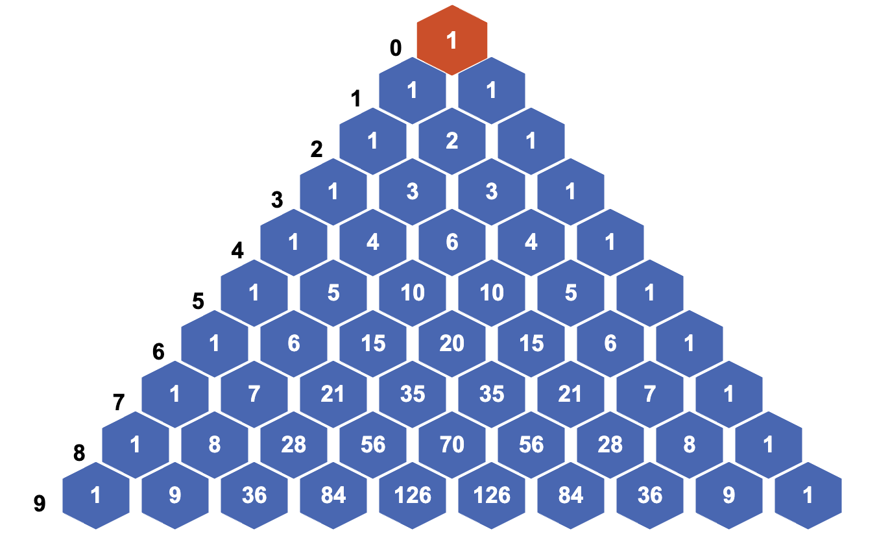
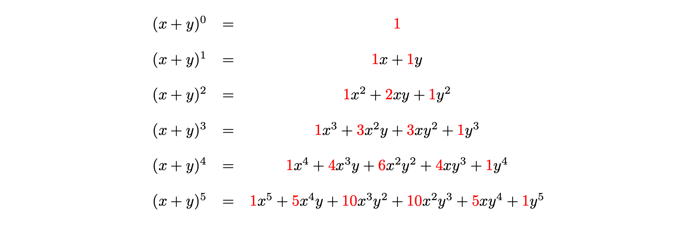

## A reminder {data-background-image="slides-bg.png"}

- Any questions, please feel free to ask at any point

  - **there's no such thing as a silly question!**
  
## Accessing these resources (and shameless self-promotion) {data-background-image="slides-bg.png" .smaller}

Materials for this week can be found at:

<https://starmast.org/suttontrust2026.html>

(to be updated throughout the week)

. . .

These are hosted on my maths resource website STARMAST, **a free-to-use, high-quality bank of inclusive and technically accessible learning resources in mathematics and statistics, suitable for everyone**, made by University of St Andrews staff and students for any student of mathematics or statistics.

<https://starmast.org>

New this week is a topic search for whatever school curriculum you may be on. :)

# The agony of choice

## What's going on? {data-background-image="slides-bg.png"}

So far, you have seen that Pascal's triangle has produced many infinite sequences that govern the way that humanity thinks about computing. 

However, you have not yet seen exactly what the numbers in Pascal's triangle **mean** - do they have any use in the real world? 

It turns out that these **count** the number of ways you can choose some objects from a larger set of objects. Let's investigate.

## Sets and subsets (1/2) {data-background-image="slides-bg.png"}

:::{.callout-note}

## Sets and subsets

A **set** is a collection of different objects, called **elements**. 

Elements of sets are typically mathematical objects such as numbers, symbols, shapes or even other sets, but in reality they can be anything at all. Two sets are equal if and only if they have the same elements. If $x$ is an element of a set $X$, then you can write $x\in X$; if $y$ is not an element of $X$, you can write $y\notin X$.

:::

:::{.notes}

For instance, the following are all sets: $$A = \{1,2,3,4,5,6\} \qquad B = \{a,b,c,♣️,💫\}\qquad C = \{\textsf{archer}, \textsf{fisher},\textsf{baker}\}$$ and the following are all true: $$2\in A,\quad b\in B,\quad \textsf{fisher}\in C,\quad 💫\notin A.$$ 

:::

## Sets and subsets (2/2) {data-background-image="slides-bg.png"}

:::{.callout-note}

## Sets and subsets

Although sets can contain anything, they must follow a couple of key principles:

-  **Distinct elements**: every element in a set must be different.
-  **Unordered**: the order that elements are written in a set does not matter.

If a set $X$ has $n$ elements in it, then you can write $|X| = n$ and say that the **cardinality** of $X$ is $n$. 

A **subset** of a set $X$ is a set $Y$ such that every element of $Y$ is also an element of $X$. For instance, the set $D = \{1,2,3,4\}$ is a subset of the set $A = \{1,2,3,4,5,6\}$. 

:::

## Counting subsets {data-background-image="slides-bg.png"}

You can find the total number of subsets of a set.

:::{.callout-note}

## Number of subsets of a set

The total number of subsets of the set $X = \{1,2,3,\ldots,n\}$ is $2^n$.

:::

This is a great way to see the mathematical idea of **choice** first hand. When you are choosing things, it's really important to outline **what you are choosing** and whether or not each choice depends on the last choice or not. 

:::{.notes}

You are given that $X = \{1,2,3,\ldots,n\}$. Now, assume that $Y$ is a subset of $X$; so the elements of $Y$ must all be elements of $X$ - but not every element of $X$ is necessarily an element of $Y$. 

So, you can ask yourself - is $1$ an element of $Y$? There are two **choices**; either $1$ is an element of $Y$, or $1$ isn't an element of $Y$.

Next, you can ask - is $2$ an element of $Y$? Again, there are two choices; either $2$ is an element of $Y$, or $2$ isn't an element of $Y$. You can notice here that the choice of whether or not $2$ is in $Y$ is completely independent of the choice that $1$ is in $Y$. The total number of potential scenarios so far is $$1,2\in Y,\qquad 1\in Y, 2\notin Y,\qquad 1\notin Y, 2\in Y,\qquad 1,2\notin Y$$ which is $2\cdot 2 = 4$.

Now, you can ask is $3$ an element of $Y$? There are four possible choices where it is (the four scenarios above plus $3\in Y$), and four possible choices where it isn't (the four scenarios above plus $3\notin Y$). Therefore, at this stage, there are $8 = 2\cdot 2 \cdot 2$. 

You can carry on in this way for all the elements of $X$. With two choices for each element, and all of the choices being independent of each other, this leads to $$\underbrace{2}_{\textsf{is }1\in Y?}\cdot \underbrace{2}_{\textsf{is }2\in Y?}\cdot \underbrace{2}_{\textsf{is }3\in Y?} \cdot \ldots \cdot \underbrace{2}_{\textsf{is }n\in Y?} = 2^n$$ many choices for the elements of $Y$. Therefore, there are $2^n$ possible subsets. 

The takeaway is that you can multiply together the numbers of choices at each stage to get the total number of choices overall.

:::

## Order! Order! {data-background-image="slides-bg.png"}

In the case above, the choice was whether to include an element in a subset or not. Next, you can ask - how many ways are there of choosing a subset of a **given size**? Here, including elements or not won't help, you are choosing something else. Let's explore.

## Scenario 1: gumballs (1/2) {data-background-image="slides-bg.png"}

:::{.callout-note}

## Scenario 1

Cantor's Confectionery are the leading fictional makers of sweets, chocolates, and all things desserty. They claim in their new food truck that from their famous five varieties of gumballs (apple, banana, cherry, date, edamame bean), there are $60$ ways in which you can pick three of them to take away and eat in any order.

You decide to investigate this fanciful claim. 

:::

## Scenario 1: gumballs {data-background-image="slides-bg.png"}

:::{.callout-note}

## Scenario 1 continued

Shortening each of the delicious flavours to the first letter of their word (so $\textsf{apple}$ becomes $a$ and so on), you can model this as a mathematical problem. This translates into the fact that you are picking three things from a set of five things $D = \{a,b,c,d,e\}$. 

- There are **five choices** for the first thing, which could be any of $a,b,c,d,e$. Let's say you pick $a$. 

- For the second thing, there are now **four choices**, as you can't pick $a$ twice. So pick one of $b,c,d,e$ - let's say $c$. 

- For the third thing, there are now **three choices**, as you can't pick $a,c$ again. So pick one of $b,d,e$ - let's say $e$. 

So there are $5\cdot 4\cdot 3 = 60$ ways to pick three things from a set of five.

:::

## Try it yourself 1 {data-background-image="slides-bg.png"}

This seems a lot of ways - almost too many ways - to pick a subset of three things from a set of five things. Here, it **is** too much. 

:::{.callout-important}

## Try it yourself 1

Why is it too much? 

:::

## Answer to try it yourself 1 {data-background-image="slides-bg.png"}

:::{.callout-note}

## Answer to try it yourself 1 (1/2)

This is because there is an **extra** condition on what you are choosing. 

You know from above that sets are **unordered**; the order in which the elements are written doesn't matter. This corresponds to the claim that you can eat the gumballs in any order.

However, the way that the elements $\{a,c,e\}$ were picked above was **in a strict order**; first $a$, then $c$, then $e$. 

But you could have got the same subset of elements $\{a,c,e\}$ by picking $c$ first, then $a$, then $e$. Or by picking $e$ first, then $c$, then $a$. 

:::

## Answer to try it yourself 1 (2/2) {data-background-image="slides-bg.png"}

:::{.callout-note}

## Answer to try it yourself 1 continued

There are in fact $6$ different orders for picking the elements: $$(a,c,e),(a,e,c),(c,a,e),(c,e,a),(e,a,c),(e,c,a)$$ and these haven't been accounted for in the counting. 

To account for this, you need to **divide** the total number of ways you can pick in order by the total number of orderings.

:::

## Scenario 1 continued {data-background-image="slides-bg.png"}

:::{.callout-note}

## Scenario 1 continued

You have seen that Cantor's Confectionery are overselling their claim by a factor of six. Incensed, you go up to the food truck with your workings-out and say that actually, there are $60/6 = 10$ ways you can pick a subset of three things from a set of five things. 

:::

And also you tell them that, really, no-one wants to eat a gumball that tastes like edamame beans. 

## Try it yourself 2 {data-background-image="slides-bg.png"}

This then gets you thinking. How can you apply these results to **other** dubious food truck marketing ploys (as well as other things)? 

To work this out, you need to work out the number of possible ways to **order** a set of $n$ elements. 

:::{.callout-important}

## Try it yourself 2: ways to order a set

Using the ideas of choice given above, show that the total number of ways to order the set $X = \{1,2,3,\ldots,n\}$ elements is $$n\cdot (n-1)\cdot (n-2) \cdot \ldots \cdot 3\cdot 2 \cdot 1 = n!$$ which you can recognise from yesterday ([Exploration slides: The hidden sequences of Pascal's triangle](e-s-pascalstriangleandgrowth.qmd)) as $n$ **factorial**.

:::

:::{.notes}

Suppose that $A$ is an ordering of the set $X$.

There are $n$ choices for the first element of the ordering. 

Since the second element of the ordering can't be the same as the first, there are $n-1$ choices for this. 

Since the third element of the ordering can't be the same as the first two elements, there are $n-2$ choices for this. 

You can continue in this way until at the $n$th element, there is exactly one choice left. So the total number of orderings is $$\underbrace{n}_{\textsf{first}}\cdot \underbrace{(n-1)}_{\textsf{second}}\cdot \underbrace{(n-2)}_{\textsf{third}} \cdot \ldots \cdot \underbrace{3}_{(n-2)\textsf{th}} \cdot \underbrace{2}_{(n-1)\textsf{th}} \cdot \underbrace{1}_{n\textsf{th}} = n!$$

:::

## Formalising the maths (1/3) {data-background-image="slides-bg.png"}

To properly express the ways that you can pick $k$ things from $n$ things, you can introduce some new notation. 

:::{.callout-note}

## Falling factorial

For a number $n$ and a positive whole number $k$, the number $(n)_k$, called the **$k$th falling factorial of $n$**, is defined to be $$(n)_k = n\cdot(n-1)\cdot(n-2)\cdot\ldots\cdot(n-k+1)$$ which is a product of $k$ many terms.

:::

Now, you have enough to provide general formulas for picking $k$ things from a set of $n$ things, whether the order matters or not.

## Formalising the maths (2/3) {data-background-image="slides-bg.png"}

:::{.callout-note}

## Permutations

Picking $k$ elements from a set of $n$ elements **where the order matters** is called a **permutation**. The amount of permutations of $k$ elements from an $n$ element set is sometimes written as $n\textsf{P}k$, which is read as "$n$ permute $k$".

You can work out that $$n\textsf{P}k = (n)_k,$$ the $k$th falling factorial of $n$. 

:::

## Formalising the maths (3/3) {data-background-image="slides-bg.png"}
    
:::{.callout-note}

## Combinations

Picking $k$ elements from a set of $n$ elements **where the order doesn't matter** is called a **combination**. 

The amount of combinations of $k$ elements from an $n$ element set is called the **binomial coefficient**, which is written as $$\binom{n}{k}$$ (read as "$n$ choose $k$"). It's also sometimes written as $n\textsf{C}k$.

You can work out that $$n\textsf{C}k = \binom{n}{k} = \frac{(n)_k}{k!}.$$
    
:::

## Try it yourself 3 {data-background-image="slides-bg.png"}

:::{.callout-important}

## Try it yourself 3

Find $n\mathsf{P}k$ and $n\mathsf{C}k$ where 

(a) $n = 7$, $k = 4$, and

(b) $n = 10$, $k = 3$.

:::

. . .

:::{.callout-note}

## Answer to try it yourself 3

(a) Here, $7\mathsf{P}4 = 840$ and $7\mathsf{C}4 =35$.

(b) Here, $10\mathsf{P}3 = 720$ and $10\mathsf{C}3 = 120$.

:::

# The binomial coefficient

## More on the binomial coefficients {data-background-image="slides-bg.png"}

The binomial coefficient, which is the number of ways you can pick $k$ elements from an $n$-element set, is one of **the most ubiquitous and useful concepts in mathematics** (but I might be biased...)

It has uses in algebra, calculus, and probability theory (as you will see later). 

In order to harness the power of the binomial coefficient, and its role in counting, you will need to investigate its properties.

## A new formula {data-background-image="slides-bg.png"}

First of all, you can express the binomial coefficient in a different way to above:

:::{.callout-note}

## The binomial coefficient 1

$$\binom{n}{k} = \frac{(n)_k}{k!} = \frac{n!}{k!\cdot(n-k)!}.$$

:::

:::{.notes}

Do on board...

To show this, you can multiply top and bottom of the existing fraction $(n)_k/k!$ by $(n-k)!$; this is the same as multiplying by $1$ to create an equivalent fraction. Doing this gives $$\binom{n}{k} = \frac{(n)_k}{k!} = \frac{(n)_k(n-k)!}{k!(n-k)!}.$$ Now if $(n)_k(n-k)!$ is equal to $n$ factorial, then you are done as the fraction will be exactly what you're looking for. Indeed, you can write out $n!$ in full to see that for any $k$,
$$
n! = \underbrace{n\cdot (n-1) \cdot \ldots (n-k+1)}_{(n)_k}\cdot \underbrace{(n-k)\cdot (n-k-1) \cdot \ldots \cdot 2\cdot 1}_{(n-k)!} = (n)_k \cdot (n-k)!
$$
and so $$\binom{n}{k} = \frac{(n)_k}{k!} = \frac{(n)_k(n-k)!}{k!(n-k)!} = \frac{n}{k!(n-k)!}$$ as required.

:::

## Try it yourself 4 {data-background-image="slides-bg.png" .smaller}

Because of the way that binomial coefficients are defined to count subsets of a set with $n$ elements, you can investigate properties of the binomial coefficients by investigating counting, rather than attempting to manipulate the formula.

In mathematics, it's often best to investigate general behaviour by looking at examples with actual numbers. Here's one you can try yourself that will reveal more hidden secrets of binomial coefficients. 

:::{.callout-important}

## Try it yourself 4

Using the formula or principles from counting, work out all the binomial coefficients $$\binom{5}{0} ,\; \binom{5}{1},\; \binom{5}{2},\;  \binom{5}{3},\;  \binom{5}{4} ,\;  \binom{5}{5}$$

You can remind yourself of the fact that $0! = 1$ and $1! = 1$.

What do you notice about the answers? What do they add up to? Where have you seen them before?

:::

## Answer to try it yourself 4 {data-background-image="slides-bg.png"}

:::{.callout-note}

## Answer to try it yourself 4

Here $$\binom{5}{0} = 1 ,\; \binom{5}{1} = 5,\; \binom{5}{2} = 10,\;  \binom{5}{3} = 10,\;  \binom{5}{4} = 5,\;  \binom{5}{5} = 1.$$

You can notice that this is exactly row $5$ of Pascal's triangle! You know from [Exploration slides: The hidden sequences of Pascal's triangle](e-s-pascalstriangleandgrowth.qmd) that adding a row of Pascal's triangle gives a power of $2$; so adding them all together gives $2^5 = 32$. 

:::

## Consequences! {data-background-image="slides-bg.png"}

It is true that adding together all the binomial coefficients $\displaystyle\binom{n}{k}$ for $k=0,1,\ldots,n$ gives $2^n$. There are two ways you can explain this - either you can do lots of tedious algebra using the formula, or you can think about what you are counting. 

You know from the above that the number of subsets of a set $X$ with $n$ elements is $2^n$. The binomial coefficient counts all of the subsets of $X$ of size $k$ for some $k$ between $0,1,\ldots,n$ - so adding all of these up naturally gives the number of all the subsets of $X$!

## Consequences, again! {data-background-image="slides-bg.png"}

You also saw that $$\binom{5}{0} = 1\quad\textsf{ and }\quad\binom{5}{5} = 1.$$ In fact, this is true for all $n$: $$\binom{n}{0} = 1\quad\textsf{ and }\quad\binom{n}{n} = 1.$$ This is because there is exactly one way to pick $0$ elements, and one way to pick $n$ elements, from a set of size $n$. 

## Consequences, again! (again) {data-background-image="slides-bg.png" .smaller}

Next, you can notice that $$\binom{5}{0} = 1 = \binom{5}{5},\qquad \binom{5}{1} = 5 = \binom{5}{4},\qquad \binom{5}{2} = 10 = \binom{5}{3}$$ This means that binomial coefficients are *symmetric*, that is $$\binom{n}{k} = \binom{n}{n-k}$$ for all $n \geq k \geq 0$. You can see this by swapping the order of multiplication in the denominator of the formula: $$\binom{n}{k} = \frac{n!}{k!\cdot (n-k)!} = \frac{n!}{(n-k)!\cdot k!} = \binom{n}{n-k}$$ or by noticing that when you choose a set of $k$ elements of a set, this is the same as **not choosing** $n-k$ elements!

## Connection with Pascal's triangle (1/2) {data-background-image="slides-bg.png" .smaller}

The other striking consequence of the binomial coefficients is that they are **exactly the entries of Pascal's triangle**. In fact, you can say that $\displaystyle\binom{n}{k}$ is the $k$th entry in the $n$th row of Pascal's triangle, where $n \geq k \geq 0$ are whole numbers. 

{width="75%"}

## Connection with Pascal's triangle (2/2) {data-background-image="slides-bg.png" .smaller}

To show that this is true, it's enough to show that binomial coefficients satisfy the defining property of Pascal's triangle; that is, you can obtain an entry by adding those above it. This corresponds to the mathematical statement: 

:::{.callout-note}

## Binomial coefficients and Pascal's triangle

$$\binom{n}{k-1} + \binom{n}{k} = \binom{n+1}{k}$$

:::

You can explain this in two different ways. The first involves counting of sets with some nice conditions - the second involves some principles of algebra. 

:::{.notes}

(Double counting.)

Suppose that you are running a maths exploration session and you have $n+1$ students in your class $X$. Pick a subset $A$ of $k$ students from this class - notice that there are $\displaystyle \binom{n+1}{k}$ ways of doing this, giving the right-hand side of the equation.

Now let's choose $k$ students from $n+1$ students in a different way, by identifying a student in the class (Alex) and choosing around them. Either the subset $A$ with $k$ students of the $n+1$ students in the class involves Alex, or it doesn't. 

  - If Alex is in the set $A$, then you can make up the numbers by choosing $k-1$ students from the remaining $n$. There are $\displaystyle\binom{n}{k-1}$ ways of picking $A$ if Alex is in $A$.
    
  - If Alex is not in the set $A$, then to make up the numbers in $A$ you need to pick $k$ students from $n$ students. There are $\displaystyle\binom{n}{k}$ ways of picking $A$ is Alex is not in $A$. 
    
Adding these together gives the left hand side of the equation. 

(Algebra explanation)

Here's the algebraic explanation. Begin by using the formula for the binomial coefficient to rewrite the right hand side.

$$\binom{n}{k-1}+\binom{n}{k}=\frac{n!}{(n-(k-1))!(k-1)!}+\frac{n!}{k!(n-k)!}$$

In order to make the denominators equal, you can multiply top and bottom of the left fraction by $k$ and the top and bottom of the right fraction by $n-(k-1)$. Doing this and combining the numerators via factorization gives

$$
\begin{aligned}
\frac{n!}{(n-(k-1))!\cdot (k-1)!}+\frac{n!}{k!(n-k)!} &=\frac{k\cdot n!}{(n-(k-1))!\cdot k!}+\frac{(n-(k-1))\cdot n!}{(n-(k-1))!\cdot k!}\\[0.5em]
&=\frac{(k+n-(k-1))\cdot n!}{k!\cdot (n-(k-1))!}
\end{aligned}
$$

Now, you can use the fact that $n-(k-1) = (n+1) - k$ to write that 
Simplifying and rewriting the right hand side you can get $\binom{n}{k}$ as required.
$$\frac{(k+n-k+1)\cdot n!}{k!\cdot (n-(k-1))!} =\frac{(n+1)\cdot n!}{k!\cdot ((n+1) - k)!}=\frac{(n+1)!}{k!\cdot (n+1)-k)!}=\binom{n+1}{k}$$
as required.

:::

## Picking things with repetition {data-background-image="slides-bg.png"}

As you have seen, subsets do not allow for repeated elements. So how can you choose a collection of things with **repetitions**? This is particularly useful if you want to go doughnut shopping...

:::{.callout-note}

## Scenario 2

Impressed with your knowledge of binomial coefficients, Cantor's Confectionery want to find out how many ways you could buy a box of ten doughnuts from its five flavours, allowing for the fact that you can buy multiple ways of each flavour. 

How can you do it?

:::

## Stars and bars! (1/2) {data-background-image="slides-bg.png"}

Here, the idea is to count the ways in which you can have **repeats**, rather than trying to count the elements. This can be done using a **stars-and-bars** argument, where the **stars** represent the $r$ things you are picking, and the $n-1$ **bars** separate repeats of the $r$ things into $n$ blocks. 

. . .

Each position of 'stars-and-bars' corresponds to a different way of picking $r$ things with repetitions from a set of $n$ things. 

## Stars and bars! (2/2) {data-background-image="slides-bg.png"}

Since there are $n-1$ ways to place the bars in the $n+r-1$ many boxes, it follows that:

:::{.callout-note}

## Choosing things with repetition

The amount of ways to pick $r$ many things from a set of $n$ things with repetition allowed is $$\binom{n+r-1}{n-1} = \binom{n+r-1}{r}.$$

:::

## Scenario 2 answer {data-background-image="slides-bg.png"}

:::{.callout-note}

## Scenario 2 continued

You confidently report that from a set of $n = 5$ flavours of doughnut to choose from, you can pick a total of $r = 10$ doughnuts with repetition in $$\binom{5+10-1}{10} = \binom{14}{10} = 1001$$ different ways. 

Cantor's Confectionery are overwhelmed with gratitude.

:::

## Why 'binomial coefficients'? {data-background-image="slides-bg.png"}

This comes from the famous **binomial theorem**, which deals with expanding brackets multiple times:

:::{.callout-note}

## The binomial theorem

For any non-negative $n\in\mathbb{Z}$: $$(x+y)^n = \sum_{k=0}^n\binom{n}{k}x^{n-k}y^k.$$

where the $\sum_{k=0}^n$ means 'the sum from $k = 0$ to $k = n$'. 

For more about this notation (called **sigma notation**) please see [Guide: Sigma notation](../../studyguides/sigmanotation.qmd).

:::

## The binomial theorem (1/2) {data-background-image="slides-bg.png"}

Proving this (incredibly important) theorem once again relies on counting - and thankfully *not* on actually expanding an unspecified amount of brackets.

:::{.callout-note}

## Explanation of the binomial theorem

Consider $(x+y)^n$. Expanding these gives a sum of terms where each term is a product of a power of $x$ and a power of $y$. 

For each $k$ between $0$ and $n$, the term $x^{n-k}y^k$ arises from choosing $y$ from $k$ many brackets in $(x+y)^n$ and $x$ from the rest. 

There are $\displaystyle\binom{n}{k}$ ways to choose the $y$'s from the brackets, so the result follows.

:::

## The binomial theorem (2/2) {data-background-image="slides-bg.png"}

You can see this in the following figure. 

{fig.alt="A system of equations. On the left is $(x+y)^n$ up to $n=4$. On the right are their expanded forms." width="120%"}

## History time {data-background-image="slides-bg.png"}

:::{.callout-tip}

## A history of binomial coefficients

- The case for $(x+y)^2$ is covered in the ancient Greek mathematical texts written by [Euclid](https://mathshistory.st-andrews.ac.uk/Biographies/Euclid/) and [Diophantus](https://mathshistory.st-andrews.ac.uk/Biographies/Diophantus/)

- However, it was in India that the theory was expanded to both higher algebra and the theory of combinations.

- The connections to Pascal's triangle were illustrated by our old friends [Omar Khayyam](https://mathshistory.st-andrews.ac.uk/Biographies/Khayyam/) and [Yang Hui](https://mathshistory.st-andrews.ac.uk/Biographies/Yang_Hui/).

- The first statement of the binomial theorem, and the name 'binomial coefficient', is often ascribed to [Stifel](https://mathshistory.st-andrews.ac.uk/Biographies/Stifel/), with [Pascal](https://mathshistory.st-andrews.ac.uk/Biographies/Pascal/) himself providing a complete proof of the formula.

- [Newton](https://mathshistory.st-andrews.ac.uk/Biographies/Newton/) proved a **generalised binomial theorem** 
  - expanded by [James Gregory](https://mathshistory.st-andrews.ac.uk/Biographies/Gregory/), famous for being the first Regius Professor of Mathematics at the University of St Andrews. 

:::

:::{.notes}

The case for $(x+y)^2$ is covered in the ancient Greek mathematical texts written by [Euclid](https://mathshistory.st-andrews.ac.uk/Biographies/Euclid/), and using cubic terms was covered in work of [Diophantus](https://mathshistory.st-andrews.ac.uk/Biographies/Diophantus/) (sometimes known as the 'father of algebra').

However, it was in India that the theory was expanded to both higher algebra and the theory of combinations. [Aryabhata I](https://mathshistory.st-andrews.ac.uk/Biographies/Aryabhata_I/) described the expansion of $(x+y)^3$ in a summary of Hindu mathematics up to the 6th century. By the 9th century at latest, Indian mathematics had formulated both using binomial coefficients as methods of counting combinations, and writing them as a product of fractions; this is evidenced by work of [Śrīdhara](https://mathshistory.st-andrews.ac.uk/Biographies/Sridhara/), [Mahāvīra](https://mathshistory.st-andrews.ac.uk/Biographies/Mahavira/) and [Bhāksara II](https://mathshistory.st-andrews.ac.uk/Biographies/Bhaskara_II/).

The connections to Pascal's triangle were illustrated by our old friends [Omar Khayyam](https://mathshistory.st-andrews.ac.uk/Biographies/Khayyam/) and [Yang Hui](https://mathshistory.st-andrews.ac.uk/Biographies/Yang_Hui/).

The first statement of the binomial theorem, and the name 'binomial coefficient', is often ascribed to [Stifel](https://mathshistory.st-andrews.ac.uk/Biographies/Stifel/), with [Pascal](https://mathshistory.st-andrews.ac.uk/Biographies/Pascal/) himself providing a complete proof of the formula.

[Newton](https://mathshistory.st-andrews.ac.uk/Biographies/Newton/) proved a **generalised binomial theorem** (working in power series rather than sums), and this was later expanded by [James Gregory](https://mathshistory.st-andrews.ac.uk/Biographies/Gregory/), famous for being the first Regius Professor of Mathematics at the University of St Andrews. 

:::

# How to win at cards

## Texas hold-em poker {data-background-image="slides-bg.png" .smaller}

[Texas hold-em poker](https://en.wikipedia.org/wiki/Texas_hold_'em) is one of the most popular card games in the world. Here's how it works.

:::{.incremental}
- Each player is dealt **two cards** - called **the hole** - and some friendly wagering occurs.
- Once the betting is over, **three cards** are then dealt - called **the flop** - and another round of betting occurs.
- Next, **one card** is dealt - called **the turn** - and another round of betting occurs.
- Next, **one final card** is dealt - called **the river** - and a final round of betting occurs.
- The winner of the hand is determined by picking the **best five cards** from the **seven usable cards** available to each player (the hole cards, the flop, the turn, and the river).
:::

## Hand rankings {data-background-image="slides-bg.png" .smaller}

| **Hand**        | **Description**                                               | **Example**        |
|-----------------|---------------------------------------------------------------|--------------------|
| High card       | None of the below                                             | A❤️ 10❤️ 9♣️ 4♠️ 2♦️    |
| Pair            | One pair of cards of the same value                           | A❤️ 10❤️ 10♣️ 4♠️ 2♦️   |
| Two pair        | Two pairs of cards of different values                        | A❤️ 10❤️ 10♣️ 4♠️ 4♦️   |
| Three of a kind | Three cards with the same value                               | A❤️ 10❤️ 4♣️ 4♠️ 4♦️    |
| Straight        | Sequence of 5 cards in increasing value, not all of same suit | J❤️ 10❤️ 9♣️ 8♠️ 7♦️    |
| Flush           | 5 cards of the same suit, not a straight                      | A❤️ 10❤️ 9❤️ 4❤️ 2❤️    |
| Full house      | Three of a kind and a pair                                    | 9♦️ 9❤️ 9♣️ 4♠️ 4♦️  |
| Four of a kind  | Four cards of the same value                                  | 9♦️ 9❤️ 9♣️ 9♠️ 4♦️ |
| Straight flush  | Straight and flush together                                   | J❤️ 10❤️ 9❤️ 8❤️ 7❤️    |
| Royal flush     | A K Q J 10 all of same suit                                   | A❤️ K❤️ Q❤️ J❤️ 10❤️    |

: {tbl-colwidths="[20,50,30]"}

## Things to note {data-background-image="slides-bg.png" .smaller}

It's worth noting that players can opt out at any time (**folding**), and that players can bet with hands that are typically not likely to win, in order to pressure other players into betting along (**bluffing**). This is then a game that is played psychologically amongst the players, as well as on the cards.

. . .

To maximise the chances of winning, poker players have an incredible knowledge of what cards are likely to appear at what times, and the probability that their hands have a chance of winning outright. 

. . .

However, to do that, the likelihood of certain hands appearing have to be calculated. This is where the binomial coefficients come in.

## Odds (and ends) (1/2) {data-background-image="slides-bg.png"}

To begin, its worth knowing that odds of these hands can be calculated by the following formula: $$\mathbb{P}(\textsf{hand of type X}) = \frac{\textsf{total number of hands of type X}}{\textsf{total number of possible hands}}$$ where $P$ means 'the **probability** of'. 

## Odds (and ends) (2/2) {data-background-image="slides-bg.png"}

One thing that will be constant is the total number of hands. Since Texas hold 'em involves **seven card** hands, the total number of hands will be the amount of ways that you can pick $7$ cards from a standard deck of $52$ cards. 

. . .

This is $$\binom{52}{7} = \frac{52!}{7!\cdot 45!} = 133784560$$ (which was not worked out by hand - but by [Calculator: Combinations and permutations](../../apps/calculators/c-ncrnpr.qmd).)

So this is the total number of hands. 

## Royal flush (1/2) {data-background-image="slides-bg.png" .smaller}

What are your chances of getting a royal flush? You can work this out by looking at the choices involved.

:::{.incremental}

- The **values** of the five cards you need are predetermined, so there is only **one choice** for the five card values you need. You can write this as $1$.

- The **suit** of the five cards you need could be any one of the four suits {❤️,♦️,♠️,♣️} and so you have **four choices** for the suit, which is written as $\displaystyle\binom{4}{1}$.

- There are two cards that could be anything. Since there are $47$ cards left to choose and you could have two of them, you have $\displaystyle\binom{47}{2}$ choices for these.

:::

## Royal flush (2/2) {data-background-image="slides-bg.png" .smaller}

Since these choices of these are independent, you can multiply these all together to get $$\textsf{number of hands with a royal flush} = 1\cdot \binom{4}{1}\cdot \binom{47}{2} = 4\cdot 1081 = 4324$$ 

. . .

Which means that the probability of a royal flush in Texas hold 'em is $$\mathbb{P}(\textsf{royal flush}) = \frac{4324}{133784560} \approx	0.0032\%.$$

## Try it yourself 5 {data-background-image="slides-bg.png"}

:::{.callout-important}

## Try it yourself 5

Work out the probability of getting **four of a kind** in Texas hold 'em poker. 

:::

:::{.notes}

You can apply the same logic to this kind of hand.

- The **values** of the four cards could be any one of the thirteen different values, so there are **thirteen choices**, one for each value. You can write this as $\displaystyle\binom{13}{1}$ as you are choosing one of the thirteen values.
- There are three other cards that could be anything. Since there are $48$ cards left to choose and you need any three of them, you have $\displaystyle\binom{48}{3}$ choices for these.

Since these choices of these are independent, you can multiply these together to get $$\textsf{number of hands with four of a kind} = \binom{13}{1}\cdot \binom{48}{3} = 13\cdot 17296 = 224848$$

Which means that the probability of four of a kind in Texas hold 'em is $$\mathbb{P}(\textsf{four of a kind}) = \frac{224848}{133784560} \approx	0.168\%.$$

:::

## Counting cards {data-background-image="slides-bg.png" .smaller}

However, as hands get less specific, the calculations involved get a little... rougher. For instance, the amount of three of a kind hands is $$\left[\binom{13}{5} - 10\right]\binom{5}{1}\binom{4}{1}\left[\binom{4}{1}^4 - 3\right] = 6461620$$ 

. . .

and the number of full houses is $$\begin{aligned}
\left[\binom{13}{2}\binom{4}{3}^2\binom{44}{1} \right]
+ & \left[\binom{13}{1}\binom{12}{2}\binom{4}{3}\binom{4}{2}^2 \right] \\
+ & \left[\binom{13}{1}\binom{12}{1}\binom{11}{2}\binom{4}{3}\binom{4}{2}\binom{4}{1}^2\right]
\end{aligned}$$

## Poker face {data-background-image="slides-bg.png"}

The astonishing thing about poker players is that all the probability they do is in their head **in the middle of play** and **with incomplete information**; players know what's in the flop, turn, and river, but they **don't** know what cards other players have! This is known as **conditional probability** and is an incredibly detailed area of mathematics and statistics.

## End {data-background-image="slides-bg.png"}

See you tomorrow :)