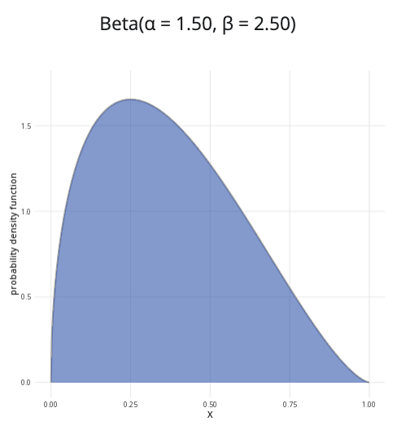

```{r, setup, include = FALSE}
library("webexercises")
```


::: {.content-visible when-format="html"}

```{=html}
<script src="https://cdn.plot.ly/plotly-2.35.2.min.js"></script>
<script src="https://cdn.jsdelivr.net/npm/jstat@1.9.6/dist/jstat.min.js"></script>

<style>
.beta-card-header {
  background-color: #3F68B6;
  color: white;
  font-weight: 600;
}

.beta-result {
  font-size: 1.1rem;
  font-weight: 500;
}

.form-check-label {
  margin-left: 0.25rem;
}

.beta-container {
  margin-top: 1rem;
  margin-bottom: 1rem;
}

.calculator-row {
  display: grid;
  grid-template-columns: 1fr 2fr;
  gap: 1rem;
}

@media (max-width: 992px) {
  .calculator-row {
    grid-template-columns: 1fr;
  }
}
</style>

<div class="container-fluid beta-container">

  <div class="calculator-row">

    <div class="calculator-left">

      <div class="card mb-3">
        <div class="card-header beta-card-header">
          Parameters
        </div>

        <div class="card-body">

          <label class="form-label">
            Shape parameter α
          </label>

          <input
            id="shape1"
            type="number"
            class="form-control"
            value="2"
            min="0.01"
            step="0.1"
          >

          <br>

          <label class="form-label">
            Shape parameter β
          </label>

          <input
            id="shape2"
            type="number"
            class="form-control"
            value="2"
            min="0.01"
            step="0.1"
          >

          <hr>

          <label class="form-label">
            Probability to calculate
          </label>

          <div class="form-check">
            <input
              class="form-check-input"
              type="radio"
              name="ptype"
              value="less"
              id="ptype_less"
              checked
            >
            <label class="form-check-label" for="ptype_less">
              P(X ≤ x)
            </label>
          </div>

          <div class="form-check">
            <input
              class="form-check-input"
              type="radio"
              name="ptype"
              value="greater"
              id="ptype_greater"
            >
            <label class="form-check-label" for="ptype_greater">
              P(X ≥ x)
            </label>
          </div>

          <div class="form-check">
            <input
              class="form-check-input"
              type="radio"
              name="ptype"
              value="between"
              id="ptype_between"
            >
            <label class="form-check-label" for="ptype_between">
              P(x ≤ X ≤ y)
            </label>
          </div>

          <br>

          <div id="lessControls">

            <label class="form-label">
              x value:
              <span id="lessValue">0.50</span>
            </label>

            <input
              id="x_less"
              type="range"
              class="form-range"
              min="0"
              max="1"
              step="0.01"
              value="0.5"
            >

          </div>

          <div id="greaterControls" style="display:none;">

            <label class="form-label">
              x value:
              <span id="greaterValue">0.50</span>
            </label>

            <input
              id="x_greater"
              type="range"
              class="form-range"
              min="0"
              max="1"
              step="0.01"
              value="0.5"
            >

          </div>

          <div id="betweenControls" style="display:none;">

            <label class="form-label">
              Lower bound x:
              <span id="lowerValue">0.25</span>
            </label>

            <input
              id="x_lower"
              type="range"
              class="form-range"
              min="0"
              max="1"
              step="0.01"
              value="0.25"
            >

            <label class="form-label">
              Upper bound y:
              <span id="upperValue">0.75</span>
            </label>

            <input
              id="x_upper"
              type="range"
              class="form-range"
              min="0"
              max="1"
              step="0.01"
              value="0.75"
            >

          </div>

        </div>
      </div>

    </div>

    <div class="calculator-right">

      <div class="card mb-3">

        <div class="card-header beta-card-header">
          Beta distribution plot
        </div>

        <div class="card-body">

          <h4
            id="plotTitle"
            style="text-align:center;margin-bottom:15px;"
          ></h4>

         <div
           id="betaPlot"
           style="height:450px;"
           aria-label="Beta distribution plot"
         ></div>

        </div>

      </div>

    </div>

  </div>

  <div class="card">

    <div class="card-header beta-card-header">
      Results
    </div>

    <div class="card-body">

      <div
        id="resultText"
        class="beta-result"
        aria-live="polite"
      ></div>

    </div>

  </div>

</div>

<script>

function getProbType() {
  return document.querySelector(
    'input[name="ptype"]:checked'
  ).value;
}

function betaPdf(x, a, b) {
  return jStat.beta.pdf(x, a, b);
}

function betaCdf(x, a, b) {
  return jStat.beta.cdf(x, a, b);
}

function updateVisibility() {

  document.getElementById("lessControls").style.display = "none";
  document.getElementById("greaterControls").style.display = "none";
  document.getElementById("betweenControls").style.display = "none";

  const ptype = getProbType();

  if (ptype === "less") {
    document.getElementById("lessControls").style.display = "block";
  }

  if (ptype === "greater") {
    document.getElementById("greaterControls").style.display = "block";
  }

  if (ptype === "between") {
    document.getElementById("betweenControls").style.display = "block";
  }
}

function updateSliderLabels() {

  document.getElementById("lessValue").textContent =
    Number(document.getElementById("x_less").value).toFixed(2);

  document.getElementById("greaterValue").textContent =
    Number(document.getElementById("x_greater").value).toFixed(2);

  document.getElementById("lowerValue").textContent =
    Number(document.getElementById("x_lower").value).toFixed(2);

  document.getElementById("upperValue").textContent =
    Number(document.getElementById("x_upper").value).toFixed(2);
}

function redraw() {

  updateVisibility();
  updateSliderLabels();

  const a =
    parseFloat(document.getElementById("shape1").value);

  const b =
    parseFloat(document.getElementById("shape2").value);

  document.getElementById("plotTitle").innerHTML =
    `Beta(α = ${a.toFixed(2)}, β = ${b.toFixed(2)})`;

  const x = [];
  const y = [];

  for (let i = 0; i <= 500; i++) {

    const xx = i / 500;

    x.push(xx);
    y.push(betaPdf(xx, a, b));
  }

  const ptype = getProbType();

  let shadeX = [];
  let shadeY = [];

  let result = "";

  if (ptype === "less") {

    const xv =
      parseFloat(document.getElementById("x_less").value);

    for (let i = 0; i <= 200; i++) {

      const xx = xv * i / 200;

      shadeX.push(xx);
      shadeY.push(betaPdf(xx, a, b));
    }

    const prob = betaCdf(xv, a, b);

    result =
      `P(X ≤ ${xv.toFixed(2)}) = ${prob.toFixed(6)} (${(100*prob).toFixed(4)}%)`;
  }

  if (ptype === "greater") {

    const xv =
      parseFloat(document.getElementById("x_greater").value);

    for (let i = 0; i <= 200; i++) {

      const xx = xv + (1 - xv) * i / 200;

      shadeX.push(xx);
      shadeY.push(betaPdf(xx, a, b));
    }

    const prob = 1 - betaCdf(xv, a, b);

    result =
      `P(X ≥ ${xv.toFixed(2)}) = ${prob.toFixed(6)} (${(100*prob).toFixed(4)}%)`;
  }

  if (ptype === "between") {

    let lo =
      parseFloat(document.getElementById("x_lower").value);

    let hi =
      parseFloat(document.getElementById("x_upper").value);

    if (hi < lo) {

      hi = lo;

      document.getElementById("x_upper").value = lo;
    }

    for (let i = 0; i <= 200; i++) {

      const xx =
        lo + (hi - lo) * i / 200;

      shadeX.push(xx);
      shadeY.push(betaPdf(xx, a, b));
    }

    const prob =
      betaCdf(hi, a, b) -
      betaCdf(lo, a, b);

    result =
      `P(${lo.toFixed(2)} ≤ X ≤ ${hi.toFixed(2)}) = ${prob.toFixed(6)} (${(100*prob).toFixed(4)}%)`;
  }

  document.getElementById("resultText").textContent =
    result;

  Plotly.react(
    "betaPlot",
    [
      {
        x: x,
        y: y,
        mode: "lines",
        showlegend: false,
        line: {
          color: "darkgray",
          width: 3
        },
        hoverinfo: "skip"
      },
      {
        x: shadeX,
        y: shadeY,
        fill: "tozeroy",
        mode: "lines",
        showlegend: false,
        fillcolor: "rgba(63,104,182,0.60)",
        line: {
          width: 0
        },
        hoverinfo: "skip"
      }
    ],
    {
      margin: {t:10},
      showlegend: false,
      xaxis: {
        title: "X",
        range: [0,1]
      },
      yaxis: {
        title: "Probability density function"
      }
    },
    {
      responsive: true,
      displayModeBar: false
    }
  );
}

document
  .querySelectorAll("input")
  .forEach(el => {
    el.addEventListener("input", redraw);
    el.addEventListener("change", redraw);
  });

window.addEventListener("load", redraw);

</script>
```

:::

::: {.content-hidden when-format="html"}

{width="80%"}

:::

**Where to use:** The beta distribution is used to model the distribution of *probabilities* or proportions. Hence, the random variable $0 \leq X \leq 1$.

**Notation:** $X \sim \textrm{Beta}(\alpha,\beta)$

**Parameters:** Two positive real numbers $\alpha,\beta$, which are shape parameters. These can be specified as follows in terms of $n$ and $k$ where $n$ is the number of Bernoulli trials and $k$ is the number of successes:

-   $\alpha = k + 1$
-   $\beta = n - k + 1$

| Quantity | Value | Notes |
|:--------|:----------------------------|:-------------------|
| **Mean** | $\mathbb{E}(X) = \dfrac{\alpha}{\alpha+\beta}$ |  |
| **Variance** | $\mathbb{V}(X) = \dfrac{\alpha\beta}{(\alpha+\beta)^2(\alpha+\beta+1)}$ |  |
| **PDF** | $\mathbb{P}(X=x)=\dfrac{x^{\alpha-1}(1-x)^{\beta-1}}{\textrm{B}(\alpha,\beta)}$ | $\textrm{B}(x,y)$ is the beta function |
| **CDF** | $\mathbb{P}(X \leq x)=I_{x}(\alpha,\beta)$ | $I_{x}(a,b)$ is the regularized incomplete beta function |

**Example:** Cantor’s Confectionery is visited by 10 customers, and 6 of them purchase something from the store. Taking the buying customers as successes and the total visiting customers as number of trials, there would be 6 successes, allowing you to find the following parameters:

-   $\alpha = 6 + 1 = 7$

-   $\beta = 10 - 6 + 1 = 5$

Then the distribution of the probabilities of a customer purchasing from Cantor’s Confectionery can be expressed as $X \sim \textrm{Beta}(7,5)$, meaning the first shape parameter is 7 and the second shape parameter is 5.

# Further reading {-}

[This interactive element appears in Overview: Probability distributions. Please click this link to go to the guide.](../overviews/o-distributions.qmd)

## Version history {-}

v1.0: initial version created 04/25 by tdhc and Michelle Arnetta as part of a University of St Andrews VIP project.

  - v1.1: moved to factsheet form and populated with material from [Overview: Probability distributions](../overviews/o-distributions.qmd) by tdhc.
  
  - v1.2: graph transferred from R Shinylive to html by tdhc in 06/26.
  
[This work is licensed under CC BY-NC-SA 4.0.](https://creativecommons.org/licenses/by-nc-sa/4.0/?ref=chooser-v1)


