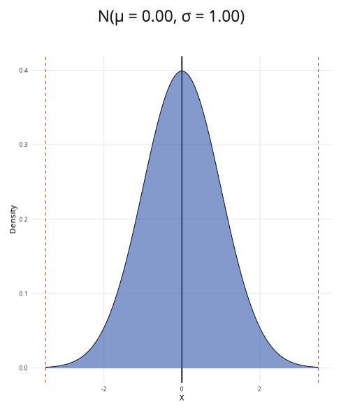

```{r, setup, include = FALSE}
library("webexercises")
```

::: {.content-visible when-format="html"}

```{=html}
<script src="https://cdn.plot.ly/plotly-2.35.2.min.js"></script>
<script src="https://cdn.jsdelivr.net/npm/jstat@1.9.6/dist/jstat.min.js"></script>

<style>
.normal-card-header {
  background-color: #3F68B6;
  color: white;
  font-weight: 600;
}

.form-check-label {
  margin-left: 0.25rem;
}

.normal-result {
  font-size: 1.1rem;
  font-weight: 500;
}

.normal-container {
  margin-top: 1rem;
  margin-bottom: 1rem;
}

.calculator-row {
  display: grid;
  grid-template-columns: 1fr 2fr;
  gap: 1rem;
}

@media (max-width: 992px) {
  .calculator-row {
    grid-template-columns: 1fr;
  }
}
</style>

<div class="container-fluid normal-container">

  <div class="calculator-row">

    <div class="calculator-left">

      <div class="card mb-3">

        <div class="card-header normal-card-header">
          Parameters
        </div>

        <div class="card-body">

          <label class="form-label">
            Mean (μ)
          </label>

          <input
            id="mean"
            type="number"
            class="form-control"
            value="0"
            step="0.1"
          >

          <br>

          <label class="form-label">
            Standard deviation (σ)
          </label>

          <input
            id="sd"
            type="number"
            class="form-control"
            value="1"
            min="0.01"
            step="0.1"
          >

          <hr>

          <label class="form-label">
            Probability to calculate
          </label>

          <div class="form-check">
            <input
              class="form-check-input"
              type="radio"
              name="ptype"
              value="less"
              id="ptype_less"
              checked
            >
            <label class="form-check-label" for="ptype_less">
               P(X ≤ x)
            </label>
          </div>

          <div class="form-check">
            <input
              class="form-check-input"
              type="radio"
              name="ptype"
              value="greater"
              id="ptype_greater"
            >
            <label class="form-check-label" for="ptype_greater">
              P(X ≥ x)
            </label>
          </div>

          <div class="form-check">
            <input
              class="form-check-input"
              type="radio"
              name="ptype"
              value="between"
              id="ptype_between"
            >
            <label class="form-check-label" for="ptype_between">
              P(x ≤ X ≤ y)
            </label>
          </div>

          <br>

          <div id="singleControls">

  <label class="form-label">
    x value:
    <span id="xValueLabel">0.00</span>
  </label>

  <input
    id="x_value"
    type="range"
    class="form-range"
    min="-3.5"
    max="3.5"
    step="0.01"
    value="0"
  >

</div>

          <div
            id="betweenControls"
            style="display:none;"
          >

            <label class="form-label">
  Lower bound (x):
  <span id="lowerLabel">-1.00</span>
</label>

<input
  id="x_lower"
  type="range"
  class="form-range"
  min="-3.5"
  max="3.5"
  step="0.01"
  value="-1"
>

<label class="form-label">
  Upper bound (y):
  <span id="upperLabel">1.00</span>
</label>

<input
  id="x_upper"
  type="range"
  class="form-range"
  min="-3.5"
  max="3.5"
  step="0.01"
  value="1"
>

          </div>

        </div>

      </div>

    </div>

     <div class="calculator-right">

      <div class="card mb-3">

        <div class="card-header normal-card-header">
          Normal distribution plot
        </div>

        <div class="card-body">

          <h4
            id="plotTitle"
            style="text-align:center;margin-bottom:15px;"
          ></h4>

          <div
            id="normalPlot"
            style="height:450px;"
            aria-label="Normal distribution plot"
          ></div>

        </div>

      </div>

    </div>

  </div>

  <div class="card">

    <div class="card-header normal-card-header">
      Results
    </div>

    <div class="card-body">

      <div
        id="resultText"
        class="normal-result"
        aria-live="polite"
      ></div>

    </div>

  </div>

</div>

<script>

function getProbType() {
  return document.querySelector(
    'input[name="ptype"]:checked'
  ).value;
}

function updateVisibility() {

  const ptype = getProbType();

  document.getElementById("singleControls").style.display =
    (ptype === "between") ? "none" : "block";

  document.getElementById("betweenControls").style.display =
    (ptype === "between") ? "block" : "none";
}

function normalPdf(x, mu, sigma) {
  return jStat.normal.pdf(x, mu, sigma);
}

function normalCdf(x, mu, sigma) {
  return jStat.normal.cdf(x, mu, sigma);
}

function updateSliderLabels() {

  document.getElementById("xValueLabel").textContent =
    Number(document.getElementById("x_value").value).toFixed(2);

  document.getElementById("lowerLabel").textContent =
    Number(document.getElementById("x_lower").value).toFixed(2);

  document.getElementById("upperLabel").textContent =
    Number(document.getElementById("x_upper").value).toFixed(2);

}

function redraw() {

  updateVisibility();
  updateSliderLabels();

  const mu =
    parseFloat(document.getElementById("mean").value);

  const sigma =
    parseFloat(document.getElementById("sd").value);

  if (sigma <= 0) return;

  document.getElementById("plotTitle").innerHTML =
    `N(μ = ${mu.toFixed(2)}, σ = ${sigma.toFixed(2)})`;

  const xMin = mu - 3.5 * sigma;
  const xMax = mu + 3.5 * sigma;
  
  ["x_value","x_lower","x_upper"].forEach(id => {

  document.getElementById(id).min = xMin;
  document.getElementById(id).max = xMax;

});

  const x = [];
  const y = [];

  for (let i = 0; i <= 500; i++) {

    const xx =
      xMin + (xMax - xMin) * i / 500;

    x.push(xx);
    y.push(normalPdf(xx, mu, sigma));
  }

  const ptype = getProbType();

  let shadeX = [];
  let shadeY = [];
  let result = "";
  let cutLines = [];

  if (ptype === "less") {

    const cutoff =
      parseFloat(document.getElementById("x_value").value);

    for (let i = 0; i <= 200; i++) {

      const xx =
        xMin + (cutoff - xMin) * i / 200;

      shadeX.push(xx);
      shadeY.push(normalPdf(xx, mu, sigma));
    }

    const prob =
      normalCdf(cutoff, mu, sigma);

    result =
      `P(X ≤ ${cutoff.toFixed(2)}) = ${prob.toFixed(4)} (${(100 * prob).toFixed(2)}%)`;

    cutLines = [cutoff];
  }

  if (ptype === "greater") {

    const cutoff =
      parseFloat(document.getElementById("x_value").value);

    for (let i = 0; i <= 200; i++) {

      const xx =
        cutoff + (xMax - cutoff) * i / 200;

      shadeX.push(xx);
      shadeY.push(normalPdf(xx, mu, sigma));
    }

    const prob =
      1 - normalCdf(cutoff, mu, sigma);

    result =
      `P(X ≥ ${cutoff.toFixed(2)}) = ${prob.toFixed(4)} (${(100 * prob).toFixed(2)}%)`;

    cutLines = [cutoff];
  }

  if (ptype === "between") {

    let lower =
      parseFloat(document.getElementById("x_lower").value);

    let upper =
      parseFloat(document.getElementById("x_upper").value);

    if (upper < lower) {
      upper = lower;
      document.getElementById("x_upper").value = lower;
    }

    for (let i = 0; i <= 200; i++) {

      const xx =
        lower + (upper - lower) * i / 200;

      shadeX.push(xx);
      shadeY.push(normalPdf(xx, mu, sigma));
    }

    const prob =
      normalCdf(upper, mu, sigma) -
      normalCdf(lower, mu, sigma);

    result =
      `P(${lower.toFixed(2)} ≤ X ≤ ${upper.toFixed(2)}) = ${prob.toFixed(4)} (${(100 * prob).toFixed(2)}%)`;

    cutLines = [lower, upper];
  }

  document.getElementById("resultText").textContent =
    result;

  const shapes = [

    {
      type: "line",
      x0: 0,
      x1: 0,
      y0: 0,
      y1: Math.max(...y),

      line: {
        color: "black",
        width: 2
      }
    }

  ];

  cutLines.forEach(v => {

    shapes.push({

      type: "line",

      x0: v,
      x1: v,

      y0: 0,
      y1: Math.max(...y),

      line: {
        color: "#db4315",
        width: 2,
        dash: "dash"
      }

    });

  });

  Plotly.react(

    "normalPlot",

    [

      {
        x: x,
        y: y,

        mode: "lines",

        showlegend: false,

        line: {
          color: "darkgray",
          width: 3
        },

        hoverinfo: "skip"
      },

      {
        x: shadeX,
        y: shadeY,

        fill: "tozeroy",

        mode: "lines",

        showlegend: false,

        fillcolor: "rgba(63,104,182,0.60)",

        line: {
          width: 0
        },

        hoverinfo: "skip"
      }

    ],

    {

      showlegend: false,

      margin: {t: 10},

      shapes: shapes,

      xaxis: {
        title: "X"
      },

      yaxis: {
        title: "Density"
      }

    },

    {
      responsive: true,
      displayModeBar: false
    }

  );

}

document
  .querySelectorAll("input")
  .forEach(el => {

    el.addEventListener("input", redraw);
    el.addEventListener("change", redraw);

  });

window.addEventListener("load", redraw);

</script>
```

:::

::: {.content-hidden when-format="html"}

{width="80%"}

:::

**Where to use:** The normal distribution can be used to model continuous random variables, which can include any positive or negative real values. The use of this distribution is often justified by the Central Limit Theorem: as the sample size increases, the distribution of sample means will resemble a normal distribution more and more closely.

**Notation:** $X \sim \textrm{Normal}(\mu,\sigma^2)$ or $X \sim N(\mu,\sigma^2)$

**Parameters:** Two real numbers $\mu$ and $\sigma^2$.

-   $\mu$ is the centre of the distribution (the mean/expected value).
-   $\sigma^2$ is the measure of how the distribution is spread (the variance).

| Quantity | Value | Notes |
|:--------|:----------------------------|:-------------------|
| **Mean** | $\mathbb{E}(X) = \mu$ |  |
| **Variance** | $\mathbb{V}(X) = \sigma^2$ |  |
| **PDF** | $\mathbb{P}(X=x)=\dfrac{1}{\sqrt{2\pi\sigma^2}}\exp\left({-\dfrac{(x-\mu)^2}{2\sigma^2}}\right)$ | $\exp(y) = e^y$ |
| **CDF** | $\displaystyle\mathbb{P}(X\leq x)=\dfrac{1}{2}\left[1+\textrm{erf}\left(\dfrac{x-\mu}{\sigma\sqrt{2}}\right)\right]$ | $\textrm{erf}(x)$ is the error function of $x$ |

**Example:** The lengths of chocolate bars produced by Cantor’s Confectionery follow a normal distribution with a mean of $5.6$ inches and a variance of $1.44$. This can be expressed as $X \sim N(5.6, 1.44)$, meaning the data is normally distributed, centered at $5.6$ with standard deviation $\sqrt{1.44} = 1.2$.


# Further reading {-}

This interactive element appears in [Guide: PMFs, PDFs, CDFs](../studyguides/pmfspdfscdfs.qmd) and [Overview: Probability distributions.](../overviews/o-distributions.qmd) Please click the relevant links to go to the guides.

## Version history {-}

v1.0: initial version created 04/25 by tdhc and Michelle Arnetta as part of a University of St Andrews VIP project.

  - v1.1: moved to factsheet form and populated with material from [Overview: Probability distributions](../overviews/o-distributions.qmd) by tdhc.
  
  - v1.2: graph transferred from R Shinylive to html by tdhc in 06/26.
  
[This work is licensed under CC BY-NC-SA 4.0.](https://creativecommons.org/licenses/by-nc-sa/4.0/?ref=chooser-v1)


