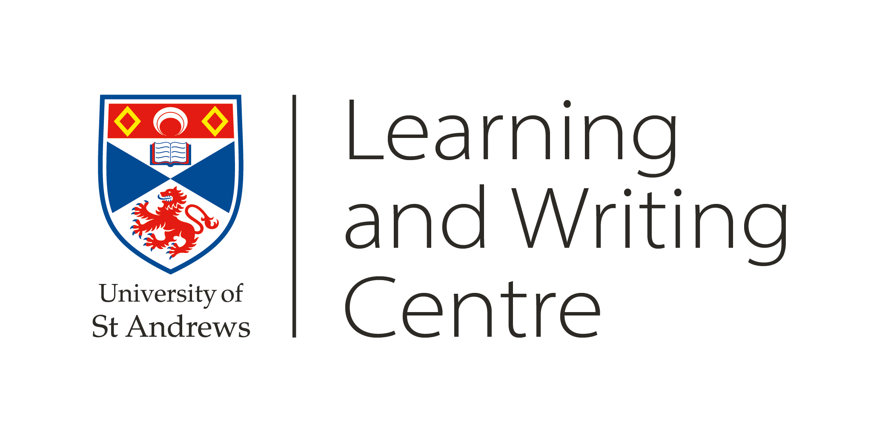
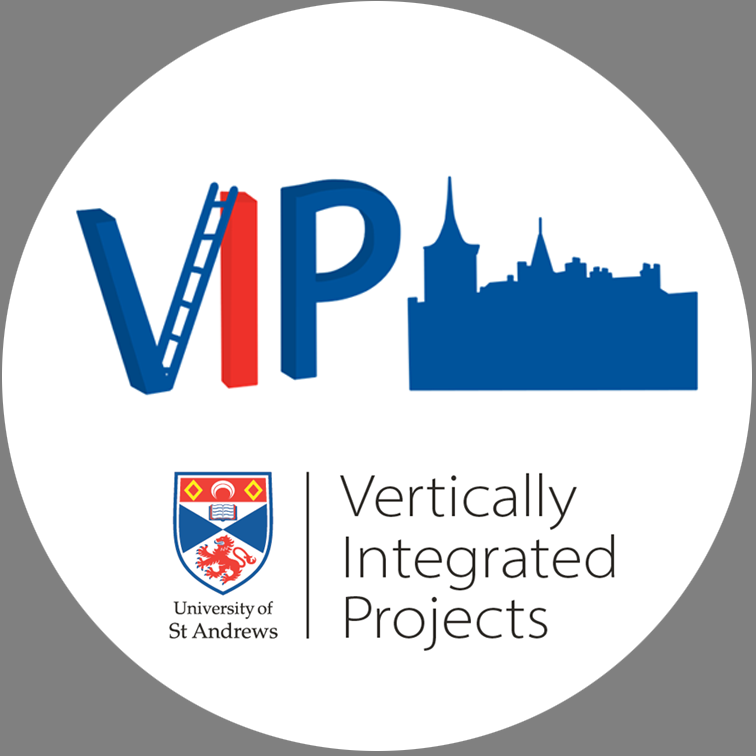
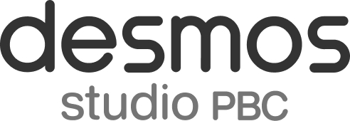

# Welcome!

Welcome to STARMAST, an accessible, inclusive, and free-to-use bank of online resources in mathematics and statistics made by University of St Andrews staff and students for any student of mathematics or statistics. Please see our [about page](about.qmd) if you would like to learn more about the project, or [our full index](fullindex.qmd) to dive in to **over 180 pages** of written resources! 

[**If you are on the Sutton Trust Summer School 2026, click this sentence to access the materials.**](suttontrust2026.qmd)

# Contents {-}

:::{#contents}
:::

# Latest news {-}

:::{#news}
:::

# Guide of the month {-}

:::{#gotm}
:::

<!-- [To see a full index of our materials, please click on this sentence.](fullindex.qmd) -->

<!-- ## Materials by type {-} -->

<!-- [To see only study guides, please click on this sentence.](studyguidelist.qmd) -->

<!-- [To see only question and answer sheets, please click on this sentence.](qalist.qmd) -->

<!-- [To see only fact sheets, please click on this sentence.](fslist.qmd) -->

<!-- [To see only proof sheets, please click on this sentence.](pslist.qmd) -->

<!-- For all materials by type, you can use the categories on the right hand side of the list to narrow your search. -->

## Other {-}

[Link to our about page](about.qmd)

[Link to our VIP page, containing all VIP resources](VIP.qmd)

[Link to our licensing information](license.qmd)

[Link to our cookie policy](cookies.qmd)

## Partners {-}

We are the recommended provider of central University of St Andrews maths and stats support resources, as directed by the Learning and Writing Centre at IELLI at St Andrews.

{width="75%" fig-alt="Logo of the Learning and Writing Centre at the University of St Andrews."}

We would not exist without the Summer Teams Enterprise Programme scheme, and particularly the Vertically Integrated Project scheme, both of which are run at the University of St Andrews.

{width="50%" fig-alt="Logo of the Vertically Integrated Project scheme at the University of St Andrews."}

Finally, we are delighted to have our interactive figures powered by [Desmos Studios PBC.](https://www.desmos.com/)

{fig-alt="Logo of Desmos Studios PBC."}

