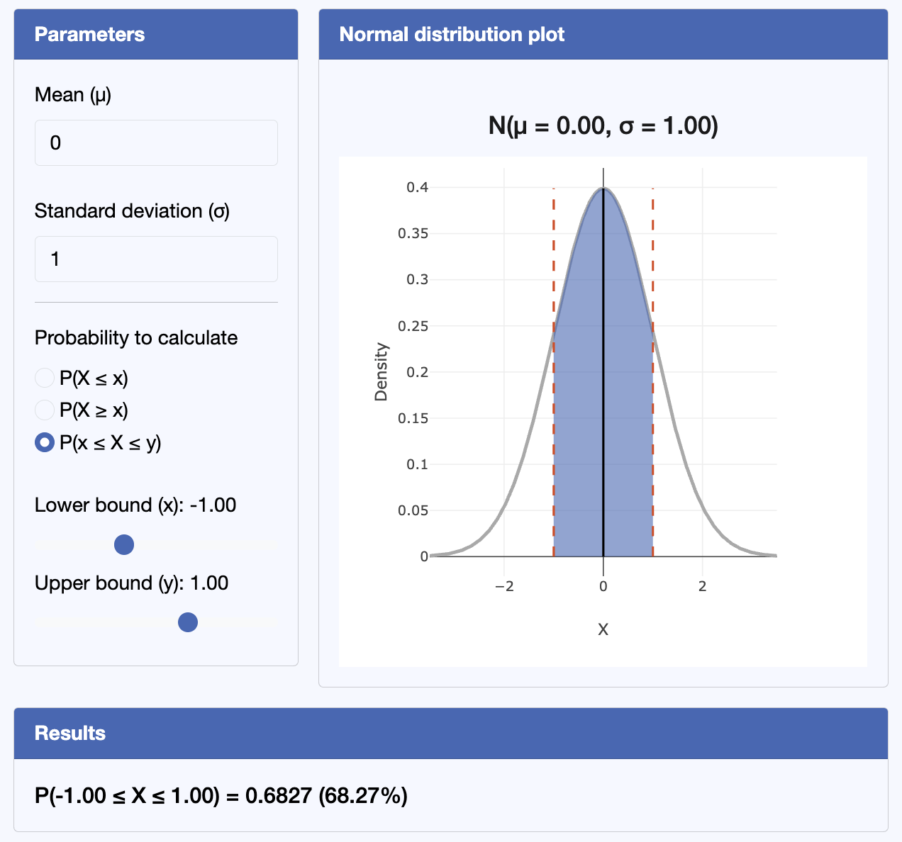

#### Update {-}

Through various updates to R Shinylive, which is the package that powers our interactive statistical figures, the majority of the figures (particularly those involving plots) are now broken on the website.

This has been caused by updates not on our end. I (tdhc) have had a painful few days discovering the problem ([in the middle of a national conference!](../VIP2526/AccessibleHTMLJun26.qmd)) and trying to fix the error. Ultimately, even after a full un- and re-installation of all of my R packages and machinery, this was all in vain.

However, shinylive did have its issues outside of its finicky set-up; primarily, the long, long loading times were not great in these interactive figures in this day and age. I have therefore begun the process of replacing these with a more robust html + Javascript setup. You can see the differences for yourself in the following images:

{width="70%" fig-alt="Static version of an interactive normal distribution figure"}

{width="70%" fig-alt="Static version of an interactive normal distribution figure"}

Currently, I have updated the following three resources:

- [Factsheet: Normal distribution](../factsheets/f-normaldist.qmd)
- [Factsheet: Beta distribution](../factsheets/f-betadist.qmd)
- [Calculator: $t$-testing](../apps/calculators/c-ttesting.qmd)

and will work on the rest over the summer, along with the fantastic new resources from the 2025/26 S2 VIP crew. Please stay tuned for more :)

#### Version history {-}

- v1.0 initial version written by tdhc 11/06/26.

---