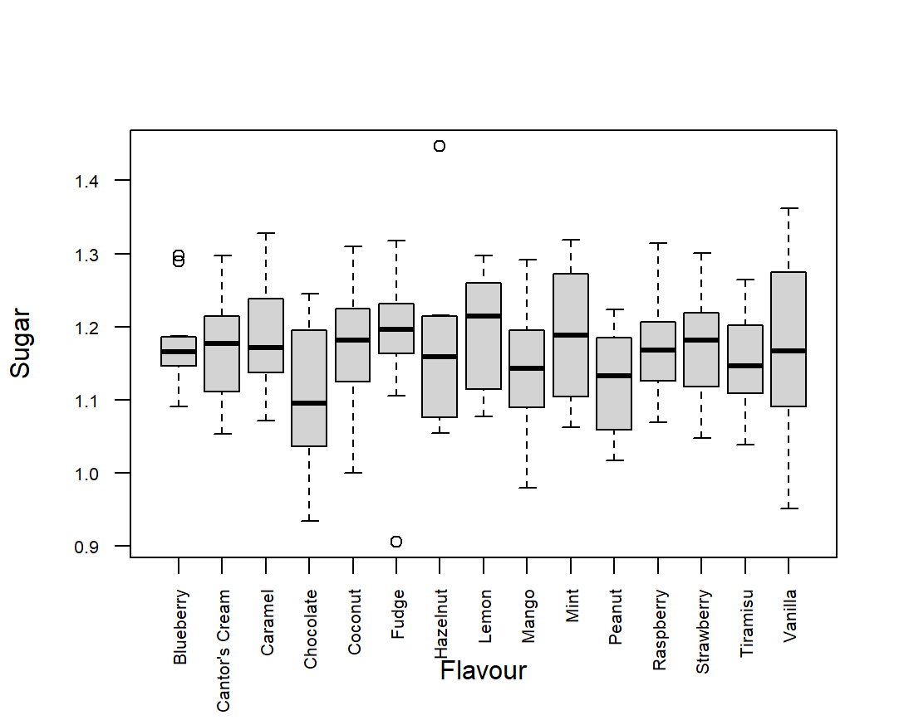

```{r, setup, include = FALSE}
library("webexercises")
```

*Before reading this guide, it is recommended that you read [Guide: Introduction to hypothesis testing](hypothesistesting.qmd), [Guide: Confidence intervals](confidenceintervals.qmd), [Fact sheet: The F distribution](../factsheets/f-fdist.qmd), and [Guide: Introduction to t-testing](t-testing.qmd).*

# What is ANOVA? {.unnumbered}

ANOVA, short for **AN**alysis **O**f **VA**riance is a statistical technique, that is used to identify whether the means among groups of data differ or are the same (or whether the differences in sample means are meaningful, or due to random variation). In this process you compare the variances of two (or more) groups, to assess if their means are the same. Specifically, an ANOVA test will indicate if one group mean is different from at least one other group mean. To do that, an $F$-test (based on the [the F distribution](../factsheets/f-fdist.qmd)) is used, which compares the variances within the groups to those between them. To determine, which group means are different, pair-wise comparisons have to be further considered (look at: [Factsheet: Family-wise error](../factsheets/f-familywiseerror.qmd)).

This guide explains the concept of the analysis of variance and how it differs from other methods of comparing two data groups, namely $t$-tests. It will explain how to conduct the $F$ test, perform one-way and two-way ANOVA analysis, and interpret ANOVA tables. It also contains an ANOVA calculator.

## Why do you want to be doing this?

The reason why ANOVA (and any other hypothesis test) is useful is the uncertainty which comes from using samples. Similarly to a $t$-test, ANOVA checks for the equality of means between samples. If you have the access to target populations from which these samples come, then you can directly compare the values of means by looking at them and assessing.

Sampling brings the element of uncertainty about the true values of parameters  within the target population, which ANOVA helps quantify.

## When and why choose ANOVA rather than t-tests?

The motivation to use ANOVA rather than a $t$-test is both pragmatic and statistical. The pragmatic part comes from the amount of paired $t$-tests you are required to conduct, to determine if any of the means between the groups you are considering are different. For example, with three groups you would need to conduct three tests. However, the number of necessary $t$-tests rises significantly, as for $4$ groups you already need $6$ tests. 

In general, the number of pairs (which amount to tests) is defined by the binomial formula for the number of possible combinations, with $n$ being the number of groups of interest:

$$\binom{n}{2} = \frac{n!}{2!(n-2)!}$$

The statistical motivation also comes from the rising amount of tests required. Every $t$-test has a fixed confidence level - for example a $t$-test with the significance level of $0.05$, when repeated six times for six pairs doesn't have the associated level of $95\%$ confidence, but rather 

$1 - (0.05 \cdot 6) = 0.7$$ 

which makes the confidence level now equal to $70\%$. This is because you're using all the test outcomes to make your inferences.

For example, if you conclude after six $t$-tests that only one mean differs out of the four, because three tests indicated so, then you're still using the results of the tests which did not indicate any differences.

In other words, regardless of your conclusions, your statistical certainty decreases from $95\%$ in the case of one $t$ test to $70\%$ in the case of six $t$ tests. This makes $t$-test an unpractical tool when dealing with more than two groups and is the reason for the usefulness of ANOVA.

::: callout-tip
Always make sure that you're using the right statistical method to solve your problem. 

If you're comparing only two groups' means, then $t$-tests are the suggested tool to do so. 

If, however, you happen to need to compare three or more groups, then the correct approach would be to use ANOVA.
:::

::: {.callout-note appearance="simple"}
## Example 1

Cantor's Confectionery wants to claim that all of their ice-cream flavours have the same sugar content. That's because, the owner - Mr.Cantor wishes to promote his business by stating that in his confectionery clients make their choices purely by based on their taste, and not on considerations for their diet. 

To that end, he selects a random batch of all of his ice-cream flavours and sends them to a laboratory to thoroughly measure the sugar content of each sample. 

Having obtained the data, Cantor recognizes that these are only samples of the broader population of all of his ice cream, hence statistical analysis is necessary.

Therefore, he employs a statistician, who will check if the advertising slogan he aims to adopt is grounded in data. 

If Cantor sampled only two flavours, then the statistician could use a $t$-test (he does not know the true population means, look at: [Guide: Introduction to t-test](t-testing.qmd)) to check the hypothesis for no differences between the mean sugar content among flavours. 

However, in reality, Cantor proudly offers 15 flavours (including: chocolate, vanilla, tiramisu, strawberry, and signature Cantor's Cream among others), so he would need to run:

$$\binom{15}{2} = \frac{15!}{2!(15-2)!}=105$$

repeated $t$-tests. 

Needless to say, the cumulative confidence level would go well below $0$ ($1 - (105\cdot 0.05) = -4.25$), and that's only for one batch of ice cream! 

Not wanting to test at a $-425\%$ confidence level, the statistician decides to adopt the Analysis of Variance.
:::

## Why choose ANOVA over a visual check?

It might be tempting to only compare the sample means visually to be able to "more or less" decide if the means are the same or not. The following example illustrate why such thinking might be misleading.

::: {.callout-note appearance="simple"}
## Example 2

Assume that Cantor's statistician obtains the raw data and then computes the mean sugar content for all the $15$ flavours across $12$ weeks of data collection, he subsequently tallies them into a table in an alphabetical order:

| Flavour        | Mean sugar content (kilograms) |
|:---------------|:------------------------------:|
| Blueberry      |            $1.176$             |
| Cantor's Cream |            $1.167$             |
| Caramel        |            $1.183$             |
| Chocolate      |            $1.109$             |
| Coconut        |            $1.166$             |
| Fudge          |            $1.178$             |
| Hazelnut       |            $1.168$             |
| Lemon          |            $1.194$             |
| Mango          |            $1.144$             |
| Mint           |            $1.194$             |
| Peanut         |            $1.126$             |
| Raspberry      |            $1.175$             |
| Strawberry     |            $1.172$             |
| Tiramisu       |            $1.151$             |
| Vanilla        |            $1.166$             |

: {tbl-colwidths="\[15,15\]"}

The sample means look rather similar, you might think, however upon visual inspection:



you can see that deciding visually which means are equal and which not, might be unachievable - a formal (quantitative) indicator of the equality of means is necessary. This is the function that ANOVA serves.

:::

## What are the types of ANOVA?

There are many different types of ANOVA used for different purposes (a short list is provided at the end of this guide). 
This guide covers the most widely used type of ANOVA - one-way ANOVA (referred to as ANOVA for conciseness), however there are many extensions of this method, which are covered in [Guide: Further ANOVAs](further-anovas.qmd).

# How to use ANOVA? {.unnumbered}

ANOVA, as $Z$ or $t$-test, is a type of a **hypothesis test**. Therefore, to conduct it, first, you have to establish the null and alternative hypothesis. 

For example, when considering three groups the null and alternative hypotheses are:

**Null hypothesis:** $H_0:\mu_A=\mu_B=\mu_C$

so all the means are the same;

**Alternative hypothesis:** at least one of the means is different from the rest (for instance: $H_1: \mu_A\neq \mu_B = \mu_C$).

If $H_0$ is true, then the group means are the same and the differences between them are due to sampling variation. Conversely, if $H_1$ is true then there is a meaningful difference between at least two means. 

This is the reason why ANOVA is testing for differences in variance (within and between groups), rather than means themselves. In other words, the test compares the variabilities of groups themselves with those between them, to establish if differences in means are a result of sampling variation or actual difference between means.

::: callout-tip
ANOVA conventionally tests at $95\%$ confidence level. So the output you get in statistical software like R or in STARMAST's ANOVA calculator will be calculated at $95\%$ confidence level.
:::

## The underlying assumptions for ANOVA {.unnumbered}

Before using the $F$ test, you have to ensure that the groups meet three assumptions, for the test to be statistically valid:

1.  **Normality:** you assume, that the data points from each groups come from a normal distribution.
2.  **Similar variance:** you assume, that all the groups of interest appear to have similar variances.
3.  **Independence:** you assume, that the data points are independent (that is, don't influence) of each other.

::: {.callout-note appearance="simple"}
## Example 3

Continuing with the previous example Cantor's decides to assess the validity of ANOVA for his investigation into the mean sugar content of his ice cream. He asks his statistician to briefly evaluate the assumption for the use of ANOVA in this case. The statistician produces the following report:

-   **Normality:** as batches of ice cream are quite large in size ($150$ liters) and there are a handful of random processes associated with their production (not everything is in control of the ice cream maker). Due to these random processes, the statistician thinks that normality is valid.
-   **Similar variance:** even if there is a degree of randomness to certain processes in ice cream making, Cantor Confectionery's ice cream production method remains fixed, therefore you can expect a similar variance in every batch, as the variation depends on random (normally distributed) processes, rather than the differing production method. Therefore, the Statistician considers the assumption of similar variance to be valid.
-   **Independence:** while data measured over time will never be perfectly independent, to ensure the independence of the batches of ice cream, following the statistician's advice Cantor decided to pick a random batch from $12$ different weeks of production across a whole year. This way the statistician concludes that the data is independent of each other.
:::

::: callout-important
## ANOVA and independence

ANOVA can accept departures from normality and differences in variances, but independence is a crucial assumption which your data has to satisfy.

This is because related data points can provide inaccurate variance, due to containing less unique information, which distort the actual error rates. 

This can considerably weaken your ability to make statistically significant inferences.
:::

## How to check for ANOVA's assumptions?

Apart from scrutinising the methods of the data collection and the nature of the data themselves, you can use these quantitative methods to check if ANOVA's assumptions are not violated:

-   To check for normality you can use **Q**uantile-**Q**uantile ($Q-Q$) plots, which provide you with a visual tool to assess normality. You could also use the Shapiro-Wilk test to formally assess normality.
-   To check for the differences in variances, you need to compare the variances from the groups to the ones from the $F$ distribution with the same degrees of freedom. To that end, use Levene Test, which you interpret as you would a $t$-test.
-   To check for independence you can formally use the Durbin-Watson Test or scrutinize the methods of data collection themselves.

## The $f$ test statistic for ANOVA

ANOVA is based on the $F$ test, which uses the $f$-test statistic defined as:

::: callout-note
## Definition of the $f$ test statistic

$$f_0 = \frac{s^2_G}{s^2_W}$$

where:

-   $s^2_G$ is the mean sum of squares between the groups

-   $s^2_W$ is the mean sum of squares within the groups
:::

More specifically:

The mean sum of squares between the groups, $s^2_G$, is the difference between each group mean and their collective mean, weighed by the number of groups subtracted by one (degrees of freedom). You calculate this using the mean sum of squares between the groups divided by the associated degrees of freedom:

$$s^2_G = \frac{\sum_{i=1}^{k} n_i(x_i - x)^2}{k-1} = \frac{SSQ_G}{k-1}$$

where:

-   $k$ is the number of groups and $k-1$ represents the degrees of freedom (as in the F distribution).

-   $n_i$ is the sample size of group $i$.

-   $x_i$ is the sample mean of group $i$.

-   $x$ is the collective sample mean across groups.

-   $k$ is the number of groups and $k-1$ represents the degrees of freedom (as in the F distribution).

-   $SSQ_G$ is the mean sum of squares between the groups (short notation for the sum in the numerator).

The mean sum of squares within the groups, $s^2_W$, is the variability within the groups themselves. It's weighed by summing the number of all data points across the groups, subtracted by the number of groups (the second degrees of freedom). You calculate it using the sum of squares within the groups divided by the associated degrees of freedom:

$$s^2_W = \frac{\sum_{i=1}^{k} (n_i -1)s^2_i}{n_s - k} = \frac{SSQ_W}{n_s - k}$$

where:

-   $n_i$ is the sample size of group i.

-   $s^2_i$ is the sample variance for group $i$.

-   $n_s$ is the sum of all the number of data points in each group.

-   $k$ is the number of groups.

-   $SSQ_W$ is the mean sum of squares (shorthand for the numerator).

## The logic behind the $F$-test:

If $H_0$ is true, then $f_0$ should be small, as the differences between groups should be small in comparison with the differences within groups.

In other words: $s^2_G << s^2_W$, if $H_0$ true.

If the $F$-test statistic is small, then the differences between groups are small, when compared with those within groups. Therefore, you can conclude that the differences in means come from the variability within the groups themselves, rather than meaningful differences between them.

Your reference point for the test statistic is the $F$ distribution. In particular the $F$-distribution with $(n-k, k-1)$ degrees of freedom, with $n$ and $k$ being the number of data points and the number of groups respectively, that is:
$$F_{1- \frac{\alpha}{2}; df_1 = n-1, df_2 = k-1}$$ 
where $1 - \alpha$ is your confidence level (conventionally $95\%$ for ANOVA).

If your $f_0$ is greater than the reference value from the $F$ distribution, then you have a low probability of observing the value of your test statistic.

Therefore, you will reject the null hypothesis ($H_0$) because the probability of obtaining the $F$-test statistic in the distribution is lower than your confidence level.

Conversely, if your $f_0$ is smaller than the reference value from the $F$ distribution, then you have a high probability of observing the value of your test statistic. Most importantly, the value is higher than your 

You can more formally quantify the probability of obtaining the $F$-test statistic using the ANOVA calculator provided below. $p$-value is the reference point for the probability of obtaining the $F$-test statistic.

:::callout-tip
- If $p < \alpha$, then you **reject** the null hypothesis ($H_0$).
- If $p > \alpha$, then you **fail to reject** the null hypothesis ($H_0$).
:::

:::{.callout-note appearance="simple"} 
## Example 4:

Having validated the assumptions for the use of ANOVA, Cantor produces multiple batches of his 15 ice cream flavours. He sends the batches to a lab to measure the sugar content of each flavour in each batch. Having obtained this data, his statistician calculates the mean sugar content levels, and then uses ANOVA to determine whether the mean sugar level differs significantly between flavours.

The statistician then obtains the mean sum of squares between the groups:

$$s^2_G = 0.006577$$ 

and the mean sum of squares within the groups: 

$$s^2_W = 0.007572$$ 

Subsequently, they calculate the $F$-test statistic:

$$f_0 = \frac{s^2_G}{s^2_W} = \frac{0.006577}{0.007572} = 0.869$$ 

They now notice that the $F$ test statistic isn't large. Nevertheless, now they needs to compare it with the $F$ distribution.

They also notice that the $F$-test statistics follows the $F$ distribution: $f_0 \sim F(14, 165)$, whose $97.5\%$ quantile is: 
$$F_{0.975; df_1 = 14, df_2 = 165} = 1.946448$$ 
which is noticeably higher than the obtained $0.869$.

Therefore, they fail to reject the null hypothesis ($H_0$) and conclude at $95\%$ confidence level that the mean sugar content across all flavour's in Cantor's Confectionery is in fact the same, and that the differences in means are due to (sampling) variation.
:::

## Conducting the F test {.unnumbered}

To conduct an $F$ test, it is best to compile an ANOVA table to summarize your data to then compare your $F$ test statistic against the $F$ distribution.

The structure of an ANOVA table is as follows:

| Source of variation | Degrees of freedom (df) | Sum of squares | Mean sum of squares | $F$ test statistic value |
|:--------------|:-------------:|:-------------:|:-------------:|:-------------:|
| Between the groups | $k-1$ | $SSQ_G$ | $s^2_G$ | $f_0$ |
| Residuals | $n_s - k$ | $SSQ_W$ | $s^2_W$ | ––– |
| Total | $n_s - 1$ | --- | --- | --- |

: {tbl-colwidths="\[15,15,15,15,15\]"}

where:

- $n_s$ is the number of data points across all groups.

While not a necessary step - the table contains all the statistics necessary to calculate the $f_0$, as well as the test statistics. 

Therefore you might want to store all the data in one place, to inform your analysis and make it more intuitive.

::: {.callout-note appearance="simple"}
## Example 5:

Continuing his analysis from the last example having conducted the ANOVA analysis Mr. Cantor's statistician decides to compile his findings into a concise ANOVA table:

| Source of variation | Degrees of freedom (df) | Sum of squares | Mean sum of squares | $F$ test statistic value |
|:--------------|:-------------:|:-------------:|:-------------:|:-------------:|
| Between the groups | $14$ | $0.0921$ | $0.006577$ | $0.869$ |
| Residuals | $165$ | $1.2494$ | $0.007572$ | ––– |
| Total | $179$ | --- | --- | --- |

: {tbl-colwidths="\[15,15,15,15,15\]"}

As a result the statistician can now present their findings concisely in a report.

This is especially practical, if the Confectionery's advert about the mean sugar content in their ice cream requires formal backing in evidence.

:::

# ANOVA calculator

Due to computational heaviness of ANOVA you shouldn't do it by hand, especially if your samples are large. Therefore, you use computers in order to carry out the necessary calculations. Particularly, R and Stata are examples of software you can use to carry out ANOVA analysis. 
However, we at STARMAST ensure that our guides are self-contained environments, and so below you can find an interactive ANOVA calculator, allowing you to conduct one-way ANOVA analysis by filling in the necessary statistics so that you can run the analysis:

```{shinylive-r}
#| standalone: true
#| viewerHeight: 800
library(shiny)
library(bslib)

ui <- page_sidebar(
  title = "ANOVA Calculator",
  sidebar = sidebar(
    numericInput("n_groups", "Number of Groups", value = 3, min = 2, max = 10),
    actionButton("update_inputs", "Update Input Fields", class = "btn-primary mt-2"),
    hr(),
    uiOutput("group_inputs"),
    actionButton("calculate", "Calculate ANOVA", class = "btn-success mt-3")
  ),
  card(
    card_header("ANOVA Results"),
    verbatimTextOutput("anova_results")
  ),
  card(
    card_header("Summary Statistics"),
    tableOutput("summary_table")
  ),
  layout_columns(
    col_widths = c(6, 6),
    card(
      card_header("Group Means Plot"),
      plotOutput("means_plot")
    ),
    card(
      card_header("Distribution Plot"),
      plotOutput("distribution_plot")
    )
  ),
  card(
    card_header("Suggested Interpretation"),
    uiOutput("interpretation")
  )
)

server <- function(input, output, session) {
  
  # Generate dynamic inputs for each group
  output$group_inputs <- renderUI({
    req(input$update_inputs)
    n_groups <- isolate(input$n_groups)
    
    lapply(1:n_groups, function(i) {
      tagList(
        h5(paste("Group", i)),
        numericInput(paste0("mean_", i), "Mean:", value = 50, step = 0.1),
        numericInput(paste0("n_", i), "Sample Size:", value = 10, min = 2),
        numericInput(paste0("sd_", i), "Standard Deviation:", value = 5, min = 0.01, step = 0.1),
        hr()
      )
    })
  })
  
  # Calculate ANOVA when button is clicked
  anova_data <- eventReactive(input$calculate, {
    n_groups <- input$n_groups
    
    # Collect data from inputs
    means <- numeric(n_groups)
    sample_sizes <- numeric(n_groups)
    sds <- numeric(n_groups)
    
    for (i in 1:n_groups) {
      means[i] <- input[[paste0("mean_", i)]]
      sample_sizes[i] <- input[[paste0("n_", i)]]
      sds[i] <- input[[paste0("sd_", i)]]
    }
    
    # Validate inputs
    if (any(is.na(means)) || any(is.na(sample_sizes)) || any(is.na(sds))) {
      return(NULL)
    }
    
    # Calculate ANOVA from summary statistics
    N <- sum(sample_sizes)
    k <- n_groups
    grand_mean <- sum(means * sample_sizes) / N
    SS_between <- sum(sample_sizes * (means - grand_mean)^2)
    SS_within <- sum((sample_sizes - 1) * sds^2)
    SS_total <- SS_between + SS_within
    df_between <- k - 1
    df_within <- N - k
    df_total <- N - 1
    MS_between <- SS_between / df_between
    MS_within <- SS_within / df_within
    F_stat <- MS_between / MS_within
    p_value <- pf(F_stat, df_between, df_within, lower.tail = FALSE)
    
    list(
      means = means,
      sample_sizes = sample_sizes,
      sds = sds,
      N = N,
      k = k,
      grand_mean = grand_mean,
      SS_between = SS_between,
      SS_within = SS_within,
      SS_total = SS_total,
      df_between = df_between,
      df_within = df_within,
      df_total = df_total,
      MS_between = MS_between,
      MS_within = MS_within,
      F_stat = F_stat,
      p_value = p_value
    )
  })
  
  # Display ANOVA table
  output$anova_results <- renderPrint({
    data <- anova_data()
    req(data)
    
    cat("ANOVA Table\n")
    cat("===========================================================\n")
    cat(sprintf("%-20s %10s %10s %12s %12s\n", "Source", "df", "SS", "MS", "F"))
    cat("-----------------------------------------------------------\n")
    cat(sprintf("%-20s %10d %10.4f %12.4f %12.4f\n", 
                "Between Groups", data$df_between, data$SS_between, 
                data$MS_between, data$F_stat))
    cat(sprintf("%-20s %10d %10.4f %12.4f\n", 
                "Within Groups", data$df_within, data$SS_within, data$MS_within))
    cat(sprintf("%-20s %10d %10.4f\n", 
                "Total", data$df_total, data$SS_total))
    cat("===========================================================\n\n")
    cat(sprintf("F-statistic: %.4f\n", data$F_stat))
    cat(sprintf("p-value: %.6f\n", data$p_value))
    cat(sprintf("Significance level: %s\n", 
                ifelse(data$p_value < 0.001, "p < 0.001 ***",
                       ifelse(data$p_value < 0.01, "p < 0.01 **",
                              ifelse(data$p_value < 0.05, "p < 0.05 *",
                                     "Not significant")))))
  })
  
  # Display summary statistics table
  output$summary_table <- renderTable({
    data <- anova_data()
    req(data)
    
    data.frame(
      Group = paste("Group", 1:data$k),
      Mean = round(data$means, 3),
      SD = round(data$sds, 3),
      N = data$sample_sizes
    )
  }, striped = TRUE, hover = TRUE)
  
  # Plot group means with error bars (base R, no color coding)
  output$means_plot <- renderPlot({
    data <- anova_data()
    req(data)
    
    se <- data$sds / sqrt(data$sample_sizes)
    
    par(mar = c(5, 5, 4, 2))
    bp <- barplot(data$means, names.arg = paste("Group", 1:data$k),
                  col = "lightgray", ylim = c(0, max(data$means + se) * 1.2),
                  ylab = "Mean Value", xlab = "Group",
                  main = "Group Means with Standard Error Bars", 
                  cex.main = 1.2, cex.lab = 1.1, border = "black")
    
    arrows(bp, data$means - se, bp, data$means + se,
           angle = 90, code = 3, length = 0.1, lwd = 2)
    
    abline(h = data$grand_mean, col = "black", lty = 2, lwd = 2)
    text(max(bp), data$grand_mean, 
         labels = paste("Grand Mean =", round(data$grand_mean, 2)),
         pos = 3, col = "black", cex = 1.1)
  })
  
  # Plot distributions (base R, no color coding)
  output$distribution_plot <- renderPlot({
    data <- anova_data()
    req(data)
    
    # Generate simulated data
    all_data <- list()
    for (i in 1:data$k) {
      all_data[[i]] <- rnorm(data$sample_sizes[i], data$means[i], data$sds[i])
    }
    
    par(mar = c(5, 5, 4, 2))
    boxplot(all_data, names = paste("Group", 1:data$k),
            col = "lightgray", ylab = "Value", xlab = "Group",
            main = "Distribution of Values by Group",
            cex.main = 1.2, cex.lab = 1.1, pch = 16, border = "black")
    
    # Add individual points
    for (i in 1:data$k) {
      points(jitter(rep(i, length(all_data[[i]])), amount = 0.1), 
             all_data[[i]], pch = 16, col = rgb(0, 0, 0, 0.3), cex = 0.8)
    }
    
    mtext("Note: Data points are simulated from the summary statistics", 
          side = 1, line = 4, cex = 0.9, font = 3)
  })
  
  # Display interpretation
  output$interpretation <- renderUI({
    data <- anova_data()
    req(data)
    
    if (data$p_value < 0.05) {
      tagList(
        p(strong("Conclusion:"), "There is a statistically significant difference between the group means 
          (F(", data$df_between, ", ", data$df_within, ") = ", round(data$F_stat, 3), 
          ", p = ", format.pval(data$p_value, digits = 3), ")."),
        p("This suggests that at least one group mean is significantly different from the others.")
      )
    } else {
      tagList(
        p(strong("Conclusion:"), "There is no statistically significant difference between the group means 
          (F(", data$df_between, ", ", data$df_within, ") = ", round(data$F_stat, 3), 
          ", p = ", format.pval(data$p_value, digits = 3), ")."),
        p("The data does not provide sufficient evidence to conclude that the group means differ.")
      )
    }
  })
}

shinyApp(ui, server)
```

**To use the ANOVA calculator follow these instructions:**

1.  Enter the number of groups you want to compare (minimum 3, otherwise use a $t / z$-test).
2.  Enter their respective means ($\mu$), sample sizes, and standard deviations ($\sigma$).
3.  Click **Calculate ANOVA.**
4.  Inspect the figures in the ANOVA table, take a look at the graphs provided, and finally read the interpretation of the test to see what conclusion the test brings.

::: callout-tip
## p-value in the ANOVA calculator
The ANOVA calculator also provides you with the exact $p$-value for the test statistic, which indicates how likely it is to obtain the test statistic from the reference $F$ distribution.
As ANOVA conventionally tests at $95\%$ confidence level, then your rule for interpreting the results of the $F$ test is as follows:

- If your $p$-value is less than $0.05$ then you reject the null hypothesis ($H_0$) and you can suggest that the means of the groups are in fact different. 
- If your $p$-value is higher than $0.05$, then you fail to reject the null hypothesis ($H_0$) and you can suggest that the means of groups are in fact the same, and the variation is caused by the variation within the groups themselves.
:::

::: {.callout-note appearance="simple"}
## Example 6:

The statistician decides to directly obtain the $p$-value of obtaining the $f_0 =0.869$ in the reference $F$ distribution ($F_{0.975; df_1 = 14, df_2 = 165}$) to complete the report for Confectionery.
Using the ANOVA calculator they obtain the $p$-value of:
$$p = 0.5935061$$
which is far higher than $0.05$ and so now they fail to reject the null hypothesis ($H_0$) and conclude that at $95\%$ confidence level there is no meaningful difference between the mean sugar content in Cantor's Confectionery ice cream.

Having proved his intuition statistically, Mr. Cantor now can advertise his Confectionery's ice cream as having the same sugar content across all the flavours.

This means that his customers can choose the ice cream flavour without worrying about the sugar content!

:::


<!---#
This is setup for a randomized block design (a type of two-way ANOVA), which I intended to be a part of the guide, but as it's not a two-way ANOVA itself, and I don't feel confident explaining it in the guide (it would also make the guide far longer than it is now), I decided to put it in the comments. Might be useful for further ANOVA guide:


# Two-way ANOVA

The ANOVA tests you conducted so far were based on one parameter within the data that differs. For example: the sugar content of ice cream in Cantor's Confectionery, which was the subject of the examples so far in this guide. 
However, the differences in the parameter for which you're checking in one-way ANOVA could be explained by other parameters contained within the data. For example: the mean sugar content might differ because of the proportions of different sugar types used in making different flavours).
To account for the variability coming from these variables you can adopt **two-way ANOVA** analysis using randomized block design. This method checks for the influence of **one discrete** parameter within the data, which could account for the variance in means.
As these factors are discrete, they allow you to split the groups into distinct categories.

::: {.callout-note appearance="simple"}
## Example 1

For example, continuing Mr. Cantor's work in researching the sugar content of Confectionery's ice cream, Mrs. Cantor wishes to expand her husbands' analysis. She believes that additional aspects of the ice cream production have to be analysed to ensure that the mean sugar content is in fact similar across all ice cream flavours.
She is advised by the Confectionery's statistician to use two-way ANOVA with randomized blocked design to check for one **discrete** parameters that could influence the mean sugar content of the ice cream.
The category into which Mrs. Cantor decides to split the Confectionery's ice cream is based on the ingredients that are used during the ice cream's production. 
Certain flavours are produced only with local sourced ingredients, while some of them require imported ones. She conjectures that the imported ingredients might result in a different sugar content in certain flavours. 
This gives rise to one factor with two blocks:

1.  **Block 1:** Cantor's Cream, Hazelnut, Fudge, Mint, Caramel, Peanut
2.  **Block 2:** Coconut, Tiramisu, Lemon, Vanilla, Chocolate, Raspberry, Strawberry, Blueberry, Mango

:::

## Two-way ANOVA table

The structure of a two-way ANOVA table is the following:

| Source of variation | Degrees of freedom (df) | Sum of squares | Mean sum of squares | $F$ test statistic value |
|:--------------|:-------------:|:-------------:|:-------------:|:-------------:|
| Between the groups | $k-1$ | $SSQ_G$ | $s^2_G$ | $f_0$ |
| Between the blocks | $b-1$ | $SSQ_B$ | $s^2_B$ | $f_B$ |
| Residuals | $(k-1)(l-1)$ | $SSQ_W$ | $s^2_W$ | ––– |
| Total | $n_s - 1$ | --- | --- | --- |

: {tbl-colwidths="\[15,15,15,15,15\]"}

The structure is analogous to the one-way ANOVA table, although this time there is an additional row representing the number of blocks chosen and there is $(b-1)$ times more residuals (accounting for the number of blocks). The sum mean sum of squares is defined by:

$$s^2_B = \frac{SSQ_B}{b-1}$$

where:


As well as a new $F$ test statistic for blocks - $f_B$, defined as:

$$f_B = \frac{s^2_B}{s^2_W}$$

## Conducting a two-way ANOVA analysis

Interpreting the two-way ANOVA table is similar to a one-way ANOVA table, though the main difference is the need to consider the discrete factors 
The reference $F$ distribution to compare the $F$ test statistic: $f_B$ is: 
$$F_{df = (b-1), (k-1)(l-1)}$$

::: {.callout-note appearance="simple"}
## Example 2

Having established these blocks Cantor's Confectionery's statistician compiles the two-way ANOVA table:

| Source of variation | Degrees of freedom (df) | Sum of squares | Mean sum of squares | $F$ test statistic value |
|:--------------|:-------------:|:-------------:|:-------------:|:-------------:|
| Between the groups | $k-1$ | $SSQ_G$ | $s^2_G$ | $f_0$ |
| Between the levels | $b-1$ | $SSQ_B$ | $s^2_B$ | $f_B$ |
| Residuals | $(k-1)(b-1)$ | $SSQ_W$ | $s^2_W$ | ––– |
| Total | $n_s - 1$ | --- | --- | --- |

: {tbl-colwidths="\[15,15,15,15,15\]"}
:::
-->

# Next steps after ANOVA analysis

After you conducted ANOVA hypothesis tests, you might want to expand your analysis beyond the analysis of variance. In particular, if your test indicates differences between the means in some groups, you might want to establish which group means are different from each other.

To do so you first need to reduce **the Family-wise** (covering a whole group of tests) Type I error rate to conduct $t$-tests with the desired degree of probability. Otherwise you risk conducting tests at low probability as described in the section on ANOVA and $t$-tests.

There are three main methods to reduce the Family-wise so: Bonferoni correction, Sidak correction, and Tukey's Honest Significant Difference (HSD) test. You can learn more about these in the [Factsheet: Family-wise Error](../factsheets/f-familywiseerror.qmd).

After you calculated the family-wise Type I error rate, then you can proceed with $t$-tests to determine which groups means are in fact different. 
These methods are known as **pairwise comparison** tests and are the most common type of analysis conducted after ANOVA.

## Application: ANOVA and linear regression

ANOVA can also be used to compare different models of linear regression. 

In particular it serves as an indicator of whether a nested (all the variables of one model are contained within the other) model would be preferable than the one you've been working on. This is because if an additional variable does not explain much of the remaining variation within the data to be explained, then its inclusion in the model might not be necessary.

As a result, you can use ANOVA to help you select the best regression model. 
To learn more about using ANOVA in linear regression read [Factsheet: ANOVA and linear regression](../factsheets/f-anova-and-regression.qmd)

## Non-parametric alternatives to ANOVA

If your data does not fulfill the assumptions of normality and similar variance you can adopt non-parametric methods, which work as handy alternatives to ANOVA.

In particular:

-   If your data is **not** normally distributed, but the groups nonetheless have **similar standard deviation** you can use Kruskal-Wallis test to perform the analysis. This test follows the [chi-squared](../factsheets/f-chisquareddist.qmd) ($\chi^2$) distribution.
-   If your data **does not** have similar variance you can use a modified version of ANOVA called Welch's ANOVA, although your data has to be **normally distributed**.

You can learn more about these two methods in this guide: [Non-parametric alternatives to ANOVA](non-parametric-anovas.qmd).

## Other types ANOVA

As mentioned previously there are other types of ANOVA, which are extension of the methods you learned about in this guide. The following is a short list providing you with quick summary of each other major type of ANOVA:

-  **Two-way ANOVA:** is an extension of one-way ANOVA, that examines the effects of two categorical (discrete) variables and their interaction on one continuous parameter of interest. Think of splitting the ice cream into two categories that might interact and then investigating these categories' effects on the mean sugar content.
-  **Factorial ANOVA:** is an extension of two-way ANOVA, that examines the effects of two (**or more**) categorical variables on a single continuous parameter of interest. Think of adding one more category to the Two-way ANOVA example above and then investigating how these three categories' interaction influences the mean sugar content.
-  **Repeated measures ANOVA:** is an extension of one-way ANOVA that similarly compares the group means, however it takes into account that some groups might be dependent. The most common use is data gathered over time while a change has been made that could potentially alter the value of the parameter. For example, think of Mr. Cantor changing the long-established recipe for the ice cream and then checking for the sugar content at different points in time before the adoption of the recipe, while it was being introduced, and after his employees' mastered it completely.
-  **MANOVA:** is the **M**ultivariate **AN**alysis **O**f **VA**riance, which is an extension of one-way ANOVA comparing the means of multiple continuous variables for three or more groups. Think of checking for other parameters in ice cream, like average sales, average time it takes to prepare them.
-  **ANCOVA:** is the **AN**alysis of **COVA**riance, which is a variant of ANOVA that apart from continuous and discrete variables adds a covariate which measures for the impact of other variables, whose effect you don't want to measure. For example, Mr. Cantor notices that his employees' productivity understandably decreases on days with higher temperature and higher sunlight, he thinks that this might result in the variation in sugar content - as on sunnier days the employees' might be less diligent, not following the ice cream recipe so closely.


If you want to learn more about these, please go to [Guide: Further ANOVAs](further-anovas.qmd).

# Quick check problems {.unnumbered}

:::: {.content-visible when-format="html"}

::: {.webex-check .webex-box data-topic="ITHT1"}

1. Are the following statements true or false?

(a) ANOVA test is interchangeable with a visual check for differences in means. `r torf(FALSE)`

(b) ANOVA is a type of a hypothesis test: `r torf(TRUE)`

(c) ANOVA checks for differences in means for three groups or more: `r torf(TRUE)`

(d) ANOVA is based on the $\chi^2$ (chi-squared) distribution: `r torf(FALSE)`

(e) There is only one type of ANOVA. `r torf(FALSE)`

(f) ANOVA **does not** indicate which group means are different from each other: `r torf(TRUE)`


2. Calculate the $F$-test statistic for $s^2_G = 6.3176$ and $s^2_W = 4.578903$. Provide the interpretation of the $F$-test statistic knowing that the relevant quantile of the $F$ distribution is: $1.607285$ ($f_0 \sim F_{0.95, 120, 55}$).

The $F$-test statistic is $f_0 =$ `r fitb(1.3797)` (provide your answer to four decimal places).

In this case you would reject the null hypothesis ($H_0$) `r torf(FALSE)`.


3. Input the following data of four groups into the ANOVA calculator:

| Sample size | Mean ($\bar{x}$) | Standard deviation ($\sigma$) | 
|:-----------:|:----------------:|:-----------------------------:|
|    $15$     |    $22.46435$    |           $4.638$             |
|    $27$     |    $19.52765$    |           $2.852$             |
|    $34$     |    $20.31442$    |           $3.166$             |
|    $21$     |    $25.60537$    |           $6.325$             |


: {tbl-colwidths="\[15,15,15,\]"}

What is the $F$-test statistic ($f_0$)? `r fitb(9.9106)`

What is the $p$-value for this data? `r fitb(0.00001)`

Is failing to reject the null hypothesis ($H_0$) the correct decision? `r torf(FALSE)`

4. Do you think you need to use [pairwise comparisons](../factsheets/f-familywiseerror.qmd) if the ANOVA test indicated no differences in means? `r torf(FALSE)`


<!--
Potential question material once the guide on checking the assumptions for statistical tests is ready (and is a pre-requisite for this guide):

1.  You want to use one-way ANOVA to compare the mean amount of a single flavour of ice cream across a batch of $15$ flavours in Cantor's Confectionery. Each batch of ice cream is prepared by the same team of employees on five consecutive days. Is your use of ANOVA justified, if not which assumption is violated?

(a) Yes, this is the correct method
(b) No, assumption of normality is violated.
(c) No, assumption of similar variance is violated.
(d) No, assumption of independence is violated.

Answer: `r mcq(c("a", "b", "c", answer="d"))`.
<!-- -->
:::

::::

# Further reading

-   [For more questions on the subject, please go to Questions: ANOVA](../questions/qs.anova.qmd)
-   [For more information on other types of ANOVA, please go to Guide: Further ANOVA types](further-anova.qmd)
-   [For more information on non-parametric alternatives to ANOVA, please go to Guide: Non-parametric alternatives to ANOVA](non-parametric-anovas.qmd)
- [For more information on the use of ANOVA in linear regression, please go to: Factsheet: ANOVA and linear regression](../factsheets/f-anova-and-regression.qmd)

 <!--# 
The full setup for the future guide on other ANOVA types.
 
Beyond one-way and randomized block design two-way ANOVA, as well as its parametric alternatives, there is a number of other ANOVA-based tools used for different purposes. Namely:


- **Two-way ANOVA:** is an extention of one-way ANOVA, that examines the effects of two categorical variables and their interaction on one continuous parameter of interest. For instance, think of Mrs. Cantor dividing the ice-cream based on the type of ingredients used and whether the ice-cream is fruit-based or non-fruit based. She reasonably infers that the sugar content can depend on the type of ingredeints used in different types of flavours in the Confectionery and similarly flavours like Chocolate or Tiramisu, which are non-fruit based can have higher sugar content than those like Blueberry or Lemon. In addition, these factors can interact with each other, as she notices that the type of ingredients used in fruit-based ice cream is different from the non-fruit ones and so an interaction between these two terms can influence the sugar content as well.
-   **Factorial ANOVA:** is an extension of two-way ANOVA, that examines the effects of two (or more) categorical independent variables on a single dependent variable. The categorical variables themselves can also have two or more levels. For instance, think of Mrs. Cantor dividing his ice-cream by the type of flavour (fruit/non-fruit based), its uniqueness (unique/non-unique to Cantor's confectionery), and colour (bright coloured / dark coloured). If she would like to run tests to compare the mean sugar content and how these groups might affect it, then her statistician will adopt Factorial ANOVA.
-   **Repeated measures ANOVA:** is an extension of one-way ANOVA, that compares the means of three (or more) groups related groups. The main difference from the one-way ANOVA is that Repeated measures ANOVA compares the groups that are dependent. Therefore, its most common use is comparing the mean of the parameter of interest at different points in time, while a change has been made, that could potentially change its value. For instance, think of Mrs. Cantor making changes to his long-established ice cream recipe, while maintaining that the sugar content of his ice-cream will remain unchanged. Nevertheless, he conjectures that it will take his employees time to properly master the new recipe, so he admits that the sugar content of a batch of ice-cream produced one week after its adoption could be different from the content two months after its introduction, as then the personnel will be much more familiar with it. In short, Cantor wants to test for the sugar content a month before the new recipe's introduction, a week after it was introduced, and a month after its adoption - therefore his statistician will use repeated measures ANOVA.
-   **MANOVA (Multivariate Analysis of Variance):** is a variant of ANOVA comparing the means of multiple continuous independent variables for three or more groups. For example, Mrs. Cantor might want to expand his analysis beyond examining the sugar content and account for other parameters like different types of sugar that the ice cream uses, or the average content of other parameters within the ice cream (for example milk), which can impact the final structure of the ice cream.
-   **ANCOVA (Analysis of Covariance):** is a variant of ANOVA that apart from continuous and discrete variables adds a covariate which measures for the impact of other variables, whose effect you don't want to measure. For instance, Mrs. Cantor notices that the productivity and diligence of her employees understandably decreases on days with higher temperature and higher rate of sunshine. Therefore, she thinks that the sugar content in the ice cream batches might vary naturally, as on days with higher temperature her employees are more likely to mix up the proportions of ingredients. As a result, Mrs. Cantor decides to use ANCOVA to count in that variation. -->

# Version history {.unnumbered}

v1.0: initial version created 04/26 by Jakub Brzozowski as a part of a University of St Andrews VIP project.

[This work is licensed under CC BY-NC-SA 4.0.](https://creativecommons.org/licenses/by-nc-sa/4.0/?ref=chooser-v1)
