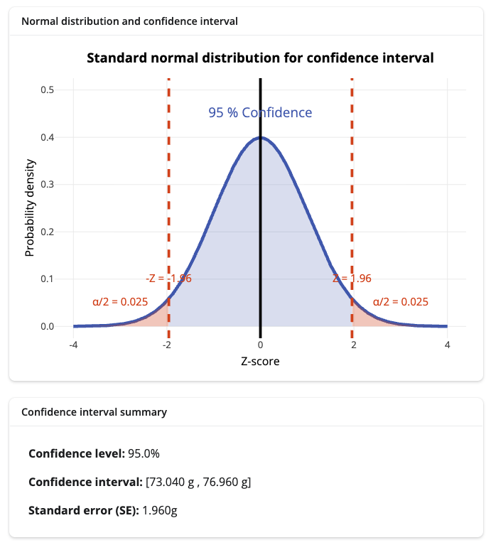

```{r, setup, include = FALSE}
library("webexercises")
```

*Before reading this guide, it is recommended that you read [Guide: Introduction to probability](introtoprobability.qmd), [Guide: Introduction to hypothesis testing](hypothesistesting.qmd), and [Guide: Expected value, variance, standard deviation](expectedvariance.qmd).*

::: {.content-visible when-format="html"}

```{=html}
<table><tr><td style="vertical-align: middle"><strong>Narration of study guide:</strong>&nbsp;&nbsp;</td><td><audio controls><source src="./Narrations/confidenceintervals.mp3" type="audio/mpeg">Your browser does not support the audio element.</audio></tr></table>
```

:::

# What is a confidence interval?

If you were conducting a study about a population of people and took several different samples of data, the sample means could be different for each sample. This makes estimating a population mean very difficult, as this variability affects your confidence that the sample is a true reflection of the population. A population mean is a fixed, unknown constant, and providing a confident estimate of this quantity that cannot be measured is one of the fundamental goals of statistics.

### Initial example and set up

For instance, suppose that you were investigating average weights of chocolate bars. To do this, you had taken five samples of $30$ chocolate bars from the massive conglomerate that is Cantor's Confectionery, and worked out the average weights of each of these five samples:

| Sample number $S_m$       | $S_1$ | $S_2$ | $S_3$ | $S_4$ | $S_5$ |
|:-----------------------:|:----:|:----:|:----:|:----:|:----:|
| Sample mean $\bar{x}_m$ | $28.2$ | $29.6$ | $27.9$ | $29.1$ | $28.8$ |

Which of these is most reflective of the average weight of all of the chocolate bars produced by Cantor's Confectionery? It's impossible to say! So what you can do is consider a **range of values**. This range of values is called a **confidence interval (CI)**, which is specified up to a **confidence level** (usually 95%, but this can vary). This range of values is centred at the sample mean $\bar{x}$, and the bounds are given by the **margin of error** of your sample. 

So each of these sample means will have a confidence interval associated to it, which is worked out using the data from the sample. You can then expand the above table to include the confidence intervals:

| Sample number $S_m$       | $S_1$ | $S_2$ | $S_3$ | $S_4$ | $S_5$ |
|:-----------------------:|:------:|:------:|:------:|:------:|:------:|
| Sample mean $\bar{x}_m$ | $28.2$ | $29.6$ | $27.9$ | $29.1$ | $28.8$ |
| 95% CI for sample $m$   | $[27.6,28.8]$ | $[29.1,30.1]$ | $[27.6,28.2]$ | $[28.3,29.9]$ | $[28.1,29.5]$ |

What does a confidence interval do? It should give you an idea of where the population mean should be. But given the various confidence intervals for the samples above, it's not even clear where the population mean could be in any one of these. For instance, the confidence intervals for samples $1$ and $2$ do not meet; the population mean cannot be in both! This is because it is a fixed, unknown constant which does not vary.

It's important to note that there is one confidence interval **per sample** of a population, and so if you take many samples (as has been done above), there are many confidence intervals that each estimate the population mean $\mu$.

### What a confidence interval tells you

Suppose that CL is the confidence level of your confidence interval. The general rule is that for CL$\%$ confidence intervals, then **if you sample the population 100 times, then you can expect the population mean to lie within approximately CL many of the calculated CL $\%$ CIs.** You can replace CL with your given confidence level.

So you can say 

> It is likely (with CL$\%$ confidence) that the population mean is within this confidence interval. 

because the population mean will be in approximately CL/100 of all CL$\%$ CI's, but you **cannot say**

> For *this particular* confidence interval, the probability that the population mean is within this confidence interval is CL$\%$.

This is because the population mean $\mu$ is a **fixed, unknown constant**; and so the probability that it is in a given CL$\%$ CI is either $0$ (it's not in there) or $1$ (it's in there). Note the important difference between 'probability' and 'confidence'! 

The concept that does this is known as a **credible interval**; see [Guide: Credible intervals] for more. 

<!-- :::{.callout-important} -->

<!-- A 95% CI **does not mean** that the population mean is in the calculated CI with a 95% probability.  -->

<!-- ::: -->


<!-- So, when estimating population means, instead of providing only one fixed value for the population mean, you can specify a **range of values** which is likely (up to a statistical point) to contain the population mean. This range of values is called a **confidence interval** (CI). -->

### What's the point?

Confidence intervals are a vital tool used to measure uncertainties in everyday life. For example:

-   In politics, confidence intervals can be used to show the uncertainty in polling estimates.

-   In economics, confidence intervals can be used to show uncertainties in market trends and inflation.

-   In medicine and biology, confidence intervals can be used to show uncertainties around effects like mean weight loss, drug effectiveness, or survival rates.

-   In sports, confidence intervals can be used by coaches to measure the true performance levels of athletes.

### In this guide

This guide will focus on how to construct and interpret confidence intervals using the **normal distribution only**. This will include looking at $Z$-values, two-tailed alpha values, and confidence levels. Then, the guide will discuss how to interpret what your confidence interval means. 

For information on confidence intervals using other distributions see [Guide: More on confidence intervals].

# Constructing confidence intervals

## The normal distribution

The **normal distribution,** or sometimes called the "bell-curve" because of its shape, is a function used to model the probability of various naturally occurring measurements, such as the average height of trees, average ages of cats, average IQs of humans, and so on. You would expect these measurements to have lots of measurements close to the middle (the average) and fewer measurements towards the extremes (the tails). 

More mathematically, the function is called a **probability density function** and it is written as $N(\mu,\sigma^2)$, which depends on two parameters: the **mean** $(\mu)$ and the **standard deviation** $(\sigma)$. In situations where $\mu = 0$ and $\sigma = 1$, you have a **standard normal distribution**. For more on $\mu$ and $\sigma$ see [Guide: Expected value, variance, standard deviation](expectedvariance.qmd); for more on probability density functions, please see [Guide: PMFs, PDFs, CDFs](pmfspdfscdfs.qmd).

::: callout-note
## Definition of a normally distributed random variable

For a population where $\mu$ is the population mean and $\sigma$ is the population standard deviation, a random variable $X$ which is modelled by the normal distribution with these parameters is written as

$$ X \sim N(\mu, \sigma^2) $$

which you can read as '$X$ is normally distributed with parameters $\mu$ and $\sigma$'. 
:::

So to use the mathematical tools associated with the normal distribution on a population, you need to have a fairly good idea of the two parameters, the mean $\mu$ (mu) and standard deviation $\sigma$ (sigma).

For more information on the normal distribution (such as what the function $N(\mu,\sigma^2)$ actually is) see [Factsheet: Normal distribution](../factsheets/f-normaldist.qmd).


## Tails

Because of the 'bell-shape' of the normal distribution, there are less values at each end. The extremes of the normal distribution are called the **tails**. 

By drawing two vertical lines on the $x$-axis at the two points $x = x_0$ and $x = -x_0$ (where $x_0$ is some number), and drawing upwards, you can define the area under the curve bounded to the right of $x = x_0$ and to the left of $x = -x_0$. These areas at each end of the curve are often also called the **tails** of the distribution.

The total area of both tails combined is called $\alpha$ (alpha), and this is always a number between $0$ and $1$. Since the graph is symmetric and the lines are drawn at $x = x_0$ and $x = -x_0$, the area of each tail is exactly ${\alpha/2}$.

To construct a confidence interval you need both tails, because you are looking at values both above and below the population mean, which is unknown. So you will construct what is called a **two-tailed test.**

:::: {.content-visible when-format="html"}

::: callout-tip
## Try!

Try different values of $\alpha$ and see how the size of the tails change.

:::

```{shinylive-r}
#| standalone: true
#| viewerHeight: 700

library(shiny)
library(bslib)
library(ggplot2)

ui <- page_sidebar(
  title = "Normal distribution tails explained",
  sidebar = sidebar(
    numericInput("mu", 
                 "Mean (μ):", 
                 value = 0, 
                 step = 0.1),
    numericInput("sigma", 
                 "Standard deviation (σ):", 
                 value = 1, 
                 min = 0.1, 
                 step = 0.1),
    hr(),
    sliderInput("tail_threshold",
                "Tails:",
                min = 1,
                max = 3,
                value = 2,
                step = 0.1),
    hr(),
    p("The distribution curve is shown in blue."),
    p("Red areas represent the tails beyond the threshold."),
    p("Use the threshold slider to see how tail areas change.")
  ),
  card(
    card_header("Normal distribution with highlighted tails"),
    plotOutput("tail_plot", height = "500px")
  )
)

server <- function(input, output, session) {
  output$tail_plot <- renderPlot({
    x_range <- c(input$mu - 4 * input$sigma, input$mu + 4 * input$sigma)
    x <- seq(x_range[1], x_range[2], length.out = 1000)
    
    y <- dnorm(x, mean = input$mu, sd = input$sigma)
    
    left_tail <- input$mu - input$tail_threshold * input$sigma
    right_tail <- input$mu + input$tail_threshold * input$sigma
    
    df <- data.frame(x = x, y = y)
    
    p <- ggplot(df, aes(x = x, y = y)) +
      geom_line(color = "#3f68b6", size = 1.2) +
      geom_area(data = df[df$x >= left_tail & df$x <= right_tail, ], 
                alpha = 0.2, fill = "#c0d6ff") +
      geom_area(data = df[df$x <= left_tail, ], 
                alpha = 0.6, fill = "#db4315") +
      geom_area(data = df[df$x >= right_tail, ], 
                alpha = 0.6, fill = "#db4315") +
      geom_vline(xintercept = left_tail, color = "#db4315", size = 1, linetype = "dashed") +
      geom_vline(xintercept = right_tail, color = "#db4315", size = 1, linetype = "dashed") +
      geom_vline(xintercept = input$mu, color = "#3f68b6", size = 1, linetype = "dotted") +
      labs(
        title = "The normal distribution",
        subtitle = paste("μ =", input$mu, ", σ =", input$sigma)
      ) +
      theme_minimal() +
      theme(
        plot.title = element_text(size = 16, hjust = 0.5),
        plot.subtitle = element_text(size = 12, hjust = 0.5),
        axis.title = element_text(size = 12),
        axis.text = element_text(size = 10)
      )
    
    max_y <- max(y)
    p + annotate("text", 
                 x = input$mu, 
                 y = max_y * 0.9, 
                 label = "μ", 
                 color = "#3f68b6", 
                 size = 5) +
        annotate("text", 
                 x = left_tail, 
                 y = max_y * 0.5, 
                 label = paste("-", input$tail_threshold, "σ"), 
                 color = "#db4315", 
                 size = 4, 
                 hjust = 1.1) +
        annotate("text", 
                 x = right_tail, 
                 y = max_y * 0.5, 
                 label = paste("+", input$tail_threshold, "σ"), 
                 color = "#db4315", 
                 size = 4, 
                 hjust = -0.1)
  })
}

shinyApp(ui = ui, server = server)
```

::::

## Confidence level

::: callout-note
## Definition of a confidence level

A **confidence level** (CL) suggests that if you were to repeat the sample and construction of a confidence interval $100$ times, you would expect the true value of the population mean to fall within CL of the constructed confidence intervals. A CL is typically represented using a percentage. 

For example, a $95\%$ CL suggests that the true value of the population mean would fall within $95$ out of $100$ computed confidence intervals.

:::

::: callout-important
## $\alpha$ is $1$ minus the CL

$1 - \alpha$ is the confidence level. So you only need **one** of either $\alpha$ or the confidence level in order to generate a confidence interval.

:::

## $Z$ value

The value of $\alpha$ (and/or the CL) is decided before constructing the confidence interval. Every value of $\alpha$ gives scores on the $x$ axis which leaves that much ${\alpha/2}$ in each tail. Because of the symmetry of the normal distribution, these scores are plus and minus each other. This is called the $Z$-value.

::: callout-note

## Definition of the $Z$ value using the normal distribution

Using the normal distribution, a $Z$-**value** (sometimes called $Z$-**score** or **standard score**) is a known test statistic. It shows how many standard deviations above or below the mean an observed data point is.

For the purposes of constructing confidence intervals, the $Z$-value is written as $Z_{\alpha/2}$. To work out $Z_{\alpha/2}$, you need to specify the $\alpha$ (and/ or CL) value. You can then use the calculator below to find out $Z_{\alpha/2}$.

:::

::::{.callout-note appearance="simple"}
## Example 1

Use the $Z$-value calculator below to find the $Z$ values for $\alpha = 0.1$, $\alpha = 0.05$, and $\alpha = 0.01$. These values have been chosen as these are the most commonly used alpha values in statistics, with $\alpha = 0.05$ in particular giving $95\%$ confidence intervals.

::: {.content-visible when-format="html"}

```{shinylive-r}
#| standalone: true
#| viewerHeight: 400


library(shiny)
library(bslib)

ui <- page_fillable(
  title = "Z-value calculator",
  
  # Z-value card in full width
  layout_columns(
    col_widths = c(12),
    card(
      card_header("Z α/2"),
      card_body(
        class = "p-2",
        div(
          h1(textOutput("z_value"), style = "text-align: center; color: #3f68b6; font-size: 2.5rem; margin: 0;")
        )
      ),
      height = "120px"
    )
  ),
  
  # Manual input and common alpha values in two columns
  layout_columns(
    col_widths = c(6, 6),
    
    # Manual input section
    card(
      card_header("Manual Input"),
      card_body(
        class = "p-2",
        numericInput("alpha", 
                     "Alpha level (α):", 
                     value = 0.05, 
                     min = 0.001, 
                     max = 0.999, 
                     step = 0.001),
        helpText("α is the significance level for a two-tailed normal distribution")
      ),
      height = "200px"
    ),
    
    # Common alpha values as buttons
    card(
      card_header("Common Alpha Values"),
      card_body(
        class = "p-2",
        div(
          actionButton("alpha_01", "α = 0.01", class = "btn-primary", color = "#3f68b6", style = "margin: 5px;"),
          actionButton("alpha_05", "α = 0.05", class = "btn-primary", color = "#3f68b6", style = "margin: 5px;"),
          actionButton("alpha_10", "α = 0.10", class = "btn-primary", color = "#3f68b6", style = "margin: 5px;")
        )
      ),
      height = "200px"
    )
  )
)

server <- function(input, output, session) {
  
  # Update alpha when buttons are clicked
  observeEvent(input$alpha_01, {
    updateNumericInput(session, "alpha", value = 0.01)
  })
  
  observeEvent(input$alpha_05, {
    updateNumericInput(session, "alpha", value = 0.05)
  })
  
  observeEvent(input$alpha_10, {
    updateNumericInput(session, "alpha", value = 0.10)
  })
  
  # Calculate and display z-value
  output$z_value <- renderText({
    z_critical <- qnorm(1 - input$alpha/2)
    round(z_critical, 4)
  })
}

shinyApp(ui = ui, server = server)
```
:::

::::

Using the normal distribution, alpha value (and/or the confidence level), and the corresponding $Z$ value, you can then construct a confidence interval.

## How do you construct a confidence interval?

::: callout-note
## Definition of confidence interval using the normal distribution

The **sample margin of error** is defined to be the following:

$$
ME = Z_{\alpha/2} \cdot \frac{s}{\sqrt{n}}
$$

where 

- $(Z_{\alpha/2})$ is the $Z$-value corresponding to the chosen confidence level $(1 -\alpha)$, 

- $s$ is the sample standard deviation

- $n$ is the sample size.

The fraction $s/\sqrt{n}$ is often known as the **standard error** of the sample.

A **CL% confidence interval** (CI) is defined to be the interval $$[\bar{x}-ME\,,\,\bar{x} + ME]$$ where $\bar{x}$ is the sample mean and $ME$ is the sample margin of error.

<!-- $$ -->
<!-- \bar{x}\pm SE -->
<!-- $$ -->

<!-- Which you read as $x$ bar plus or minus the standard error. -->


<!-- So your confidence interval is written as -->

<!-- $$ -->
<!-- [\bar{x} - SE,\bar{x} + SE] -->
<!-- $$ -->

Here, $\bar{x} - ME$ is called your **lower bound** and $\bar{x} + ME$ is called your **upper bound**. The
:::

Here's a step-by-step guide to working out a confidence interval.

:::{.callout-tip}

## General steps for constructing a confidence interval using the normal distribution

**Step 1**: Write down everything you need to work out a confidence interval, which is

- your sample size $n$

- a sample mean $\bar{x}$ and sample standard deviation $s$

- your alpha value $(\alpha)$ (or the confidence level (CL)) together with its corresponding $Z$ value

**Step 2:** Use your $\alpha$ (or CL) and the $Z$-value calculator to find $Z_{\alpha/2}$.

**Step 3:** Find the margin of error $$ME = Z_{\alpha/2} \cdot \frac{s}{\sqrt{n}}$$ and then construct the confidence interval for this sample mean:
$$[\bar{x} - ME\,,\,\bar{x} + ME]$$

**Step 4:** Check your work! The average of your confidence interval should equal your sample mean.

<!-- For example, -->

<!-- $$ -->
<!-- \bar{x} = 50, \\[0.5em] -->
<!-- [49.2, 50.8] -->
<!-- $$ -->

<!-- sum the upper and lower bound of the confidence interval, so -->

<!-- $$ -->
<!-- 49.2 + 50.8 = 100 -->
<!-- $$ -->

<!-- and when you divide by $2$ -->

<!-- $$ -->
<!-- \frac{100}{2} = 50 = \bar{x} -->
<!-- $$ -->

:::

::::{.content-visible when-format="html"}

:::{.callout-note appearance="simple"}

## Example 2

Cantor's Confectionery have purchased a new computer to help monitor the quality of their products. The computer allows them to input the mean and standard deviation of a sample of their best-selling products, and then put them into the following program. 

```{shinylive-r}
#| standalone: true
#| viewerHeight: 900

library(shiny)
library(bslib)
library(ggplot2)
library(plotly)

ui <- page_sidebar(
  title = "Confidence interval for mean weight of a product in Cantor's Confectionery",
  
  sidebar = sidebar(
    sliderInput("alpha",
                "significance level (α):",
                min = 0.01,
                max = 0.20,
                value = 0.05,
                step = 0.01),
    
    hr(),
    
    numericInput("x_bar",
                 "sample mean (x̄) in grams:",
                 value = 75,
                 min = 50,
                 max = 100,
                 step = 0.1),
    
    numericInput("sigma",
                 "standard deviation (σ) in grams:",
                 value = 10,
                 min = 1,
                 max = 20,
                 step = 0.1),
    
    numericInput("n",
                 "sample size (n):",
                 value = 100,
                 min = 10,
                 max = 500,
                 step = 1)
  ),
  
  card(
    card_header("Normal distribution and confidence interval"),
    plotlyOutput("normal_plot", height = "600px")
  ),
  
  card(
    card_header("Confidence interval summary"),
    div(
      style = "font-size: 16px; padding: 10px;",
      uiOutput("ci_summary")
    ),
  height = "250px"
  )
)

server <- function(input, output, session) {
  
  # Reactive calculations
  confidence_level <- reactive({
    (1 - input$alpha) * 100
  })
  
  alpha_half <- reactive({
    input$alpha / 2
  })
  
  z_critical <- reactive({
    qnorm(1 - alpha_half())
  })
  
  standard_error <- reactive({
    input$sigma / sqrt(input$n)
  })
  
  margin_of_error <- reactive({
    z_critical() * standard_error()
  })
  
  ci_lower <- reactive({
    input$x_bar - margin_of_error()
  })
  
  ci_upper <- reactive({
    input$x_bar + margin_of_error()
  })
  
  # Main plot
  output$normal_plot <- renderPlotly({
    
    # Create data for the normal distribution
    x_seq <- seq(-4, 4, length.out = 1000)
    y_seq <- dnorm(x_seq)
    
    # Create the base plot
    p <- ggplot(data.frame(x = x_seq, y = y_seq), aes(x = x, y = y)) +
      geom_line(size = 1.2, color = "#3f68b6") +
      
      # Shade the rejection regions
      geom_area(data = data.frame(x = x_seq[x_seq <= -z_critical()], 
                                  y = y_seq[x_seq <= -z_critical()]),
                aes(x = x, y = y), fill = "#db4315", alpha = 0.3) +
      geom_area(data = data.frame(x = x_seq[x_seq >= z_critical()], 
                                  y = y_seq[x_seq >= z_critical()]),
                aes(x = x, y = y), fill = "#db4315", alpha = 0.3) +
      
      # Shade the confidence region
      geom_area(data = data.frame(x = x_seq[x_seq >= -z_critical() & x_seq <= z_critical()], 
                                  y = y_seq[x_seq >= -z_critical() & x_seq <= z_critical()]),
                aes(x = x, y = y), fill = "#3f68b6", alpha = 0.2) +
      
      # Add vertical lines for critical values
      geom_vline(xintercept = c(-z_critical(), z_critical()), 
                 linetype = "dashed", color = "#db4315", size = 1) +
      geom_vline(xintercept = 0, linetype = "solid", color = "black", size = 1) +
      
      # Add labels
      annotate("text", x = -z_critical(), y = 0.1, 
               label = paste("-Z =", round(-z_critical(), 3)), 
               hjust = 1.1, color = "#db4315", size = 4) +
      annotate("text", x = z_critical(), y = 0.1, 
               label = paste("Z =", round(z_critical(), 3)), 
               hjust = -0.1, color = "#db4315", size = 4) +
      annotate("text", x = 0, y = 0.45, 
               label = paste(confidence_level(), "% Confidence"), 
               hjust = 0.5, color = "#3f68b6", size = 5, fontface = "bold") +
      annotate("text", x = -3, y = 0.05, 
               label = paste("α/2 =", round(alpha_half(), 4)), 
               hjust = 0.5, color = "#db4315", size = 4) +
      annotate("text", x = 3, y = 0.05, 
               label = paste("α/2 =", round(alpha_half(), 4)), 
               hjust = 0.5, color = "#db4315", size = 4) +
      
      labs(
        title = "Standard normal distribution for confidence interval",
        x = "Z-score",
        y = "Probability density",
        subtitle = paste("Confidence Interval for μ: [", round(ci_lower(), 2), "g,", round(ci_upper(), 2), "g]")
      ) +
      theme_minimal() +
      theme(
        plot.title = element_text(hjust = 0.5, size = 14, face = "bold"),
        plot.subtitle = element_text(hjust = 0.5, size = 12),
        axis.title = element_text(size = 12),
        axis.text = element_text(size = 10)
      ) +
      xlim(-4, 4) +
      ylim(0, 0.5)
    
    ggplotly(p) %>%
      config(displayModeBar = FALSE)
  })
  
  # Confidence interval summary
  output$ci_summary <- renderUI({
    tagList(
      p(strong("Confidence level:"), paste0(sprintf("%.1f", confidence_level()), "%")),
      p(strong("Confidence interval:"), 
        paste0("[", sprintf("%.3f", ci_lower()), " g , ", sprintf("%.3f", ci_upper()), " g]")),
      p(strong("Margin of error (ME):"), paste0(sprintf("%.3f", margin_of_error()), " g")),
      p(strong("Standard error (SE):"), paste0(sprintf("%.3f", standard_error()), " g"))
    )
  })
}

shinyApp(ui = ui, server = server)
```

What can you tell from this?

- First of all, you can see that this is a normal distribution for the mean weight of one of Cantor's Confectionery's best selling products.

- This takes an input of a sample mean and a sample standard deviation.

- When different values for $\alpha$ are selected, the tails of the normal distribution change. This means that when constructing a confidence interval, the $Z$-values will be different depending on your confidence level.

- By changing any of the parameters, the values of the confidence interval changes. This is because the value of the confidence intervals depend on all of these parameters.

:::

::::

::::{.content-hidden when-format="html"}

:::{.callout-note appearance="simple"}

## Example 2

Cantor's Confectionery have purchased a new computer to help monitor the quality of their products. The computer allows them to input the mean and standard deviation of a sample of their best-selling products, and then put them into the following program. 

{width="80%"}

:::

:::{.callout-note appearance="simple"}

## Example 2 (continued)

What can you tell from this?

- First of all, you can see that this is a normal distribution for the mean weight of one of Cantor's Confectionery's best selling products.

- This takes an input of a sample mean and a sample standard deviation.

- When different values for $\alpha$ are selected, the tails of the normal distribution change. This means that when constructing a confidence interval, the $Z$-values will be different depending on your confidence level.

- By changing any of the parameters, the values of the confidence interval changes. This is because the value of the confidence intervals depend on all of these parameters.

:::

::::

:::{.callout-note appearance="simple"}

## Example 3

Cantor's Confectionery uses the normal distribution from Example 1 and the computer from Example 2 to construct a $95\%$ confidence interval for the mean weight of their bags of sweets. They take a sample of $100$ bags which has an average weight of $75$ grams. The calculated standard deviation is $10$ grams.

They ask you, an eminent and capable statistician, to check the results of their computation. 

**Step 1:** What do you need?

-   The sample size is $100$ bags of sweets, so $n = 100$.

-   The average weight of the bags of sweets is $75$ grams so $\bar{x} = 75\,\textrm{g}$. The sample standard deviation of the sample is $10$ grams so $s = 10\,\textrm{g}$.

-   The confidence level is $95\%$; so $\alpha = 0.05$ and ${\alpha/2} = 0.025$.

**Step 2:** Use the Z value calculator to identify $Z_\frac{0.05}{2} = Z_{0.025} = 1.960$.

**Step 3:** Construct the confidence interval. First, you'll need to work out the margin of error; which since the sample standard deviation is in grams, and the $Z$-value and square root of sample size are unitless, should be expressed in grams. Here, $$ME = Z_{0.025} \cdot \frac{s}{\sqrt{n}} = 1.960\cdot \frac{10\,\textrm{g}}{\sqrt{100}} = 1.960\cdot \frac{10\,\textrm{g}}{10} = 1.960\,\textrm{g}.$$

<!-- $$ -->
<!-- [\bar{x} - Z_{0.025} \frac{\sigma}{\sqrt{n}}, \bar{x} + Z_{0.025} \frac{\sigma}{\sqrt{n}}]   -->
<!-- $$ -->

Then a 95% CI can be calculated:

$$
95\%\textsf{ CI }= [(75 - 1.960)\,\textrm{g}\,,\, (75 + 1.960)\,\textrm{g}] = [73.04\,\textrm{g}\,, 76.96\,\textrm{g}]
$$

<!-- $$ -->
<!-- = [73.04, 76.96] -->
<!-- $$ -->

**Step 4:** Check your work. You know that the sample mean should be the exact centre of your confidence interval. Here

$$
73.04\,\textrm{g} + 76.96\,\textrm{g} = 150 \,\textrm{g}
$$
and since 

$$
\frac{150\,\textrm{g}}{2}\,\textrm{g} = 75 \,\textrm{g}
$$

you can see that the centre of the confidence interval is the sample mean $\bar{x} = 75\,\textrm{g}$.

:::

:::{.callout-note appearance="simple"}

## Example 4

Using the sample mean and sample standard deviation from Example 3, you can ask the computer from Cantor's Confectionery in Example 2 to work out a $90\%$ confidence interval and $99\%$ confidence interval. It outputs the following results:

$$
\begin{aligned}
\textsf{A }90\%\textsf{ CI }&= [73.36\,\textrm{g}, 76.64\,\textrm{g}] \\[0.5em]
\textsf{A }99\%\textsf{ CI }&=[72.424\,\textrm{g}, 77.576\,\textrm{g}]
\end{aligned}
$$

What does this suggest about the confidence levels and the corresponding confidence intervals?

For all three examples, the sample mean falls in the centre of the confidence interval. But, as the confidence level **increases**, so does the **width** of the confidence interval. This makes sense; if you want to be more confident as to where the population mean $\mu$ is, then you need to give a wider set of values. 

This is also linked to the tails of the normal distribution. If you were to think about the tails of these normal graphs, as the CL increases the amount of area underneath each extreme decreases. This means you have more values in the middle of the graph, which is why you have more values in the confidence interval. For more on this, see [Guide: More on confidence intervals].


:::

Here's another example which shows that you do not need to follow the precise steps. 

:::{.callout-note appearance="simple"}

## Example 5

There is a new shop in town! Lovelace's Lollies are claiming their products are better than Cantor's Confectionery. They have employed you to construct some $95\%$ confidence intervals for them. 

They take a sample of $77$ of their best selling boxes of lollies. The average weight of these boxes is $84$ grams with a standard deviation of $9.5$ grams. So

-   The sample size is $n = 77$.

-   $\bar{x} = 84\,\textrm{g}$ is the sample mean, and $s = 9.5\,\textrm{g}$ is the sample standard deviation.

-   It's a $95\%$ CI, and so $Z_\frac{0.05}{2} = Z_{0.025} = 1.960$.

So to construct the confidence interval you need to first compute the standard error:

$$ME = Z_{\alpha/2}\cdot \frac{s}{\sqrt{n}} = 1.960\cdot \frac{9.5\,\textrm{g}}{\sqrt{77}} = 2.122\,\textrm{g} \qquad \textsf{ to 3dp.}$$

Which means that the $95\%$ CI for this sample is
$$
95\%\textsf{ CI }= [(84 - 2.122)\,\textrm{g}, (84 + 2.122)\,\textrm{g}] = [81.878\,\textrm{g}\,, 86.122\,\textrm{g}]
$$

This completes your work for Lovelace's Lollies.

:::

# Applications of confidence intervals

It's really important to scrutinize any of your answers and check your understanding of the statistics you are presenting.

So in Examples 3 and 5, Cantor's Confectionery and Lovelace's Lollies have both constructed a $95\%$ confidence interval from a sample of their best selling products. What does this tell you?

-   If Cantor's Confectionery were to repeat the study several times, they would expect the average weight of a bag of sweets to **lie between** $73.04$ grams and $76.96$ grams, **with** $95\%$ **confidence.**

-   If Lovelace's Lollies were to repeat the study several times, they would expect the average weight of a box of lollies to **lie between** $81.88$ and $86.12$ grams, **with** $95\%$ **confidence.**

The next example shows what these **do not** tell you.

:::{.callout-note appearance="simple"}

## Example 6

The imminent rivalry between Cantor's Confectionery and Lovelace's Lollies has reached STARMAST News with the following headline:

"Here to compete with Cantor's Confectionery: Lovelace's Lollies **guarantee** that $95\%$ of all boxes of lollies will weigh $86.12$ grams".

There are issues with this statement.

From the definition of a confidence level, you know that a confidence level suggests that if you were to repeat the study many times, you would expect the true estimate to fall within CL$\%$ of the results.

This is **not the same** as saying CL$\%$ of the products weigh a certain amount.

Instead, the STARMAST News headline should read

"Here to compete with Cantor's Confectionery: A study on a sample of Lovelace's Lollies suggest that if more boxes were to be sampled, they expect $95\%$ of boxes would weigh between $81.88$ and $86.12$ grams".

:::

Finally, you can use a published confidence interval and some rearranging of equations to find out both the sample mean and sample standard deviation from a confidence interval. 

:::{.callout-note appearance="simple"}

## Example 7

Cantor's Confectionery release a new "family-sized" bag of sweets to compete with Lovelace's Lollies. They publish a news report on STARMAST News to counter some of the claims made by Lovelace's Lollies.

> "We've made a family-sized bag of sweets. Out of a sample of 81 bags, the $99\%$ confidence interval was $[100.00g, 104.00g]$ to two decimal places!

(Probably not the best PR people at Cantor's Confectionery.)

Anyway, Lovelace's Lollies have got hold of this news report and want you to investigate the sample mean and sample standard deviation of their competitor's study. This is to compare their manufacturing processes with their sample standard deviation from Example 5.

You know that the sample mean is always at the centre of a confidence interval, and so here $$\bar{x} = \frac{100.00 + 104.00}{2}\,\textrm{g} = 102\,\textrm{g}.$$
To work out the sample standard deviation $s$, you will need to take the equation for the standard error and rearrange for $s$.

- Here, the margin of error is the upper bound of the CI minus the sample mean, which is $ME = (104 - 102)\,\textrm{g} = 2\,\textrm{g}$.

- The confidence level is $99\%$. This means that $\alpha = 0.01$ and so, from the $Z$-value calculator: $$Z_{\alpha/2} = Z_{0.005} = 2.576.$$

- The sample size is $n = 81$, which means that $\sqrt{n} = \sqrt{81} = 9$.

So you will have to rearrange the equation $$2 = 2.576\cdot \frac{s}{\sqrt{81}}$$ and doing so gives $$s = \frac{2\cdot 9}{2.576} = 6.99\,\textrm{g} \qquad\textsf{ to 2dp.}$$

<!-- Cantor's Confectionery want to know the standard deviation of this sample to compare with their standard deviation of $10$ grams from example 3 and Lovelace's Lollies standard deviation of $9.5$ grams from example 5 -->

<!-- The sample mean is given as -->

<!-- $$ -->
<!-- \bar{x} = 102 -->
<!-- $$ -->

<!-- The confidence level is $99\%$ so under the normal distribution -->

<!-- $$ -->
<!-- Z_{\alpha/2} = Z_{0.005} = 2.576 -->
<!-- $$ -->

<!-- The sample size is -->

<!-- $$ -->
<!-- n = 81 -->
<!-- $$ -->

<!-- So, to work out the sample standard deviation $(\sigma)$, you must work back from the confidence interval -->

<!-- You can then use **either bound**. So, using the lower bound you know that -->

<!-- $$ -->
<!-- 100 = 102- 2.576(\frac{\sigma}{\sqrt{81}}) -->
<!-- $$ -->

<!-- by rearranging the equation -->

<!-- $$ -->
<!-- -2 = -\frac{2.576(\sigma)}{\sqrt{81}} -->
<!-- $$ -->

<!-- and so, -->

<!-- $$ -->
<!-- \sigma = 7 -->
<!-- $$ -->

This is the lowest sample standard deviation yet; it seems that Cantor's Confectionery have better manufacturing facilities!

:::

# Quick check problems {.unnumbered}

<!-- add facility for webexercises to work on html -->

:::: {.content-visible when-format="html"}
<!-- add facility to check answers at end rather than one at a time -->

::: {.webex-check .webex-box data-topic="CI1"}

1. Cantor's Confectionery has constructed a $99\%$ CI for the population mean length of their pulled taffy, which is $[29.1\,\textrm{mm}, 32.9\,\textrm{mm}]$. Below are three statements about this working; two are false, and one is true. Select the true statement:

`r mcq(c("There is a 99% probability that the population mean is in this interval.", "99% of the sample data is within this interval.", answer = "It's likely (to a 99% confidence level) that the population mean is in this interval."))`

2.  What would your CL be for $\alpha = 0.05$?

<!-- -->

(a) $85\%$

(b) $90\%$

(c) $95\%$

Answer: `r mcq(c("a", "b", answer = "c"))`.

3.  What is the $Z$-value for $\alpha = 0.1$, to 4 decimal places?

Answer: `r fitb("1.6449")`.

4.  If a random variable $X$ is normally distributed, which parameters are used?

Answer: `r mcq(c("n and Z", "mu and n", answer = "mu and sigma"))`.

5.  What are the extremes of the normal distribution called?

Answer: `r mcq(c("ends", "sides", answer = "tails"))`.

:::

::::

::: {.content-hidden when-format="html"}

1. Cantor's Confectionery has constructed a $99\%$ CI for the population mean length of their pulled taffy, which is $[29.1\,\textrm{mm}, 32.9\,\textrm{mm}]$. Below are three statements about this working; two are false, and one is true. Select the true statement:

- There is a $99\%$ probability that the population mean is in this interval.

- $99\%$ of the sample data is within this interval.

- It's likely (to a $99\%$ confidence level) that the population mean is in this interval.

2.  What would your CL be for $\alpha = 0.05$?

(a) $85\%$

(b) $90\%$

(c) $95\%$

3.  What is the $Z$-value for $\alpha = 0.1$, to 3 decimal places?

4.  If a random variable $X$ is normally distributed, which parameters are used?

5.  What are the extremes of the normal distribution called?

:::

# Further reading

[For more questions on the subject, please go to Questions: Introduction to confidence intervals.](../questions/qs-confidenceintervals.qmd)

[If you would like to use a calculator to check your answers, please go to Calculator: Confidence intervals with normal distribution.](../apps/calculators/c-confidenceintervalsnormal.qmd)

# Version history

v1.0: initial version created 12/25 by Millie Harris as part of a University of St Andrews VIP project.

[This work is licensed under CC BY-NC-SA 4.0.](https://creativecommons.org/licenses/by-nc-sa/4.0/?ref=chooser-v1)
