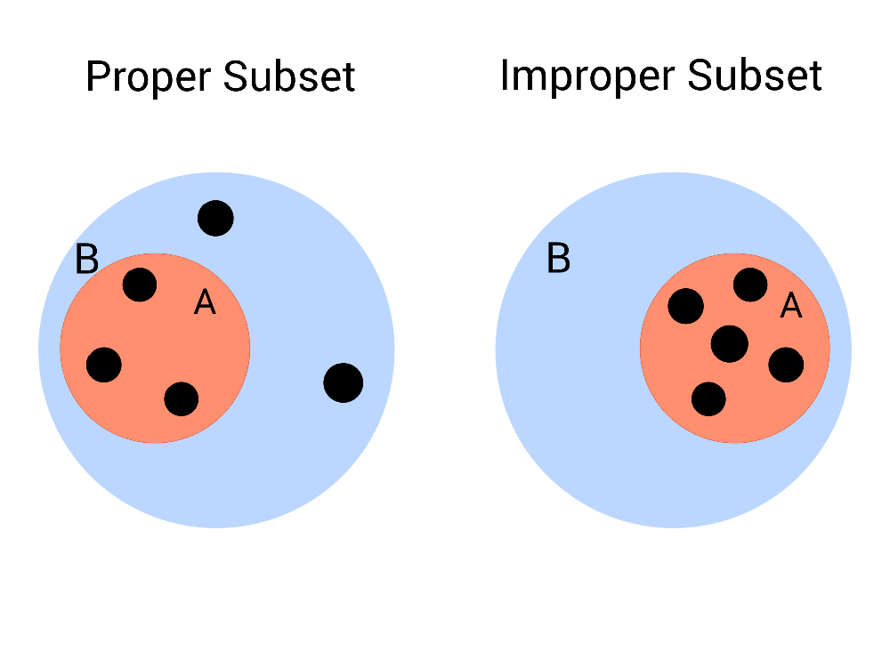
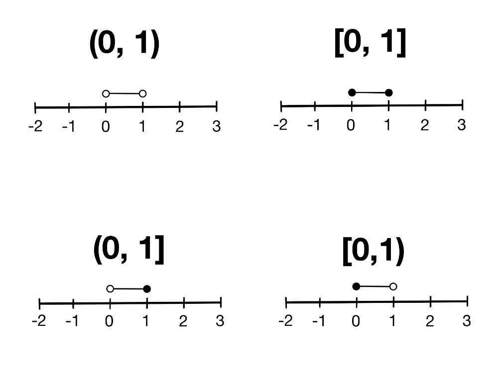

```{r, setup, include = FALSE}
library("webexercises")
```

*Before reading this guide, it is recommended that you read [Overview: Number sets](o-setsofnumbers.qmd). This will act as an introduction to some key numerical sets that will be repeatedly referred to in examples throughout this guide.*

::: {.content-visible when-format="html"}
```{=html}
<table><tr><td style="vertical-align: middle"><strong>Narration of study guide:</strong>&nbsp;&nbsp;</td><td><audio controls><source src="./Narrations/introtosettheory.mp3" type="audio/mpeg">Your browser does not support the audio element.</audio></tr></table>
```
:::

# Introduction {.unnumbered}

Set theory is a fundamental area of study in mathematics, and underpins almost all other mathematical disciplines. Its operations, such as the union, intersection and complement (see [Guide: Operations of sets](operationsofsets.qmd) to learn more about these) are key concepts when it comes to formalizing mathematical theorems.

It also has many applications in other areas. Computer scientists use it in the design of computing languages, statisticians use it when calculating probabilities and analyzing data—even linguists use it to categorize language structures.

# What is a set? {.unnumbered}

In mathematics, it is often helpful to be able to talk about groups of objects together. To do this, you use the idea of a set.

::: {.callout-note}
## Definition of a set

A **set** is a collection of different objects, called **elements**. Elements of sets are typically mathematical objects such as numbers, symbols, shapes or even other sets, but in reality they can be anything at all.

:::

Although sets can contain anything, they must follow a few key principles:

-   **Well-defined**: it must be clear, for any object, whether or not it is in the set.
-   **Distinct elements**: every element in a set must be different.
-   **Unordered**: the order that elements are written in a set does not matter.

## Set notation {.unnumbered}

Sets can be written in two different ways: **roster notation** and **set builder notation**.

### Roster notation {.unnumbered}

Roster notation lists all elements of a set explicitly in **curly brackets** $\{ \; \}$ (also called **braces**). It is best used for small sets, or sets containing elements that cannot be easily described by a condition or property, like a word or physical object.

::: {.callout-note appearance="simple"}
## Example 1

You have a collection of keys on a keyring. There are keys are present on the keyring, so these keys are all **well-defined**. Each key unlocks something different, so each key is **distinct**. The order of the keys does not matter, since each key will unlock the door it's meant to regardless of its position on the keyring, so the keys are **unordered**.

In this sense, you can think of each key on the keyring as an element of a set, and the whole set as the collection of individual keys. If a keyring had a house key, a car key and a shed key on it, then the corresponding set would be

$$
\{\,\textsf{house key},\ \textsf{car key},\ \textsf{shed key}\,\}
$$
This set is written in roster notation, since all keys in the set have been explicitly written down.

:::

Roster notation becomes unwieldy when sets become large, or even infinite. That is where set builder notation comes in!

### Set Builder Notation {.unnumbered}

Set builder notation describes a set by stating the properties that its elements must have. Instead of listing elements, it provides rules and conditions that define the set. When relevant, set builder notation also includes the domain—the type of element—that the elements come from.

::: {.callout-note appearance="simple"}
## Example 2

Suppose you wanted to collect all even numbers in a single set. In set builder notation, this is written as

$$
\left\{x: \frac{x}{2} \in \mathbb{Z}\right\}
$$

the set of all $x$ such that $\frac{x}{2}$ in an integer (see [Guide: Introduction to fractions](introtonumericalfractions.qmd) to learn about fractions, and [Guide: Introduction to algebraic fractions](introtoalgebraicfractions.qmd) to learn about fractions that involve variables, like $x$).

This can alternatively be written as
$$
\{x \in \mathbb{Z}: x \equiv 0 \pmod{2} \}
$$
the set of all $x$ in the integers $\mathbb{Z}$ such that $x$ is congruent to 0 modulo 2 (see [Guide: Introduction to modular arithmetic](introtomodulararithmetic.qmd) to learn about congruence.)
:::

::: callout-tip
Here, a colon has been used to mean 'such that', but other notation is also accepted in this context. Some guides and textbooks may also use a pipe symbol (\|) in the place of the colon.
:::

# Set Cardinality

Once you know what a set is, an important question to address is how to talk about its size. You can use the concept of **cardinality** to measure this.

::: {.callout-note}
## Definition of cardinality

The **cardinality** of a set is the number of distinct elements contained within it.

For a set $A$, you write its cardinality as $|A|$.
:::

In the case of finite sets—sets containing a finite number of elements—you can find its cardinality by counting the elements in the set. 

::: {.callout-note appearance="simple"}
## Example 3

Consider a set $D$ of all of the days of the week.

$$
D = \{\,\text{Monday},\ \text{Tuesday},\ \text{Wednesday},\ \text{Thursday},\ \text{Friday},\ \text{Saturday},\ \text{Sunday} \}
$$
Then $|D| = 7$, and this set is finite.
:::

However, not all sets are finite. Some, like the integers $\mathbb{Z}$ or the reals $\mathbb{R}$, contain an infinite number of elements, and these infinities can be **different sizes**. Between every two integers in existence, there is an infinite amount of real numbers, so the infinity that is the size of $\mathbb{R}$ is bigger than the infinity that is the size of $\mathbb{Z}$.

The question of differentiating between these cardinalities leads to a very important distinction between **countable** and **uncountable** sets.

### Countable Sets

A set is countable if it fulfills one of these conditions:

-   It is finite.
-   It is infinite, but you can list it's elements one by one, like this:

$$
A = \{\, 1^{st}, 2^{nd}, 3^{rd}, ... \}\
$$
These are called finite and countably infinite sets, respectively.

All countably infinite sets have the same cardinality. This is because there always exists a **bijection** between a countably infinite set and the natural numbers $\mathbb{N}$. This cardinality is written $\aleph_0$, and pronounced 'aleph-null' or 'aleph-naught'.

::: {.callout-note}

## Bijections: a quick aside

A bijection is a type of function $f: A \rightarrow B$ that maps elements from one set $A$, called the domain, to another set $B$, called the range. This means that if you take an element from $A$ and pass it through the function $f$, it will return an element from $B$.

If a bijection exists between two sets $A$ and $B$, then it guarantees that those sets have the same cardinality. See [Guide: Introduction to functions](introtofunctions.qmd) for more detail on bijections, and why this is the case.
:::

Examples of countably infinite sets include the natural numbers $\mathbb{N}$, the integers $\mathbb{Z}$ and the rational numbers $\mathbb{Q}$.

### Uncountable sets

A set is uncountable if it fulfills both of these conditions:

-   It is infinite.
-   Its elements cannot be listed.

Another way to refer to uncountable sets is uncountably infinite sets. The cardinality of an uncountably infinite set is strictly greater than $\aleph_0$.

::: {.callout-note appearance="simple"}
## Example 4

One example of an uncountable set is the interval $(0,1)$, which is the set of every number that lies somewhere between $0$ and $1$ on a number line. You can prove that this set is uncountable by assuming that it is countable, then finding a contradiction in that assumption.

If $(0, 1)$ is countable, then you can list every element in it like this:

$$
\{ a_0, a_1, a_2, a_3, \dots\}
$$
Since every number in this list can be represented on a number line, you can write every element of the list as a decimal:

$$
\begin{array}{rcc}
a_1 & = & 0.\underline{a_{11}} a_{12} a_{13} a_{14} \dots \\
a_2 & = & 0.a_{21} \underline{a_{22}} a_{23} a_{24} \dots \\
a_3 & = & 0.a_{31} a_{32} \underline{a_{33}} a_{34} \dots \\
a_4 & = & 0.a_{41} a_{42} a_{43} \underline{a_{44}} \dots \\
\vdots & & \vdots \\
\end{array}
$$

so that $a_{ij}$ is the $j^{th}$ decimal digit of the number $a_i$.

Now you can consider another number,
$$
b = 0.b_1 b_2 b_3 b_4...\text{ where } 
b_i =
\begin{cases}
5 & \text{if} \; a_{ii} \neq 5,\\
7 & \text{if} \; a_{ii} = 5.
\end{cases}
$$
Then $b$ **cannot** be any of the $a_i$ in the list, since $b_i \neq a_{ii}$, so $b$ is different to every single $a_i$ in its $i^{th}$ decimal place.

This means that $b$ is not in the list, which contradicts the assumption that the list contains all elements in the interval $(0,1)$.

This means that the elements of the interval cannot be listed, and $(0,1)$ is uncountable.
:::

Other examples of uncountable sets are the real numbers $\mathbb{R}$ and the complex numbers $\mathbb{C}$. Both of these sets have the cardinality $2^{\aleph_0} = \mathfrak{c}$, which is known as the continuum, but other uncountably infinite sets have different cardinalities.

::: callout-tip
Another way of differentiating between countable and uncountable sets is by considering roster notation! If a set can be written in roster notation, then it is countable. If you must use set-builder notation to describe the set, then it is uncountable.
:::

### The empty set

Having come from considering sets with an infinite number of elements, you might consider the opposite case—what about a set that contains no elements at all? This set does exist, and is called the **empty set**. It is written using the null sign, $\emptyset$. The empty set has cardinality $0$.

Two sets are equal if neither set contains an element not present in the other. Since the empty set contains no elements, this means there is only one empty set—it is unique.

::: {.callout-note}
## Definition of the empty set

The **empty set** is the unique set that contains no elements. It is written as $\emptyset$.
:::

The empty set often appears in mathematical proofs and workings. In set theory, it is used to define operations such as the union $\cup$ and the intersection $\cap$. These operations are explored in [Guide: Operations of sets](operationsofsets.qmd).

::: {.callout-note appearance="simple"}
## Example 5

Consider a standard, 6-sided die, with numbers 1 to 6 on the faces. Then
$$
\{ x \in \text{die faces}\  : x \geq 7 \} = \emptyset
$$
since there is no face on the die that has a number greater than or equal to 7 on it.
:::

# Subsets {.unnumbered}

It is often useful to compare two sets by looking at how their elements relate. One of the most important ways to do this is through the idea of a **subset**.

::: {.callout-note}
## Definition of a subset

A **subset** of a set $A$ is a set $B$ whose elements are all contained within the set $A$. For two sets $A$ and $B$, you write $B \subseteq A$ to say '$B$ is a subset of $A$'.
:::

Subsets come in two forms, depending on whether they include all or only some of the elements of the larger set:

- A **proper** subset contains only some of the elements in the larger set.
- An **improper** subset is a subset that is exactly the same as the larger set; a duplicate copy.

A visual representation of proper and improper subsets is given in @fig-1. Notice the difference in where the elements (the small black dots) are—in the proper subset case, there are elements inside $B$ that remain outside of $A$. This is not the case for the improper subset!

::: {.content-visible when-format="html"}

{width="70%" fig-alt="Two figures, one to the left titled 'Proper Subset' and one to the right titled 'Improper Subset'. Both figures show a blue circle labelled B containing five yellow dots, and a smaller red circle labelled A inside of B. In the left figure, A encircles three of the five yellow dots. In the right figure, A encircles all five dots in $B$." #fig-1}

:::

::: {.content-hidden when-format="html"}

{width="70%" fig-alt="Two figures, one to the left titled 'Proper Subset' and one to the right titled 'Improper Subset'. Both figures show a blue circle labelled B containing five black dots, and a smaller red circle labelled $A$ inside of B. In the left figure, A encircles three of the five black dots. In the right figure, A encircles all five dots in B." #fig-1}

:::

The interactive diagram below lets you explore the relationship between two sets, $A$ and $B$. You can move the elements around inside the larger circle to see how their positions affect whether $A$ is a proper or improper subset of $B$.

Try dragging the points and watch how the description beneath the figure updates.

```{shinylive-r}
#| standalone: true
#| viewerHeight: 650

library(shiny)

ui <- fluidPage(
  tags$h2("Interactive Subset Demonstration"),

  # --- JavaScript for dragging ---
  tags$script(HTML("
    function makeDraggable(id) {
      const el = document.getElementById(id);
      let offsetX = 0, offsetY = 0, isDown = false;

      const centerX = 250;
      const centerY = 250;
      const bigRadius = 200;
      const elemRadius = 15;
      const maxDist = bigRadius - elemRadius;

      el.addEventListener('mousedown', function(e) {
        isDown = true;
        offsetX = e.clientX - el.offsetLeft;
        offsetY = e.clientY - el.offsetTop;
      });

      document.addEventListener('mouseup', function() {
        isDown = false;
      });

      document.addEventListener('mousemove', function(e) {
        if (!isDown) return;

        let x = e.clientX - offsetX;
        let y = e.clientY - offsetY;

        let cx = x + elemRadius;
        let cy = y + elemRadius;
        let dx = cx - centerX;
        let dy = cy - centerY;
        let dist = Math.sqrt(dx*dx + dy*dy);

        if (dist > maxDist) {
          let scale = maxDist / dist;
          cx = centerX + dx * scale;
          cy = centerY + dy * scale;
          x = cx - elemRadius;
          y = cy - elemRadius;
        }

        el.style.left = x + 'px';
        el.style.top = y + 'px';

        Shiny.setInputValue(id + '_pos', {left: x, top: y}, {priority: 'event'});
      });
    }

    document.addEventListener('DOMContentLoaded', function() {
      for (let i = 1; i <= 5; i++) {
        makeDraggable('el' + i);
      }
    });
  ")),

  # --- SVG container ---
  tags$div(
    style = "position: relative; width: 500px; height: 500px; border: 1px solid #ccc;",

    tags$svg(
      width = 500, height = 500,

      # Big circle B
      tags$circle(
        cx = 250, cy = 250, r = 200,
        fill = "#C0D6FF",
        stroke = "#C0D6FF",
        `stroke-width` = 3
      ),
      tags$text(
        x = 250, y = 30, "B",
        `font-size` = 28,
        fill = "#C0D6FF"
      ),

      # Small circle A
      tags$circle(
        cx = 250, cy = 250, r = 100,
        fill = "#FF9677",
        stroke = "#FF9677",
        `stroke-width` = 3
      ),
      tags$text(
        x = 250, y = 140, "A",
        `font-size` = 26,
        fill = "#FF9677"
      )
    ),

    # Draggable elements in a pentagon
    lapply(1:5, function(i) {
      angle <- 2 * pi * (i - 1) / 5
      r <- 150
      x <- 250 + r * cos(angle) - 15
      y <- 250 + r * sin(angle) - 15

      tags$div(
        id = paste0("el", i),
        style = paste0(
          "position:absolute; width:30px; height:30px; border-radius:50%;",
          "background:#000000;",
          "left:", x, "px;",
          "top:", y, "px;"
        )
      )
    })
  ),

  tags$br(),
  textOutput("subsetStatus")
)


server <- function(input, output, session) {

  insideA <- reactive({
    sapply(1:5, function(i) {
      pos <- input[[paste0("el", i, "_pos")]]
      if (is.null(pos)) return(FALSE)

      x <- pos$left + 15
      y <- pos$top + 15

      sqrt((x - 250)^2 + (y - 250)^2) < 100
    })
  })

  output$subsetStatus <- renderText({
    vals <- insideA()
    if (all(vals)) {
      "A is an improper subset of B."
    } else {
      "A is a proper subset of B."
    }
  })
}

shinyApp(ui, server)
```

::: {.callout-note appearance="simple"}

## Example 6

Consider a class of children at school. You can think of the class as a set, with each individual child being an element. Suppose you want to separate out the children who were born in summer from the rest of the class. Then the set of those children is a **subset** of the class.

$$
\{ \text{Children in the class: born in summer} \} \subseteq \{ \text{Children in the class} \}
$$

:::

::: {.callout-note appearance="simple"}

## Example 7

$$
\mathbb{N} \subseteq \mathbb{Z} \subseteq \mathbb{Q} \subseteq \mathbb{R} \subseteq \mathbb{C}
$$
The natural numbers $\mathbb{N}$ are a subset of the integers $\mathbb{Z}$, which are a subset of the rational numbers $\mathbb{Q}$, which are a subset of the real numbers $\mathbb{R}$, which are a subset of the complex numbers $\mathbb{C}$.

These subsets are all proper!

- The integers contain all of the natural numbers, as well as zero, and all of the negative whole numbers.
- The rationals contain all of the integers, as well as all of the fractions.
- The reals contain all of the rationals, as well as the numbers that can't be expressed as a fraction.
- The complex numbers include all of the real numbers, as well as numbers that contain some multiple of $i$.


See [Overview: Number sets](o-setsofnumbers.qmd) to learn more about these sets, and [Guide: Introduction to complex numbers](introtocomplexnumbers.qmd) for a more detailed look into the numbers in $\mathbb{C}$ and how they behave.
:::

### Interval Sets

Interval sets are subsets of the real numbers, and contain every number between two specific endpoints. Intervals can be **open**, **closed** or **half-open**.

- An **open** interval does not include its endpoints. They are written with round brackets.
- A **closed** interval does include its endpoints. They are written with square brackets.
- A **half-open** interval includes one of its endpoints. They are written with one round and one square bracket, with the endpoint to be included next to the square bracket.

::: {.callout-note appearance="simple"}
## Example 8

a) $(0,1)$ is an open interval. It contains every number between $0$ and $1$, but excludes $0$ and $1$ from the set.

b) $[0,1]$ is a closed interval. It contains every number between $0$ and $1$, as well as $0$ and $1$ themselves.

c) $(0,1]$ is a half-open interval, and is open on the left. It contains every number between $0$ and $1$, and it also contains $1$. It does **not** contain $0$, since the interval is open on that side.

d) $[0,1)$ is a half-open interval, and it is open on the right. It contains every number between $0$ and $1$, and it also contains $0$. It does **not** contain $1$, since the interval is open on that side.
:::

Intervals are sometimes represented as number lines with circles on the edges. A filled in circle represents a closed endpoint, and an outlined circle represents an open endpoint.

@fig-2 shows all of the intervals in Example 8 on a number line. Notice how the square brackets match up with the filled in circles, and the round brackets match up with the outlined circles.

::: {.content-visible when-format="html"}

{width=70%" fig-alt="Four number lines arranged in a two by two grid, that start at minus 2 on the left and end at 3 on the right, with whole numbers labelled on them. Above each number line, where 0 and 1 are positioned, there is a smaller line with two circles attached to each end. The topost smaller line is labelled round bracket, 0, 1, round bracket, and the cirlces on its ends are outlined. The second smaller line is labelled square bracket, 0, 1, square bracket, and the circles on its ends are filled in. The third smaller line is labelled round bracket, 0, 1, square bracket. The circle on its left end is outlined, and the circle on its right end is filled in. The final smaller line is labelled sqaure bracket, 0, 1, round bracket. The circle on its left end is filled in, and the circle on its right end is outlined." #fig-2}

:::

::: {.content-hidden when-format="html"}

{width="70%" fig-alt="Four number arranged in a two by two grid, that start at minus 2 on the left and end at 3 on the right, with whole numbers labelled on them. Above each number line, where 0 and 1 are positioned, there is a smaller line with two circles attached to each end. The topost smaller line is labelled round bracket, 0, 1, round bracket, and the cirlces on its ends are outlined. The second smaller line is labelled square bracket, 0, 1, square bracket, and the circles on its ends are filled in. The third smaller line is labelled round bracket, 0, 1, square bracket. The circle on its left end is outlined, and the circle on its right end is filled in. The final smaller line is labelled sqaure bracket, 0, 1, round bracket. The circle on its left end is filled in, and the circle on its right end is outlined." #fig-2}

:::

All interval sets are proper subsets of the reals.

::: callout-tip
When you don't know if a subset is proper or improper, $\subseteq$ is a good way to indicate the relationship between two sets.

If you know the subset is proper, many mathematicians use $\subset$ instead. If you know the subset is improper, then the sets are equal, so $=$ is another acceptable sign to use.
:::

::: {.callout-important}
## The empty set and subsets

You can always choose a subset with no elements from any set. This means that the empty set is always a subset of any set $A$.
:::

# Power Sets

A power set of a set $A$ is the set of all possible subsets of $A$. It is written as $\mathcal{P}(A)$.

::: {.callout-note}

## Definition of a power set

For any set $A$, the **power set** of $A$ is defined as

$$
\mathcal{P}(A) = \{X: X \subseteq A\}
$$
:::

::: {.callout-note appearance="simple"}
## Example 9

Consider a set

$$
A = \{ 2, 4, 7 \}
$$
Then the power set of $A$ is
$$
\mathcal{P}(A) =
\begin{aligned}
\{& \;\; \emptyset, \\
&\{2\},\ \{4\},\ \{7\}, \\
&\{2,4\},\ \{2,7\},\ \{4,7\}, \\
&\{2,4,7\}\}
\end{aligned}
$$
:::

The easiest way to construct a power set of some finite set $A$ with cardinality $n$ is as follows:

-   Begin with the empty set, $\emptyset$.
-   Add in all combinations of subsets with one element.
-   Add in all combinations of sets with two elements.
-   Continue like this until you reach the subsets with $n-1$ elements.
-   Once you add those in, add the original set.

This creates a power set!

## Cardinality of Power Sets

The cardinality of a power set is always greater than the set it is made from. If the set is finite, then there is a formula to get the exact number.

::: {.callout-note}

## Size of a power set: finite case

The number of subsets of any finite set $A$ with cardinality $n$ is $2^n$.

This is because, for each element $x \in A$, a subset can either include it, or not include it. There are two choices for each element, and you make this decision once for each element. Each difference in choice results in a different subset, and considering every choice together gives

$$
\overbrace{2 \times 2 \times \cdots \times 2}^{n\ \text{times}} = 2^n
$$
possible options.
:::

::: {.callout-note appearance="simple"}
## Example 10

Recall the set in **Example 8**,
$$
A = \{ 2, 4, 7 \}
$$
which has power set

$$
\mathcal{P}(A) =
\begin{aligned}
\{&\;\; \emptyset, \\
&\{2\},\ \{4\},\ \{7\}, \\
&\{2,4\},\ \{2,7\},\ \{4,7\}, \\
&\{2,4,7\}\}
\end{aligned}
$$
The size of $\mathcal{P}(A)$ is $|\mathcal{P}(A)| = 2^{|A|} = 2^3 = 8$, which matches the formula above!
:::

This gets a lot more complicated when you consider infinite sets, and there is no one formula to give an answer for every case. See [Proof Sheet: Introduction to set theory](ps-introtosettheory.qmd) for a more detailed look at why power sets of infinite sets are always larger than the sets they are made from.

::: {.callout-important}
## Power set of the empty set

The empty set, since it is empty, only has one subset; itself. As such, the power set of the empty set is the **set containing only the empty set**,

$$
 \mathcal{P}(\emptyset) = \{ \emptyset \}.
$$
This set has one element, the empty set, so $|\mathcal{P}(\emptyset)| = 1$.
:::

# Quick check problems {.unnumbered}

::: {.content-visible when-format="html"}

::: {.webex-check .webex-box data-topic="ITST1"}

1. Are the following statements true or false?

(a) Uncountable sets can be written using roster notation.
`r torf(FALSE)`

(b) $\{1, 3, 4 \} \subseteq \{1, 2, 3, 4, 5 \}$
`r torf(TRUE)`

(c) The empty set always a subset of any set $A$.
`r torf(TRUE)`

(d) The power set of a set $A = \{a\}$ is $\{a\}$.
`r torf(FALSE)`

2. For any set $A$ with cardinality $|A| = 4$, what is the cardinality of the power set $\mathcal{P}(A)$?
`r fitb ("16")`

3. Write the set $\{ x \in \mathbb{Z}: 2 \leq x \leq 5 \}$ in roster notation.
`r fitb ("{2, 3, 4, 5}")`

:::
:::

::: {.content-hidden when-format="html"}
1. Are the following statements true or false?

(a) Uncountable sets can be written using roster notation.

(b) $\{1, 3, 4 \} \subseteq \{1, 2, 3, 4, 5 \}$

(c) The empty set always a subset of any set $A$.

(d) The power set of a set $A = {a}$ is ${a}$.

2. For any set $A$ with cardinality $|A| = 4$, what is the cardinality of the power set $\mathcal{P}(A)$?

3. Write the set $\{ x \in \mathbb{Z}: 2 \leq x \leq 5 \}$ in roster notation.
:::

# Further reading {.unnumbered}

For more questions on the subject, please go to [Questions: Introduction to set theory](../questions/qs-introtosettheory.qmd)

For more about the cardinalities of infinite power sets, please see [Proof: Cardinalities of Infinite Power Sets](../proofsheets/ps-introtosettheory.qmd).

## Version history {.unnumbered}

v1.0: initial version created 03/26 by Holly Goldsmith as part of a University of St Andrews VIP project.

[This work is licensed under CC BY-NC-SA 4.0.](https://creativecommons.org/licenses/by-nc-sa/4.0/?ref=chooser-v1)


