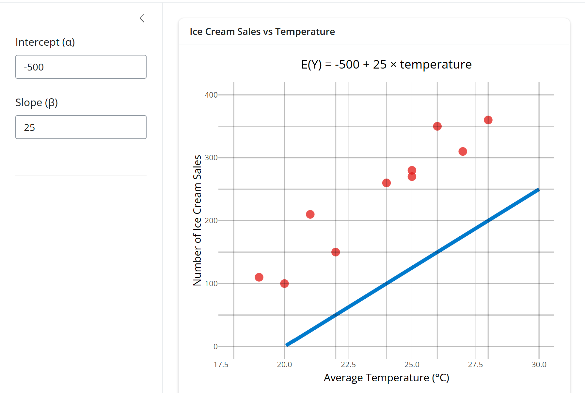
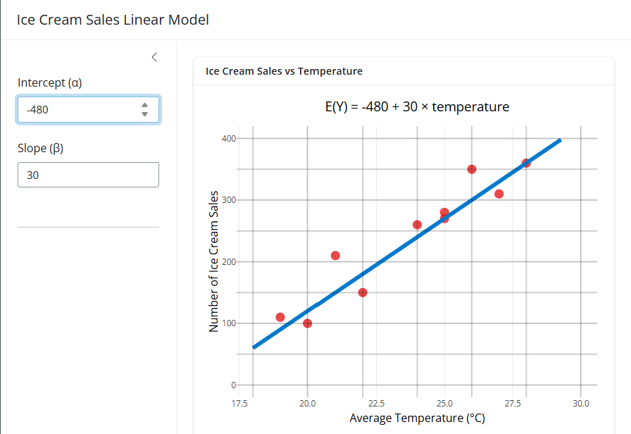
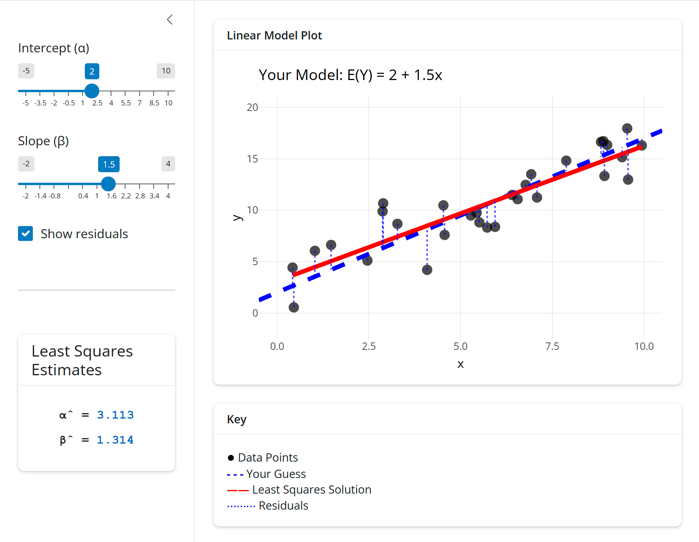

```{r, setup, include = FALSE}
library("webexercises")
```

*Before reading this guide, it is strongly recommended that you read [Guide: Introduction to straight lines] and [Guide: Expected value, variance, standard deviation](expectedvariance.qmd).*

::: {.content-visible when-format="html"}

```{=html}
<table><tr><td style="vertical-align: middle"><strong>Narration of study guide:</strong>&nbsp;&nbsp;</td><td><audio controls><source src="./Narrations/linearregression.mp3" type="audio/mpeg">Your browser does not support the audio element.</audio></tr></table>
```

:::

# What is linear regression? {-}

One of the key purposes of statistics is the understanding of data, which often involves considering the relationships between variables. Typically, this information is split into two categories: 'the thing which is observed' and 'the thing(s) which affect this observation', and a statistician collects information in both categories to build a full picture of the scenario. Then, the statistician tries to explain **how** and **why** a certain outcome is reached - which is incredibly useful for predicting which outcome may be reached in the future!

For instance, if the seaside branch of Cantor's Confectionery had $150$ ice cream sales in one day, and only $30$ in another, they may wish to understand what it was that motivated this change, so that they can have the appropriate number of ice creams in stock. It could be that one of these days was a warm, sunny, summer's Saturday, while the other was a cold, rainy winter's Monday. If you take a sample of the weather, season and day of the week and the corresponding number of ice cream sales across multiple days, you can build a model which allows you to predict the number of ice cream sales on a particular day.

One of the models which describes the relationship between variables is known as **linear regression**. Linear regression finds a **line of best fit** for your data (known as a **regression line**) which can be used to predict outcomes - like the number of ice cream sales. Linear regression is used almost everywhere where predictions need to be made from data; such as economics, medicine, and the social sciences.

This guide will introduce you to linear regression. It will explain how to apply a simple linear regression model to a sample of data by finding the regression line, by using the least squares method. The guide will also explore further practical applications of linear regression, including in the construction of confidence intervals which explains the uncertainty about how closely your sample matches the real-world scenario, and in testing hypotheses about whether some factors impact the overall outcome.

# Simple linear regression

Roughly speaking, variables in statistics fall into two kinds:

- things which you can see, measure, or control
- things which are impacted by the above kind of variables.

These are called **explanatory** and **response variables** respectively:

::: {.callout-note}

## Explanatory and response variables, statistical model

There are two types of variable used in statistical modelling. 

The first is an **explanatory variable**; an independent variable controlled by the user to try and explain the behaviour of the model. These are typically variables that you can observe or measure.

The second is a **response variable**; a dependent variable which changes as any explanatory variables change. 

A **statistical model** uses one or more explanatory variables to attempt to describe the behaviour of a response variable.

:::

You can add or subtract as many explanatory variables as you like in your statistical model. 

::: {.callout-note}

## Definition of linear regression, simple linear regression

A **linear regression model** is a statistical model that attempts to find a **line of best fit** through your data, by representing your response variable as a linear expression (no squared terms) involving one or more explanatory variables.

**Simple linear regression** is a linear regression model used when there is only **one** explanatory variable $x$. The **regression line** predicts the value of the response variable, which is written as $\mathbb{E}(Y)$. 

:::

:::{.callout-tip}

For more on expected values, please see [Guide: Expected value, variance, standard deviation](expectedvariance.qmd). For more about explanatory and response variables, please see [Overview: Statistical notation](../overviews/o-statsnotation.qmd).

:::

To find the equation of the regression line for a population of data, you will need to find the $y$-intercept of the line, which will be written as $\alpha$, and its gradient, which will be described as $\beta$. For more about the equation of a straight line, please read [Guide: Introduction to straight lines].

The equation of the regression line is given by:
$$\mathbb{E}(Y) = \alpha + \beta x$$

In practice, it is impractical to work with an entire population of data; what if there were millions of samples? Instead, statisticians analyze **samples** of the population. This means that you will need to obtain **estimates** for the values of $\alpha$ and $\beta$ from your sample of data. These will be called by $\hat{\alpha}$ and $\hat{\beta}$.

:::{.callout-tip}

$\hat{\alpha}$ and $\hat{\beta}$ are known as **unbiased** estimators of the population **regression parameters** $\alpha$ and $\beta$. Here, 'unbiased' means that the expected value of $\hat{\alpha}$ is the same as $\alpha$ (similar for $\hat{\beta}$ and $\beta$).

For more about biased estimators, please read [Guide: Biased and unbiased estimators]. For a proof that $\hat{\alpha}$ and $\hat{\beta}$ are unbiased estimators, please see [Proof: Simple linear regression].

:::

::: {.callout-note appearance="simple"}

## Example 1

The seaside branch of Cantor's Confectionery wants to statistically model the relationship between temperature ($x$) and ice cream sales ($Y$). To do this, they track the number of ice cream sales in a $10$ day period alongside the peak temperature that day.

| Day number | Peak temperature (°C)    | Number of sales |
|:-----------|:-------------------------|:----------------|
| 1          | 22                       | 150             |
| 2          | 20                       | 100             |
| 3          | 19                       | 110             |
| 4          | 21                       | 210             |
| 5          | 24                       | 260             |
| 6          | 25                       | 280             |
| 7          | 27                       | 310             |
| 8          | 26                       | 350             |
| 9          | 28                       | 360             |
| 10         | 25                       | 270             |

You can define $Y$ to be the random variable describing the number of sales, associated with the explanatory variable $x$ (temperature). Then, you can plot the graph of the simple linear regression model:

$$\mathbb{E}(Y) = \alpha + \beta x$$
:::

::: {.content-visible when-format="html"}

You can use the tool below to observe how changing the values of **regression parameters** affects how closely the **simple linear regression model** fits the observed data. 


```{shinylive-r}
#| standalone: true
#| viewerHeight: 700

library(shiny)
library(bslib)
library(ggplot2)
library(plotly)

# Ice cream sales data
ice_cream_data <- data.frame(
  day = 1:10,
  temperature = c(22, 20, 19, 21, 24, 25, 27, 26, 28, 25),
  sales = c(150, 100, 110, 210, 260, 280, 310, 350, 360, 270)
)

ui <- page_sidebar(
  title = "Ice cream sales linear model",
  fillable = TRUE,
  sidebar = sidebar(
    width = 250,
    numericInput("alpha", "intercept (α)", value = -500, step = 10, width = "100%"),
    numericInput("beta", "gradient (β)", value = 25, step = 1, width = "100%")
  ),
  card(
    full_screen = TRUE,
    card_header("Ice cream sales vs temperature"),
    plotlyOutput("regression_plot", height = "100%"),
    card_footer(
      class = "text-muted",
      p("The scatter plot shows the relationship between temperature and ice cream sales. 
        The blue line represents your fitted linear model: E(Y) = α + βx.
        Adjust the model parameters (α and β) to find the line that best fits the data points. You can
        hover over the graph to see individual datum points.")
    )
  )
)

server <- function(input, output, session) {
  output$regression_plot <- renderPlotly({
    # Create regression line values
    temp_range <- seq(18, 30, length.out = 100)
    predicted_sales <- input$alpha + input$beta * temp_range
    
    # Create the plot
    p <- ggplot() +
      # Add the observed data points
      geom_point(data = ice_cream_data, 
                aes(x = temperature, y = sales),
                size = 3, color = "#E31A1C", alpha = 0.8) +
      # Add the regression line
      geom_line(aes(x = temp_range, y = predicted_sales),
               color = "#007ACC", linewidth = 1.5) +
      labs(
        title = paste("E(Y) =", input$alpha, "+", input$beta, "× temperature"),
        x = "Average temperature (°C)",
        y = "Number of ice cream sales"
      ) +
      xlim(18, 30) +
      ylim(0, 400) +
      theme_minimal() +
      theme(
        plot.title = element_text(size = 14, hjust = 0.5),
        axis.title = element_text(size = 12)
      ) +
      # Add grid lines
      geom_hline(yintercept = seq(0, 400, 50), alpha = 0.2) +
      geom_vline(xintercept = seq(18, 30, 2), alpha = 0.2)
    
    # Convert to plotly for interactivity
    ggplotly(p, tooltip = c("x", "y")) %>%
      layout(autosize = TRUE) %>%
      config(displayModeBar = FALSE)
  })
}

shinyApp(ui, server)
```

The question: 'what values of $\alpha$ and $\beta$ give the best fit?' is precisely the goal of simple linear regression. 

:::

::: {.content-hidden when-format="html"}

The graphs below illustrate how changing the values of the **regression parameters** affects how closely the **simple linear regression model** fits the observed data.





You can see that the line in Figure 2 is much closer to the data points than the line in Figure 1, meaning the equation in Figure 2 is a better fitted linear model.

:::

<!-- You have now seen that there is a connection between the values of the regression parameters and how well the regression line fits the data.  -->

:::{.callout-tip}
There are always a positive whole number $n$ many observations in any sample of data. (You could also write $n\in\mathbb{N}$ to say this.)

If you have a whole number $i$ such that $1 \leq i \leq n$, the $i$^{th} data point on the graph of your data is given by $(x_{i},y_{i})$ and its corresponding estimated value is given by:
$$\mathbb{E}(Y_{i}) = \alpha + \beta x_{i}$$
:::

## Least squares estimation

### Residuals

In practice, it is not always possible to plot the data points on a set of axes and manually tweak the values of the regression parameters until they appear to match the data - especially when you are working with a large sample of data. In addition, this is not a very scientific method for working anything out.

A quantitative method is a far more practical, and also far more correct, way to compute the regression parameters $\alpha$ and $\beta$. You can use **residuals** in the **method of least squares estimation** to find the optimal regression line for your data.

::: {.callout-note appearance="simple"}
## Definition of residuals

The **residual** describes the difference between the **observed** value $y_i$ and the **estimated** value $\mathbb{E}(Y_{i})$. 

Each **residual** is denoted $e_{i}$, where $i$ is a whole number such that $1 \leq i \leq n$, where $n$ is your number of observations.

So, using the equation for $\mathbb{E}(Y_{i})$, you can define the residuals by:

$$e_i = y_i - \mathbb{E}(Y_i) = y_i -  (\alpha + \beta x_{i})$$
:::

:::{.callout-tip}
When plotted on a graph, the residual can be viewed as the vertical difference between the line of best fit and the plotted data point. However, the difference may be positive or negative, which means that the residuals may be positive or negative.
:::

### Method of least squares

Ideally, you want $\mathbb{E}(Y_{i})$ to be as close to your observed data as it possibly can be, so you want the difference between your **observed** data and the data **estimated** by the model to be as small as possible. This is made more difficult because these differences could be negative; adding all of the differences together would then misrepresent how close the data points are to the regression lines. You can get around this by *squaring* the residuals; this makes every quantity positive while still retaining a sense of size. 

To find the values of the regression parameters which achieve this closeness, you can use the **method of least squares** (or **least squares estimation**).

::: {.callout-note appearance="simple"}

## Method of least squares

<!-- **Least squares estimation** is used to minimize the **sum of the squares of the residuals**, which is defined as $S(\alpha,\beta)$.  -->

<!-- You consider the squares of the residuals $e_{i}^{2}$ to ensure that the summed values are always positive.] -->

Taking the sum of each $e_{i}^{2}$, you can define
$$S(\alpha,\beta) = \sum_{i=1}^{n} e_{i}^{2} = \sum_{i=1}^{n}(y_{i} - (\alpha + \beta x_{i}))^{2}$$
The **method of least squares** minimizes this quantity $S(\alpha,\beta)$ to find **estimates** (sometimes known as **point estimates**) for the regression parameters $\hat{\alpha}$ and $\hat{\beta}$. These estimates generate a line of best fit where the average difference between the **observed** data and that **estimated** by the model is **as small as possible**.

:::

::: {.content-visible when-format="html"}

::: {.callout-note appearance="simple"}

## Example 2

Use the tool below to explore how changing the values of the **regression parameters** affects how close the estimated values $\mathbb{E}(Y_i)$ are to the observed values $y_i$. You can see that the residuals are the vertical differences between the observed and expected values. 

:::

```{shinylive-r}
#| standalone: true
#| viewerHeight: 800

library(shiny)
library(ggplot2)
library(bslib)
library(plotly)

ui <- page_sidebar(
  title = "Least squares estimation explorer",
  fillable = TRUE,
  sidebar = sidebar(
    sliderInput("intercept", "Intercept (α)", 
                min = -5, max = 10, value = 2, step = 0.1),
    sliderInput("slope", "Gradient (β)", 
                min = -2, max = 4, value = 1.5, step = 0.1),
    checkboxInput("show_residuals", "Show residuals", value = TRUE),
    hr(),
    card(
      card_header(
        h5("Least squares estimates", style = "margin: 0;")
      ),
      card_body(
        div(
          style = "font-family: 'Courier New', monospace; font-size: 16px; font-weight: bold; text-align: center; padding: 10px;",
          uiOutput("dataInfo")
        )
      )
    )
  ),
  # Stack cards vertically using layout_columns with col_widths = 12
  layout_columns(
    col_widths = 12,
    card(
      card_header("Simple linear regression model plot"),
      card_body(
        plotlyOutput("regPlot", height = "100%")
      ),
      fill = TRUE
    ),
    card(
      card_header("Key"),
      div(
        style = "font-size: 0.9em; line-height: 1.4;",
        tags$div(tags$span("●", style = "color: black; font-size: 1.2em;"), " Data points"),
        tags$div(tags$span("- - -", style = "color: blue; font-weight: bold;"), " Your guess"),
        tags$div(tags$span("——", style = "color: red; font-weight: bold;"), " Least squares estimates"),
        conditionalPanel(
          condition = "input.show_residuals == true",
          tags$div(tags$span("⋯⋯⋯", style = "color: blue;"), " Residuals")
        )
      )
    )
  )
)

server <- function(input, output, session) {
  
  # Generate simulated data
  values <- reactiveValues()
  
  # Initialize data
  observe({
    if (is.null(values$data)) {
      set.seed(123)
      x <- runif(30, 0, 10)
      y <- 1.5 * x + 2 + rnorm(30, 0, 2)
      values$data <- data.frame(x = x, y = y)
      values$lm_model <- lm(y ~ x, data = values$data)
    }
  })
  
  # Data information with better formatting using HTML
  output$dataInfo <- renderUI({
    req(values$lm_model)
    ls_coef <- coef(values$lm_model)
    
    div(
      div(
        HTML(paste0("α̂ = ", span(round(ls_coef[1], 3), style = "color: #0066cc;"))),
        style = "margin-bottom: 8px;"
      ),
      div(
        HTML(paste0("β̂ = ", span(round(ls_coef[2], 3), style = "color: #0066cc;")))
      )
    )
  })
  
  # Interactive plot with hover functionality
  output$regPlot <- renderPlotly({
    req(values$data, values$lm_model)
    d <- values$data
    
    # Calculate predictions
    ls_pred <- predict(values$lm_model)
    guess_pred <- input$slope * d$x + input$intercept
    
    # Create base plot
    p <- ggplot(d, aes(x, y)) +
      geom_point(size = 2, color = "black", alpha = 0.7,
                 aes(text = paste("x:", round(x, 2), "<br>y:", round(y, 2)))) +
      geom_abline(slope = input$slope, intercept = input$intercept,
                  color = "blue", linetype = "dashed", linewidth = 1.5) +
      geom_line(aes(y = ls_pred), color = "red", linewidth = 1.5) +
      labs(
        title = paste("Your Model: E(Y) =", round(input$intercept, 2), "+", 
                     paste0(round(input$slope, 2), "x")),
        x = "x",
        y = "y"
      ) +
      theme_minimal(base_size = 12) +
      xlim(0, 10) +
      ylim(min(d$y) - 2, max(d$y) + 2)
    
    # Add residuals if requested
    if (input$show_residuals) {
      p <- p + geom_segment(aes(xend = x, yend = guess_pred),
                            color = "blue", linetype = "dotted", alpha = 0.7)
    }
    
    # Convert to plotly with hover tooltips
    ggplotly(p, tooltip = "text") %>%
      config(displayModeBar = FALSE) %>%
      layout(autosize = TRUE)
  })
}

shinyApp(ui = ui, server = server)


```

:::


::: {.content-hidden when-format="html"}

::: {.callout-note appearance="simple"}

## Example 2

The graphs below demonstrate how changing the values of the **regression parameters** affects how close the estimated values $\mathbb{E}(Y_i)$ are to the observed values $Y_i$. You can see that the residuals are the vertical differences between the observed and expected values. 

:::




:::

You can see that the regression line which uses the least squares estimates fits the data the closest.

<!-- :::{.callout-tip} -->
<!-- When working with sums, you could use programming languages such as R to save time manually typing each value into a calculator. -->
<!-- ::: -->

### Finding estimates of the regression parameters

Example 2 gave values for the estimates of the regression parameters. So, how can you find estimates for the regression parameters? To do this, you could use the following steps:

#### Step 1: find the sample means

Find the **sample means** $\bar{x}$ and $\bar{y}$ are the **sample means** of $x$ and $y$.

#### Step 2: find the sums of squared differences

The sum of the squared differences between each observation $x_{i}$ and the sample mean $\bar{x}$ is given by: $$SS_{XX} = \sum_{i=1}^{n} (x_{i} - \bar{x})^2$$

The sum of the differences between each observation $x_{i}$ and the sample mean $\bar{x}$, multiplied by the differences between each observation $y_{i}$ and the sample mean $\bar{y}$ is described by: $$SS_{XY} = \sum_{i=1}^{n} (x_{i} - \bar{x})(y_{i} - \bar{y})$$

(For more detail about these terms, please read [Overview: Statistical notation](../overviews/o-notation.qmd).)

#### Step 3: find the least squares estimates

The **least squares estimate** for the regression parameter $\beta$ is therefore:

$$\hat{\beta} = \frac {SS_{XY}} {SS_{XX}} = \frac{ \sum_{i=1}^{n} (x_{i} - \bar{x})(y_{i} - \bar{y})} { \sum_{i=1}^{n} (x_{i} - \bar{x})^{2}}$$

The **least squares estimate** for the regression parameter $\alpha$ is therefore:

$$\hat{\alpha} = \bar{y} - \hat{\beta}\bar{x}$$

:::{.callout-important}

When working with large sums of squares, you could use programming languages (such as R or Python, or even Microsoft Excel) to save time manually typing each value into a calculator!

:::

:::{.callout-tip}

Another way of doing this method is by using calculus. You can differentiate $S(\alpha,\beta)$ with respect to the parameters $\alpha$ and $\beta$ and set these equal to $0$ to find the point at which there is no change in the value of the parameters. These are then the estimates for the parameters. 

For more about partial derivatives, please read [Guide: Introduction to partial differentiation](introtopartialdifferentiation.qmd). For a proof that these really are the values of $\hat{\alpha}$ and $\hat{\beta}$, please see [Proof: Simple linear regression].

:::

Now, here's how to use least squares to best fit the ice-cream data from Cantor's Confectionery. 

::: {.content-visible when-format="html"}

::: {.callout-note appearance="simple"}
## Example 3

In Example 1, you saw the following data from Cantor's Confectionery.

| Day number | Peak temperature (°C)    | Number of sales |
|:-----------|:-------------------------|:----------------|
| 1          | 22                       | 150             |
| 2          | 20                       | 100             |
| 3          | 19                       | 110             |
| 4          | 21                       | 210             |
| 5          | 24                       | 260             |
| 6          | 25                       | 280             |
| 7          | 27                       | 310             |
| 8          | 26                       | 350             |
| 9          | 28                       | 360             |
| 10         | 25                       | 270             |

You defined temperature as the explanatory variable $x$ and the number of ice cream sales as the response variable $Y$. You also saw how changing the values of the regression parameters $\alpha$ and $\beta$ affected how closely the simple linear regression model $\mathbb{E}(Y) = \alpha + \beta x$  fitted the observed data.

Now, let's use **least squares estimation** to estimate the values $\hat{\alpha}$ and $\hat{\beta}$ which best fit the data. You can see that there are $n = 10$ entries in the table. 

**Step 1:** You can use the definition of sample means (as seen in [Overview: Statistical notation](../overviews/o-notation.qmd)) to obtain values of $\bar{x}$ and $\bar{y}$. Here

$$
\begin{aligned}
\bar{x} &= \frac{1}{n} {\sum_{i=1}^{n} x_{i}} = \frac{1}{10} {\sum_{i=1}^{10} x_{i}} = 23.7\\[1em]
\bar{y} &= \frac{1}{n} {\sum_{i=1}^{n} y_{i}} = \frac{1}{10} {\sum_{i=1}^{10} y_{i}} = 240
\end{aligned}
$$

**Step 2:** Now, you can use these sample means to calculate $SS_{XX}$ and $SS_{XY}$:

$$
\begin{aligned}
SS_{XY} &= \sum_{i=1}^{10} (x_{i} - \bar{x})(y_{i} - \bar{y}) = 2460\\[1em]
SS_{XX} &= \sum_{i=1}^{10} (x_{i} - \bar{x})^{2} = 84.1
\end{aligned}
$$

**Step 3:** Finally, using these results, you can find estimates for the regression parameters.

$$\hat{\beta} = \frac {SS_{XY}} {SS_{XX}} = \frac {2460} {84.1} = 29.2509 \quad\textsf{ to 4dp}$$

$$
\begin{aligned}
\hat{\alpha} &= \bar{y} - \hat{\beta}\bar{x}\\ 
&= 240 - 29.2509 \cdot 23.7\\ 
&= -453.2461 \quad\textsf{ to 4dp}
\end{aligned}
$$

:::

:::

::: {.content-hidden when-format="html"}

::: {.callout-note appearance="simple"}
## Example 3

In Example 1, you saw the following data from Cantor's Confectionery.

| Day number | Peak temperature (°C)    | Number of sales |
|:-----------|:-------------------------|:----------------|
| 1          | 22                       | 150             |
| 2          | 20                       | 100             |
| 3          | 19                       | 110             |
| 4          | 21                       | 210             |
| 5          | 24                       | 260             |
| 6          | 25                       | 280             |
| 7          | 27                       | 310             |
| 8          | 26                       | 350             |
| 9          | 28                       | 360             |
| 10         | 25                       | 270             |

You defined temperature as the explanatory variable $x$ and the number of ice cream sales as the response variable $Y$. You also saw how changing the values of the regression parameters $\alpha$ and $\beta$ affected how closely the simple linear regression model $\mathbb{E}(Y) = \alpha + \beta x$  fitted the observed data.

Now, let's use **least squares estimation** to estimate the values $\hat{\alpha}$ and $\hat{\beta}$ which best fit the data. You can see that there are $n = 10$ entries in the table. 

**Step 1:** You can use the definition of sample means (as seen in [Overview: Statistical notation](../overviews/o-notation.qmd)) to obtain values of $\bar{x}$ and $\bar{y}$. Here

$$
\begin{aligned}
\bar{x} &= \frac{1}{n} {\sum_{i=1}^{n} x_{i}} = \frac{1}{10} {\sum_{i=1}^{10} x_{i}} = 23.7\\[1em]
\bar{y} &= \frac{1}{n} {\sum_{i=1}^{n} y_{i}} = \frac{1}{10} {\sum_{i=1}^{10} y_{i}} = 240
\end{aligned}
$$

:::

 

::: {.callout-note appearance="simple"}
## Example 3 (continued)

**Step 2:** Now, you can use these sample means to calculate $SS_{XX}$ and $SS_{XY}$:

$$
\begin{aligned}
SS_{XY} &= \sum_{i=1}^{10} (x_{i} - \bar{x})(y_{i} - \bar{y}) = 2460\\[1em]
SS_{XX} &= \sum_{i=1}^{10} (x_{i} - \bar{x})^{2} = 84.1
\end{aligned}
$$

**Step 3:** Finally, using these results, you can find estimates for the regression parameters.

$$\hat{\beta} = \frac {SS_{XY}} {SS_{XX}} = \frac {2460} {84.1} = 29.2509 \quad\textsf{ to 4dp}$$

$$
\begin{aligned}
\hat{\alpha} &= \bar{y} - \hat{\beta}\bar{x}\\ 
&= 240 - 29.2509 \cdot 23.7\\ 
&= -453.2461 \quad\textsf{ to 4dp}
\end{aligned}
$$

:::

:::

## Where to from here?

First things first, it was mentioned that you really don't want to do this method by hand. Luckily, the STARMAST team has provided the following:

:::{.callout-tip}

You can use [Calculator: Simple linear regression](../apps/calculators/c-simplelinearregression.qmd) to calculate $\hat{\alpha}$ and $\hat{\beta}$.

:::

Now, what else is there?

### Likelihood estimation

As you saw earlier, the observations $y_{1}, \ldots , y_{n}$ are representatives of random variables $Y_1,\ldots,Y_n$ and these random variables therefore be assumed to follow a probability distribution. Since the observations $y_{1}, \ldots , y_{n}$ are functions of the regression parameters $\alpha,\beta$, the least squares estimates for the regression parameters $\hat{\alpha}$ and $\hat{\beta}$ are also random variables. For more information about this, please see [Guide: Maximum likelihood estimation].

### Probability distributions and confidence intervals

Since the least squares estimates $\hat{\alpha}$ and $\hat{\beta}$ are random variables, you can assume that these also follow a probability distribution. For more information about the types of probability distributions which your data could follow, please read [Overview: Probability distributions](../overviews/o-distributions.qmd).

:::{.callout-important}

Before you can assume that your data follows a particular distribution, you must check whether your data aligns with the assumptions which underpin this distribution.

:::

It is useful for your regression parameters to follow probability distributions because it allows you to construct confidence intervals and test hypotheses about them. Constructing confidence intervals for the regression parameters enables you to construct a plausible range of values, within which it is likely that your estimation lies. This recognizes the uncertainty as to how closely your sample matches the real-life scenario. (On [Calculator: Simple linear regression](../apps/calculators/c-simplelinearregression.qmd), this uncertainty is present in a shaded portion around the regression line.)

For more information about confidence intervals, please read [Guide: Confidence intervals](confidenceintervals.qmd).

To learn how to apply these ideas to data which follow a **normal distribution**, please read [Guide: Normal linear regression].

### Correlation and determination coefficients

Linear regression is all about finding the regression line to try and model your data. You can measure how well your data is approximated by a line of best fit by using a **correlation coefficient**. Correlation coefficients tell you how much of the variability of your response variable $Y$ is explained by your linear model. You can then use one or many correlation coefficients to find the **coefficient of determination**. This is a positive number ranging from $0$ to $1$, and tells you how much of the variation in the response variable is due to changes in the explanatory variables.

For simple linear regression on a data set of size $n$, you can find the $R^2$ coefficient of determination by using the following formula: $$R^2 = 1 - \dfrac{S(\hat{\alpha},\hat{\beta})}{SS_{YY}}$$ where 

- $\displaystyle S(\hat{\alpha},\hat{\beta})$, the minimum value of the sum of squares of residuals, with $\hat{\alpha},\hat{\beta}$ determined by the least squares method given above;
- $\displaystyle SS_{YY} = \sum_{i=1}^{n} (y_{i} - \bar{y})^{2}$, the total sum of squares of the vertical differences (which is related to the variance of the random variable $Y$).

Here, you can see that if the residuals are all $0$, then $S(\hat{\alpha},\hat{\beta})$ is exactly $0$ and so $R^2 = 1$, meaning that the regression line $\mathbb{E}(Y) = \hat{\alpha} + \hat{\beta}x$ perfectly represents the data. A good rule to follow in simple linear regression is that the closer a coefficient of determination is to $1$, the better the data is represented by a linear model.

:::{.callout-tip}

[Calculator: Simple linear regression](../apps/calculators/c-simplelinearregression.qmd) calculates the $R^2$ coefficient of determination for you.

:::

For more about correlation coefficients and the $R^2$ coefficient of determination, please see [Guide: Correlation coefficients] and [Guide: Coefficient of determination].

### Multiple linear regression

The idea of testing hypotheses is particularly useful when there are multiple explanatory variables, because you can test whether some of them are equal to zero - and if so, they can be discounted. This reduces the complexity of the linear regression model, meaning it is more transferable to new data. 

For more on this, please read [Guide: Introduction to multiple linear regression].

# Quick check problems

<!-- add facility for webexercises to work on html -->

:::: {.content-visible when-format="html" data-topic="LR1"}
<!-- add facility to check answers at end rather than one at a time -->

::: {.webex-check .webex-box}
1. Which of these is the equation of a linear regression model?

(a) $\mathbb{E}(Y) = \alpha + \beta x_{i}$

(b) $\hat{\alpha} = \bar{y} - \hat{\beta}\bar{x}$

(c) $\hat{\beta} = \frac {SS_{XY}} {SS_{XX}}$

Answer: `r mcq(c(answer="a", "b", "c"))`.

2. What is the name of the type of linear regression with one explanatory variable?

Answer: `r mcq(c("Independent", answer = "Simple", "Single"))`.

3.  Are the following statements true or false?

(a) $e_i$ is used to describe a residual. Answer: `r torf(TRUE)`.

(b) To use linear regression, your data must be normally distributed. Answer: `r torf(FALSE)`.

(c) The regression parameter $\alpha$ can be equal to zero. Answer: `r torf(TRUE)`.

(d) If the $R^2$ coefficient of determination is equal to $0$, the data is perfectly represented by a simple linear regression model. Answer: `r torf(FALSE)`.

:::
::::

::: {.content-hidden when-format="html"}
1.  Which of these is the equation of a linear regression model?

<!-- -->
(a) $\mathbb{E}(Y) = \alpha + \beta x_{i}$

(b) $\hat{\alpha} = \bar{y} - \hat{\beta}\bar{x}$

(c) $\hat{\beta} = \frac {SS_{XY}} {SS_{XX}}$

2.  What is the name of the linear regression model which has one explanatory variable?

3.  Are the following statements true or false?

(a) $e_i$ is used to describe a residual.

(b) To use linear regression, your data must be normally distributed.

(c) The regression parameter $\alpha$ can be equal to zero.

(d) If the $R^2$ coefficient of determination is equal to $0$, the data is perfectly represented by a simple linear regression model.
:::


# Further reading {-}

For more questions on the subject, please go to [Questions: Introduction to linear regression](../questions/qs-linearregression.qmd).

You can work out a simple linear regression model for a data set by using [Calculator: Simple linear regression](../apps/calculators/c-simplelinearregression.qmd).

For more about why the formulas in this sheet are true, please see [Proof: Simple linear regression].

To learn about normal linear regression, please read [Guide: Normal linear regression].

To extend linear regression to encompass multiple explanatory variables, please read [Guide: Introduction to multiple linear regression].

## Version history {-}

v1.0: initial version created 12/25 by Flora Green as part of a University of St Andrews VIP project.
  
[This work is licensed under CC BY-NC-SA 4.0.](https://creativecommons.org/licenses/by-nc-sa/4.0/?ref=chooser-v1)

