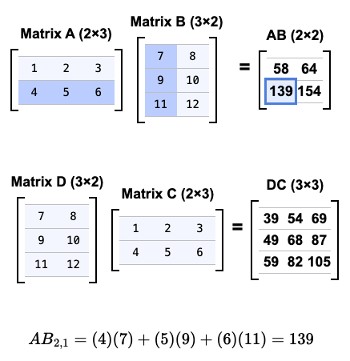
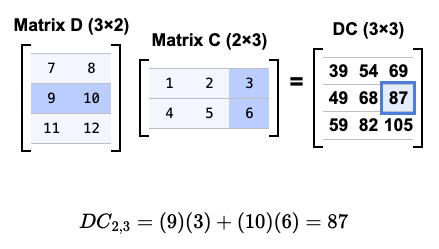

```{r, setup, include = FALSE}
library("webexercises")
```

*Before reading this guide, it is strongly recommended that you read [Guide: Introduction to matrices](introtomatrices.qmd).*

::: {.content-visible when-format="html"}

```{=html}
<table><tr><td style="vertical-align: middle"><strong>Narration of study guide:</strong>&nbsp;&nbsp;</td><td><audio controls><source src="./Narrations/matrixmultiplication.mp3" type="audio/mpeg">Your browser does not support the audio element.</audio></tr></table>
```

:::


# What is matrix multiplication? {.unnumbered}

A matrix is a rectangular array or table, with entries in rows and columns. Understanding matrices can make solving systems of linear equations more efficient and opens the door to doing mathematics in many dimensions.

::: callout-note
## Definition of a matrix

A $m \times n$ **matrix** is a rectangular array of $mn$ entries set out in $m$ **rows** and $n$ **columns**. You can write it like so:

$$
\begin{bmatrix}
a_{11} & a_{12} & \cdots & a_{1n} \\
a_{21} & a_{22} & \cdots & a_{2n} \\
\vdots & \vdots & \ddots & \vdots \\
a_{m1} & a_{m2} & \cdots & a_{mn}
\end{bmatrix}
$$

This matrix has **dimension** $m \times n$.
:::

The entries in a matrix are usually numbers, but they can be other mathematical objects. Any type of number may be an entry in your matrix, positive or negative, rational or irrational, real or complex. Note here that while entries can be other mathematical objects, for this study guide you will use entries within the real numbers.

<!-- If complex numbers are unfamiliar to you, you can read more about them at [Guide: Introduction to complex numbers]. -->

Matrices are a fundamental tool within linear algebra, and they have a wide range of real-life applications. They are used in computer graphics, data analysis, search engine optimization, cryptography, economics, robotics, genetics, quantum mechanics, and many more places. Matrices are used anywhere where information in multiple variables needs to be analyzed and calculated efficiently. 

A key skill in matrix arithmetic is **matrix multiplication**. This is different from the scalar multiplication that you saw in [Guide: Introduction to matrices](introtomatrices.qmd), in that instead of multiplying a matrix by a constant, you are multiplying a matrix by **another matrix**. In this guide, you will see how and when you can multiply together two matrices, as well as how matrix multiplication interacts with other arithmetic operations as seen in  [Guide: Introduction to matrices](introtomatrices.qmd).

# Initial example: $2\times 2$ matrices

First, let's see how you can multiply two $2 \times 2$ matrices via an example. Let $A$ and $B$ be $2 \times 2$ matrices with entries given below:

$$A =
\begin{bmatrix} 
1 & -1 \\ 
2 & 1
\end{bmatrix} \quad B =\begin{bmatrix} 
3 & 0 \\ 
1 & -1 
\end{bmatrix}$$

How can you find their product $AB$? Since a matrix is defined by its entries, you could think about working out each entry. The idea for the $(i,j)$th entry is to find a 'product' of the $i$th row of $A$ by the $j$th column of $B$.

For the $(1,1)$th entry of $AB$, you can match the $1$st row of $A$ to the $1$st column of $B$, multiply the matched entries together, and add up all the entries. The first row of $A$ is $\begin{matrix}1 & -1\end{matrix}$, and the first column of $B$ is $\begin{matrix}3 & 1\end{matrix}$. Here, $1$ (from $A$) and $3$ (from $B$) are matched, and $-1$ (from $A$) and $1$ (from $B$) are matched. Multiplying these together and adding gives $$[AB]_{1,1} = 1\cdot 3 + (-1)\cdot 1 = 3 - 1 = 2$$

This process is illustrated in the following equation, with the appropriate row and column highlighted in bold: 

$$AB =
\begin{bmatrix} 
\mathbf{1} & \mathbf{-1} \\ 
2 & 1 
\end{bmatrix}\begin{bmatrix} 
\mathbf{3} & 0 \\ 
\mathbf{1} & -1 
\end{bmatrix} = \begin{bmatrix}1\cdot 3 + (-1)\cdot 1 & \\ & \end{bmatrix} = \begin{bmatrix}2 & \\ & \end{bmatrix}$$

You can now repeat this process to find the other entries. For the $(1,2)$th entry of $AB$, you can match the $1$st row of $A$ to the $2$nd column of $B$, multiply the matched entries together, and add up all the entries. Doing this in the matrix with the appropriate values highlighted in bold gives 

$$AB =
\begin{bmatrix} 
\mathbf{1} & \mathbf{-1} \\ 
2 & 1 
\end{bmatrix}\begin{bmatrix} 
3 & \mathbf{0} \\ 
1 & \mathbf{-1} 
\end{bmatrix} = \begin{bmatrix}2 & 1\cdot 0 + (-1)\cdot (-1)\\ & \end{bmatrix} = \begin{bmatrix}2 & 1\\ & \end{bmatrix}$$

For the $(2,1)$th entry of $AB$, you can match the $2$nd row of $A$ to the $1$st column of $B$. Doing this in the matrix with the appropriate values highlighted in bold gives 

$$AB =
\begin{bmatrix} 
1 & -1 \\ 
\mathbf{2} & \mathbf{1} 
\end{bmatrix}\begin{bmatrix} 
\mathbf{3} & 0 \\ 
\mathbf{1} & -1 
\end{bmatrix} = \begin{bmatrix}2 & 1\\ 2\cdot 3 + 1\cdot 1& \end{bmatrix} = \begin{bmatrix}2 & 1\\ 7 & \end{bmatrix}$$

Finally, for the $(2,2)$th entry of $AB$, you can match the $2$nd row of $A$ to the $2$nd column of $B$. Doing this in the matrix with the appropriate values highlighted in bold gives 

$$AB =
\begin{bmatrix} 
1 & -1 \\ 
\mathbf{2} & \mathbf{1} 
\end{bmatrix}\begin{bmatrix} 
3 & \mathbf{0} \\ 
1 & \mathbf{-1} 
\end{bmatrix} = \begin{bmatrix}2 & 1\\ 7 & 2\cdot 0 + 1\cdot (-1)\end{bmatrix} = \begin{bmatrix}2 & 1\\ 7 & -1\end{bmatrix}$$

and this is your final answer!

This process can be generalised to any two $2\times 2$ matrices.

:::{.callout-note}

## Multiplying $2\times 2$ matrices

Suppose that 
$$A =
\begin{bmatrix} 
a & b \\ 
c & d 
\end{bmatrix} \quad\textsf{ and }\quad B =\begin{bmatrix} 
e & f \\ 
g & h 
\end{bmatrix}$$
are two $2\times 2$ matrices. Then their product $AB$ is the matrix $$AB = \begin{bmatrix} 
a & b \\ 
c & d 
\end{bmatrix}\begin{bmatrix} 
e & f \\ 
g & h 
\end{bmatrix} = 
\begin{bmatrix}ae + bg & af + 
bh \\ ce + dg & cf + dh \end{bmatrix}$$

:::

:::{.callout-important}

Going ahead, it's more important to **learn the process** of how this formula is found, rather than learn the formula itself. This is because this process can be extended to work out general matrix multiplication, and not every matrix is a $2\times 2$ matrix!

:::

:::{.callout-tip}

The 'product' of the $i$th row of $A$ and the $j$th column of $B$ to form the $(i,j)$th entry of $AB$ can be recognised as the **scalar product** of the vectors given by $i$th row of $A$ and the $j$th column of $B$. For more on the scalar product, please see [Guide: The scalar product](scalarproduct.qmd).

:::

 

<!-- Here you can see that in order to calculate the first entry of $C$ you multiply the corresponding elements from the first row of $A$ by the elements from the first column of $B$, and sum together the results. -->

::: {.callout-note appearance="simple"}

## Example 1

Let $A$ and $B$ be the following two $2\times 2$ matrices.
$$A =\begin{bmatrix} 
1 & 2 \\ 
3 & 4 
\end{bmatrix} \quad\textsf{ and }\quad B =
\begin{bmatrix} 
0 & 5 \\ 
6 & 7 
\end{bmatrix}$$

You can follow the process illustrated above to write

$$AB = \begin{bmatrix} 
1 & 2 \\ 
3 & 4 
\end{bmatrix}\begin{bmatrix} 
0 & 5 \\ 
6 & 7 
\end{bmatrix} =
\begin{bmatrix} 
1 \cdot 0 + 2 \cdot 6 & 1 \cdot 5 + 2 \cdot 7 \\ 
3 \cdot 0 + 4 \cdot 6 & 3 \cdot 5 + 4 \cdot 7 
\end{bmatrix}$$

By carrying out these calculations you will have,
$$AB=\begin{bmatrix} 
0 + 12 & 5 + 14 \\ 
0 + 24 & 15 + 28 
\end{bmatrix}=\begin{bmatrix} 
12 & 19 \\ 
24 & 43 
\end{bmatrix}$$

:::

Unlike for numbers, the **order** of multiplication matters in matrix multiplication. This is because you take the rows from the left matrix in the product, and columns from the right matrix; these could be different if the order swaps between the left and right matrices! You can see this in the following example. 

::: {.callout-note appearance="simple"}
## Example 2

Using the $A$ and $B$ from Example 1, you can compute $BA$:

$$BA = \begin{bmatrix} 
0 & 5 \\ 
6 & 7 
\end{bmatrix}\begin{bmatrix} 
1 & 2 \\ 
3 & 4 
\end{bmatrix} =
\begin{bmatrix} 
0 \cdot 1 + 5 \cdot 3 & 0 \cdot 2 + 5 \cdot 4 \\ 
6 \cdot 1 + 7 \cdot 3 & 6 \cdot 2 + 7 \cdot 4 
\end{bmatrix}$$
By carrying out these calculations you will have,
$$BA=\begin{bmatrix} 
0 + 15 & 0 + 20 \\ 
6 + 21 & 12 + 28 
\end{bmatrix}=BA=\begin{bmatrix} 
15 & 20 \\ 
27 & 40 
\end{bmatrix}$$

You can compare $AB$ and $BA$.

$$AB =\begin{bmatrix} 
12 & 19 \\ 
24 & 43 
\end{bmatrix}, \quad BA =
\begin{bmatrix} 
15 & 20 \\ 
27 & 40 
\end{bmatrix}$$
and here, **none** of the entries match! Since $AB \neq BA$, this example confirms that **matrix multiplication is not commutative** in general.

:::

# Generalizing to all matrices

Not all matrices are $2\times 2$ matrices. How would you multiply two $3\times 3$ matrices? Or two $40\times 40$ matrices? 

The idea in multiplying $2\times 2$ matrices was the following: 

> The idea for the $(i,j)$th entry is to find a 'product' of the $i$th row of $A$ by the $j$th column of $B$. This is done by matching entries in the $i$th row of $A$ to entries in the $j$th column of $B$, multiplying the matched entries, and adding them all together.

This applies to matrices $A$ and $B$ of any dimensions, **provided that there is a match for all the entries in the $i$th row of $A$ to the $j$th column of $B$**. What this means is that two matrices $A$ and $B$ can be multiplied together *if and only if* **the number of columns of $A$ equals the number of rows of $B$**. This is because the number of entries in the $i$th row of $A$ is the same as the number of columns of $A$, and the number of entries in the $j$th column of $B$ is the same as the number of rows of $B$.

Here is a definition of matrix multiplication for more general matrices.

:::{.callout-note}
## Definition of matrix multiplication

Let $A$ be an $m \times n$ matrix and $B$ be an $n \times p$ matrix:

$$A = \begin{bmatrix} a_{11} & a_{12} & \cdots & a_{1n} \\ 
a_{21} & a_{22} & \cdots & a_{2n} \\ 
\vdots & \vdots & \ddots & \vdots \\ 
a_{m1} & a_{m2} & \cdots & a_{mn} 
\end{bmatrix} \quad B = \begin{bmatrix} b_{11} & b_{12} & \cdots & b_{1p} \\ 
b_{21} & b_{22} & \cdots & b_{2p} \\ 
\vdots & \vdots & \ddots & \vdots \\ 
b_{n1} & b_{n2} & \cdots & b_{np} 
\end{bmatrix}$$

The product $C = AB$ is an $m \times p$ matrix, where each entry $c_{ij}$ of $C$ is given by the following summation formula:

$$
\begin{aligned}
c_{ij} &= a_{i1}b_{1j} + a_{i2}b_{2j} + \ldots + a_{in}b_{nj}\\[0.5em]
&= \sum_{k=1}^{n} a_{ik} b_{kj}
\end{aligned}
$$
In the context of vectors, this is the scalar product of the $i$th row of $A$ with the $j$th column of $B$. You can read more about this at [Guide: The scalar product](scalarproduct.qmd).

:::

For more about the sigma notation in this definition, you can read more about it in [Guide: Introduction to sigma notation](sigmanotation.qmd). It's important to remember:

:::{.callout-warning}
You can only multiply matrices $A$ and $B$ if $A$ has the same number of columns as $B$ has rows, otherwise this operation is **undefined**.
:::

:::{.callout-warning}
As seen in Example 2, matrix multiplication is **non-commutative**. This means that it is not always true for matrices that $AB = BA$. In fact, in some cases, $AB$ may be defined when $BA$ is not defined.
:::

::: {.content-visible when-format="html"}

To take a better look at this unusual property, you can now see some examples of this in action. You can use the interactive figure below to investigate multiplying a $2\times 3$ matrix by a $3\times 2$ matrix (and the other way around). You are able to change the numbers inside the matrices $A,B,C,D$ by clicking on the entry you want to change. 

```{=html}

<!DOCTYPE html>

<html lang="en">
<head>
<meta charset="UTF-8">
<title>Accessible Matrix Multiplication</title>

<script src="https://cdn.jsdelivr.net/npm/mathjax@3/es5/tex-mml-chtml.js"></script>

<style>
  body {
    font-family: Arial, sans-serif;
  }

  .matrix-figure {
    background-color: white;
    color: black;
    text-align: center;
    padding: 20px;
  }

  .matrix-row {
    display: flex;
    justify-content: center;
    align-items: center;
    gap: 20px;
    margin-bottom: 60px;
    flex-wrap: wrap;
  }

  .matrix-label {
    font-weight: bold;
    margin-bottom: 5px;
  }

  .matrix-wrapper {
    display: flex;
    flex-direction: column;
    align-items: center;
  }

  .matrix {
    position: relative;
    display: inline-block;
  }

  .matrix table {
    border-collapse: collapse;
  }

  .matrix td {
    padding: 0;
    min-width: 30px;
    text-align: center;
  }

  .matrix input {
    width: 40px;
    text-align: center;
    border: none;
    font-family: monospace;
    font-size: 14px;
    padding: 4px;
  }

  #matrixAB td {
    min-width: 35px;
    font-size: 18px;
    font-weight: bold;
  }

  .matrix::before,
  .matrix::after {
    content: "";
    position: absolute;
    top: 0;
    bottom: 0;
    width: 10px;
    border-top: 2px solid black;
    border-bottom: 2px solid black;
  }

  .matrix::before {
    left: -10px;
    border-left: 2px solid black;
  }

  .matrix::after {
    right: -10px;
    border-right: 2px solid black;
  }

  .equals-sign {
    font-size: 24px;
    font-weight: bold;
  }

  .result-cell {
    font-weight: bold;
    cursor: pointer;
    outline: none;
  }

  /* Focus style for keyboard users */
  .result-cell:focus {
    outline: 3px solid #4a90e2;
    background-color: #e6f0ff;
  }

  .highlight-row input,
  .highlight-col input {
    background-color: #c0d6ff !important;
  }

  .explanation {
    margin-bottom: 20px;
  }
</style>

</head>

<body>

<div class="matrix-figure">
  <div class="explanation">
    Click or use keyboard (Tab + Enter) on result cells to see how values are calculated.
  </div>

  <!-- AB -->

  <div class="matrix-row">
    <div class="matrix-wrapper">
      <div class="matrix-label">Matrix A (2×3)</div>
      <div class="matrix">
        <table id="matrixA">
          <tr><td><input value="1"></td><td><input value="2"></td><td><input value="3"></td></tr>
          <tr><td><input value="4"></td><td><input value="5"></td><td><input value="6"></td></tr>
        </table>
      </div>
    </div>

<div class="matrix-wrapper">
  <div class="matrix-label">Matrix B (3×2)</div>
  <div class="matrix">
    <table id="matrixB">
      <tr><td><input value="7"></td><td><input value="8"></td></tr>
      <tr><td><input value="9"></td><td><input value="10"></td></tr>
      <tr><td><input value="11"></td><td><input value="12"></td></tr>
    </table>
  </div>
</div>

<div class="equals-sign">=</div>

<div class="matrix-wrapper">
  <div class="matrix-label">AB (2×2)</div>
  <div class="matrix">
    <table id="matrixAB" role="grid">
      <tr>
        <td class="result-cell" tabindex="0" data-row="0" data-col="0" aria-label="AB row 1 column 1">58</td>
        <td class="result-cell" tabindex="0" data-row="0" data-col="1" aria-label="AB row 1 column 2">64</td>
      </tr>
      <tr>
        <td class="result-cell" tabindex="0" data-row="1" data-col="0" aria-label="AB row 2 column 1">139</td>
        <td class="result-cell" tabindex="0" data-row="1" data-col="1" aria-label="AB row 2 column 2">154</td>
      </tr>
    </table>
  </div>
</div>

  </div>

  <!-- DC -->

  <div class="matrix-row">
    <div class="matrix-wrapper">
      <div class="matrix-label">Matrix D (3×2)</div>
      <div class="matrix">
        <table id="matrixD">
          <tr><td><input value="7"></td><td><input value="8"></td></tr>
          <tr><td><input value="9"></td><td><input value="10"></td></tr>
          <tr><td><input value="11"></td><td><input value="12"></td></tr>
        </table>
      </div>
    </div>

<div class="matrix-wrapper">
  <div class="matrix-label">Matrix C (2×3)</div>
  <div class="matrix">
    <table id="matrixC">
      <tr><td><input value="1"></td><td><input value="2"></td><td><input value="3"></td></tr>
      <tr><td><input value="4"></td><td><input value="5"></td><td><input value="6"></td></tr>
    </table>
  </div>
</div>

<div class="equals-sign">=</div>

<div class="matrix-wrapper">
  <div class="matrix-label">DC (3×3)</div>
  <div class="matrix">
    <table id="matrixDC" role="grid">
      <tr>
        <td class="result-cell" tabindex="0" data-row="0" data-col="0">39</td>
        <td class="result-cell" tabindex="0" data-row="0" data-col="1">54</td>
        <td class="result-cell" tabindex="0" data-row="0" data-col="2">69</td>
      </tr>
      <tr>
        <td class="result-cell" tabindex="0" data-row="1" data-col="0">49</td>
        <td class="result-cell" tabindex="0" data-row="1" data-col="1">68</td>
        <td class="result-cell" tabindex="0" data-row="1" data-col="2">87</td>
      </tr>
      <tr>
        <td class="result-cell" tabindex="0" data-row="2" data-col="0">59</td>
        <td class="result-cell" tabindex="0" data-row="2" data-col="1">82</td>
        <td class="result-cell" tabindex="0" data-row="2" data-col="2">105</td>
      </tr>
    </table>
  </div>
</div>
  </div>

  <div id="explanation"></div>
</div>

<script>
function parseMatrix(table) {
  return Array.from(table.rows).map(row =>
    Array.from(row.cells).map(cell =>
      parseFloat(cell.querySelector("input")?.value || 0)
    )
  );
}

function updateProduct(A, B, outId) {
  const resultTable = document.getElementById(outId);
  for (let i = 0; i < A.length; i++) {
    for (let j = 0; j < B[0].length; j++) {
      let sum = 0;
      for (let k = 0; k < B.length; k++) {
        sum += A[i][k] * B[k][j];
      }
      resultTable.rows[i].cells[j].textContent = sum;
    }
  }
}

function highlight(row, col, leftId, rightId) {
  clearHighlights();
  const left = document.getElementById(leftId).rows;
  const right = document.getElementById(rightId).rows;

  for (let i = 0; i < left[row].cells.length; i++) {
    left[row].cells[i].classList.add("highlight-row");
  }

  for (let i = 0; i < right.length; i++) {
    right[i].cells[col].classList.add("highlight-col");
  }
}

function clearHighlights() {
  document.querySelectorAll("td").forEach(td =>
    td.classList.remove("highlight-row", "highlight-col")
  );
}

function explain(name, A, B, row, col) {
  const rowVals = A[row];
  const colVals = B.map(r => r[col]);
  const terms = rowVals.map((a, i) => `(${a})(${colVals[i]})`);
  const result = rowVals.reduce((acc, a, i) => acc + a * colVals[i], 0);

  document.getElementById("explanation").innerHTML =
    `\\[${name}_{${row+1},${col+1}} = ${terms.join(" + ")} = ${result}\\]`;

  MathJax.typesetPromise();
}

function activate(cell, leftId, rightId, name, A, B) {
  const row = +cell.dataset.row;
  const col = +cell.dataset.col;
  highlight(row, col, leftId, rightId);
  explain(name, A, B, row, col);
}

function handleKeys(e, cell, tableId, callback) {
  if (e.key === "Enter" || e.key === " ") {
    e.preventDefault();
    callback();
  }

  const row = +cell.dataset.row;
  const col = +cell.dataset.col;
  const table = document.getElementById(tableId);

  let r = row, c = col;

  if (e.key === "ArrowRight") c++;
  if (e.key === "ArrowLeft") c--;
  if (e.key === "ArrowDown") r++;
  if (e.key === "ArrowUp") r--;

  if (table.rows[r] && table.rows[r].cells[c]) {
    e.preventDefault();
    table.rows[r].cells[c].focus();
  }
}

function init() {
  const updateAll = () => {
    const A = parseMatrix(matrixA);
    const B = parseMatrix(matrixB);
    const C = parseMatrix(matrixC);
    const D = parseMatrix(matrixD);

    updateProduct(A, B, "matrixAB");
    updateProduct(D, C, "matrixDC");
  };

  document.querySelectorAll("input").forEach(i =>
    i.addEventListener("input", () => {
      clearHighlights();
      explanation.innerHTML = "";
      updateAll();
    })
  );

  document.querySelectorAll("#matrixAB .result-cell").forEach(cell => {
    cell.addEventListener("click", () => {
      activate(cell, "matrixA", "matrixB", "AB",
        parseMatrix(matrixA), parseMatrix(matrixB));
    });

    cell.addEventListener("keydown", e => {
      handleKeys(e, cell, "matrixAB", () =>
        activate(cell, "matrixA", "matrixB", "AB",
          parseMatrix(matrixA), parseMatrix(matrixB))
      );
    });
  });

  document.querySelectorAll("#matrixDC .result-cell").forEach(cell => {
    cell.addEventListener("click", () => {
      activate(cell, "matrixD", "matrixC", "DC",
        parseMatrix(matrixD), parseMatrix(matrixC));
    });

    cell.addEventListener("keydown", e => {
      handleKeys(e, cell, "matrixDC", () =>
        activate(cell, "matrixD", "matrixC", "DC",
          parseMatrix(matrixD), parseMatrix(matrixC))
      );
    });
  });

  updateAll();
}

init();
</script>

</body>
</html>


```

:::

:::{.content-hidden when-format="html"}

To take a better look at this unusual property, you can look at the two figures below. 

{width="70%"}

{width="70%"}

:::

:::{.content-hidden when-format="pdf"}

:::{.callout-note appearance="simple"}

## Example 3

Let $A$ be a $2 \times 3$ matrix and $B$ be a $3 \times 2$ matrix.

$$A = \begin{bmatrix} 
-2 & 1 & 3 \\ 
4 & -5 & 2
\end{bmatrix} \quad\textsf{ and }\quad B =\begin{bmatrix} 
3 & -1 \\ 
-2 & 5 \\ 
1 & -2
\end{bmatrix}$$

You can work out the product $AB$. Since $A$ is $2 \times 3$ and $B$ is $3 \times 2$, the product $AB$ is a $2 \times 2$ matrix. You can work out each entry of $AB$ by following the row and column matching as described above.

$$
\begin{aligned}
AB &=
\begin{bmatrix} 
\mathbf{-2} & \mathbf{1} & \mathbf{3} \\ 
4 & -5 & 2
\end{bmatrix}\begin{bmatrix} 
\mathbf{3} & -1 \\ 
\mathbf{-2} & 5 \\ 
\mathbf{1} & -2
\end{bmatrix}\\[0.5em]
&= \begin{bmatrix}(-2)\cdot 3 + 1\cdot(-2) + 3\cdot 1 & \\ & \end{bmatrix} = \begin{bmatrix}-5 & \\ & \end{bmatrix}
\end{aligned}
$$

For the $(1,2)$th entry of $AB$, use the first row of $A$ and the second column of $B$. 

$$
\begin{aligned}
AB &=
\begin{bmatrix} 
\mathbf{-2} & \mathbf{1} & \mathbf{3} \\ 
4 & -5 & 2
\end{bmatrix}\begin{bmatrix} 
3 & \mathbf{-1} \\ 
-2 & \mathbf{5} \\ 
1 & \mathbf{-2}
\end{bmatrix}\\[0.5em]
&= \begin{bmatrix}-5 & (-2)\cdot (-1) + 1\cdot 5 + 3\cdot (-2) \\ & \end{bmatrix} = \begin{bmatrix}-5 & 1\\ & \end{bmatrix}
\end{aligned}
$$

For the $(2,1)$th entry of $AB$, you can match the $2$nd row of $A$ to the $1$st column of $B$. 

$$
\begin{aligned}
AB &=
\begin{bmatrix} 
-2 & 1 & 3 \\ 
\mathbf{4} & \mathbf{-5} & \mathbf{2}
\end{bmatrix}\begin{bmatrix} 
\mathbf{3} & -1 \\ 
\mathbf{-2} & 5 \\ 
\mathbf{1} & -2
\end{bmatrix}\\[0.5em]
&= \begin{bmatrix}-5 & 1\\ 4\cdot 3 + (-5)\cdot (-2) + 2\cdot 1 & \end{bmatrix} = \begin{bmatrix}-5 & 1\\ 24 & \end{bmatrix}
\end{aligned}
$$

Finally, for the $(2,2)$th entry of $AB$, you can match the $2$nd row of $A$ to the $2$nd column of $B$.

$$
\begin{aligned}
AB &=
\begin{bmatrix} 
-2 & 1 & 3 \\ 
\mathbf{4} & \mathbf{-5} & \mathbf{2}
\end{bmatrix}\begin{bmatrix} 
3 & \mathbf{-1} \\ 
-2 & \mathbf{5} \\ 
1 & \mathbf{-2}
\end{bmatrix}\\[0.5em]
&= \begin{bmatrix}-5 & 1\\ 24 & 4\cdot (-1) + (-5)\cdot 5 + 2\cdot (-2) \end{bmatrix} = \begin{bmatrix}-5 & 1\\ 24 & -33\end{bmatrix}
\end{aligned}
$$

and this is your final answer! You don't have to write all of this out, you could instead write

$$AB = \begin{bmatrix} 
(-2) \cdot 3 + 1 \cdot (-2) + 3 \cdot 1 & (-2) \cdot (-1) + 1 \cdot 5 + 3 \cdot (-2) \\ 
4 \cdot 3 + (-5) \cdot (-2) + 2 \cdot 1 & 4 \cdot (-1) + (-5) \cdot 5 + 2 \cdot (-2) 
\end{bmatrix} =\begin{bmatrix} 
-5 & 1\\ 
24 & -33
\end{bmatrix}$$

Now you can work out $BA$. Since $B$ is $3 \times 2$ and $A$ is $2 \times 3$, the product $BA$ is a $3 \times 3$ matrix:

$$BA = \begin{bmatrix} 
3 \cdot (-2) + (-1) \cdot 4 & 3 \cdot 1 + (-1) \cdot (-5) & 3 \cdot 3 + (-1) \cdot 2 \\ 
(-2) \cdot (-2) + 5 \cdot 4 & (-2) \cdot 1 + 5 \cdot (-5) & (-2) \cdot 3 + 5 \cdot 2 \\ 
1 \cdot (-2) + (-2) \cdot 4 & 1 \cdot 1 + (-2) \cdot (-5) & 1 \cdot 3 + (-2) \cdot 2 
\end{bmatrix}$$
By carrying out these multiplications and adding you will have,
$$BA=\begin{bmatrix} 
-6 - 4 & 3 + 5 & 9 - 2 \\ 
4 + 20 & -2 - 25 & -6 + 10 \\ 
-2 - 8 & 1 + 10 & 3 - 4
\end{bmatrix} =\begin{bmatrix} 
-10 & 8 & 7 \\ 
24 & -27 & 4 \\ 
-10 & 11 & -1 
\end{bmatrix}$$

Here you can see that not only are the entries in $AB$ not equal to those in $BA$, but the matrix $AB$ is of different dimension to $BA$. They are definitely not equal!

:::

:::

:::{.content-visible when-format="pdf"}

:::{.callout-note appearance="simple"}

## Example 3

Let $A$ be a $2 \times 3$ matrix and $B$ be a $3 \times 2$ matrix.

$$A = \begin{bmatrix} 
-2 & 1 & 3 \\ 
4 & -5 & 2
\end{bmatrix} \quad\textsf{ and }\quad B =\begin{bmatrix} 
3 & -1 \\ 
-2 & 5 \\ 
1 & -2
\end{bmatrix}$$

You can work out the product $AB$. Since $A$ is $2 \times 3$ and $B$ is $3 \times 2$, the product $AB$ is a $2 \times 2$ matrix. You can work out each entry of $AB$ by following the row and column matching as described above.

$$
\begin{aligned}
AB &=
\begin{bmatrix} 
\mathbf{-2} & \mathbf{1} & \mathbf{3} \\ 
4 & -5 & 2
\end{bmatrix}\begin{bmatrix} 
\mathbf{3} & -1 \\ 
\mathbf{-2} & 5 \\ 
\mathbf{1} & -2
\end{bmatrix}\\[0.5em]
&= \begin{bmatrix}(-2)\cdot 3 + 1\cdot(-2) + 3\cdot 1 & \\ & \end{bmatrix} = \begin{bmatrix}-5 & \\ & \end{bmatrix}
\end{aligned}
$$

For the $(1,2)$th entry of $AB$, use the first row of $A$ and the second column of $B$. 

$$
\begin{aligned}
AB &=
\begin{bmatrix} 
\mathbf{-2} & \mathbf{1} & \mathbf{3} \\ 
4 & -5 & 2
\end{bmatrix}\begin{bmatrix} 
3 & \mathbf{-1} \\ 
-2 & \mathbf{5} \\ 
1 & \mathbf{-2}
\end{bmatrix}\\[0.5em]
&= \begin{bmatrix}-5 & (-2)\cdot (-1) + 1\cdot 5 + 3\cdot (-2) \\ & \end{bmatrix} = \begin{bmatrix}-5 & 1\\ & \end{bmatrix}
\end{aligned}
$$

For the $(2,1)$th entry of $AB$, you can match the $2$nd row of $A$ to the $1$st column of $B$. 

$$
\begin{aligned}
AB &=
\begin{bmatrix} 
-2 & 1 & 3 \\ 
\mathbf{4} & \mathbf{-5} & \mathbf{2}
\end{bmatrix}\begin{bmatrix} 
\mathbf{3} & -1 \\ 
\mathbf{-2} & 5 \\ 
\mathbf{1} & -2
\end{bmatrix}\\[0.5em]
&= \begin{bmatrix}-5 & 1\\ 4\cdot 3 + (-5)\cdot (-2) + 2\cdot 1 & \end{bmatrix} = \begin{bmatrix}-5 & 1\\ 24 & \end{bmatrix}
\end{aligned}
$$

:::

:::{.callout-note appearance="simple"}

## Example 3 (continued)

Finally, for the $(2,2)$th entry of $AB$, you can match the $2$nd row of $A$ to the $2$nd column of $B$.

$$
\begin{aligned}
AB &=
\begin{bmatrix} 
-2 & 1 & 3 \\ 
\mathbf{4} & \mathbf{-5} & \mathbf{2}
\end{bmatrix}\begin{bmatrix} 
3 & \mathbf{-1} \\ 
-2 & \mathbf{5} \\ 
1 & \mathbf{-2}
\end{bmatrix}\\[0.5em]
&= \begin{bmatrix}-5 & 1\\ 24 & 4\cdot (-1) + (-5)\cdot 5 + 2\cdot (-2) \end{bmatrix} = \begin{bmatrix}-5 & 1\\ 24 & -33\end{bmatrix}
\end{aligned}
$$

and this is your final answer! You don't have to write all of this out, you could write instead

$$AB = \begin{bmatrix} 
(-2) \cdot 3 + 1 \cdot (-2) + 3 \cdot 1 & (-2) \cdot (-1) + 1 \cdot 5 + 3 \cdot (-2) \\ 
4 \cdot 3 + (-5) \cdot (-2) + 2 \cdot 1 & 4 \cdot (-1) + (-5) \cdot 5 + 2 \cdot (-2) 
\end{bmatrix} =\begin{bmatrix} 
-5 & 1\\ 
24 & -33
\end{bmatrix}$$

Now you can work out $BA$. Since $B$ is $3 \times 2$ and $A$ is $2 \times 3$, the product $BA$ is a $3 \times 3$ matrix:

$$BA = \begin{bmatrix} 
3 \cdot (-2) + (-1) \cdot 4 & 3 \cdot 1 + (-1) \cdot (-5) & 3 \cdot 3 + (-1) \cdot 2 \\ 
(-2) \cdot (-2) + 5 \cdot 4 & (-2) \cdot 1 + 5 \cdot (-5) & (-2) \cdot 3 + 5 \cdot 2 \\ 
1 \cdot (-2) + (-2) \cdot 4 & 1 \cdot 1 + (-2) \cdot (-5) & 1 \cdot 3 + (-2) \cdot 2 
\end{bmatrix}$$
By carrying out these multiplications and adding you will have,
$$BA=\begin{bmatrix} 
-6 - 4 & 3 + 5 & 9 - 2 \\ 
4 + 20 & -2 - 25 & -6 + 10 \\ 
-2 - 8 & 1 + 10 & 3 - 4
\end{bmatrix} =\begin{bmatrix} 
-10 & 8 & 7 \\ 
24 & -27 & 4 \\ 
-10 & 11 & -1 
\end{bmatrix}$$

Here you can see that not only are the entries in $AB$ not equal to those in $BA$, but the matrix $AB$ is of different dimension to $BA$. They are definitely not equal!

:::

:::

Here's an example where one product of matrices $AB$ is defined, but where the product $BA$ isn't defined:

:::{.callout-note appearance="simple"}

## Example 4

Now, you can try multiplying a $2 \times 3$ matrix and a $3 \times 1$ matrix.

$$A =\begin{bmatrix} 
0 & 2 & -1\\ 
4 & 0 & 3 \\ 
\end{bmatrix}\quad\textsf{and}\quad B =\begin{bmatrix} 
1\\
-2\\
0
\end{bmatrix}$$

You can compute $AB$ since, in order to multiply matrices, you require the first matrix to have the same number of columns as our second matrix has rows. Here $A$ has 3 columns, and $B$ has 3 rows.
Let's calculate $AB$,

$$AB = \begin{bmatrix}
0 \cdot 1 + 2 \cdot (-2) + (-1) \cdot 0 \\
4 \cdot 1 + 0 \cdot (-2) + 3 \cdot 0 
\end{bmatrix}$$
Simplifying gives

$$AB = \begin{bmatrix}
0 + -4 + 0 \\
4 + 0 + 0 
\end{bmatrix} = \begin{bmatrix}
-4 \\
4
\end{bmatrix}$$

So here $AB$ is the $2 \times 1$ matrix given above. 

However, in this example, $BA$ is undefined. This is because you require the first matrix to have the same number of columns as the second matrix has rows, $B$ here only has 1 column, whereas $A$ has 2 rows.

::: 

# Properties of matrix arithmetic

Now you've seen matrix addition and subtraction, scalar multiplication, and matrix multiplication, you can develop some key properties that hold through arithmetic with matrices. These properties rely on arithmetic properties of the set of numbers that give the entries. 

::: {.callout-note}
## Properties of matrix arithmetic

For any three matrices $A,B,C$ and any two scalars $\alpha,\beta$, the following properties hold where the operations make sense:

(a) Matrix addition is commutative; that is $A+B=B+A$.

(b) Matrix addition is associative; that is $(A+B)+C=A+(B+C)$.

(c) Scalar multiplication is distributive across matrix addition; that is, $\alpha(A + B) = \alpha A + \alpha B$.

(d) Scalar multiplication is distributive across scalar addition; that is, $(\alpha+\beta)A = \alpha A + \beta A$.

(f) Matrix multiplication is associative, that is $(AB)C=A(BC)$.

(g) Matrix multiplication is distributive across matrix addition; that is $A(B+C)=AB+AC$ and $(A+B)C=AC+BC$.

(h) Scalar multiplication can occur at any stage of matrix multiplication; that is $\alpha(AB) = (\alpha A)B = A(\alpha B)$. 

:::

You can see proofs of these properties in [Proof sheet: Properties of matrix arithmetic]. Here's an example of these properties in action:

::: {.callout-note appearance="simple"}
## Example 5

Let's calculate $(A + 2B)C$, for $$A =\begin{bmatrix} 
-2 & 3 \\
0 & 1 \\
\end{bmatrix} \qquad B =\begin{bmatrix} 
-1 & 2 \\
-1 & -3 \\
\end{bmatrix}\qquad C = \begin{bmatrix}1&1\\0&1\end{bmatrix}$$

There are two ways of going about doing this. You could expand the brackets using property (g) above to get $$(A + 2B)C = AC + 2BC$$ and work out $AC + 2BC$ instead. However, working out $(A + 2B)C$ involves doing one lot of matrix multiplication, and working out $AC + 2BC$ involves two lots of matrix multiplication. Typically, to avoid mistakes you want to reduce the amount of computation you have to do; since matrix multiplication is computationally heavy, doing one set is preferable to doing two!

So you can work out $(A + 2B)C$. In Example 8 of [Guide: Introduction to matrices](introtomatrices.qmd) you worked out that 
$$A +  2B = \begin{bmatrix}
-3 & 6 \\
-3 & -9 \\
\end{bmatrix}$$

Now you can do the matrix multiplication to get:

$$
\begin{aligned}
(A +  2B)C &= \begin{bmatrix}
-3 & 6 \\
-3 & -9 \\
\end{bmatrix}\begin{bmatrix}
1 & 1 \\
0 & 1 \\
\end{bmatrix}\\[0.5em]
&= \begin{bmatrix} 
(-3) \cdot 1 + 6 \cdot 0 & (-3) \cdot 1 + 6 \cdot 1 \\ 
(-3) \cdot 1 + (-9) \cdot 0 & (-3) \cdot 1 + (-9) \cdot 1 
\end{bmatrix} = \begin{bmatrix} 
-3 & 3 \\ 
-3 & -12
\end{bmatrix}
\end{aligned}
$$
and this is your final answer. The moral of the story is not to expand brackets unless you really have to!

:::


# Quick check problems {-}

<!-- add facility for webexercises to work on html -->

::: {.content-visible when-format="html"}

<!-- add facility to check answers at end rather than one at a time -->

::: {.webex-check .webex-box data-topic="MM1"}

1. Decide whether the following statements are true or false. 

(a) Both $AB$ and $BA$ are defined for any two matrices $A$ and $B$. `r torf(FALSE)`

(b) If $A$ is a $p\times p$ matrix and $B$ is a $q\times p$ matrix, then $BA$ is a $p\times q$ matrix. `r torf(TRUE)`

(c) If $A,B,C$ are three matrices, is it always true that $A(B+C) = BA + CA$? Answer: `r torf(FALSE)`.

<!-- (d) If $A$ is an $m\times n$ matrix and $\mathbb{x}$ is an $m\times 1$ column vector, then $A\mathbf{x}$ is an $n\times 1$ column vector.  Answer: `r torf(FALSE)`. -->


<!-- 2. Find the product $\mathbf{A}\mathbf{v}$ where $$\displaystyle A = \begin{bmatrix}  -->
<!-- 3 & 0 \\  -->
<!-- 4 & -2 -->
<!-- \end{bmatrix} \quad\textsf{ and }\quad \mathbf{v} = -->
<!-- \begin{bmatrix}  -->
<!-- 1 \\ -->
<!-- 3\end{bmatrix}.$$ -->

<!-- Answer: The entry $[A\mathbf{v}]_{11} =$ `r fitb(3)` and $[A\mathbf{v}]_{21} =$ `r fitb(-2)`. -->

2. When you multiply together the two matrices $$B = \begin{bmatrix} 
-2 & 2 \\ 
-2 & 2
\end{bmatrix} \quad\textsf{ and }\quad C =
\begin{bmatrix} 
-4 & 3\\
3 & -4\end{bmatrix}$$ you get a $2\times 2$ matrix where each column has the same entry throughout. Find the two numbers in the two columns.

Answer: The number in the left column is `r fitb(14)` and the number in the right column is `r fitb(-14)`.

3. You are given the following equation $$\begin{bmatrix} 
1 & 0 & 2 \\
-1 & 0 & 1 \\
-2 & 1 & 0
\end{bmatrix}
\begin{bmatrix} 
0 & 1 & 2 \\
1 & -2 & 1 \\
-1 & 2 & 0\end{bmatrix} = \begin{bmatrix}
-2 & a & 2 \\
b & 1 & c \\
1 & d & -3
\end{bmatrix}$$ 
Find $a,b,c,d$.

Answer: $a =$ `r fitb(5)`, $b =$ `r fitb(-1)`, $c =$ `r fitb(-2)`, $d =$ `r fitb(-4)`.


:::

:::

::: {.content-hidden when-format="html"}

1. Decide whether the following statements are true or false. 

(a) Both $AB$ and $BA$ are defined for any two matrices $A$ and $B$.

(b) If $A$ is a $p\times p$ matrix and $B$ is a $q\times p$ matrix, then $BA$ is a $p\times q$ matrix.

(c) If $A,B,C$ are three matrices, is it always true that $A(B+C) = BA + CA$?


2. When you multiply together the two matrices $$B = \begin{bmatrix} 
-2 & 2 \\ 
-2 & 2
\end{bmatrix} \quad\textsf{ and }\quad C =
\begin{bmatrix} 
-4 & 3\\
3 & -4\end{bmatrix}$$ you get a $2\times 2$ matrix where each column has the same entry throughout. Find the two numbers in the two columns.


3. You are given the following equation 
$$
\begin{bmatrix} 
1 & 0 & 2 \\
-1 & 0 & 1 \\
-2 & 1 & 0
\end{bmatrix}
\begin{bmatrix} 
0 & 1 & 2 \\
1 & -2 & 1 \\
-1 & 2 & 0
\end{bmatrix} = 
\begin{bmatrix}
-2 & a & 2 \\
b & 1 & c \\
1 & d & -3
\end{bmatrix}
$$ 

Find $a,b,c,d$.

:::

# Further reading

For more questions on this topic, please go to [Questions: Matrix multiplication](../questions/qs-matrixmultiplication.qmd).

For more about how special matrices behave with matrix multiplication, please go to [Guide: Matrix multiplication with special matrices](matrixmultiplicationspecial.qmd).

## Version history {-}

v1.0: initial version created 04/25 by Jessica Taberner as part of a University of St Andrews VIP project.
  
[This work is licensed under CC BY-NC-SA 4.0.](https://creativecommons.org/licenses/by-nc-sa/4.0/?ref=chooser-v1)

